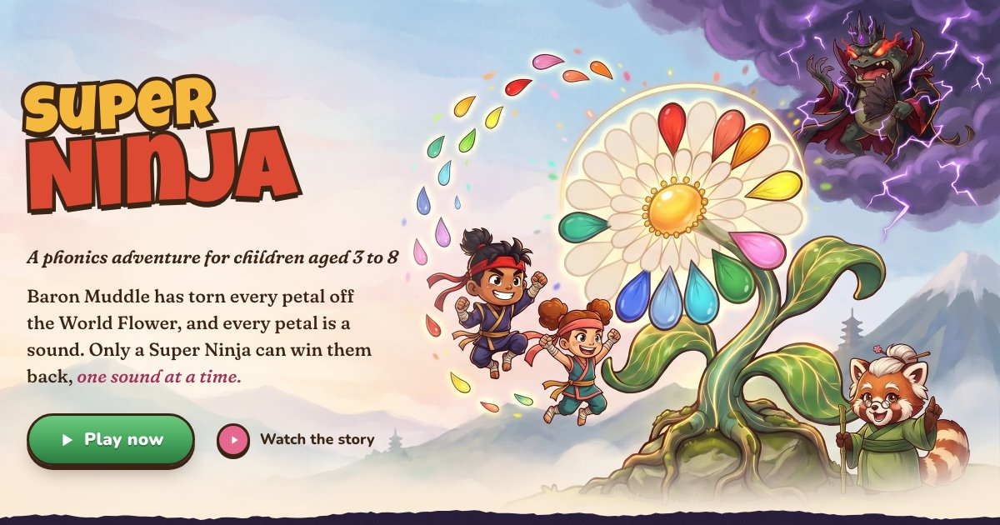

# Super Ninja

A phonics adventure game for British children aged 3 to 8. Baron Muddle has scattered the island's sounds. Children win them back one sound at a time, by listening, building words, reading and spelling, in battles, runs, word swaps and stories.

**Play it:** https://superninja.templestein.com



## How it was made

Jonas described what he wanted, and Claude (Claude Code) built it: the code, art, voices, music, videos and playtesting pipelines. Codex, Gemini and other models helped along the way. **Every prompt Jonas gave is in [PROMPTS.md](PROMPTS.md), verbatim.**

## What's here

| Path | What |
|---|---|
| `src/` | The game (Vite + React + TypeScript + plain CSS): scenes in `src/scenes`, content in `src/content`, the audio engine and learner model in `src/engine` |
| `index.html`, `landing/` | The landing page |
| `public/` | Shipped assets: images, speech, music, films |
| `scripts/` | Asset pipeline (art, speech, stretched words, music, video, trailer), releases, and the playtest treadmill (`scripts/treadmill`) |
| `docs/` | Design and process: [pedagogy](docs/PEDAGOGY.md), [art style](docs/ART_STYLE.md), [releasing](docs/RELEASING.md), [playtest treadmill](docs/TREADMILL.md), [feedback log](docs/FEEDBACK.md), [trailer](docs/TRAILER.md), [intro storyboard](docs/INTRO_STORYBOARD.md), [media models](docs/MEDIA_MODELS.md), [Jev](docs/JEV.md) |
| `playtest/` | The playtest inbox and fixtures. Bot run output isn't committed. |

## Running it

```sh
bun install
bun run dev            # http://localhost:5173 (landing) and /play/ (game)
bun scripts/treadmill/run.ts --quick   # bots play every kind of level and file a bug inbox
scripts/release.sh minor               # generate, check, build and deploy (needs the project's secrets)
```

Asset generation needs API keys, which are kept in Doppler. Raw renders, source art and bot screenshots aren't in this repo (they are several gigabytes); the finished assets in `public/` are.

## Phonics

The teaching follows the Sounds~Write approach used in many UK schools. It uses pure sounds and British pronunciation, goes from sounds to spellings, and follows the Initial Code unit order. Super Ninja is an independent project and isn't affiliated with or endorsed by Sounds-Write Ltd. Sounds~Write is a registered trade mark of Sounds-Write Ltd.
