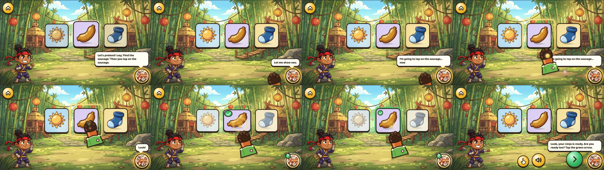

# Demo choreography: how Sensei shows a game (27 Sep)

Jonas, 27 Sep, verbatim:

> "I think when the sensei shows us something, the pacing is still not right. Lots of stuff suddenly happens. It says, look, it's just one quick word, and then it activates something, but it looks actually like the character does it, like the character is shooting. The sensei should be shooting at the word, and then it, but it should say more carefully and slowly. I'm going to show you what. So let's assume I say, find the sausage. Then you, then you would have to tap on the sausage. Let me show you. I'm gonna tap on the sausage now. Look! And then, yeah, and then you, like you can obviously finagle the words exactly, but that's more the vibe we're going for."

This is the rule for every "I do" demo, the component that plays it ([`src/ui/SenseiDemo.tsx`](../src/ui/SenseiDemo.tsx)), its lines (54 new clips), and a harness that plays one full demo with the real art and voice. The "before" is the inventory: [demo-choreography/inventory.md](demo-choreography/inventory.md) (every demo the game plays today, measured on production). No scene is rewired here: the big fix's lanes own every scene file today, so the wiring is the follow-up's (QUEUE item 0, and [fix-requests.md](fix-requests.md) "Demo choreography (27 Sep)").

**The harness video** (844 × 390, real speed, with sound): [demo-choreography/harness/find-the-sausage.mp4](demo-choreography/harness/find-the-sausage.mp4); Show me again: [find-the-sausage-replay.mp4](demo-choreography/harness/find-the-sausage-replay.mp4); and a busy child who taps cards while Sensei talks: [find-the-sausage-taps.mp4](demo-choreography/harness/find-the-sausage-taps.mp4). §7 has the timelines and what I saw in them. §10 is the fix round after the judge's review (27 Sep, afternoon).

---

## 0. The short version

1. **Sensei acts, visibly and slowly.** Her own paw (a red panda's paw in the green sleeve of her robe, not the white "tap here" glove) comes out of her portrait in the bottom-right corner, sweeps along below the board and up into the target in about a second with her colours trailing (never across the cards beside it), hovers while she says "Look!", waits half a second, presses, and only then does anything happen.
2. **The ninja only watches.** It turns to look at Sensei's corner, then at the target, in its attentive pose. It never strikes, casts, dashes, throws or launches during Sensei's demo. Strikes, kiai, spells and streak flames are the child's own.
3. **Every action is announced first, in the first person, naming its target:** "I'm going to tap on the sausage… now…". The paw sets off on "now". Nothing happens within 400 ms of the end of the line that announces it.
4. **The rule comes first, as a hypothetical:** "Let's pretend I say, ‘Find the sausage.’ Then you tap on the sausage." Then "Let me show you.", then the announcement.
5. **A calm beat after the effect** (the paw goes home, about 700 ms, nothing new said) before the Ready question. The hand-over never starts on top of the result.
6. **Show me again is the same function at the same pace,** opening with "Of course. Watch my paw again." instead of the rule.
7. **The board stays live throughout.** A card tapped while Sensei names the cards or shows the game lights at once (a bounce and its ring) and says its word at her next pause; the demo carries on. The child can always act (TEACHER_SCRIPT §0.1).

What it fixes, from the inventory's counts (§5 there): 0 of 20 paw taps announced today; 13 of 20 paw arrivals within 5 ms of the last word; the ninja moving in 16 of 17 demos (a strike in the same frame as the paw's tap in 7); two hand-overs on top of the result; one result before its cause (Word Squish). In the harness, every one of those is the other way round (§7).

---

## 1. The rule for every "I do" demo

| step | what the child sees | what Sensei says | line ids | who acts |
|---|---|---|---|---|
| **(a) the rule, as a hypothetical** | the board, still; the thing named is spotlit (the warm-white "being named" ring) on its word | "Let's pretend I say, ‘Find the sausage.’ Then you tap on the sausage." | `tv_demo_rule_find_<w>` where the demo item is the task's variable; `tv_demo_rule_<game>` where it isn't ("Let's pretend I say a sound. Then you find how we write it.") | Sensei's voice |
| **(b) "Let me show you."** | her portrait glows; her paw comes out from behind it on "show" and waves once, beside the portrait and a little above its middle. The ninja turns to look at her corner | "Let me show you." (a replay: "Of course. Watch my paw again."; an I do whose pair line opens "I'll go first.": the paw comes out on "first") | `tv_demo_show` · `tv_show_again` · `tv_ido_pair_<pair>` | Sensei |
| **(c) the action, announced** | the target's gold halo lights on its name ("sausage"); on "now" the paw sets off | "I'm going to tap on the sausage… now…" (a pause before "now"; recorded suspended, so "Look!" follows) | `tv_demo_now_tap_<w>`, `tv_demo_now_*` (§5) | Sensei |
| **(d) Sensei does it, visibly and slowly** | the paw sweeps from her corner along below the board and up into the target from underneath (1050 ms, eased in and out), gold, green and pink sparkles trailing behind it, never across the cards beside it; it hovers just above its press point (low on the card, a little right of the middle) so the picture stays in sight; on "Look!" it is still; half a second after "Look!" it presses: a squash, a gold ripple, her gold paw print on the card | "Look!" | `tv_demo_look` (the first action of a demo only) | Sensei's paw |
| **the effect, only now** | at the bottom of the press: the card goes green with its tick, the others dim; the tile flies to its line; the pocket fills. Anything that travels is carried by her magic (her colours), never by the ninja | the effect's own sound on the press: the word, the pure sound. Never the success chime (`sfx.good`): that is the child's reward, and it masked the word | the scene's (`sound`) | Sensei's paw (the cause stays on the card 550 ms, drawn back down along its arm so the print and the picture show) |
| **(e) the ninja watches** | its attentive pose (the `listen` sprite: a hand to its ear, eyes up, smiling), turned to her corner on (b), to the target on (c), back to rest at the end | — | — | the child's ninja, watching |
| **(f) a beat of calm** | the paw flies home into her portrait (700 ms: down out of the row first); then the scene clears the result (`clear`) | nothing (a card the child tapped during the action says its word here) | — | — |
| then: **Ready** | ▶ and the paw (Show me again); the ninja in its ready stance facing ▶ | "Look, your ninja is ready. Are you ready too? Tap the green arrow." (the save's first) · "Do you want to have a go now?" | TS §2.3 | the child |
| then: **the hand-over** | the turn's own board | "Your word is sock. Can you find the sock?" | TS | the child; **now** the ninja strikes on the child's answer |

**The words.** Jonas's own words, "finagled" in three places, each decided here (§9): "Let's pretend" for "let's assume" (pretend play is a 3-year-old's own frame, and "Let's say I say" trips); present tense in the rule ("Then you tap on the sausage", TEACHER_SCRIPT §2.1: present tense, "I" for Sensei, "you" for the child); and a pause before "now" in the announcement ("I'm going to tap on the sausage… now…"). The pause does three jobs: it slows the line (Jonas: "more carefully and slowly") without stretching the voice; it gives the halo on "sausage" a moment on its own before anything moves; and "now" becomes a clear starting gun for the paw.

**"Look!"** stays a one-word exclamation, as Jonas said it. It is not an instruction under the house rules (script-audit's `isInstructionSentence`: "Look!", "Zap!", "Bong!" are exclamations; only "Listen!" and "Watch!" alone are orders), so it trips neither `bare-command` nor `shouted-instruction`. It is recorded at −19 LUFS like every clip under 1.2 s, so it never lands at a sentence's loudness.

---

## 2. Sensei's paw

**Why not the glove.** Today's "hand" is the white glove (`TapHint`, a 110 stage-px `svg`): it pops in over the target with no arm and no travel, bobs, and vanishes, often before its bob reaches the press (inventory §2). The same glove is the idle "tap here" hint (16 s into a turn, 8 s into a held Next) and the Show me again icon, so a child has learnt it as "tap here", not "Sensei". Sensei's paw is a different thing that can't be mistaken for it:

- **A red panda's paw** (Sensei Maple is a red panda): four round toes, dark and soft, with a warm rim light; her red fur at the wrist with a cream highlight; the bright green sleeve of her robe with its cream trim and a pink blossom (the blossom in her hair). 180 × 228 stage px, about 97 × 123 CSS px on an 844 × 390 phone (the glove is 59). Drawn as an inline SVG in the house's ink outline; a painted sprite is requested (fix-requests).
- **It comes from her.** It grows out from behind her portrait (the layer is z 84, mounted after the scene and before the nav layer: under the portrait's 85 and the nav buttons; over the board, the effects (80/81) and, by DOM order, the caption bubble (84), so a wide caption never hides the paw the child is following), with a glow ring on the portrait, and goes back into it with the same glow. It waits beside the portrait, a little above its middle, clear of the caption bubble.
- **It travels where the child can follow it, and only over its target:** a quadratic curve sampled by arc length and eased (`cubic-bezier(0.45, 0.05, 0.3, 1)`), so it starts gently, crosses at speed and settles. Rising from her corner to a card it is a scoop: along at her corner's height, below the board, then up into the target from underneath, so it never crosses a card beside the target (in W1 that card is the child's next answer). Going home it drops out of the row first, then along. A hop between targets in one row bows upward over the row (a third of the distance, 60–220 px). It leans 8° into the flight and straightens as it arrives. Six sparkles of her colours (gold, the green of her robe, the pink of her blossom) follow the fingertip's path 110 ms apart, drawn over her arm and on behind it, fading at both ends. A "stream of her own magic" and the paw in one: the paw says who, the trail says where from.
- **It presses where the picture stays in sight:** low on a card, a little right of its middle (60 % across, 64 % down), pointing up and a little left (16°), so its arm stays under the card it presses and off the cards beside it. It hovers 30 px above that point. The press: down in 160 ms with a squash about the fingertip, a gold ripple (to 1.45×, 560 ms), and her gold paw print on the card (fading over 1.1 s); then it draws back down along its arm (20 px right, 62 down) to the card's lower edge, so the print and the whole picture show while the effect plays. In the harness the paw's whole outline keeps at least 35 stage px (about 18 CSS px) from the sock's picture through the flight, the hover, the press and the effect (`playtest/demo/harness/probe.ts`).
- **The halo:** the target's gold ring (her colour; the warm-white ring stays "being named") lights on the target's name in the announcement, or on arrival, and goes at the press.
- **Compositor only.** Every motion is `transform` and `opacity` through the Web Animations API (`el.animate`), started per step and cancelled when it lands; no `requestAnimationFrame`, no layout per frame. When no demo is running the layer is `display: none`. At `?fast=N` every animation's `playbackRate` is N, like the rest of the game.

---

## 3. The timing rules

The numbers are `DEMO` in SenseiDemo.tsx (game ms; the unit tests check each rule on a fake clock).

| # | rule | number |
|---|---|---|
| T1 | **Nothing happens within 400 ms of the end of the line that announces it** (a press, an effect, a sound) | `afterAnnounce` 400 |
| T2 | The paw sets off on the announcing line's word "now" (measured: `public/a/l/<id>.words.json`, else content/word-times.ts, else estimated from the text and the clip's length) | word-timed |
| T3 | The first flight takes about a second, eased; later hops between targets a little less | `flight` 1050, `hop` 850 (900–1200 was the brief) |
| T4 | The paw hovers, still, before it presses: at least 300 ms, and "Look!" (the demo's first action) is said while it hovers; the press **500 ms after "Look!" ends** (Jonas: "it says, look, it's just one quick word, and then it activates something"), so the visible effect comes about 680 ms after it | `hover` 300, `lookToPress` 500 |
| T5 | **The effect happens only at the bottom of the press** (never on arrival, never before), and its sound starts with it | `down` 160 |
| T6 | The paw stays on the target after the press while the effect plays, so the cause is still there | `hold` 550 |
| T7 | A `then` line (the model answer, "So into the pocket it goes!") waits for the effect's sound, plus a breath | `thenGap` 250 |
| T8 | **A calm beat before the next line or the Ready hold:** the paw goes home, nothing said | `home` 700 with `beat` 700 (the brief: 600–800) |
| T9 | **The paw moves only while the child can see it:** it appears only by coming out of her portrait and reaches a target only by flying there; it never vanishes mid-flight; while the phone is upright it freezes where it is and the demo waits (speech is paused by the engine too), and once the phone is turned back it waits 600 ms more before anything moves on | `resume` 600 |
| T10 | **The ninja never acts in Sensei's demo.** It watches (`onWatch`: her corner, the target, done) | — |
| T11 | **No hand-over on top of the result:** the Ready question comes after the beat; "Now you try!" is gone (TEACHER_SCRIPT) | — |
| T12 | **Never the child's instruction in Sensei's demo, never a question the paw answers** (TEACHER_SCRIPT §2.1, kept): "Tap the sun!" and "Which picture is it?" before the paw are exactly what T1–T5 replace | — |
| T13 | **Nothing big before the first word** of a first meeting: a monster or boss lands on "Oh no!", not in silence before it, and the ninja's "!" shout goes (it isn't the child's action) | the entrance on the first line's start |
| T14 | A breath between the rule, "Let me show you." and the announcement | `breath` 250 |
| T15 | **The board stays live.** A card tapped during the names or the demo lights at once (the scene: a bounce, its ring, the tap sound) and its word comes at Sensei's next pause (`demoTap()`: after the rule, after "Let me show you.", between actions, or after the calm beat), never on top of her and never cutting her off; a later tap replaces a waiting one; the demo carries on. During the Ready hold a card tap answers the hold and the card says its word before the hand-over (Warmup's `echoBoard`) | `demoTap`, `demoPause`, `demoTalk` |

**What a demo costs, and the 12 s rule.** The harness (§7) runs 13.3 s from the rule's first word to the Ready question: the rule 5.4 s, "Let me show you." 1.5 s with its breaths, the announcement 3.0 s, then 1.5 s to the press (the flight's overhang, "Look!" and its half second), 1.0 s for the effect and its word, and 0.7 s of calm. With the two names before it (only sun and sock: the rule names the sausage, mechanics §5.4), Sensei talks for 16.7 s before the Ready question. Trimming can't bring that under TEACHER_SCRIPT §0.1's "about 12 s": the names and Jonas's full script already pass it. So **the cards are live throughout** (T15): from the moment they land, 0.9 s before Sensei's first word, a tap on a card registers at once and gets its word at her next pause, and the demo carries on. TEACHER_SCRIPT §0.1 counts a card tap as an action, so no stretch of talk runs without something the child can do. On a first meeting the concrete hypothetical still **replaces** the frame's task sentence where they say the same thing (W1: `tv_demo_rule_find_sun` replaces `tv_ears_frame`; the game's name stays wherever TS puts it). §6 says, game by game, what each rule line replaces. The follow-up measures every first meeting again with `playtest/demo/inventory/` against a frozen build (`--base`), as the "after".

---

## 4. Several actions, sounds, and Show me again

**Several actions** (`actions: [...]`). Each action is announced before its paw moves, and each keeps T1–T6. The paw goes from target to target without going home in between, and home once at the end. "Look!" is said on the first action only (a demo that says it three times is shouting). Examples:

- **Word Building (am):** "I'm going to find the first sound… now…" → < a >, Look!, /a/, and < a > flies to line 1 carried by her magic; then the child finds the last one (TS's join-in). A full Sensei build (a replay, a recap): "…the last sound… now…" → < m >, /m/.
- **Sound Dots (sun):** one announcement ("I'm going to tap each dot, starting on this side… now…"), then three presses, each with its own pure sound; later hops can be quicker (`flight` per action, e.g. 700), because the sound on each press narrates it.
- **Sound Swap (mat → sat):** the child kicks out /m/ (TS's join-in: the child's ninja kicks, the child's action). Then "I'm going to put in the new sound… now…" → < s > in the letter row, Look!, /s/, and it flies into the gap by her magic. A replay where Sensei does both halves: "I'm going to take out the old sound… now…" first.

**Sounds.** The pure sound plays on the press, never before it (`sound: { sound: "a" }`): the child hears the sound as they see the paw press the thing that makes it. A sound that is the question (Guess My Word's /s/ /u/ /n/) is said before the announcement, as now; only the answer's tap is Sensei's action.

**Show me again** replays the same `senseiDemo()` call with `replay: true`:

- the rule is skipped (the child has just heard it);
- "Of course. Watch my paw again." (`tv_show_again`) takes the place of "Let me show you.", and the paw comes out on "paw" (`tv_show_again` has no word timings yet, so SenseiDemo maps its two phrases onto the clip's own two speech islands: "paw" lands at 2.06 s, Whisper hears it at 2.02 s; by the letters alone it landed on "Watch", 0.35 s early);
- the actions play at exactly the same pace (the unit test checks the announcement-to-press gap is the same to within 10 ms);
- in a Ready hold, pass `showSay: null` to `holdReady()`, so "Of course…" is said once, by the demo, and the paw comes out on its word;
- the scene resets the target first (the sausage back from green) and cancels the replay if the child taps an answer (`cancelDemo()`; the hold's `readyStop()` for a board tap).

---

## 5. The lines (54 clips, recorded)

A block at the end of `LINES` ("// --- Demo choreography (docs/DEMO_CHOREOGRAPHY.md, 27 Sep)"). Recorded with `scripts/gen-audio.ts lines --only-file playtest/demo/audio/ids.txt` in the house's Sensei voice (Erinome, en-GB, plain text: `VOICES.sensei`; the brief said Sulafat, which Jonas replaced with Erinome on 27 Sep, DECISIONS.md), then QA'd (§8).

**Generic** (4): `tv_demo_show` "Let me show you." · `tv_demo_look` "Look!" · `tv_demo_watch_me` "Watch my paw carefully." (four words, so it isn't a bare command) · `tv_demo_watch_write` "Now watch me write it." (the Dojo's writing becomes Sensei's, §6).

**The rule, per game type** (24, TEACHER_SCRIPT §4.1's games; `notice` has none: it is a show the child drives):

| id | text |
|---|---|
| tv_demo_rule_tap | Let's pretend I say a word. Then you find its picture, and tap it. |
| tv_demo_rule_fastslow | Let's pretend you tap the tortoise. Then you say the word slowly. |
| tv_demo_rule_tapall | Let's pretend I say a sound. Then you find every picture that starts with it. |
| tv_demo_rule_tapall_in | Let's pretend I say a sound. Then you find every picture with it in the middle. |
| tv_demo_rule_rail | Let's pretend I show you two pictures. Then you read them, starting on this side. |
| tv_demo_rule_which | Let's pretend I read one row. Then you tap the row I read. |
| tv_demo_rule_compound | Let's pretend I say two little words. Then you squish them into one big word. |
| tv_demo_rule_slowpick | Let's pretend I say a word very slowly. Then you find its picture. |
| tv_demo_rule_sounds | Let's pretend I say the sounds in a word. Then you find its picture. |
| tv_demo_rule_dots | Let's pretend I show you a picture. Then you tap each dot, and say its sound. |
| tv_demo_rule_firstsound | Let's pretend I say a sound. Then you find the picture that starts with it. |
| tv_demo_rule_find | Let's pretend I say a sound. Then you find how we write it. |
| tv_demo_rule_soundhunt | Let's pretend I say a sound. Then you find the picture with that sound in the middle. |
| tv_demo_rule_build | Let's pretend I say a word. Then you build it with its sounds, one at a time. |
| tv_demo_rule_readcheck | Let's pretend Kai and Suki read a word. Then you tap the one who read it right. |
| tv_demo_rule_battle | Let's pretend I say a word. Then you find its sounds, and zap the monster. |
| tv_demo_rule_boss | Let's pretend I say a word. Then you spell it, and zap the boss. |
| tv_demo_rule_trial | Let's pretend I say a word. Then you spell it before the bar is full. |
| tv_demo_rule_review | Let's pretend I say a tricky word. Then you spell it, and zap the monster. |
| tv_demo_rule_swap | Let's pretend I want a new word. Then you change just one sound. |
| tv_demo_rule_sort | Let's pretend a word falls down. Then you tap the chest with the same spelling. |
| tv_demo_rule_run | Let's pretend I say some sounds. Then you catch the lantern with that word. |
| tv_demo_rule_story | Let's pretend it's your page. Then you read each word, and tap the green tick. |
| tv_demo_rule_learn | Let's pretend I say a new sound. Then you say it back to me. |

"Spell" is used only by games met after the first battle, where TEACHER_SCRIPT §2.4 rule 13 introduces it; the battle's own rule says "find its sounds".

**The rule with its word** (a family, 2): `tv_demo_rule_find_<w>` "Let's pretend I say, ‘Find the <w>.’ Then you tap on the <w>." for **sun** (W1's demo item, warmups.ts) and **sausage** (Jonas's example, the harness).

**The action, announced** (24, all "I'm going to … … now…", the paw's word "now" timed in each clip's words.json):

| family or id | members |
|---|---|
| `tv_demo_now_tap_<w>` "I'm going to tap on the <w>… now…" | the canonical demo items: **sun** (W1 Ninja Ears, Pocket Hunt, Guess My Word, Sound Dots), **sausage** (the harness), **sock** (W2's one more Pocket Hunt), **mug** (W3 Slow Words, the /m/ Pocket Hunt), **cat** (W3 Pocket Hunt, in the middle), **map**, **ant**, **tent**, **nut**, **pan** (First Sounds' I do answers, Early.tsx `IDO_PAIRS`), **pin**, **mop** (Sound Hunt's), **rabbit**, **tortoise** (fast and slow, Word Squish) |
| `tv_demo_now_tap_row` | "I'm going to tap on this row… now…" (two rows) |
| `tv_demo_now_tap_chest` | "I'm going to tap on this chest… now…" (Sorting) |
| `tv_demo_now_tap_card` | "I'm going to tap on my word card… now…" (Word Building's and a battle's word card, when Sensei taps it herself: a replay or a recap) |
| `tv_demo_now_tap_dots` | "I'm going to tap each dot, starting on this side… now…" (Sound Dots) |
| `tv_demo_now_read_row` | "I'm going to read this row… now…" (two rows: the paw glides under the pictures as she reads them) |
| `tv_demo_now_first_sound` · `_next_sound` · `_last_sound` | "I'm going to find the first / next / last sound… now…" (Word Building, a battle) |
| `tv_demo_now_take_out` · `tv_demo_now_put_in` | "I'm going to take out the old sound… now…" · "I'm going to put in the new sound… now…" (Sound Swap) |

When the speech templates land (SPEECH_TEMPLATES.md), `tv_demo_rule_find_<w>` and `tv_demo_now_tap_<w>` are whole-sentence families of the kind it adopts as they are (§6.3 there); until then a new demo item means one new recording per family, generated like `tv_your_word_<w>`.

---

## 6. Game by game

What each demo becomes. "Now" is the rule, the show, the announcement and the target; the effect is what `press()` does; the sound plays on the press. **Retires** lists today's lines and moves that go from the demo (not from the game). Every demo ends with T8's beat, then its Ready (TS §2.3) and hand-over.

| game (where) | today (inventory) | the rule | the actions: announce → target · effect · sound · then | retires from the demo |
|---|---|---|---|---|
| Ninja Ears `tap` (W1) | "Tap the sun!" said *during* the demo; paw pops in; the ninja kicks as it vanishes; "Now you try!" 0.5 s later (§3.1) | `tv_demo_rule_find_sun` (replaces `tv_ears_frame`) | now_tap_sun → the sun · green, others dim · [sun] | `tv_ears_demo`, the kick, the star stamp |
| the rabbit and the tortoise `fastslow` (W1) | the paw lands 4 ms after "Watch me first!"; the ninja dashes and does a slow-motion kata (§3.2) | after `tv_ts_meet`: `tv_demo_rule_fastslow` | now_tap_rabbit → the rabbit · the hop, the ribbon zips · [sun]; now_tap_tortoise → the tortoise · the stretch, the ribbon draws, three dots · [sun, slowly] | `tv_ts_fast`, `tv_ts_slow` on the full form (kept for recaps), the dash, the kata |
| Pocket Hunt `tapall` (W1, W2, W3) | the paw timed onto /s/; a shuriken 0.68 s later (§3.4) | after `tv_pocket_frame` (the name): `tv_demo_rule_tapall`, or in the middle `_tapall_in` | now_tap_sun (W1; cat in the middle, W3; mug for /m/) → the card · its first (middle) dot glows · [sun, first] ([cat, slowly]); then `fs_sun` · `tv_so_pocket` as a mini-card flies to the pocket on her trail | `tv_pocket_ido` ("I'll find one first.": the show line says it), the shuriken |
| Ninja Reading `rail` (W2, W4) | the ninja is the reading finger; its spell merges the pictures (§3.5) | the read slider's own (`pr_demo`: "Let's say I want to read this long word. I'll read it slowly first. Watch my paw...") already has (a)–(c) | the read slider's demo paw: request its first move to be SenseiDemo's flight from her corner to the tortoise | the ninja's run and cast |
| two rows `which` (W2) | "Now you try!" 131 ms after the tap, under the result (§3.6) | `tv_demo_rule_which` (after `tv_which_frame`'s rows) | now_read_row → the fish, then (no announcement, 850 ms hop) the dog · each lights · [fish], [dog]; now_tap_row → the top row · it glows, a crown of stars in her colours | `tv_which_demo`, `tv_which_so` ("Fish came first." can stay as a `then` if re-recorded alone), the ninja's gift |
| Word Squish `compound` (W2, if it stays beside the read slider) | the result before its cause (§3.7) | `tv_demo_rule_compound` | now_tap_tortoise → the tortoise · each card lights in turn · "Sun… flower." (a clip of the slow reading alone); now_tap_rabbit → the rabbit · the cards squish into the sunflower · "Sunflower!" | `tv_squish_slow`, `tv_squish_fast` (they narrate the taps as they happen), the ninja's cast |
| Slow Words `slowpick` (W3) | a question the paw answers; bullet-time punch (§3.9) | `tv_demo_rule_slowpick` (replaces the frame's second and third sentences) | `tv_slow_demo` [mug, slowly] · `tv_i_hear_mug`; now_tap_mug → the mug · green · [mug] | `fm_which_pic` in the demo, the punch |
| Guess My Word `sounds` (W5) | 0.75 s of silence, the kick, then "sun" (§3.12) | `tv_demo_rule_sounds` | `tv_my_sounds` /s/ /u/ /n/ · `tv_i_hear_sun`; now_tap_sun → the sun · it bounces, the dots bloom · [sun] | `tv_guess_so_sun` on the full form, the kick |
| Sound Dots `dots` (W6) | paw 2–3 ms after each sound; the ninja runs the sweep (§3.13) | `tv_demo_rule_dots` | now_tap_dots → dot 1 · lights · /s/; → dot 2 (700 ms hop) · /u/; → dot 3 · /n/; then `tv_dots_word_ido` [sun] as the paw sweeps under the ribbon (an action with no press sound) | the ninja's run |
| First Sounds `firstsound` (w1-2, w1-3, w1-10) | question, paw 1 ms after /m/, 1.1 s silence, the ninja's cast (§3.14) | `tv_demo_rule_firstsound` (after `tv_first_frame`, or replacing its second half) | `tv_ido_pair_<pair>` (the paw comes out on "first") · `tv_let_me_listen` · [map, first] · `fs_map`; now_tap_map → the map · green, a crown of stars in her colours | `tv_so_i_tap`, the ninja's cast and kick; the spelling spell in the we do stays the child's ninja's (it follows the child's own right answer) |
| Ninja Eyes `find` (w1-2) | no demo (§4.1) | `tv_demo_rule_find` with `tv_ne_frame` | no demo: the first item stays a we do (TS) | — |
| Sound Hunt `soundhunt` (w1-7) | the paw the moment "paaan" ends; punch; cast (§3.17) | `tv_demo_rule_soundhunt` | `tv_ido_pair_pan_pin` · `tv_let_me_listen` · [pin, slowly] · `mid_pin`; now_tap_pin → the pin · green | the punch |
| Word Building `build` (w1-4) | "aaammm", paw 0–5 ms later, 0.7 s silence, the ninja launches each letter (§3.16) | `tv_demo_rule_build` (after `tv_build_frame`'s name) | the card join-in [am] · `tv_i_say_slowly` [am, slowly] · `st_hear_two`; now_first_sound → < a > · it flies to line 1 on her trail · /a/; then the child: `tv_you_find_last` | `tv_first_is` as the tap's narration, the ninja's launches, the cheer |
| Kai and Suki `readcheck` (w1-4) | guided, no demo (§4.2) | `tv_demo_rule_readcheck` optional (TS's `tv_rc_how` says it) | none | — |
| a Monster Battle `battle` (w1-6) | the monster crashes in before any word; the ninja shouts "!" (§4.3) | `tv_demo_rule_battle` (after `tv_battle_frame`) | the card join-in [at]; now_first_sound → < a > · it flies to line 1 on her trail, the monster flinches, its bar drops · /a/; then `tv_bar_down`, and the child finds the last one (**the child's** ninja strikes) | the crash-in before the first word, the "!", the ninja's strike on Sensei's letter |
| Sound Swap `swap` (w1-8) | no demo (§4.4) | `tv_demo_rule_swap` (with `tv_swap_frame`) | TS's order (the child reads first; "Are you ready to watch?"; the child kicks out /m/); now_put_in → < s > in the letter row · it flies into the gap on her trail · /s/; then /s/ /a/ /t/ [sat] | — |
| Sorting `sort` (w6-br1) | no demo (§4.9) | `tv_demo_rule_sort` | the first word falls and is read; now_tap_chest → its chest · the word flies in on her trail, the spelling glows · [the word] | the ninja's kick of the demo word |
| New Sounds `learn` (w2-1) | the ninja writes the letter before "And this is how we spell it." (§4.8) | `tv_demo_rule_learn` optional (TS's `tv_learn_how` says it) | `tv_demo_watch_write` "Now watch me write it." (announce; go on "write") → the space beside the petal · the letter appears where her paw presses | "Now watch my ninja write it." (`tv_watch_write`) in the lesson, the ninja's cast |
| Ninja Run, Story Time, the boss, the Gem Trial, Sensei's Challenge | no demo; four crash in before any word (§4) | their rule lines, where TS's frame doesn't already say it | no paw demo (TS): the run's jump and the story's first page are the child's join-ins | the crash-in before the first word, the ninja's "!" |

---

## 7. The harness: one full W1-style demo, "Find the sausage"

`playtest/demo/harness/` is a standalone page (its own vite entry, a frozen build served from `playtest/runs/demo-harness/dist` with the game's assets straight from `public/`, never the shared dev server) with the game's shell: the Stage, the ninja, Sensei's portrait, the nav layer (the real Ready hold, `holdReady()`), the effects and the caption bubble (captions on, so a silent video still reads). Three picture cards (sun, sausage, sock) in the warm-ups' row, with PicCard's markup and CSS. It plays: the two cards the demo doesn't use named (sun, sock), the demo (`senseiDemo()` with `tv_demo_rule_find_sausage`, `tv_demo_now_tap_sausage`, the sausage, `press` = green, `sound` = [sausage], `clear` = the result cleared after the beat, `onWatch` = the ninja's `listen` pose facing its target), the Ready hold (▶, or the paw: the replay; a card answers it and says its word), "Your word is sock. Can you find the sock?", and the child's tap, when the ninja strikes for the first time. The cards are live from the moment they land (T15: `demoTalk()` around the names and the demo, `demoTap()` on a tap).

```
bunx vite build --config playtest/demo/harness/vite.config.ts
bun playtest/demo/harness/serve.ts --port 4981
bun playtest/demo/harness/record.ts --port 4981 [--replay | --taps]
bun playtest/demo/harness/probe.ts --port 4981 [--out probe.json]
```

`record.ts` films it at 844 × 390 in a touch browser at real speed (a CDP screencast rebuilt at 30 fps, the speech and sound effects rebuilt from the page's audio log), and writes `docs/demo-choreography/harness/<name>.mp4`, a contact sheet (`<name>.jpg`: a frame every 0.5 s for 16 s from the rule) and `<name>.json` (the timeline on one clock). `--taps` plays a busy child: it also taps the sausage while the sun is named, the sun during the rule and the sock while the paw flies. `probe.ts` samples the paw in the page every 30 ms (its fingertip and turn from the computed transforms, its whole outline from `pawOutline()`) and reports its least clearance to the sock's picture and where it crosses the caption bubble.



▶ [the video, at real speed with sound](demo-choreography/harness/find-the-sausage.mp4) (844 × 390; the demo is 5.0–18.4 s) · ▶ [with Show me again](demo-choreography/harness/find-the-sausage-replay.mp4) (the replay is 24.7–33.9 s) · ▶ [a busy child](demo-choreography/harness/find-the-sausage-taps.mp4) (taps at 2.2, 7.9 and 16.8 s) · contact sheets: [find-the-sausage.jpg](demo-choreography/harness/find-the-sausage.jpg), [find-the-sausage-replay.jpg](demo-choreography/harness/find-the-sausage-replay.jpg), [find-the-sausage-taps.jpg](demo-choreography/harness/find-the-sausage-taps.jpg) · the timelines: [find-the-sausage.json](demo-choreography/harness/find-the-sausage.json), [find-the-sausage-replay.json](demo-choreography/harness/find-the-sausage-replay.json), [find-the-sausage-taps.json](demo-choreography/harness/find-the-sausage-taps.json)

**The timeline** (27 Sep, after the fix round; from the page's own clock, as the inventory measures; ms from the rule's first word):

| ms | Sensei says | what moves | who does it | against the words |
|---:|---|---|---|---|
| −4270 | | the cards drop in: **live from here** (a tap lights the card and says its word at her next pause) | | 0.9 s before her first word |
| −3364 | This is the sun. · This is a sock. | each card spotlit on its own clip (the sausage is named by the rule) | Sensei's voice | |
| 0 | Let's pretend I say, ‘Find the sausage.’ Then you tap on the sausage. *(5.4 s)* | the sausage spotlit on its name (the warm-white ring) | Sensei's voice | on "sausage" |
| 5697 | Let me show you. *(1.2 s)* | | | |
| 6059 | | her paw comes out of her portrait and waves; the ninja turns to her corner (its listening pose) | **Sensei's paw** | on "show" |
| 7166 | I'm going to tap on the sausage… now… *(3.0 s)* | the sausage's gold halo on "sausage" | Sensei | |
| 9348 | | the paw sets off: a 1.05 s sweep along below the board and up into the sausage, her colours trailing; the ninja turns to the sausage | **Sensei's paw** | on "now" |
| 10126 | *(the announcement ends)* | | | |
| 10418 | Look! *(0.7 s)* | the paw hovers, still | Sensei's paw | while it hovers |
| 11587 | | **the press**: a squash, a gold ripple | **Sensei's paw** | **499 ms after "Look!"**; 1461 ms after the announcement |
| 11765 | "sausage" *(0.9 s)*, 3 ms after the bottom of the press; no chime | **the effect**: the sausage goes green with its tick, the others dim; her paw print; the paw draws back down so the print shows | the paw, still there | at the bottom of the press, 677 ms after "Look!" |
| 12627 | | the paw goes home into her portrait (down out of the row, then along) | Sensei's paw | the calm beat: nothing said |
| 13343 | Look, your ninja is ready. Are you ready too? Tap the green arrow. | ▶; the ninja in its ready stance, facing ▶; the sausage's result cleared | the Ready hold | 716 ms after the paw set off home |
| 24857 | *(after "Your word is sock. Can you find the sock?", the child taps the sock)* | **the ninja's first move of the whole demo**: a soft strike on the sock; the success chime (the child's) | the child's ninja | the child's own answer |

**The busy child** ([find-the-sausage-taps.mp4](demo-choreography/harness/find-the-sausage-taps.mp4)): a tap on the sausage while the sun is named (its tap sound 11 ms later, the ring at once; "sausage" said 1.0 s later, when "This is the sun." ends), on the sun 1.8 s into the rule (the ring at once; "sun" said when the rule ends, then "Let me show you."), and on the sock while the paw flies (the ring at once; "sock" said after the calm beat, never between "Look!" and the press). The demo carries on whole: the announcement to the press is 4434 ms, as in the clean run (4421 ms).

**Against the inventory's flags** (its definitions, §0 there):
- **NINJA: none.** The ninja's only changes during the demo are two turns of its listening pose (to her corner, to the sausage) and back to rest; its first move is on the child's own answer, 11.5 s after the demo.
- **UNANNOUNCED: none.** The press, the effect and the paw's flight all come after or during "I'm going to tap on the sausage… now…", which names the action and the target in the first person.
- **SUDDEN: the press is 0.50 s after "Look!" and 1.46 s after the announcement,** and the visible effect 0.68 s after "Look!". The one thing the analyser would still flag is the paw coming out *under* "Let me show you." (four words): that is intended. It is the thing the line names, on the word that names it, the way the inventory's one clean demo (the first sound, §3.3 there) moves "in time with a word that names it".
- **Show me again replays at the same pace:** "Of course. Watch my paw again." (the paw comes out 2.06 s into it, on "paw": Whisper hears "paw" at 2.02 s), then the announcement, the flight, "Look!" and the press at the same offsets to within 7 ms (from the announcement's start, the demo / the replay: the flight 2180 / 2181 ms, "Look!" 3265 / 3258 ms, the press 4435 / 4431 ms). Then "Are you ready to have a go now?" and ▶.

Compare the inventory's W1 (§3.1 there): the paw popped in under the child's own instruction, the tap came 41 ms after "Tap the sun!", the ninja kicked in the same frame, and "Now you try!" started 0.5 s after the tap, 1.5 s for the whole show.

**What I saw when I looked** (frames at 844 × 390, at each step; the strip above):
- The paw reads as Sensei's: a dark red-panda paw on her red fur and green sleeve, clearly not the white glove (which sits in the nav row as the Show me again button during the Ready hold).
- It waits beside her portrait, below the caption bubble, with its toes and a little of her red wrist showing. On "now" it sweeps left along the path below the board, then rises into the sausage from underneath. It passes over the lower-left corner of the long announcement caption for about 0.4 s (captions on; the paw is on top, so it never disappears) and never goes near the sock: its whole outline keeps at least 35 stage px (about 18 CSS px) from the sock's picture in flight, hovering and pressing (`probe.ts`, 217 samples).
- It hovers low on the sausage, a little right of its middle; the sausage stays readable. After the press it draws back to the card's lower edge: her gold paw print, the green tick and the whole sausage are in view while "sausage" is said.
- The ninja stands with a hand to its ear, looking up and smiling, for the whole demo: attentive rather than puzzled. Its first move (a kick with a star) is on the child's sock.
- In the busy-child run each tapped card lifts with its ring the moment it is touched and says its word at the next pause; the sock's ring while the paw flies is a small distraction, but it is the child's own action.

---

## 8. QA of the lines

`playtest/voice/qa.py` over all 54 (faster-whisper small.en; `playtest/demo/audio/qa.json`), `scripts/accent-judge.ts --features bath` (21 votes a word, gemini-3.1-pro-preview, calibrated first: British references 45/48 British, American 0/48; `playtest/demo/audio/bath.json`), and gen-audio's own gates (a judge's word-perfect score, pace, loudness, a lead-in's tail):

| check | result |
|---|---|
| word for word (Whisper) | **52 of 54** on small.en. `tv_demo_rule_fastslow` ("tapped" for "tap the") is exact on medium.en. `tv_demo_rule_tapall` is heard as "I say **as** sound" by both models: gen-audio's judge heard it word-perfect, but two Whisper models agree, so it is **flagged for a retake**. The retake is blocked today: the Gemini TTS project's daily quota (10,000 requests, `gemini-3.8-flash-tts`) ran out during the re-voicing. Run `doppler run -p os-legacy-2026-04 -c dev -- bun scripts/gen-audio.ts lines --only tv_demo_rule_tapall --force`, then the QA, once it resets (the take it replaces is in `.trash/demo-choreography/`) |
| the judge's listening (27 Sep, padded clips, Gemini 3.1 Pro, 3 votes) | the harness's six lines 4–5 for warmth and pace, British, word for word. **Three to retake:** `tv_demo_rule_tapall` "I say **as** sound" (3 of 3, and one vote "rushed"); `tv_demo_now_tap_sun` (W1's real demo line) heard as "I'm **gonna**" (2 of 3) and `tv_demo_now_tap_ant` (3 of 3). Still blocked at 13:05 on 27 Sep: the TTS project's daily quota (`429 … limit: 10000, gemini-3.8-flash-tts`). The takes they replace are kept in `.trash/demo-choreography/*.before-fix2.mp3`; the commands are in fix-requests |
| letter names | none |
| pace (≤ 3.3 words a second) | all: the announcements 1.9–3.3 (2.5–5.7 s long), the rules 2.4–3.3; none lengthened by PSOLA (the first recording of the announcements, without the pause before "now", came out at 4+ words a second and had to be lengthened 1.05–1.42×; the pause fixed it) |
| loudness | the sentences −16.6 to −15.7 LUFS; "Look!" (0.67 s) −18.9 (the −19 for clips under 1.2 s) |
| the announcements' endings | "now…" is recorded as the end of a longer lead-in: 22 of 24 fall no more than 2 semitones (most rise a little, as a lead-in should). **Two fall a little more**: `tv_demo_now_tap_ant` 2.7 and `tv_demo_now_tap_mop` 2.4 (the best of 36 takes each). Kept: "now…" is followed by the paw's flight and "Look!", never spliced to a sound, which is what the 2-semitone rule protects. qa.py's `lead_blips` lists 10 of them: its detector reads the word "now" after the deliberate pause as a stray tail (Whisper hears "now" in every one); gen-audio's own tail check passes them |
| BATH ("last" in `tv_demo_now_last_sound`, the only BATH word in the 54) | **15/21 British (71 %)**. Two retakes were 14/21 and **0/21** (an American "last"); the 15/21 take is kept (the 0/21 one is in `.trash/demo-choreography/`). Other lines with "last" reached 19/21 (`pr_last_word`). Flagged for Jonas's ear, and for a retake round when the TTS quota allows |
| word timings | `public/a/l/<id>.words.json` for the 29 lines whose words move something: every `tv_demo_now_*` ("now", and the target's name), `tv_demo_rule_find_<w>`, `tv_demo_show` ("show"), `tv_demo_watch_me` ("paw"), `tv_demo_watch_write` ("write") |
| line tags, durations | all 54 in `src/core/content/line-tags.ts` (rules: instruction, mentioning what their game's frame mentions; the rest: model) and in `public/a/durations.json` (these ids only: `playtest/demo/audio/tags.ts`, `durations.ts`) |

The voice: gen-audio's `VOICES.sensei`, **Erinome**, en-GB, plain text. (The brief said Sulafat; DECISIONS 27 Sep moved Sensei to Erinome, Jonas's pick, and every line is being re-recorded in it.)

---

## 9. Decisions taken here (without asking), and what is left to others

Decided here, without asking (DECISIONS.md style: what, why, the alternative, how to undo):

1. **"Let's pretend" for Jonas's "let's assume"**, and the present tense ("Then you tap on the sausage."). Pretend play is a 3-year-old's own frame; "Let's say I say" trips; TEACHER_SCRIPT §2.1 wants the present tense. *Alternative:* "Let's say I say, ‘Find the sausage.’ Then you'd tap on the sausage." (the brief's words). *Undo:* change the 26 texts in the block and re-record them.
2. **A pause before "now"** in every announcement ("I'm going to tap on the sausage… now…"). It slows the line without stretching the voice (the first recording needed PSOLA to reach 3.3 words a second), gives the target's halo a moment before anything moves, and makes "now" the paw's starting gun. *Alternative:* Jonas's unbroken "I'm gonna tap on the sausage now." *Undo:* drop the "..." before "now" and re-record the 24.
3. **"Look!" stays an exclamation** (Jonas's word), and the press comes **500 ms** after it (was 350 ms; the judge's bar is 400, and Jonas's complaint was exactly this moment). *Alternative:* "Look…" as a suspended lead-in.
4. **`tv_demo_watch_me` is "Watch my paw carefully."**, not the brief's "Watch me carefully.": three words would be a bare command (script-audit's `bare-command`, a major check), and "my paw" says where to look.
5. **Sensei's paw is a red panda's paw in her green sleeve, with her colours trailing**, both "her paw" and "a stream of her own magic". Not the white glove, which children know as "tap here". An inline SVG until a painted sprite exists.
6. **The paw comes up into a card from below and presses low on it, a little right of its middle** (60 % across, 64 % down, tilted 16°), so the picture stays in sight and its arm stays off the cards beside it (the first version covered the sausage; the second came in from the lower right, over the sock's corner). **After the press it draws back down** so her paw print shows.
7. **The layer is z 84, over the caption bubble by DOM order and under Sensei's portrait and the nav buttons:** her paw comes out from behind her, and a caption never hides it (a wide caption reaches across its path, and the paw is what the child follows; captions are the grown-ups' setting). It rests below the bubble, so it covers a caption only while it flies past (about 0.4 s). *Alternative:* z 82 and the paw briefly behind the caption (the first version). *Undo:* `.sd-layer` z-index.
8. **The ninja watches with its `listen` pose turned to the target** (`ninja.pose("listen", { face })`: a hand to its ear, eyes up, smiling), until Ninja.tsx has `watch()` (requested). `think` (a hand on its chin) read as puzzled rather than watching.
9. **The phone held upright:** the paw freezes, the demo waits, and after the phone is turned back it waits 600 ms more before anything moves.
10. **Show me again: the demo says "Of course. Watch my paw again." itself** (`holdReady(…, { showSay: null })`), so the paw can come out on "paw".
11. **The rule line replaces the frame's task sentence** where they say the same thing (W1: `tv_demo_rule_find_sun` instead of `tv_ears_frame`): the new demo costs 13.3 s from the rule to the Ready question against the script's 4.2 s. **For Jonas:** on W1, a 3-year-old's very first game, the rule could go and the demo alone could show it (it names the sausage twice anyway); the lines support either.
12. **`tv_demo_rule_fastslow` names the child's first task** ("Let's pretend you tap the tortoise. Then you say the word slowly."), not the rabbit the demo taps first.
13. **The two announcement families cover the canonical demo items only** (14 pictures, plus a row, a chest, the word card and the dots). A new demo item needs a new recording in each family until the speech templates land.
14. **Two falling announcements kept** (`tv_demo_now_tap_ant` 2.7, `tv_demo_now_tap_mop` 2.4 semitones), and **the 71 % British "last"** (§8).
15. **The 12 s rule is met by keeping the board live, not by cutting the demo** (the judge's first option): Sensei's names and demo run 16.7 s before the Ready question, but a card tap registers from the moment the cards land and is answered at once (T15). The word waits for her next pause rather than cutting her off, because the engine's `say()` interrupts, and two voices at once is noise to a 3-year-old. *Alternative:* split the demo with a hold or a join-in after the rule (the child taps ▶ to see Sensei do it). *Undo:* drop the `demoTap()` calls; the demo doesn't depend on them.
16. **Only the cards the demo doesn't use are named before it** (mechanics §5.4): the rule names the sausage and spotlights it on its word.
17. **No success chime on Sensei's press** (`sfx.good` is the child's reward, and 2 of 4 listening votes said it masked the word); the paw's tap sound is the press's sound, and the word starts with the effect.
18. **A line with no word timings is timed from its own pauses:** its phrases are mapped to the clip's speech islands when they match one for one, else the letters estimate as before (`tv_show_again`'s "paw": 2.06 s against Whisper's 2.02; the letters said 1.66).

**Left to others** (the requests are in [fix-requests.md](fix-requests.md) "Demo choreography (27 Sep)"): mounting `<SenseiDemoLayer/>` in the shell (after the scene, before `<HelpButton/>` and `<NavLayer/>`); rewiring every scene's I do and its Show me again, with the board live through it (`demoTap()`); dropping "Look," from the save's first Ready question after a demo; taking the ninja's moves out of the demos; the battles' entrances on their first word; the Dojo's writing by Sensei; `ninja.watch()`/`nod()` and a `watch` sprite; a painted paw; a shared "carry on her trail" effect; a `choreo` field in games.ts; bot and script-audit checks; and the "after" inventory on a frozen build once the scenes are wired.

**The files:** `src/ui/SenseiDemo.tsx` (the API: `senseiDemo(opts): Promise<void>`, `<SenseiDemoLayer/>`, `cancelDemo()`, `demoRunning()`, `demoTap()`, `demoPause()`, `demoTalk()`, `DEMO`, `demoEnv`, `wordTime()`, `speechIslands()`, `pressPoint()`, `arcPath()`, `pawOutline()`, `PAW_TILT`), `src/styles/sensei-demo.css`, `src/ui/sensei-demo.test.ts` (19 tests on a fake clock: `bun test ./src/ui/sensei-demo.test.ts`), the block at the end of `src/content/lines.ts`, `playtest/demo/harness/` (index.html, main.tsx, vite.config.ts, serve.ts, record.ts, probe.ts), `playtest/demo/audio/` (ids, texts, logs, QA, tags.ts, durations.ts), and `docs/demo-choreography/harness/` (the videos, strips, contact sheets and timelines).

---

## 10. The fix round (27 Sep, afternoon): what the judge found, and what changed

The judge's review (FAIL: two blocking, eight minor) and what was done about each. Measured again on the frozen harness build (§7), with three new recordings.

| # | the finding | what changed | measured now |
|---|---|---|---|
| 1 | **The 12 s rule:** the cards ignored taps until the Ready hold, and Sensei talked 18.4 s (the three names, then 13.3 s from the rule) before the child could act. Trimming alone can't reach 12 s | **The board is live throughout** (T15): `demoTap()` in SenseiDemo, used by the harness from the moment the cards land. A tap lights the card at once (a bounce, its ring, the tap sound); its word comes at Sensei's next pause (after the rule, after "Let me show you.", between actions, or after the calm beat, once the result is cleared: `clear`); the demo carries on. `demoTalk()` does the same for the names. A card during the Ready hold answers it and says its word before the hand-over; a replay is cancelled at once. **Only sun and sock are named** before the demo | the cards are live from −4270 ms, 0.9 s before Sensei's first word; a tap's sound and ring within 12 ms of the touch. Sensei's talk to the Ready question is 16.7 s (rule to Ready 13.3 s), with the board live throughout. The busy-child run: three taps, each answered at the next pause, and the announcement-to-press gap unchanged (4434 vs 4421 ms) |
| 2 | **The press 351 ms after "Look!"** (the effect 534 ms) | `DEMO.lookToPress` 350 → **500** | the press 499–500 ms after "Look!" ends, the visible effect 677–678 ms, in all three runs; a unit test holds it in 450–600 |
| 3 | The paw brushed the sock's lower-left corner in flight, and its sleeve covered it while hovering and pressing | the flight **sweeps along below the board and rises into the target from underneath** (`arcPath`: rising flights scoop, falling ones drop out of the row first, level hops still bow up); the paw points up at 16° (was 30°), presses 60 % across (was 64 %), hovers straight above its press point, and **draws back down** after the press (was up and right) | its whole outline (`pawOutline`) at least 35 stage px (about 18 CSS px) from the sock's picture in flight, hovering, pressing and in the effect: 217 samples at 30 ms (`probe.ts`), and a unit test over the path with the flight's lean |
| 4 | With captions on, the bubble hid the paw at its resting point and early in the flight | the resting point is lower (clear of the bubble), and the layer is **z 84, over the bubble by DOM order** (mount it after the scene, before Help and the nav layer): a caption never hides the paw | resting: clear of the bubble; in flight it crosses the long announcement caption for about 0.4 s, on top of it; hidden by it: 0 samples |
| 5 | The success chime landed on "sausage" | no `sfx.good()` in Sensei's demo (the harness's `press`); the header says the press's sound is the thing's own, never the child's reward | one chime in the whole run, on the child's own sock; "sausage" 2–3 ms after the bottom of the press |
| 6 | The replay's paw came out on "Watch", not "paw" | "watch" is no longer one of the show line's emerge words, and a line with no word timings is timed from its own pauses (`speechIslands`) | out 2061 ms into "Of course. Watch my paw again."; Whisper hears "paw" at 2.02 s. The replay's pace: within 7 ms of the demo |
| 7 | `tv_demo_rule_tapall` "as sound"; `tv_demo_now_tap_sun`/`_ant` "gonna" | re-taken 28 Sep with `playtest/read-slider/audio/retake.ts` (faster-whisper, the rubric judge, the accent judge, a warmth listen with a "gonna" vote), up to 8 takes each: **`tv_demo_rule_tapall`** ("I say a sound", accent 95 %, warmth 4.88) and **`tv_demo_now_tap_ant`** (0 of 8 "gonna", fall 1.07, so §8's kept 2.7 is gone) installed and re-timed; **`tv_demo_now_tap_sun` still fails** (seven takes fell 5–14 semitones on "now...", the level one said "gonna" 8 of 8), so its old clip stays, for Jonas's ear on the [listening page]((private R2 link: see the local .r2-prefix)). Old clips in `.trash/retakes-2026-09-28/` | — |
| 8 | Two "Look"s: "Look!" then, 2.8 s later, "Look, your ninja is ready…" | a request to drop "Look," from `tv_ready_first` when it follows a demo (a TEACHER_SCRIPT line, not this lane's) | — |
| 9 | The `think` pose read as puzzled | the harness uses the **`listen`** pose (a hand to its ear, eyes up, smiling) until `ninja.watch()` exists; the fix-request is updated | seen in every frame of the demo |
| 10 | The 54 tags were appended to `src/core/content/line-tags.ts`, outside this lane's files | left in place (removing them would fail the tag check for 54 recorded lines) and said plainly in fix-requests, for that file's owner to keep or move | — |

Tests: `bun test ./src/ui/sensei-demo.test.ts` 19 pass (the path test rewritten for the paw's whole outline, and five new: a tap during the rule, a tap during the flight, `demoTap` outside and inside a talk, a cancelled demo dropping a waiting word, and the pause-timed estimate); `tsc -p tsconfig.app.json` 0 errors; the harness type-checks.
