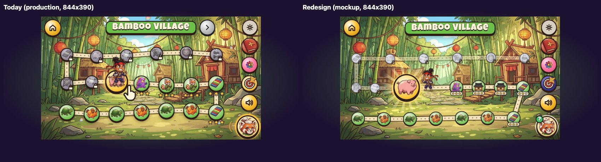

# The world map: one glowing stone, the ninja beside it

**Status:** design and implementation spec, 27 September 2026, revised the same day after review (§12 lists what changed). Nothing here is in the game yet. The follow-up workflow builds it into `src/App.tsx` (`WorldMap`) after the fix workflow (docs/fix-requests.md, "Map redesign and confirm (27 Sep)").

**Jonas (27 Sep), verbatim:** "Oh also on the overworld map the kids can still never find the right button to press and their avatar weirdly overlays half of the button etc and its all v weird. Also we could have some failsafe there where going back to a previous lesson accidentally, the sensei asks if thats what we want. In general a simple reusable mechanic that lets us 'confirm' an action would be v helpful in other situations too."

**What's where:**
- The evidence: [map-design/audit.md](map-design/audit.md), measured on production.
- A working mockup: [map-design/final/index.html](map-design/final/index.html). Open it from the repo (`open docs/map-design/final/index.html`). It uses the game's real map art, stones and sprites from `public/a/i`, and Sensei's recorded lines from `public/a/l`. With no `state`, it plays the map like the game does: tap to start, and you hear the arrival, get the idle ladder, see the walk after "playing" the glowing stone, and get Sensei's question when you tap a finished stone. `?state=rest|hint|idle8|idle16|help|locked|ninja|confirm|confirm8|away` shows a still, `&child=new|bamboo|w3` picks the child, `&debug=1` draws the boxes, and `&fast=4` speeds up the timers and speech. Sensei's question is drawn with the Confirm's own stylesheet (`src/styles/confirm.css`) and captions off, as a child sees it (`&captions=1` shows them).
- The layout, as code: [map-design/final/layout.js](map-design/final/layout.js). The mockup and the checker use it, and the game should port it as it is (§5).
- The geometry check: `bun docs/map-design/final/check.ts` lays out every land with each of its stones as the next one (74 layouts).
- Screenshots and measurements: [map-design/final/shots/](map-design/final/shots/), taken the way the audit took today's (Playwright, touch, DPR 3, the three phones, the three children). Also `bun docs/map-design/final/scripts/shots.ts`.

The players are 3 to 8 and most can't read. So everything the map asks is spoken and pictured.

---

## 1. Why

The audit's findings, in short:
1. **The child's ninja stands on the button.** Its box covers 97 % of the next stone's width and 70 % of its height. It is on top, so it takes 76 % of the taps on the stone, and its sprite hides 31 % of the stone. The stone bounces every 1.1 s and the ninja every 2.2 s, so the stone slides about under its feet. That is the "weird".
2. **Most of what a child can hit is a mistake.** Finished stones are 42 % of the tappable area in mid-Bamboo, and they replay their level the moment a finger lands. The nearest one is 2.5 mm from the gold stone, and the pointing hand sits between the two.
3. **Five gold round things, three names for the target.** Home, Hear it again, Sensei's Challenge, the land arrows and the stone are all gold and round. Sensei says "glowing stone", Help says "big, gold, bouncing stone", and a locked stone says "big gold stone".
4. **Sensei hints once, about 2 s in, and then never again.** There's no idle ladder. The hand is up from the first frame, so it never grows stronger.
5. **Another land is a dead end.** Every stone there replays, with no ninja, no glowing stone and no way home. Help still asks for the gold stone.
6. **The bots can't see any of it.** They fire `pointerdown` straight at the right stone, and the sweep exempts the ninja from its coverage checks.

## 2. The design



1. **One target: the glowing stone.** It is the next level's stone:
   - it is big: 150 stage px in Bamboo Village and 160 in the two-row lands, which is 71–88 CSS px on our phones, and its tap circle reaches 10 px further;
   - it is gold, with its game's picture;
   - slow rays turn behind it, a halo breathes and a ring ripples out, and it bounces, all on one beat of 1.2 s.
   
   **Nothing else on the map glows or bounces.**
2. **The ninja stands beside it, never on it.** It stands on the path just before the stone, on the side the path comes from, facing it. Its box is always 12 stage px clear of the stone's box, by construction (§5.3), so the two can't overlap at any stone position. It points at the stone whenever Sensei talks about it.
3. **The path makes room.** Each row of stones is laid out as slots (§5.2). The glowing stone's slot also holds the ninja's place behind it and a margin ahead. Whatever room is left is shared out between the other stones. So the ninja never stands on another stone, and the nearest finished stone is at least twice as far from the glowing one as today in Bamboo Village, and much further in the other lands (§9.1).
4. **Finished stones are smaller and calm, and they ask first.**
   - They are 80–88 stage px, in the land's colour, with a thin rim, no motion and their stars on a small pill.
   - Their tap circle is still 45–55 CSS px.
   - A tap opens Sensei's question (the Confirm, §7): "Do you want to play the fish-dog game again?" The child answers with the stone's picture (play it again) or the green ▶ (your next game).
5. **Locked stones are misty and not buttons.** They are small (60–66), grey and faded, with a padlock. A tap there does no harm. It **shows the way**, as any tap on the background does (see 7).
6. **One name, everywhere: "the glowing stone".**
   - It's in `tv_map_hint`, the `tv_map_next_<game>` previews, the new Help line `tv_map_help` ("Look next to your ninja. Tap the glowing stone.") and the new `tv_map_locked` ("Not yet! Tap the glowing stone first.").
   - `help_map` and `map_locked` retire from the map.
   - Help ties the target to what a three-year-old finds first: their own ninja.
7. **Showing the way.** A tap on the ninja, a locked stone or the background never navigates. Instead:
   - the glowing stone flashes;
   - the hand comes onto it;
   - the ninja points (the ninja throws a star at it if you tap the ninja);
   - Sensei says the hint, at most every 8 s.
   
   A wrong tap teaches the right one.
8. **The hand points *at* the stone.**
   - Its fingertip is on the stone's rim, on the side away from the ninja.
   - A tap on the hand plays the level (its painted shape only, not its square box).
   - It shows only while Sensei talks about the stone, on the idle ladder, on Help and after a wrong tap.
   - There's only ever one hand on screen (today there are two at the end of the first session).
9. **The idle ladder** (NAVIGATION.md §3.2, on the map):
   - 8 s: the glow grows, the hand comes and the ninja points;
   - 16 s: `tv_map_hint`, and the ninja leaps and throws a star at the stone;
   - 40 s: `tv_map_hint` once more;
   - then quiet. Nothing ever starts by itself.
10. **Another land shows the way back.** There's no ninja and no glowing stone there. The land arrow towards the child's land becomes the one glowing thing: a gold disc with rays, filled by a big cream arrow that points towards the child's land, with the ninja's face as a small badge on the side the arrow points to ("your ninja is that way"). What's drawn is what Sensei names: `tv_map_away` says "Your ninja isn't in this land. Tap the glowing arrow to go back." Every stone there asks first.
11. **Only one gold, glowing thing.**
    - Sensei's Challenge turns indigo.
    - ◀ ▶ become paper "signposts", and ▶ to a locked land is hidden (nothing to tap, nothing to say "Not yet!" about).
    - Home and Hear it again stay the nav layer's gold, the same on every screen, but they never glow or bounce.
12. **Motion is compositor-only.**
    - `transform` and `opacity` only, one beat.
    - The walk after a level moves the ninja and the stones with transitions on `transform`, not `left`/`top`.
    - There's no `requestAnimationFrame` while the map is idle.

## 3. What it looks like

Everything was shot from the mockup at DPR 3 with touch, at 844 × 390, 667 × 375 and 932 × 430, for the audit's three children:
- **new:** just after the first session; the next stone is `w1-wu3`.
- **bamboo:** mid-Bamboo; the next stone is `w1-7`, Sound Hunt.
- **w3:** the Misty Mountains; the next stone is `w3-6`, a dojo.

| | new | bamboo | w3 |
|---|---|---|---|
| today beside the redesign | [844](map-design/final/shots/compare-new-844x390.jpg) · [667](map-design/final/shots/compare-new-667x375.jpg) · [932](map-design/final/shots/compare-new-932x430.jpg) | [844](map-design/final/shots/compare-bamboo-844x390.jpg) · [667](map-design/final/shots/compare-bamboo-667x375.jpg) · [932](map-design/final/shots/compare-bamboo-932x430.jpg) | [844](map-design/final/shots/compare-w3-844x390.jpg) · [667](map-design/final/shots/compare-w3-667x375.jpg) · [932](map-design/final/shots/compare-w3-932x430.jpg) |
| at rest | [new-844x390](map-design/final/shots/new-844x390.jpg) | [bamboo-844x390](map-design/final/shots/bamboo-844x390.jpg) | [w3-844x390](map-design/final/shots/w3-844x390.jpg) |
| close-up (compare `current/*-closeup.png`) | [new](map-design/final/shots/new-844x390-closeup.png) | [bamboo](map-design/final/shots/bamboo-844x390-closeup.png) | [w3](map-design/final/shots/w3-844x390-closeup.png) |
| boxes: the ninja (red), the stone (green), the hand (blue), tap circles (orange) | [new](map-design/final/shots/new-844x390-boxes.jpg) | [bamboo](map-design/final/shots/bamboo-844x390-boxes.jpg) | [w3](map-design/final/shots/w3-844x390-boxes.jpg) |
| what a finger hits (compare `current/*-tapmap.jpg`) | [new](map-design/final/shots/new-844x390-tapmap.jpg) | [bamboo](map-design/final/shots/bamboo-844x390-tapmap.jpg) | [w3](map-design/final/shots/w3-844x390-tapmap.jpg) |
| the hint (arrival, Sensei on the stone) | [new](map-design/final/shots/new-844x390-hint.jpg) | [bamboo](map-design/final/shots/bamboo-844x390-hint.jpg) | [w3](map-design/final/shots/w3-844x390-hint.jpg) |
| the ladder: 8 s, 16 s | [8](map-design/final/shots/new-844x390-idle8.jpg) · [16](map-design/final/shots/new-844x390-idle16.jpg) | [8](map-design/final/shots/bamboo-844x390-idle8.jpg) · [16](map-design/final/shots/bamboo-844x390-idle16.jpg) | [8](map-design/final/shots/w3-844x390-idle8.jpg) · [16](map-design/final/shots/w3-844x390-idle16.jpg) |
| Help | [new](map-design/final/shots/new-844x390-help.jpg) | [bamboo](map-design/final/shots/bamboo-844x390-help.jpg) | [w3](map-design/final/shots/w3-844x390-help.jpg) |
| a tap on a locked stone / on the ninja | [locked](map-design/final/shots/new-844x390-locked.jpg) · [ninja](map-design/final/shots/new-844x390-ninja.jpg) | [locked](map-design/final/shots/bamboo-844x390-locked.jpg) · [ninja](map-design/final/shots/bamboo-844x390-ninja.jpg) | [locked](map-design/final/shots/w3-844x390-locked.jpg) · [ninja](map-design/final/shots/w3-844x390-ninja.jpg) |
| a finished stone tapped: the question, as Sensei asks | [the fish-dog](map-design/final/shots/new-844x390-confirm.jpg) | [the battle](map-design/final/shots/bamboo-844x390-confirm.jpg) | [Ninja Run](map-design/final/shots/w3-844x390-confirm.jpg) |
| the question after 8 s of quiet: the hand and the glow on ▶ | [8 s](map-design/final/shots/new-844x390-confirm8.jpg) | [8 s](map-design/final/shots/bamboo-844x390-confirm8.jpg) | [8 s](map-design/final/shots/w3-844x390-confirm8.jpg) |
| another land | [Blossom Hills](map-design/final/shots/new-844x390-away.jpg) (with Unlock every level) | [Blossom Hills](map-design/final/shots/bamboo-844x390-away.jpg) (with Unlock every level) | [Blossom Hills from the Misty Mountains](map-design/final/shots/w3-844x390-away.jpg) |

What changed, looking at them side by side:
- **The stone reads at once in every still.** The only frame of today's map that did this was the walk's 0.3 s frame.
- **The ninja is still the most alive thing on screen, and now it leads the eye to the answer.** It stands on the path and points at the stone.
- **The monsters and stars next to the stone recede,** and the misty stones ahead read as "not yet".

**How the question is drawn in the stills.** The mockup can't run the React component, so it draws what `ConfirmView` renders (the same elements and class names) with the component's own stylesheet, `src/styles/confirm.css`, linked from the page, and Confirm.tsx's layout constants, copied into `CFK` in index.html. So the look (colours, rings, glow, sizes) is the component's, and a change to confirm.css shows up in the mockup at once. Only a change to the layout constants or the elements needs copying. The stills were shot against Confirm.tsx and confirm.css as of 08:32 on 27 September. As in the game:
- the question is one layer at z 87, so it dims the map, the side column and Help;
- only Home (z 88) stays above it;
- the side column's Hear it again goes, because the question is a modal nav entry with its own speaker by the bubble.

Captions are off, as they are by default in the game. If the stills and the component ever disagree, the component and the confirm lane's own screenshots (`playtest/confirm/shots/`) are right.

## 4. States

"The hint" means the glowing stone flashes, the hand comes, the ninja points and Sensei says `tv_map_hint`, at most once every 8 s. A **finished stone** in this table also covers a stone the child can play but hasn't finished (§7).

| State | When | On screen | Sensei | The hand | The ninja | What taps do |
|---|---|---|---|---|---|---|
| **Arrival, the session's first map** | from the title (`intro: "welcome"`) | the map fades in; the stone blooms | `arrivalLines()` (TV-B1.2): `tv_welcome_back`, then `tv_map_next_<game>` if the stone is a new game, else `tv_map_hint` on the save's first two arrivals | on the stone while the preview or hint is said, and 2.5 s after | waves (`cheer` for 0.8 s), then points during the hint | glowing stone or its hand: plays; finished stone: the question; anything else: the hint |
| **Arrival after a level: the walk** | `mapAnim.from` is the level just won, on this land | the stones start where they were, with that level glowing, then slide to their new slots (0.7 s). The just-won stone turns calm, the new one lights up (its glow fades in), and petals burst | the land's welcome only once a session (TV-B1.2), then the preview if it's a new game; otherwise nothing (TS §5.8 "every other arrival") | with the preview only | runs from its old place to its new one (0.9 s, `run` pose), hops (`cheer`), then points for 1.2 s | as above; taps during the walk are kept for after it (the stones are moving) |
| **The first session ends here** (`intro: "stickerbook"`) | Reward 2's Next or Home | the Sticker Book bounces | `fm_rw2_map`, then `tv_map_hint` | on the book during `fm_rw2_map`, then on the stone during the hint (**one hand at a time**) | points during the hint | as above |
| **Rest** | after the arrival lines | the stone bounces and glows; the ninja breathes | nothing | none | idle, facing the stone | as above |
| **Idle 8 s** | 8 s of quiet (speech and the upright phone don't count) | the glow grows (`.glow.strong`) | nothing | on | points | as above |
| **Idle 16 s** | 16 s | as 8 s | `tv_map_hint` | on | leaps and throws a star at the stone, which flashes | as above |
| **Idle 40 s** | 40 s | as 8 s | `tv_map_hint` once more; then quiet for good | on | points | as above |
| **Wrong tap** | a tap on the background, a locked stone (it puffs) or a decoration | the hint | `tv_map_locked` for a locked stone, `tv_map_hint` otherwise (at most every 8 s, and never over a line) | on | points | the ladder starts again from 0 |
| **The ninja tapped** | the ninja's box | the hint | `tv_map_hint` (at most every 8 s) | on | hops and throws a star at the stone | nothing else: the ninja is never a way into a level |
| **Help** | Help, 1st press | the hint, the glow grows | `tv_map_help` | on | points | |
| **Help, 2nd press on** | | as the 1st press | `tv_map_help`, then `tv_map_hint` | on | throws a star | |
| **Hear it again** (the side column) | | | the arrival lines again; if nothing was said on arrival, `tv_map_hint` (so it always says something) | as during the hint | points | |
| **A finished stone tapped** | a stone with stars, on this land or another | Sensei's question (§7) over the map; the ladder stops | `tv_map_replay_<kind>`, then `tv_map_replay_how` | on ▶ (the Confirm's 8 s, and at once after any tap off the answers) | | the picture: replays it; ▶: the next level; Home (after 2.5 s) or 40 s of quiet: back to the map; anything else (the backdrop, the "?" bubble, Sensei): the hand onto ▶, and `tv_map_replay_how` again |
| **Another land** | ◀ ▶ | no ninja, no glowing stone; the way back is a big gold glowing arrow, with the ninja's face as a badge | the land's welcome (once a session), then `tv_map_away` | on the arrow back (during `tv_map_away`, on the ladder, on Help) | | the arrow back: the child's land (the walk doesn't play); finished stone: the question; anything else: the hint of this land (`tv_map_away`) |
| **The land is done** | the child's next stone is on the next land | the map opens on the new land (as today) with the ninja at the start of its path | the land's welcome, then `tv_map_next_learn` or the hint | with the line | appears with a hop at its place | as above |
| **Unlock every level** (grown-ups) | `settings.unlockAll` | stones ahead look finished (calm, no stars, no lock) | | | | they ask first (`tv_map_other`), as finished stones do |

## 5. The layout

### 5.1 Rows and sizes

A land's stones go in rows, snaking up from the bottom. Row 0 runs left to right, row 1 right to left, row 2 left to right.
- **1 row** for up to 7 stones (no land has so few today).
- **2 rows** for 8 to 16 stones: Blossom Hills (8) and Dragon River (9) used to be one row, which left no room for the ninja. The Misty Mountains (12), Shadow Castle (11) and the Sky Temple (14) were already two.
- **3 rows** for more: Bamboo Village's 20.

The stones stay inside x 64–1104 (x 64–1050 for a row whose centre line is at y ≥ 520, clear of Help). All sizes are in stage px.

| | 3 rows (Bamboo) | 2 rows | 1 row |
|---|---|---|---|
| row centre lines (y) | 596, 416, 244 | 560, 330 | 470, a long S of ±80 |
| the path's wobble | ±4 | ±10 | |
| the glowing stone: disc / tap circle | 150 / 170 | 160 / 180 | 170 / 190 |
| a finished stone: disc / tap circle (boss disc) | 80 / 96 (92) | 88 / 100 (100) | 92 / 104 (104) |
| a locked stone (not tappable) | 60 | 66 | 70 |
| the ninja's box (sprite 640 × 858) | 100 × 134 | 116 × 156 | 124 × 166 |
| the hand (TapHint) | 100 | 106 | 110 |

In CSS px, at 667 × 375, 844 × 390 and 932 × 430 with the touch insets (stage scale 0.4708, 0.4917, 0.5472):
- the glowing stone's disc is **70.6 / 73.8 / 82.1** (Bamboo) and **75.3 / 78.7 / 87.6** (two rows);
- its tap circle is **80.0 / 83.6 / 93.0** (Bamboo) and **84.7 / 88.5 / 98.5** (two rows);
- a finished stone's tap circle is 45.2 / 47.2 / 52.5 (Bamboo).

Today the stone is 62–72, and the ninja takes three quarters of it.

### 5.2 The slots (`layout()` in layout.js)

For each row, in the order the path runs:

```
items = the row's stones; each has pre, size, post (stage px along the row)
  the glowing stone: pre = GAP_BACK (14) + ninja width + GAP (12)   // the ninja's place, behind it
                     post = CLEAR (30)                              // room ahead
  every other stone: pre = post = 0
free   = row length − Σ (pre + size + post)
spacer = free / (items − 1)                                         // shared out evenly between the stones
u = 0 (the row's start edge); for each item: u += pre; centre = u + size/2; u += size + post + spacer
x = row start + centre (left→right rows) or row end − centre (right→left rows); y = pathY(row, x)
```

With the lands we have, `free` is never negative. The tightest is the Sky Temple's bottom row with the glowing stone in it: 126 stage px spare over 6 gaps. If a land ever outgrows its rows, `rowCount()` gives it another row, and check.ts fails first.

The stones' places change as the child moves on, because the glowing stone's slot moves. The walk animates that (§6.4).

### 5.3 The ninja: beside the stone, whatever the stone's position

**The rule.** For a glowing stone at (x, y) with radius R, in a row that runs in direction `d` (+1 left→right, −1 right→left), with the ninja's box W × H:

```
box.left  = d > 0 ? x − R − GAP − W : x + R + GAP          // on the side the path comes from, GAP = 12
box.right = box.left + W
feet      = (box.left + W/2,  pathY(row, box.left + W/2) + FEET)   // standing on the path, FEET = 20
box.top   = feet.y − H,  box.bottom = feet.y
facing    = d        (the sprites face right; mirror with scaleX(−1) when d < 0)
```

**Why it can never overlap.**
- The ninja's box and the stone's box are side by side, with 12 stage px of air between them, wherever the stone is: the start of a row, a corner, the top row, next to Help.
- The stone's bounce grows it by 4 px a side at most (scale 1.05).
- Its tap ring reaches 10 px past the disc, still short of the ninja's box.
- The slot layout reserves the ninja's place in the row. The one-row S curve and the row gaps (180 / 230 stage px) leave room for its height. So no other stone is under it either, and the row above it is always locked stones on a normal save.

**The numbers** (`bun docs/map-design/final/check.ts`, [output](map-design/final/shots/check.txt); every layout in [layouts.json](map-design/final/shots/layouts.json)). Over the 74 layouts, the ninja's box over the glowing stone's box is **0 × 0** in every one. At the closest, in stage px:

| Land | stones | rows | ninja's box to any other stone's tap circle | to any other stone's disc | glowing stone's tap circle to the nearest other tap circle | tap circles overlapping | hand over another tap circle | ninja or hand in a reserved zone |
|---|---|---|---|---|---|---|---|---|
| Bamboo Village | 20 | 3 | 39.3 clear | 27.2 clear | 39.0 | none (17.3 clear) | 0 | 0 |
| Blossom Hills | 8 | 2 | 138.0 | 59.8 | 90.0 | none | 0 | 0 |
| Misty Mountains | 12 | 2 | 50.8 | 56.8 | 90.1 | none | 0 | 0 |
| Dragon River | 9 | 2 | 83.5 | 58.5 | 95.8 | none | 0 | 0 |
| Shadow Castle | 11 | 2 | 50.8 | 56.8 | 94.5 | none | 0 | 0 |
| Sky Temple | 14 | 2 | 29.0 | 35.0 | 90.3 | none (9 clear) | 0 | 0 |

With Unlock every level (stones ahead tappable too), the ninja's box still touches no tap circle (9.6 stage px clear in Bamboo).

### 5.4 The hand

The TapHint hand points up, with its fingertip at 48 %, 10 % of its box. It is rotated about the fingertip, which goes on the stone's rim on the side **ahead** (the ninja has the other side). `placeHand()` tries three places in order and takes the first whose painted box lies over no other tap circle and inside the stage:
1. **below**: the tip at (x + d·0.36R, y + 0.52R), rotated −d·28°;
2. **beside**: (x + d·0.62R, y + 0.1R), −d·80°;
3. **above**: (x + d·0.36R, y − 0.52R), 180 + d·28°.

Over the 74 layouts, "below" wins 68 times and "beside" 6 times (where a finished stone sits below). In every one the hand lies over no other tap circle, and clear of Help, Home and the side column.

**How it is built (one model, the mockup's):** `MapHand` is its own element in the scene, not inside the stone's anchor or button.
- **Where it sits in the tree.** It is a direct child of `.scene.map`, rendered after the ninja, at z 9 (§5.5): above the side column (8) and under the nav layer (84 on).
- **Its box and place.** Its box is `L.hand.size` square, with `position: absolute; left: 0; top: 0; transform-origin: 48% 10%`. The fingertip is at (48 %, 10 %) of the box. `L.hand.tip` is the fingertip's place in stage px, measured from the scene's top-left like everything else in `layout()`. So `transform: translate(tip.x − 0.48·size px, tip.y − 0.10·size px) rotate(rot deg)` puts the fingertip on `tip`, and turning about the fingertip (the `transform-origin`) keeps it there. That is exactly what `handBox()` measures.
- **Its motion.** Inside it, a `.tap` box (`position: absolute; inset: 0; transform-origin: 48% 10%`) runs `map-taphand` on the map's beat (`--beat`, 1.2 s): `translateY(9px)` at rest, 0 at 45 %, 1 px at 60 %.
  - It is started in the same render as the disc's bounce, so the finger meets the rim as the stone rises (the bounce's top is also at 45 %).
  - It doesn't ride on the disc's bounce: the beat keeps the two together.
  - It is an HTML box, so the motion runs on the compositor. The TapHint's SVG is only drawn inside it.
- **Its taps.** The box and `.tap` have `pointer-events: none`. Only the SVG `<path>` takes taps (`pointer-events: visiblePainted`), and only while the hand shows (`.map-hand.on`, opacity 0 → 1 over 0.25 s). Its own `tapProps` handler plays the level, as the stone's does, and calls `stopPropagation` so the scene's "show the way" doesn't run. Hidden, it takes no taps.
- **Its hook.** `data-map-hand`.
- **On another land** the hand belongs to the way back (`.map-way`, in the banner), below the arrow.

### 5.5 Z-order (in the scene)

| z | What |
|---|---|
| 0 | background, vignette, the path (walked: solid; ahead: 50 % and misty) |
| 4 | the glowing stone's light: rays, halo, ripple. It sits under the stones and the ninja, so the ninja stands in the light |
| 5 | stones |
| 6 | the ninja |
| 7 | the glowing stone |
| 8 | the banner, the side column |
| 9 | the hand (`MapHand`, a direct child of the scene, §5.4) |
| 84–88 | nav layer, Help, captions (as now); the Confirm's layer over the map |

## 6. Implementation spec: src/App.tsx and its CSS

### 6.1 What changes

| File | Change |
|---|---|
| **new `src/ui/mapLayout.ts`** | port `docs/map-design/final/layout.js` as it is, with types: `layout(levels, state)`, `pathD`, `nextBox`, `placeHand`, `rectOverlap`, `circleRectDepth` and the constants. Unit tests: port `check.ts` to `src/ui/mapLayout.test.ts` (`bun test`) so a content change that breaks the geometry fails CI |
| **`src/App.tsx` `WorldMap`** | rewrite the render (§6.2), with a small `MapHand` (§5.4) and the way back `MapWay` (§2.10). Remove `nodePos`, `MAP_HERO_W/H`, the hero's tap shortcut and `data-tap-proxy`, the per-stone inline sizes and gradients, and the stone's `TapHint` at `right: −70`. Keep the props, the route key, `useNav({ again, againAt: "side" })`, `useHelp`, `playMusic`, the side column and `HoldButton` |
| **`KIND_ICON`** (App.tsx) | `dojo: "item_dojo"` in place of `"sensei_idle"`. It is the new dojo picture, a small dojo hall (`public/a/i/item_dojo.webp`, §10 decision 7). The map's stones and the reward's medal (`RewardTrophy`) both read `KIND_ICON`, so both change |
| **new `src/styles/map.css`** (imported by App.tsx) | the map's classes (§6.3). **Remove** from `src/styles/shell.css` `.map-hero`, `.map-hero img`, `.map-hero::after`, `.map-hero-hop`, `@keyframes map-hop`, and change `.map-challenge`'s background to indigo. **Remove** from `src/styles.css` `.map-next` and `@keyframes mapnext` |
| `src/content/instructions.ts` (owner) | `ASIDES` += `tv_map_help`, `tv_map_locked`, and the question's lines (`tv_map_replay_*`, `tv_map_other*`), so Hear it again never replays Help's clue or a question |
| `scripts/treadmill/*` | §8 |

### 6.2 The render (sketch)

```tsx
type StoneState = "next" | "done" | "open" | "locked";
const cur = currentLevel();
const here = w.id === cur.world;
const stateOf = (i: number): StoneState => {
  const l = w.levels[i];
  if (here && l.id === cur.id) return "next";
  if ((stars[l.id] ?? 0) > 0) return "done";
  return isUnlocked(l) ? "open" : "locked";           // open: placed past it, or Unlock every level
};
const L = useMemo(() => layout(w.levels, stateOf), [w.id, cur.id, stars, unlockAll]);
const [glow, setGlow] = useState(false), [hand, setHand] = useState(false), [pointing, setPointing] = useState(false); // point(): true for 1.6 s
// the walk: if mapAnim.from is on this land, first render layout(w.levels, i => i < fromIdx ? "done" : i === fromIdx ? "next" : …)
// then, in a layout effect + one frame, switch to L: the anchors and the ninja transition on transform (§6.4)

<div className="scene map" style={{ "--land": w.colour } as CSSProperties} onPointerDown={showTheWay}>
  <div className="vignette" /><PetalDrift n={6} />
  <svg className="map-path">{/* pathD(L).ahead (className "ahead"), then .walked: the three strokes as today */}</svg>
  {L.next && <div className={`map-glow ${glow ? "strong" : ""}`} style={{ "--s": `${L.next.size}px`, transform: `translate(${L.next.x}px, ${L.next.y}px)` }}>
    <i className="rays" /><i className="halo" /><i className="ripple" /></div>}
  {L.stones.map((s) => (
    <div key={s.id} className="map-anchor" style={{ transform: `translate(${s.x}px, ${s.y}px)`, zIndex: s.state === "next" ? 7 : 5 }}>
      {s.state === "locked"
        ? <div className="map-stone locked" data-map-locked data-level={s.id} aria-hidden style={box(s.size)}>{disc(s)}<span className="lock"><Icon.lock/></span></div>
        : <button className={`map-stone ${s.state}`} aria-label={`level ${s.id}`} data-map-next={s.state === "next" || undefined}
            data-map-done={s.state !== "next" || undefined} style={box(s.hit)} {...tapProps((el) => s.state === "next" ? play() : ask(s, el))}>
            {disc(s)}</button>}
    </div>))}
  {L.ninja && <div className={`map-ninja ${pointing ? "pointing" : ""}`} data-map-ninja aria-hidden
      style={{ width: L.ninja.w, height: L.ninja.h, transform: `translate(${L.ninja.box.l}px, ${L.ninja.box.t}px)` }}
      {...tapProps(() => { ninjaStar(); showTheWay(); })}>
    <i className="shadow" /><div className="face" style={{ transform: `scaleX(${L.ninja.face})` }}><div className="bob">
      
      </div></div></div>}
  {L.hand && <MapHand h={L.hand} on={hand} onTap={play} />}   {/* its own element at z 9, not inside the stone (§5.4) */}
  {/* banner: ◀ (calm) | the land's name | ▶ (calm, only if that land is open) — or <MapWay side> towards the child's land */}
  {/* side column as today; .map-challenge indigo */}
</div>
```

- `box(d)` gives `{ left: −d/2, top: −d/2, width: d, height: d }`. `disc(s)` is `<span className="disc" style={{ width: s.size, height: s.size }}>{stars pill}</span>`.
- **The hand** (`MapHand`, §5.4): `<div className={`map-hand ${on ? "on" : ""}`} data-map-hand style={{ width: h.size, height: h.size, transform: `translate(${h.tip.x - 0.48 * h.size}px, ${h.tip.y - 0.1 * h.size}px) rotate(${h.rot}deg)` }}><div className="tap"><svg …><path {...tapProps(onTap)} …/></svg></div></div>`. Everything is in stage px from the scene's top-left, because it is a direct child of the scene.
- **The way back** (`MapWay`, on another land): the gold disc (`data-map-way`, the button) holds a big cream arrow (a filled block arrow, 80 % of the disc, mirrored for ◀) and the ninja's face as a 54 px badge on the side the arrow points to. The badge is inside the button, so a tap on it goes back too.
- `showTheWay(e?)`:
  - reset the ladder;
  - `flash()` the stone and burst its glow;
  - show the hand; the ninja points;
  - if the tap was inside a locked stone's disc (use `L.stones` and `stageXY` of the pointer), puff that stone and say `tv_map_locked`, else `tv_map_hint`;
  - say at most once every 8 s of game time, and never over another line (`isSpeaking()`);
  - on another land, the arrow back gets the hand and the line is `tv_map_away`.
- **Sound for a wrong tap:** `sfx.tap`, not `sfx.wrong`. It isn't a mistake to punish.
- Keep acting on finger-down (`tapProps`) for the stones and the ninja. The scene's own `onPointerDown` handles the background, and children that act call `stopPropagation`.

### 6.3 CSS (`src/styles/map.css`)

The mockup's `<style>` is the reference. Copy these rule groups over with the `map-` prefix: `.anchor`, `.stone.*`, `.map-glow` (already prefixed in the mockup: a bare `.glow` would collide with the Confirm's own state classes), `.hand` and `.hand .tap`, `.ninja`, `.star-fly`, `.way` (with `.arrow` and `.face`), `.btn-round.calm`, `.side.challenge`, `@keyframes bounce, rays, halo, halo-strong, ripple, burst, flash, puff, bob, hop, leap, taphand, sx, sy, spin`.

The rules that matter:

```css
.map { --beat: 1.2s; }                                   /* one rhythm */
.map-anchor { position: absolute; left: 0; top: 0; width: 0; height: 0; transition: transform .7s cubic-bezier(.4, 0, .2, 1); }
.map-stone { position: absolute; border-radius: 50%; display: grid; place-items: center; }
.map-stone .disc { position: relative; border-radius: 50%; display: grid; place-items: center; }
.map-stone.done .disc, .map-stone.open .disc { background: radial-gradient(circle at 40% 30%, #fffaf0, var(--land) 78%); border: 4px solid var(--ink); box-shadow: 0 4px 0 var(--ink); }
.map-stone.locked { pointer-events: none; }
.map-stone.locked .disc { background: radial-gradient(circle at 40% 30%, #eceef4, #a4a8ba); border: 4px solid rgba(43,29,20,.62); }
.map-stone.locked .disc img { filter: grayscale(1) contrast(.9) opacity(.62); }     /* static filter: painted once */
.map-stone.next .disc { background: radial-gradient(circle at 40% 30%, #fffbe6, #ffc53d 70%, #c98a00); border: 7px solid var(--ink);
  box-shadow: 0 8px 0 var(--ink); animation: map-bounce var(--beat) ease-in-out infinite; will-change: transform; }
.map-glow .rays { /* repeating-conic-gradient, radial mask */ animation: map-rays 18s linear infinite; will-change: transform; }
.map-glow .halo { animation: map-halo var(--beat) ease-in-out infinite; }          /* opacity + scale */
.map-glow .ripple { animation: map-ripple calc(var(--beat) * 2) ease-out infinite; } /* scale + opacity */
.map-ninja { position: absolute; left: 0; top: 0; z-index: 6; transition: transform .9s cubic-bezier(.45, 0, .25, 1); }
.map-ninja .bob { animation: map-bob var(--beat) ease-in-out infinite; transform-origin: 50% 100%; }
.map-ninja img { position: absolute; left: 0; bottom: 0; width: 100%; transition: opacity .12s; }   /* poses cross-fade */
.map-hand { position: absolute; left: 0; top: 0; z-index: 9; transform-origin: 48% 10%; opacity: 0; transition: opacity .25s; pointer-events: none; }
.map-hand.on { opacity: 1; }
.map-hand .tap { position: absolute; inset: 0; transform-origin: 48% 10%; animation: map-taphand var(--beat) ease-in-out infinite; }
.map-hand.on svg path { pointer-events: visiblePainted; }                            /* only the painted hand takes taps */
```

**Performance** (docs/PERF.md):
- Everything endless is `transform` or `opacity` on its own layer. That's the stone's bounce, the rays' turn, the halo, the ripple, the ninja's breathing and the hand's tap (on its HTML `.tap` box, never on an SVG group, which would repaint).
- There are only three `will-change` layers: the disc, the rays and the ninja.
- The walk is two transitions on `transform`.
- The pose swaps are opacity cross-fades between stacked sprites (no `src` change mid-animation).
- The ladder is `setTimeout`s. There's no `requestAnimationFrame` loop.
- `PetalDrift` stays as it is.
- The locked stones' filters are static.
- While the Confirm is open, pause the map's loops (`.map.paused *, .map.paused *::before { animation-play-state: paused }` from `useConfirmOpen()`).

### 6.4 The walk after a level

1. **Read where the ninja came from.** Take `mapAnim.from` (set by the level host as now). If that level is on this land, `old = layout(w.levels, state as if from were next)`.
2. **First render with `old`.** For each stone, render its anchor at `old`'s position (`style.transition = "none"`), and the ninja at `old.ninja.box` in the `run` pose, facing `old`'s direction. Leave the new glowing stone's light at opacity 0. The stone just won is already `done` (smaller), because sizes don't animate.
3. **Next frame: move to the new layout.** Set every anchor to its position in `L`, and the ninja to `L.ninja.box`. The CSS transitions carry them: the stones in 0.7 s, the ninja in 0.9 s.
4. **At 0.95 s, arrive.**
   - The ninja does its `cheer` hop (0.8 s), then points for 1.2 s. Meanwhile the light fades in (0.4 s), the stone `flash`es, and you get `fx.burst(x, y, "petals", 24)`, `fx.ring` and `sfx.petal` + `sfx.jump`, as today.
   - Then the arrival lines.
5. **Keep taps for after the walk.** During the 1 s walk, a tap on the new glowing stone is kept and played at arrival. Bots wait for `__snState.settling` to go false.

### 6.5 The ladder, Help and Hear it again

- **The ladder** is a small hook in App.tsx, `useMapLadder({ onRung })`.
  - Its timers use game time (FAST), and pause while anyone speaks or the phone is upright.
  - Any `pointerdown` on the stage resets it.
  - It starts when the arrival lines end, or at mount if nothing is said.
  - The rungs are 8 s (glow, hand, point), 16 s (`tv_map_hint` + `ninjaStar()`) and 40 s (`tv_map_hint`). Then it stops.
  - Publish the rung in `__snState.rung`.
- **Help** (`useHelp`):
  - here: press 1 is `tv_map_help` + the hand + the glow + the point; press 2 and later add `tv_map_hint` and the star;
  - on another land: `tv_map_away` + the hand on the arrow back.
- **Hear it again:** `arrival.current` if it isn't empty, else `tv_map_hint` (here) or `tv_map_away` (another land).
- **The arrival lines** are B1's `arrivalLines()` (TV-B1.2). On another land, `tv_map_away` follows the land's welcome.

## 7. The Confirm on the map

**When the map asks:** a tap on a finished stone (`done`), or a stone the child can play but hasn't finished (`open`), on any land.

**When it never asks:**
- the glowing stone;
- a locked stone (not a button);
- the ninja (it shows the way);
- Home (goes to the title and nothing is lost: CONFIRM.md row 15);
- ◀ ▶ (just paging);
- Sensei's Challenge (CONFIRM.md row 13).

**The call** (the API in `src/ui/Confirm.tsx`, CONFIRM.md §3, as of 27 September, 08:32):

```ts
async function ask(s: Stone, el: Element) {
  const played = (stars[s.id] ?? 0) > 0;
  const q = !played ? "tv_map_other" : hasLine(`tv_map_replay_${s.kind}`) ? `tv_map_replay_${s.kind}` : "tv_confirm_play_again";
  ladder.stop();
  const r = await confirmWith({
    id: "replay",
    ask: { line: q },
    how: [{ line: played ? "tv_map_replay_how" : "tv_map_other_how" }],
    slots: { game: levelGames(s)[0] },                          // narrate.tsx
    yes: { pic: img(iconOf(s)), say: [{ line: "tv_map_replay_yes" }] },  // the stone's own picture: play it (again)
    no: { say: [{ line: "tv_map_replay_next" }] },               // the green ▶: your next game
    from: el,                                                    // answers drawn away from the tapped stone
  });                                                            // (home: "no", the default: Home stays on the map)
  if (r.yes) onLevel(s.id);
  else if (r.how === "no") onLevel(cur.id);                      // ▶ starts the next game (CONFIRM.md row 1)
  else ladder.start();                                           // Home, 40 s of quiet, cancel: stay on the map
}
```

- **One picture, and it answers.** The stone's picture goes to YES only. The map passes no bubble `pic`, so Sensei's bubble shows her "?". The component also never draws the same picture twice (`pictures()`). So "Tap the picture to play it again" can only mean YES. The biggest things on screen are the two answers, and the "?" bubble is smaller.
- **A tap off the answers shows the way.** A tap on the "?" bubble, on Sensei or on the backdrop does this:
  - the hand and the glow come onto ▶ at once;
  - Sensei says `tv_map_replay_how` again, if she is quiet and hasn't said it in the last 6 s;
  - a tap on her face says the whole question instead.

  A tap there never just resets the ladder, so a child who keeps tapping the bubble is shown the answer. It's the map's own rule (§2.7).
- **The question names the stone's picture or game**, one whole recording per kind.
  - `tv_map_replay_picread` is "Do you want to play the fish-dog game again?", and `…_ears` is "…the tortoise game…". The others are `…_battle`, `…_boss`, `…_dojo`, `…_run`, `…_swap`, `…_story`, `…_sort`, `…_firstsound` and `…_soundhunt`.
  - A kind with no line of its own (`listen`) falls back to the Confirm's `tv_confirm_play_again` ("You've played that game before. Do you want to play it again?").
- `tv_map_replay_how` follows: "Tap the picture to play it again. Or tap the green arrow for your next game." Neither line says "go back", so nothing the child hears names the ◀ Back glyph.
- **The Confirm's own rules still hold:**
  - NO, the green ▶ (252 stage px, on the right with the child's ninja giving a thumbs up), is the safe answer. It is bigger than YES (216), and it gets the hand and the glow;
  - taps in the first 700 ms are ignored;
  - Home is ignored for 2.5 s, then answers NO (the map stays as it was);
  - 40 s of quiet closes it as NO;
  - the map's speech and lesson clocks pause under it.
- **The warm-up pacing risk** (CONFIRM.md note a) is a fix in `warmupPace`, not a question (fix-requests.md).

## 8. Bots and the treadmill

### 8.1 `__snState` on the map

```ts
window.__snState = {
  scene: "map",
  world: w.id,                  // the land shown
  next: cur.id,                 // the level to play next (unchanged: existing bots keep working)
  here: boolean,                // is the glowing stone on this land?
  target: { x, y, r } | null,   // the glowing stone's centre and disc radius, stage px (its tap circle is r + 10)
  ninja: { l, t, r, b } | null, // the ninja's box, stage px
  way: "stone" | "back" | "forward",  // what a child should tap: the stone, or the glowing arrow back
  rung: 0 | 8 | 16 | 40,        // the idle ladder
  settling: boolean,            // the walk is running (1 s after arrival)
};
// while the question is up, Confirm's own state replaces it: { scene: "confirm", id: "replay", ready, safe: "no", … }
```

**Hooks:**
- `[data-map-next]` is the glowing stone's button;
- `[data-map-done]` covers the finished and open stones;
- `[data-map-locked]` and `data-level` mark the locked discs (not buttons);
- `[data-map-ninja]`, `[data-map-hand]` and `[data-map-way]` are the ninja, the hand and the glowing arrow back;
- `aria-label="level <id>"` stays on every stone button.

### 8.2 Tap like a child

**`continuous.ts` and `bot.ts` on the map** stop calling `dispatchEvent("pointerdown")`. Instead:
1. wait for `!settling`;
2. if `here`, take the rect of `[data-map-next] .disc`, and tap its centre with `page.touchscreen.tap(x, y)` (or `page.mouse.click`), which is hit-tested;
3. otherwise tap `[data-map-way]` the same way;
4. assert that the route becomes `level:<next>`. A tap that lands on anything else is a finding (`map-tap-missed`, major).

A "clumsy" persona sometimes taps 20 CSS px off the centre towards the nearest finished stone, then expects the question and answers ▶.

### 8.3 The sweep

- **Map cases:**
  - `map-new`, `map-bamboo` and `map-w3`, with the audit's saves (`saveFor()` in `current/scripts/map-audit.ts`), at 844 × 390, 667 × 375 and 932 × 430;
  - `map-away` (w3 on Blossom Hills);
  - `map-walk` (`?scene=reward&id=w1-6` → Home, then the walk).
- **Remove the `[data-tap-proxy]` exemption** from `covered-target` and `zone-conflict` (sweep.ts l. 205, 215), and from HERO.md's contract text. Nothing on the map is a proxy any more.
- **New invariants:**

| Check | Rule | Severity |
|---|---|---|
| `map-ninja-overlap` | the ninja's rect ∩ the glowing stone's rect = **0 × 0**. Measure mid-bounce too: pause the disc's animation at 45 % and measure again | blocker |
| `map-next-covered` | every point of the glowing stone's disc on a 2 CSS px grid hit-tests (`elementFromPoint`) to the stone or its hand: 100 % | blocker |
| `map-next-size` | the disc ≥ 56 CSS px, the tap circle ≥ 64 CSS px | major |
| `map-next-biggest` | the glowing stone's tap circle is the largest single tappable target in the scene | major |
| `map-one-glow` | exactly one element on the map runs an endless animation with a glow: the glowing stone, or the arrow back on another land. The World Flower's `pulse` (a ready gem) is allowed, as it doesn't glow | major |
| `map-one-hand` | at most one TapHint visible | major |
| `map-hand-on-target` | the hand's fingertip is inside the glowing stone's disc, and its painted box overlaps no other tap target | minor |
| `map-replay-asks` | a touch tap on a finished stone opens `__snState.scene === "confirm"` with id `replay` and leaves the route unchanged. ▶ then goes to `level:<next>`; Home goes back to the map | blocker |
| `map-locked-inert` | a touch tap on a locked stone leaves the route unchanged and opens no question; `tv_map_locked` is said (`__audioLog`) | major |
| `map-ninja-inert` | a touch tap on the ninja's head leaves the route unchanged | major |
| `map-idle-ladder` | untouched for 60 s: the hand by 8.5 s, `tv_map_hint` at 16 s and 40 s (±1 s, not counting speech), then no more lines to 60 s | major |
| `map-away-way` | on another land, `[data-map-way]` exists and glows, and Help says `tv_map_away` | major |

## 9. Acceptance

### 9.1 What the mockup already shows (to hold the game to)

From [measurements.json](map-design/final/shots/measurements.json), at DPR 3 with touch, the three children at the three phone sizes:

| | today (audit) | redesign (mockup) |
|---|---|---|
| the ninja's box over the next stone | 62.9 × 45.2 CSS px (97 % × 70 %) at 844 | **0 × 0** at every size, for every child (the ninja is 4.5–5.3 CSS px away) |
| taps on the stone's disc that reach the stone | 24 % (76 % hit the ninja) | **100 %** |
| the next stone's disc / tap circle, CSS px | 62–80 (disc) | 70.6–87.6 at rest, up to 90.2 mid-bounce / 80.0–98.5 |
| from the stone's edge to the nearest finished stone | 15.9 CSS px (2.5 mm), and it replayed on touch | 29–97 CSS px to its **tap circle**, and it asks first |
| a real tap on the finished stone next door | the old level, at once | Sensei's question |
| a real tap on the hand | nothing | the next level |
| a real tap on the ninja's head | the next level (a hidden shortcut) | shows the way |
| a real tap on a locked stone | "Not yet! Play the big gold stone first." | shows the way, with "Not yet! Tap the glowing stone first." |
| gold round things on the map | 5 | 3 (Home and Hear it again, never glowing, and the stone); 1 glowing |
| names for the target | 3 | 1 |
| hands on screen at once | 2 (end of the first session) | 1 at most |
| Sensei after arrival | one line at ~2 s, then nothing | the ladder: 8 s, 16 s, 40 s, then quiet (checked live at `fast=4`: the hand at 8, `tv_map_hint` at 16 and at 40, none after) |

### 9.2 What the built map must pass

1. **Geometry.** `bun test src/ui/mapLayout.test.ts` (check.ts ported) passes: 74 layouts, the ninja's box over the stone 0 × 0, and every clearance in the §5.3 table ≥ 0.
2. **Stills.** On a frozen build (`bun scripts/treadmill/frozen.ts --port 49xx`), shoot the audit's three children at the three sizes with `docs/map-design/current/scripts/map-audit.ts --base http://127.0.0.1:49xx --only shots`. The map shots must match the mockup's `final/shots/<child>-<size>.jpg` in layout: the stones' places, the ninja beside the stone, sizes within ±2 px. Put them in `docs/map-design/built/` and add a side-by-side `compare-built-*.jpg`.
3. **The DOM overlap check.** At each of the 9 child × size pairs, at rest and with the disc's animation paused at 45 %: the ninja's `getBoundingClientRect()` ∩ `[data-map-next]`'s = **0 px**, and the disc hit-test = 100 %.
4. **The sweep's map cases** (§8.3): 0 findings, with the `data-tap-proxy` exemption gone.
5. **The walk.** Frames at 0.3, 0.6, 1.0 and 3.5 s after Home on w1-6's reward (`--only arrive`):
   - the new stone's light comes on only when the ninja has arrived (during the 0.9 s run, at a row change, the ninja may pass in front of stones, including the new one);
   - by 1.0 s it is beside it, 0 px over it;
   - `measurements-arrive.json` shows no `left`/`top` transitions.
6. **Performance.** `soak.ts --check` with the map's idle budget: no rAF callbacks while idle, and no main-thread paints from the map's loops (docs/PERF.md fix 4 style). Phone budgets unchanged.
7. **The treadmill.** One `continuous.ts` run with position taps plays the first session and three stones with no `map-tap-missed`.
8. `npx tsc -b` and `bun test` are clean.

## 10. Decisions made without asking (to copy into docs/DECISIONS.md)

1. **The ninja stands behind the stone on the path, not on it, and not on a fixed side.** It faces the way the path runs.
   - Why: "behind, facing it" reads as "I walked here; this one is next", and the walk never crosses the stone.
   - The alternative was always the left side, which mirrors less but sometimes puts the ninja "ahead" of the stone and makes the walk jump over it.
2. **The map re-lays itself out around the glowing stone (slots).**
   - Why: there's no room for a ninja between evenly spaced stones (145 stage px apart in Bamboo).
   - The stones slide 0.7 s after each level. That is the only cost, and it reads as "the path makes way".
3. **Blossom Hills and Dragon River become two rows.** With the ninja's slot, one row of 8–9 stones has no room.
4. **The ninja is never a way into a level.** A tap on it shows the way.
   - The brief allowed "not tappable, or harmless".
   - A dead ninja would teach "the map is broken", and a shortcut would teach the child to tap the ninja rather than the stone.
5. **Locked stones aren't buttons, but a tap there still gets an answer** (`tv_map_locked`, the hint). No other screen goes silent on a tap, so this one shouldn't either.
6. **Home and Hear it again keep their gold.** They are the nav layer's controls, the same on every screen. What sets the stone apart is its glow, its rays and its size, and the ninja pointing at it, not its colour. Sensei's Challenge (indigo) and ◀ ▶ (paper) lose their gold.
7. **The dojo stone gets its own picture: a small dojo hall** (`item_dojo`), no longer Sensei.
   - Why: in the Misty Mountains the glowing dojo stone showed Sensei about 75 CSS px from the Sensei Help button. "Tap the glowing stone" beside a second Sensei was the likeliest first-tap miss left. A tap on Help is harmless, but a miss is still a miss.
   - Made the way the game's items are (`scripts/img.ts` with the art manifest's style, cut out like `post-art.py`): `docs/map-design/final/scripts/gen-dojo-icon.ts` and `cut-dojo-icon.py`. There were four takes, and the frontal one with the chunkiest silhouette was kept (take 1).
   - It is a single curved dark roof over warm wood and glowing paper doors. It has no lantern, gong or gate, which the story, Ninja Run and word-picture stones already use. It matches "Next is the dojo" (`tv_map_next_learn`).
   - The alternative was a dojo gate. A torii reads as the Ninja Run gong's red frame, and a gate is a word picture (`pic_gate`).
8. **The replay question names the stone**, one recording per kind (Jonas's example, "the fish-dog game"), falling back to the Confirm's generic `tv_confirm_play_again` ("You've played that game before. Do you want to play it again?", which never says "go back"). Stones the child can play but hasn't finished ask "Do you want to play that game instead?", because "again" would be untrue.
9. **▶ in the question starts the next game** (CONFIRM.md row 1). Only Home, the backdrop and 40 s of quiet stay on the map.
10. **The ladder follows NAVIGATION §3.2** (8 s glow and hand, 16 s line, 40 s line), not TEACHER_SCRIPT §5.8's "the 8 s idle nudge" wording. It is the same line, a rung later, the same as every held step.
11. **No swiping between lands.** A swipe that pages by accident takes a child away from its ninja. The arrows are enough, and the way back glows.
12. **With Unlock every level, stones ahead ask first too.** It costs one extra tap in a grown-up mode, and it keeps the rule "only the glowing stone plays at once".
13. **The way back is drawn as the arrow Sensei names.** `tv_map_away` says "Tap the glowing arrow". The first design drew the ninja's face with a 25 CSS px ▶ badge, so the arrow now fills the gold disc and the face is the badge. The alternative was to re-record the line as "Tap your ninja". But on the home land a tap on the ninja only shows the way (decision 4), so the same words would mean two things.
14. **The hand is its own element in the scene** (§5.4). The spec used to put it inside the stone's button. That can't reach z 9 over the side column, and it measured from the wrong corner. The mockup already did it this way.
15. **The slowed map clips are kept** (§12.2). A blind listen found no artefacts, and re-taking wouldn't help: this voice says an eight-word question at about 4.4 words a second, so any take needs slowing.

## 11. Files

- `docs/map-design/final/index.html`: the mockup. `worlds.js` and `lines.js` are generated from `src/content/worlds.ts` and `lines.ts` for it (re-export them if the content changes).
- `docs/map-design/final/layout.js`: the layout, to port to `src/ui/mapLayout.ts`.
- `docs/map-design/final/check.ts`: the geometry check.
- `docs/map-design/final/scripts/shots.ts`: the screenshots, close-ups, boxes, tap maps, probe taps and the comparisons with today.
- `docs/map-design/final/shots/`: the output, with `measurements.json`, `layouts.json`, `check.txt` and `audio-check.json` (§12.2).
- `docs/map-design/final/scripts/audio-check.ts`: the second listen to the map's (and the confirm's) clips (§12.2).
- **New art:** `public/a/i/item_dojo.webp` (320 × 274), the dojo stone's picture (§10 decision 7). The raw takes are in `assets-src/art/item_dojo.take{0..3}.png`, with the chosen one at `assets-src/art/item_dojo.png`. Made by `docs/map-design/final/scripts/gen-dojo-icon.ts` and `cut-dojo-icon.py`.
- **New lines, recorded** (`src/content/lines.ts`, the "Map redesign" block, `public/a/l/`):
  - `tv_map_help`, `tv_map_locked`, `tv_map_away`;
  - `tv_map_replay_{ears,picread,firstsound,soundhunt,dojo,battle,boss,run,swap,story,sort}`;
  - `tv_map_replay_how`, `tv_map_replay_yes`, `tv_map_replay_next`, `tv_map_other`, `tv_map_other_how`.
- **Their metadata:** `src/core/content/line-tags.ts`, block `// Map redesign`, for content test 6b.

## 12. Review round (27 Sep): what changed, and the lines check

### 12.1 What changed

The review passed the map's geometry: 0 px of overlap, 100 % of taps reaching the stone, and check.ts green. Its map findings, and what was done:

| # | Finding | Fix |
|---|---|---|
| 4 | The question's bubble showed the stone's picture a second time. It was the biggest picture on screen, and it did nothing when tapped | §7: the map passes the stone's picture to YES only, so the bubble shows Sensei's "?". The component now draws a picture only once, and a tap on the bubble shows the way (the hand onto ▶ and the `how` line). That part is the confirm lane's. The mockup draws the question with the component's stylesheet |
| 5 | The dojo stone showed Sensei, the Help button's face, about 75 CSS px from Help | New art: `item_dojo`, a small dojo hall (§10 decision 7). `KIND_ICON.dojo` in App.tsx is a fix request |
| 6 | The spec contradicted itself about the hand (a child of the button, but at z 9, measured from the wrong corner) | One model, the mockup's, spelled out in §5.4, §5.5, §6.2 and §6.3. The mockup's tap motion also moved from an SVG group to an HTML box, so it runs on the compositor |
| 7 | `tv_map_away` says "Tap the glowing arrow", but the glowing thing was the ninja's face | The way back is now a big arrow, with the face as a badge (§2.10, §10 decision 13). The line stays |
| 10 | Stale notes: map clips "not measured", map lines "untagged", "17" map lines | All 19 are in `durations.json` and tagged in `line-tags.ts`. The notes in fix-requests.md and CONFIRM.md now say so |
| 11 | Clips slowed up to ×1.36; three transcripts in plain text, not phonetics | §12.2 |
| 12 | The question in the stills didn't match the component (Help not dimmed, a second speaker) | The mockup now draws `ConfirmView`'s elements with `confirm.css` at z 87, with Help dimmed and the side column's speaker gone (§3). There's a new still at 8 s, `confirm8` |

The mockup also lost a small busy loop: while someone talked, its idle ladder re-armed a 0 ms timer. It now looks again after 300 ms.

### 12.2 The lines check

`bun docs/map-design/final/scripts/audio-check.ts` (under Doppler) has Gemini listen to every finished clip; the results are in `shots/audio-check.json`. That is the model gen-audio's judge uses, with a new prompt. It checked all 19 map clips, and the confirm's 8 as they were at 08:30, read-only.

**The accent.** Every clip got an IPA transcription, and every one was heard as Southern British English (RP-like).
- This includes the three that had plain-text transcripts:
  - `tv_map_replay_ears`: [dʒuː wɒnt tə pleɪ ðə ˈtɔːtəs ɡeɪm əˈɡɛn];
  - `tv_map_replay_sort`: [dʊ jʊ wɒnt tə pleɪ ˈsɔːtɪŋ əˈɡɛn];
  - `tv_confirm_leave_boss`: [… ðə bɒs ˈbætl̩ …].
- The evidence: GOAT is /əʊ/ (glowing, stone, go, okay, home), LOT is /ɒ/ (want, not, swap, boss, monster), and the endings are non-rhotic (tortoise /ˈtɔːtəs/, sorting /ˈsɔːtɪŋ/, picture /ˈpɪktʃə/).

**The slowing.** gen-audio slowed the word-perfect takes that were still over 3.3 words a second with Praat's PSOLA (`lengthened`). The heaviest are:

| Clip | Slowed by |
|---|---|
| `tv_map_replay_story` | ×1.36 |
| `tv_map_replay_boss` | ×1.31 |
| `tv_map_replay_run` | ×1.31 |
| `tv_map_replay_swap` | ×1.30 |
| `tv_map_replay_dojo` | ×1.27 |
| `tv_map_replay_sort` | ×1.22 |

The confirm's `tv_confirm_replay` is ×1.36 and `tv_confirm_leave` ×1.25.

- **Alone, blind** (the listener isn't told the clip may be slowed):
  - every finished clip scores 8–10 for natural, and 0–2 for how audible any processing is. No artefacts were named.
  - The untouched takes of the same lines score 6–9 and 0–4.
- **A/B** (the finished clip against an untouched take, in a random order, asking which one was slowed): the listener picks the finished clip 13 times in 14, with an audibility of 6–8.
- **The control.** The same A/B on two untouched takes, where nothing was slowed, still "finds" a slowed clip every time, with an audibility of 2–8 (usually 5–6). It even invents "phasey" and "robotic" artefacts.

So the A/B is suggestion, not evidence. What it picks up is the slower pace, which is the point of the slowing.

**Decision:** keep the clips (§10 decision 15). Re-taking wouldn't help, because the voice says these eight-word questions at about 4.4 words a second (7 or 8 takes each, all too fast), so every take would be slowed as much. A human ear is still the real test for the six clips above: `afplay public/a/l/tv_map_replay_story.mp3` and so on. If one sounds drawn out, the fix is to re-word it into two short sentences, so gen-audio widens the pause between them instead of slowing the voice. That needs a new line id (lines.ts is append-only).
