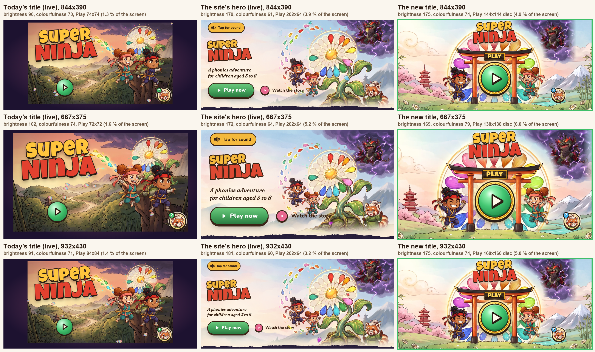

# The title screen: design and implementation spec

**Status:** final design, 27 September 2026, with a mock-up, a reference implementation that has been run inside a copy of the game, and acceptance checks. Nothing in `src/` has been changed: the fix workflow owns it. §9 lists every edit, and `playtest/runs/title-design/final/wire.py` applies them to a copy of the game.

**Jonas (27 Sep, verbatim):** "Also the layout of the game start screen looks lame and boring and worse than the marketing site and the play button looks weird and little and out of place floating randomly."



*[`title-design/final/compare.png`](title-design/final/compare.png): today's live title (left), the live site's hero (middle) and the new title (right), on the iPhone 15 (844×390), iPhone SE (667×375) and Pro Max (932×430).*

**In one paragraph.** The title is now one painted scene that fills the whole phone. A vermilion torii stands on the meadow of the Island of Sounds at dawn. Behind it the World Flower blooms: its wheel of glassy sound petals rises over the gate like a rainbow sunrise. **Play is the flower's golden heart**, a 288-stage-px green jewel in a beaded gold rim, framed by the gate's opening. The gate's black-and-gold name board says PLAY. The logo sits in the sky above the gate, and no beam crosses a letter. Kai and Suki stand either side of the gate; once a child has a ninja, that child's own ninja stands in front with their name on a wooden sign. Baron Muddle glowers from his storm in the top right, and Sensei is the Help coin in the corner. Every 9 s a golden star streaks past Baron into the heart. Tap anywhere and the heart rings like a gong, the ninjas dive into its light, and the light fills the screen. A child who already plays goes straight on in one tap. A grown-up's "who's playing?" and settings wait quietly in the top-left corner.

**The files:**
- [`title-design/final/index.html`](title-design/final/index.html): the mock-up. Open it from the repo root on a phone held sideways. Try `?state=first|returning|several`, `&sheet=open`, `&who=leo|ava`, `&shot=1`.
- [`title-design/final/impl/Title.tsx`](title-design/final/impl/Title.tsx) and [`impl/title.css`](title-design/final/impl/title.css): the reference implementation. It was type-checked and run in a copy of the game (§10.2).
- [`title-design/final/shots/`](title-design/final/shots/): every state on all three phones, with the mock-up's stills and the in-game stills (`game-*`).
- [`title-design/final/art/`](title-design/final/art/): the new art, ready to copy into `public/a/i/` (§9.4).

---

## 1. Why

### 1.1 What was wrong (the audit, [title-design/audit.md](title-design/audit.md))

- **Play was little and floated.** It was a 74 CSS px coin (1.3 % of an iPhone 15's screen) in the lower left, over the busiest part of the painting. Nothing held it, nothing pointed at it, and Sensei's Help coin in the opposite corner was nearly as big and the same green.
- **A third of the phone was a dark frame.** A fixed 16:9 stage left 107–116 px plum bars on each side of the big phones.
- **It was darker and muddier than the site:** brightness 90 against the site's 179. It showed a dusky sunset where the site shows a pastel dawn.
- **The story was missing.** The site shows the whole cast round a big World Flower. The title had two cut-out heroes over a small flower, no Baron, and Sensei only as the coin.
- **It barely moved,** and it was silent on launch.
- **One tap started the game twice.** A cold 4G launch showed a grey box for about 2 s, because the painting loaded last, behind 32 pose sprites.
- **Returning children tapped twice** (Play, then their own face), and nothing on the title said whose game it was.

### 1.2 What the three mock-ups and three judges taught

| | Hero poster | Ninja ready | World-map gate |
|---|---|---|---|
| wow and brand | 6 | 7 | **8** |
| small hands | 6 | 7 | **8** |
| cost | 6 | **8** | 7 |

The judges' reports are [judge-wow-and-brand.md](title-design/judge-wow-and-brand.md), [judge-small-hands.md](title-design/judge-small-hands.md) and [judge-cost.md](title-design/judge-cost.md).

**This design builds on world-map-gate,** as all three judges advised: a symmetrical scene with Play dead centre in a gate, and profiles behind a chip and a shelf. From the other two it takes:

| from | graft | where it lands |
|---|---|---|
| hero-poster | the site's painted World Flower, back at the centre of the story | the flower's wheel rises behind the gate; Play is its heart |
| hero-poster | something flies into Play every 9 s | a golden shooting star, not a petal (a teardrop always means a sound, Dec6) |
| hero-poster | a press that sinks onto its shadow; a paw at 16 s | Play's press state; the game's `TapHint` |
| ninja-ready | Play as an object, with a gong's response and a PLAY plaque | the heart rings like a gong; the gate's name board says PLAY |
| ninja-ready | the child's own ninja, front and centre, named | the own ninja stands in front, bigger, on a wooden name sign |
| ninja-ready | a staged arrival | the logo drops, Play pops, the heroes land and the storm rolls in, all within 1.2 s |
| cost judge | the painting sized per phone and preloaded; paint in its colours first; bake the gate into the art; a CSS-transition hold ring; an idle sleep | all adopted (§8) |

**The must-fixes, and how they are fixed:**

| must-fix (judge) | fixed by |
|---|---|
| the torii looks like UI laid on a painting (wow) | the gate, the flower and the land are **one painting** (Nano Banana Pro, from the game's references). No SVG gate |
| the logo is jammed onto the torii (wow) | the logo sits in the sky, clear of the top beam at every size (a gap of about 10 CSS px). It gets a cream halo round its letters so it reads over the flower's crown |
| bring back the World Flower (wow) | it is the centrepiece: an 800-stage-px rainbow wheel behind the gate |
| petals snagged on the beam, a theft that doesn't read (wow) | there are no loose petals. The star flies from Baron's storm to the heart |
| Sensei's tap rivals Play; Help breaks the contract (wow, small hands) | Sensei is only the standard Help coin, bottom-right at 124 stage px. There is no painted Sensei, so there is no second Sensei |
| heroes are toys that don't start; their boxes crowd Play (small hands) | the heroes are part of the scene, and a tap on them starts the game |
| the grip starts the game (small hands) | the scene starts only on a short tap (up within 450 ms, moved under 12 px). Play itself starts on pointerdown. Verified: a 700 ms thumb on the edge does nothing |
| no single tap may change who plays; no one-tap "+" (small hands) | chip → shelf → face is two taps, and even then it never starts the game. "New ninja" is inside the shelf |
| your own face must not be a dead end (small hands) | in the shelf, your own face closes the shelf and makes the heart beat |
| the gear under 44 px (small hands) | the chip and the gear are 96 stage px: 45 CSS px on an SE, 47 on an iPhone 15 |
| a visible nudge, since sound is locked (small hands) | the heart beats hard at 8 s, then every 14 s; the paw at 16 s. Both are visual |
| the ▶ and "?" in the same green (audit) | on the title, Help's "?" is sky blue. Play is the only green thing on the screen |
| a rotating ray layer is the biggest cost (cost) | the rays are painted into the art. No big layer ever rotates |
| two endless animations on `<svg>` (cost) | none. Everything endless runs on an HTML element, on transform or opacity |
| the music warm-up competes with the art (cost) | it runs 2.5 s after mount, once the painting is up |
| the pose probe (2.6 MB) goes before the art (cost) | the probe waits 2.5 s (§9.6) |
| one tap, two starts (audit) | a `going` guard, and every control stops its tap. Verified: two taps on Play give one start |

### 1.3 Did it beat the site?

- **The numbers (844×390).** The new title is as bright as the site (175 against 179) and more colourful (colourfulness 74 against 61; today's title is 90 and 70). Play is 144 CSS px across (37 % of the screen's height) against the site's 202×64 pill and today's 74 px coin. §8 has the full table.
- **A blind check.** Gemini's vision models were shown the three 844×390 screens as A, B and C, four times, without being told which was which. They picked the new title as the best every time:

| | overall (3.1 Pro) | overall (3.8 Flash) |
|---|---|---|
| **the new title** | **6.9, 7** | **9, 9** |
| the site's hero | 5, 4 | 5, 6 |
| today's title | 5.8, 5 | 7, 7 |

  Their most common criticism was that the centre is dense (logo, gate, board and button stacked). §11 lists it as a known trade-off.
- **My own verdict, as lead designer:** it is clearly better than the site. The site is a web page with a painting beside it. This is one scene, and the thing to tap is the heart of it.

---

## 2. The design, element by element

All positions are in stage px: the game's 1280×720 stage, scaled to the phone's height by `Stage` (ui.tsx: 10 px free at the top and 26 px at the bottom on touch screens). The art bleeds past the stage to the edges of every phone.

| element | where (stage px) | what it is |
|---|---|---|
| **the painting** (`title_key`) | box x −300.5 … 1579.8, y −46 … 841 (1880×887) | the dawn meadow, the torii and the World Flower's rainbow wheel, all in one image. On every phone it covers the whole screen. On taller or wider screens (tablets, desktop windows) it scales up about the flower's heart until it covers (§9.1, `useBleed`) |
| the gate (painted) | top beam at y 244; tie beam at y 340–363; pillars' inner edges at x 485 / 795; feet at y 723 | vermilion lacquer, a black top beam with gold caps |
| the flower (painted) | heart at (640, 482); wheel radius about 400 | two rings of glassy teardrop petals: the outer ring in rainbow sound colours, the inner ring pale ghost petals (the story: Baron took some) |
| **the logo** | centred, top 4; "Super" 100 px, "Ninja" 132 px; −3° | the game's `.logo` lockup, unchanged. It gets a cream halo that follows its letters (two drop-shadows, painted once) |
| **Play** | the button is x 470–810, y 262–712 (the gate's opening); the disc is 288 across, centred at (640, 496) | §4 |
| **the PLAY board** | x 546–734, y 266–338 | black lacquer and gold, hung on the gate's central strut. It is part of the button |
| the heroes | left hero x 112–434 (own ninja) or 176–432 (Kai, first launch); right hero x 852–1092; feet at y 712 | §3 |
| **Baron's storm** (`title_baron`) | right −96, top −62, 600 wide | keyed from the site's own painting. Its right and top edges are feathered so it melts into the sky |
| **Help** (the global `HelpButton`) | right 14, bottom 14, 124 | unchanged, except that its "?" is sky blue on the title |
| **the grown-ups' corner** | left 18, top 16; the chip and the gear are 96 tall | only when players exist (§5) |
| glow, motes, sparks, star | the heart's glow is 520 across at (640, 482); 6 motes rise in the gate's opening; 4 twinkles | the scene's life (§4.3) |

**Sizes on the three phones (CSS px):**

| | iPhone SE 667×375 | iPhone 15 844×390 | Pro Max 932×430 |
|---|---|---|---|
| stage scale | 0.471 | 0.492 | 0.547 |
| Play's disc | **138** (22 mm) | **144** (24 mm) | **160** (27 mm) |
| Play's tap area (the gate opening) | 160×212 | 167×221 | 186×246 |
| share of the screen: disc / tap area | 6.0 % / 13.6 % | 4.9 % / 11.2 % | 5.0 % / 11.4 % |
| Play's centre (across, down) | 50 %, 65 % | 50 %, 65 % | 50 %, 65 % |
| logo | 186×103 | 194×108 | 216×120 |
| chip / gear height | 45 / 45 | 47 / 47 | 53 / 53 |
| Help coin | 58 | 61 | 68 |

A short tap anywhere else in the scene also starts the game (§4.4). Play is 1.9× today's diameter and 3.7× its area.

**Stacking order, bottom to top:** painting → glow → motes, sparks → storm → logo → heroes (own ninja above the other) → Play (z 10) → star (z 12) → grown-ups' corner (z 20) → shelf (z 30) → shock ring, iris (z 40) → Help (z 85, global).

---

## 3. Every state

| # | state | what the title shows | Play goes to |
|---|---|---|---|
| 1 | **First launch, browser tab** (Get ready → "play here") | Kai cheering on the left, Suki leaping on the right, no grown-ups' corner. The "play here" tap has already unlocked sound, so the title theme plays from the start | the name screen ("What's your name?"), then the film, Choose and the Dojo, as today |
| 2 | **First launch, home-screen app** | the same, silent until the first tap. Any tap (Play, a hero, the sky, Help) unlocks sound; Play also plays the gong and starts the theme | as 1 |
| 3 | **Held upright** | the game's turn-your-phone picture covers everything (`RotatePrompt`, unchanged) | — |
| 4 | **One child** (Maya, Suki) | Maya's Suki stands front-left in her ready stance, bigger (322 wide), on a wooden "Maya" sign. Kai cheers on the right. Top-left: the chip (Maya's face, ⇄) and the gear | **straight on as Maya, in one tap:** `afterLaunch()` (the map with its welcome, or the next lesson) |
| 5 | **A child whose ninja is Kai** (Leo) | Leo's Kai front-left with "Leo"; Suki on the right | as 4, as Leo |
| 6 | **A child with no ninja yet** (Ava) | first launch's cast (Kai and Suki), no sign; the chip shows Ava's initial in her colour | as 4 (for her: the film, then Choose) |
| 7 | **Several children** (six) | the chip: the current child's face, then two siblings, "+3" and ⇄ | as 4, as the current child |
| 8 | **Players, but none chosen** (the current one was deleted on the grown-ups page) | first launch's cast; the chip shows the faces; no gear (the grown-ups page belongs to a player) | Who's playing? (the `Profiles` list, as today) |
| 9 | **The shelf** (the chip tapped) | a dimmed scene, and a panel: "Who's playing?", every child's face (122 px, their colour ring, the current one ringed in gold), and a dashed "+ New ninja" | while it is open, Play does nothing: a tap outside a face only closes the shelf |
| 10 | a face in the shelf | the face beats, the shelf closes, and that child's ninja lands at the front with their sign. The chip updates and the heart beats. **It never starts the game** | the next Play starts as that child (verified: Leo) |
| 11 | "+ New ninja" | → the name screen (`Profiles` with `naming`). Its ◀ Back goes to the list, Home to the title | — |
| 12 | **The gear, short press** | Sensei: "This part is for grown-ups. Hold the button to open." (`grownups`), and a bubble under the corner: "Grown-ups: press and hold" | — |
| 13 | **The gear, held 2 s** | a gold ring fills round it (a CSS transition, no rAF) | the grown-ups page for the current child; its way back (and Home) returns to the title |
| 14 | **Help** | Sensei's coin glows and talks: `help_start`, "Tap the big green button to start!". At 0.9 s the heart beats hard and the paw points at it for 3 s. With the shelf open: `help_players` | — |
| 15 | **Idle 8 s** | the heart beats hard twice with a gold ring, and the PLAY board clacks. If sound is on, Sensei says `tap_start`, "Tap to start!" (at most twice per visit). Then again every 14 s | — |
| 16 | **Idle 16 s** | the paw (the game's `TapHint`) taps at the heart | — |
| 17 | **Idle 30 s** | the scenery rests (`.sleep`: every ambient loop paused). Play keeps breathing, glinting and rippling, and the paw keeps tapping. Any touch wakes it | — |
| 18 | **Back on the title with Home** (from the map, the film, Choose, the opt-in, a first-session lesson) | as 4–7. The land's music gives way to the title theme (sound is already on) | straight back in, one tap: `afterLaunch()` resumes the film, the opt-in, the welcome or the lesson (`firstSession` is kept) |
| 19 | **New school year** (the first launch on or after 1 September) | as 4–7 | `afterLaunch()` → the opt-in in "new year" mode, as today |
| 20 | **Start** | §4.5 | as above, 1.05 s after the tap |
| 21 | **Reduced motion** (`prefers-reduced-motion`) | every loop runs once; the scene is still | as above |
| 22 | **A tablet or a desktop window** | the art scales about the heart until it covers (1024×768: ×1.135) | as above |

Stills of every state: §10.1.

---

## 4. The Play button

### 4.1 Size and shape

- **The disc:** 288 stage px across (138 / 144 / 160 CSS px on the three phones). It is centred at (640, 496), on the flower's painted heart, which it covers.
  - **The rim:** a domed gold ring (radial gradient, highlight top-left) with **28 stamen beads**, like the painted heart's stamens. It has a 7 px ink border and a hard 11 px ink drop with a soft shadow under it.
  - **The disc:** a green jewel, inset 24 (radial #effff3 → #8ff0ac → #45c874 → #23924d → #176a37), with a 6 px ink border and inner shading. It is the only green thing on the screen.
  - **The ▶:** a cream triangle (#fffbea) 124 px across with a 9 px ink stroke and a 7 px ink drop, nudged right to sit optically centred.
- **The PLAY board:** 188×72, black lacquer (#4a3526 → #1f140d) with a gold inner line (#e0a21a), and gold Luckiest Guy "PLAY" (#ffd45a, 50 px, ink stroke). It hangs on the gate's strut, 8 px above the disc. It is for grown-ups and matches the site's "Play now". Children read the ▶.
- **The button's box** is the whole gate opening: x 470–810, y 262–712. It includes the board and the disc. `aria-label="Start"`.

### 4.2 Arrival (it is never "floating randomly")

The arrival starts once the painting has decoded (at most 1.2 s after mount). The painted golden heart is already there, and Play grows out of it:

| t | what happens | how |
|---|---|---|
| 0 | the camera settles on the gate | the art, `scale` 1.07 → 1, 1.3 s |
| 0.05 s | the logo drops in with a bounce | 0.65 s |
| 0.2 s | **Play pops out of the heart** | scale 0.4 → 1, 0.55 s, overshoot |
| 0.3 / 0.42 s | the heroes land with a squash | 0.55 s each; the own ninja first |
| 0.4 s | Baron's storm rolls in from the top right | 0.8 s |
| 0.7 s | the grown-ups' corner fades in | 0.4 s |
| ≈ 1.2 s | settled | |

Strips: `shots/arrival-<size>.jpg`.

### 4.3 While it waits (alive, never frantic)

| motion | detail | cost |
|---|---|---|
| heartbeat | scale 1 ↔ 1.045, 1.8 s | transform |
| glint | a white sheen sweeps across the disc every 3.6 s | transform, clipped by the disc |
| two ripples | gold rings run out from the rim (scale 0.96 → 1.5), 2.4 s, 1.2 s apart | transform, opacity |
| the heart's glow | 520 px radial light behind Play, breathing 0.55 ↔ 0.95, 4.2 s | opacity, transform |
| **the shooting star** | every 9 s (first at 2.6 s) a golden four-point star leaves Baron's storm, hops up, swoops down right of the logo and lands in the heart. A gold ring runs out as it lands. It is visual, so it works before sound is unlocked | transform, opacity (two elements on one 9 s timeline) |
| the nudge (8 s, then every 14 s) | the heart beats hard (scale 1.16/1.12 → 0.95 → 1.06) twice with a gold ring-out; the board clacks | one-shot classes |
| the paw (16 s) | `TapHint`, left 236, top 280 inside the button | transform |

### 4.4 Taps

- **Play starts on `pointerdown`,** instantly. The treadmill presses it that way.
- **Anything else in the scene** (the sky, the heroes, Baron, the meadow) starts on a **short tap**: up within 450 ms, moved under 12 CSS px. A thumb resting on the edge, a palm or a swipe never starts it.
- **These never start the game:**
  - the chip, the gear and the shelf (they stop their own taps);
  - Help (outside the scene).
- **The first touch of any kind unlocks sound.** It calls `unlockAudio()`, which includes iOS's "playback" session, and starts the title theme.
- **One tap is one start:** a `going` ref guard. Verified: two taps on Play 150 ms apart give one start and `sessions` + 1.

### 4.5 The press and the exit (1.05 s)

| t after the tap | picture | sound |
|---|---|---|
| 0 | the heart sinks onto its shadow (translateY 9, squash 0.96/0.93); the disc brightens a little (never washes out); a cream **shock ring** runs out (scale 0.9 → 2.6, 0.65 s); **blossoms and gold twinkles** burst from the heart (`fx.burst(640, 486, "blossoms", 36, 1.6)`, `fx.twinkle`); the board clacks | **`sfx.gong()`**: the game's gong (110, 220.5, 331 and 443 Hz sines, 3.2 s decay, and a noise strike); **the title theme** starts streaming (`playMusic("title")`, fading in over about 0.6 s) |
| 0.08 s | the heart swells (1.16) and **turns into light** (a cream-gold flash fills it over 0.4 s); the glow flares | `sfx.whoosh()` |
| 0.08 / 0.16 s | **the ninjas crouch, leap in an arc and dive into the heart** (0.8 s each; the one on the right mirrored) | |
| 0.26 s | Baron's storm recoils up and away | `sfx.petal()` (the bright four-note chime) |
| 0.55–1.05 s | the light (an iris from the heart, scale 0.3 → 17) fills the screen with cream | |
| 1.05 s | the route changes. The next screen fades in **from cream** (`.fullscreen-fade.light`), not from plum | |

Strips: `shots/start-first-<size>.jpg`, `shots/start-one-child-<size>.jpg`.

---

## 5. Profiles and grown-ups

**Who's playing is shown, not asked.**
- The child's own ninja stands at the front with their name, and the chip shows their face.
- Play goes straight on as them. For a returning child that is **one tap where today takes two**.
- The *Who's playing?* screen (`Profiles`) is still reached when there is no current player (states 1, 2 and 8), and from the shelf's "+ New ninja" (the name screen).

**The chip** (top-left, 96 stage px tall, cream with an ink border: a button):
- It shows the current child's face first, then up to two siblings, "+N" for the rest, and a ⇄ glyph.
- Each face is the ninja's head (192 px crops, `face_kai` and `face_suki`), or the child's initial in white Luckiest Guy.
- Each face has a colour ring in the child's own colour (`NAME_COLOURS`, Profiles.tsx, picked by the name). So two children with the same ninja look different: Leo and Theo are both Kai, ringed gold and violet.
- `aria-label="Who's playing? <name>"`.

**The shelf** (a modal on the title, never a new screen):
- One row of up to seven 140-wide cards (122 px faces with their names), with "+ New ninja" at the end. More children wrap onto a second row.
- It keeps its order while open.
- A face: the face beats, then `profilesApi.select(id)` as the shelf closes (never under the finger). The new ninja lands at the front, the chip updates and the heart beats.
- Your own face: it closes the shelf and the heart beats.
- A tap outside a face only closes the shelf. It never starts the game.

**The gear** (next to the chip, 96 stage px):
- Press and hold for 2 s. Sensei says `grownups` on press, and a gold ring fills by a CSS transition.
- A press shorter than 1.9 s shows "Grown-ups: press and hold" under the corner for 2.6 s.
- The page opened is `{ name: "grownups", from: { name: "title" } }`, so its way out returns to the title.
- It is shown only when there is a current player, since the page belongs to one.

**Why the top-left:** the title has no Home, so the Home zone is free. Grown-ups look there on every other screen, and it is the corner furthest from Play and from a child's right thumb. The sweep already exempts `.scene.title` from the Home-zone and ninja-zone checks (NAVIGATION.md §6).

**A toddler who holds the gear still gets in**, as on the map today. The grown-ups page's destructive action ("delete this player") needs its own confirmation (small-hands judge; that is the grown-ups page's job, not the title's).

---

## 6. What Sensei says

No new lines. It keeps TEACHER_SCRIPT's and `lines.ts`'s title and name lines as they are:

| line | text | when on the title |
|---|---|---|
| `help_start` | Tap the big green button to start! | Help. It is true now: the button is big, green and the only green thing |
| `tap_start` | Tap to start! | idle 8 s and 22 s, only if sound is on and nobody is speaking; at most twice per visit |
| `help_players` | Tap your picture to play. New ninja? Tap the big plus! | Help while the shelf is open |
| `grownups` | This part is for grown-ups. Hold the button to open. | on pressing the gear |
| `help_name` | Ask a grown-up to help you type your name, then tap the green tick. | unchanged, on the name screen |

- **No child's name is spoken.** There is no recording of it, and the game is static. The name is shown on the sign and in the shelf.
- **"Welcome back" stays on the map** (`tv_welcome_back`), where it is said on the first map of a session. The title doesn't greet, so it isn't said twice.
- **No unlock greeting.** The first tap on Help says `help_start` in full (ninja-ready's bug, where the unlock greeting cut Help off, can't happen).
- **Music:**
  - The title theme streams through `<audio>` and is never decoded (PERF.md fix 5).
  - It plays from mount when sound is already on (Home from the map, or after Get ready). That fixes the audit's "the land's music keeps playing on the title".
  - Otherwise it starts on the first touch.
  - The HTTP-cache warm-up runs 2.5 s after mount, never while the art loads.

---

## 7. The art

| file (→ `public/a/i/`) | size | bytes | what |
|---|---|---|---|
| `title_key.webp` | 2400×1132 | 250 KB | the painting, for DPR 3 (`srcset` 3x) |
| `title_key_1600.webp` | 1600×755 | 149 KB | the painting, for DPR 2 (the SE) and DPR 1 (`srcset` 2x) |
| `title_baron.webp` | 840×660, alpha | 54 KB | Baron in his storm, keyed from `public/media/landing/hero-wide.webp`, with the right 110 px and the top 34 px feathered |
| `face_kai.webp`, `face_suki.webp` | 192×192 | 13 KB each | the heads for the chip and the shelf (from the idle poses) |

**How the painting was made:**
- **The model:** Nano Banana Pro (`gemini-3-pro-image`, 21:9, 2K) through `scripts/img.ts`.
- **The references:** the site's `hero-wide.webp` (style, palette, flower), `world_flower_bg.webp` (the land) and `world_flower_partial.png` (the flower's model sheet).
- **A flat layout guide** fixed the gate, the heart and the sky (`make-guide.py`).
- **22 takes over five rounds.** The chosen plate is `gateGuidedV3-2`.
- **An edit then painted the outer ring** into a rainbow wheel behind the gate (`wheelEdit-2`), with the geometry unchanged: the heart at (1585, 800) in source px, the top beam at y 440, the pillars' inner edges at 1350 and 1820.
- **`make-art.py`** crops it to stage x −300 … 1580 (source x 160–3009) and scales it, at 1 source px = 0.66 stage px.
- **Every prompt, guide and take** is in `playtest/runs/title-design/final/gen/` (git-ignored). Copy the chosen source PNG and the three scripts to `assets-src/title/` to keep the provenance.

**What the art deliberately doesn't contain:**
- **Characters.** They are the game's sprites, so they can move and change with the player.
- **The logo.** It is live Luckiest Guy text, the same lockup as the site and the icon.
- **Baron.** He is keyed from the site, so he is exactly the villain the parent just saw.

**First paint.** Before the painting arrives, `play/index.html`'s body is the painting's own gradient (#c8e4ec → #e7cdb7 → #859c60), never plum or grey (§9.6).

---

## 8. Performance

Measured with Playwright Chromium (`isMobile`, `hasTouch`), on the mock-up and on the reference implementation running in a copy of the game.

| | today | **new** | budget (acceptance) |
|---|---|---|---|
| **cold first launch, 4G (150 ms, 9 Mbps), CPU ×4, iPhone 15: title ready** (painting drawn, logo font in, Play fully shown) | 4.07–4.31 s (production) | **1.83 s** (a production build of the copy, gzip; 3 runs) | ≤ 2.2 s |
| the painting finished | 3.57–3.98 s | **0.88 s** | ≤ 1.2 s |
| data before ready | 3.2–3.4 MB (32 pose sprites first) | **1.18 MB** (2 pose sprites) | ≤ 1.4 MB |
| first contentful paint | 0.96–1.0 s | 1.39 s | the body's gradient covers it (§9.6) |
| DOM, whole page (elements / all nodes) | 59 / 87 | **109–126 / 161–183** (shelf open: +22) | ≤ 160 / ≤ 260 (house: ≤ 400) |
| the title's own elements | 35 | 53–70 | ≤ 90 |
| endless animations running | 17 | **21–22** | ≤ 24 |
| … on an SVG element, or on a property the compositor can't run (the soak's own rule, in the game at 5 s) | 0 | **0** | 0 (soak: ≤ 2) |
| … running on a hidden element (the soak's own rule, in the game at 5 s) | 0 | **0** | 0 (soak: ≤ 2) |
| … after 30 s untouched (`.sleep`) | 17 | **5** (Play's 4 and the paw) | ≤ 6 |
| rAF calls, 10 s untouched, sound locked, CPU ×4 | 0 | **0** | 0 |
| main thread, same | 0.1 % | **0.35 %** | ≤ 0.5 % |
| with sound on | — | Sensei's 8 s "Tap to start!" runs the lip-sync for about 1 s (76 rAF calls; 2 % over 10 s) | as any line |
| decoded audio, the title 5 s untouched (soak `titleDecodedMB`) | 0.1 MB | `tap_start` + `help_start` only (≈ 0.2 MB) | ≤ 2 MB |
| decoded images on screen (est.) | 12.4 MB | DPR 3: ≈ 18 MB (painting 10.9, storm 2.2, two hero sprites 4.7); DPR 2: ≈ 12 MB | ≤ 19 / ≤ 13 MB |
| title images downloaded | 224 KB painting + 2.6 MB poses | DPR 3: 250 + 54 KB (+ 2 hero sprites, cached for the game anyway); DPR 2: 149 + 54 KB | ≤ 350 KB of title-only art |

**Where the cost goes, and what was kept out:**
- **No rAF ever runs on the title while idle.** Only the burst on the tap uses the effects canvas.
- **There is no full-screen layer that changes every frame.** The camera settle is a one-shot. The rays are painted. The biggest looping layers are the 520 px glow and Play itself.
- **The idle sleep pauses 17 loops after 30 s.**
- **Every endless animation is on an HTML element.** The ▶ is an `<svg>` inside the heartbeat's HTML layer, and it isn't animated itself.
- **A caveat:** headless Chromium composites in software. Before shipping, one idle-heat check on a real iPhone SE should confirm the numbers (the cost judge's caveat).

---

## 9. Implementation spec

The fix workflow owns `src/`, so nothing here has been applied. `playtest/runs/title-design/final/wire.py` makes exactly these edits to a **copy** of the game. With them, the copy passes `tsc` (the only errors were the fix workflow's own, in `src/scenes/Warmup.tsx`), builds, and plays every state in §3.

### 9.1 New: `src/scenes/Title.tsx`

Copy [`title-design/final/impl/Title.tsx`](title-design/final/impl/Title.tsx). What it does:

- **`Title({ onStart, onNewPlayer, onGrownups })`.** The current player comes from `useSave(() => profilesApi.current())`; the list from `profilesApi.list()`.
- **State:** `in` (the arrival: set when the painting has decoded, at most 1.2 s), `going`, `pressing`, `shelf` (the order while open), `hop`, `paw`, `sleep`, `wake`. A `going` ref is the one-start guard.
- **`useBleed(root)`** adds `.bleed` to the closest `.stage` while mounted. It returns the painting's cover scale: 1 on every phone, more only where the screen, in stage px, is taller or wider than the art.
  - It measures in a microtask, after `Stage`'s own layout effect. React runs the parent's layout effect after the child's, so measuring directly gave a wrong ×1.28 (found and fixed in the copy).
- **The DOM,** all in `.scene.title`:
  - `img.t-key`: `src=title_key`, `srcSet="title_key_1600 2x, title_key 3x"`;
  - `.t-glow`, `.t-motes > i.t-mote ×6`, `i.t-spark ×4`;
  - `.t-storm > .t-storm-bob > img(title_baron) + .t-storm-flash`;
  - `.t-logo > .logo > span.l1 + span.l2`;
  - `Cast` (`.t-hero[.me][.flip][.leap][.second] > .t-land > .t-shadow + .t-hbob > img`, and `.t-sign`);
  - `button.t-play[aria-label=Start] > span.t-board + span.t-bob > span.t-heart > (…)` and `TapHint`;
  - `.t-comet`;
  - `.t-gu > button.t-chip + button.t-gear + span.t-hint`;
  - `.t-shelf > .t-panel > h3 + .t-row > button.t-card ×n + button.t-card.add`;
  - `.t-shock`, `.t-iris`.
- **Taps:**
  - `onPointerDownCapture` wakes the scene and unlocks sound, then starts the title theme.
  - `onPointerDown` and `onPointerUp` implement the short-tap start.
  - The Play button starts on `pointerdown` (and on keyboard click, `detail === 0`) and stops propagation. The chip, the gear and the shelf stop propagation too.
- **Timers,** never rAF: the nudge at 8 s and then every 14 s (with `tap_start` if sound is on, at most twice); the paw at 16 s; sleep at 30 s. Every touch restarts them.
- **`useHelp`:** `help_start`, then a nudge at 0.9 s and the paw for 3.2 s. With the shelf open: `help_players`.
- **`start()`:**
  - `unlockAudio`, `sfx.gong`, then `whoosh` at +80 ms and `petal` at +260 ms;
  - `fx.burst(640, 486, "blossoms", 36, 1.6)` and `fx.twinkle(…)`;
  - `playMusic("title")`;
  - `sessions + 1`;
  - `.going`, then `onStart` after `EXIT_MS` = 1050.
- **`window.__snState = { scene: "title", player, players, shelf }`.** `scene` is unchanged; the other fields are extra.

### 9.2 `src/App.tsx`

```tsx
import { Title } from "./scenes/Title";
import { store, useSave, logAdjust, recordMet, profilesApi } from "./engine/store";
// Route: { name: "profiles" } becomes
  | { name: "profiles"; naming?: boolean }
// in App(): remember whether the screen being left is the title
const fromTitle = useRef(false);
const go = (r: Route) => { fromTitle.current = route.name === "title"; /* … as before … */ };
// the title route
{route.name === "title" && (
  <Title
    onStart={() => {
      const cur = profilesApi.current();
      if (!cur) return go({ name: "profiles" }); // no players: the name screen; none chosen: Who's playing?
      profilesApi.select(cur.id);
      go(store.get().seenIntro && store.get().hero ? afterLaunch() : { name: "intro" });
    }}
    onNewPlayer={() => go({ name: "profiles", naming: true })}
    onGrownups={() => go({ name: "grownups", from: { name: "title" } })}
  />
)}
<Profiles naming={route.naming} onPlay={…} onNew={…} onHome={…} />
<div className={`fullscreen-fade ${fromTitle.current ? "light" : ""}`} key={`fade-${fade}`} />
```

**Delete:**
- the old `function Title` (the `// ---- Title` block). Keep `PetalDrift` after it: the map and the finale use it;
- `unlockAudio`, `preload` and `urls` from the audio import, if nothing else uses them (they don't today).

`onStart` makes the same choice `Profiles`' `onPlay` makes, so every resume path (`afterLaunch()`) is unchanged.

### 9.3 `src/styles/shell.css`

Replace the "Title: on Start…" block with [`title-design/final/impl/title.css`](title-design/final/impl/title.css). The block to replace is `.title-hero`, `.title-hero.vanish`, `.title-hero.vanish.late`, `@keyframes title-vanish`, `.title-start-in` and `@keyframes title-start-in`.

The new block's classes are all `t-*`, and its keyframes are all `t-*`, so nothing collides. It also carries three global rules:
- `.stage.bleed { overflow: visible; contain: layout; background: transparent; }`
- `.stage.bleed .help-q { background: #3fb2ee; }` (Help's "?" is sky blue on the title only)
- `.fullscreen-fade.light { background: #fffbef; }`

### 9.4 Assets

```sh
cp docs/title-design/final/art/key-2400.webp     public/a/i/title_key.webp
cp docs/title-design/final/art/key-1600.webp     public/a/i/title_key_1600.webp
cp docs/title-design/final/art/baron-storm.webp  public/a/i/title_baron.webp
cp docs/title-design/final/art/face-kai.webp     public/a/i/face_kai.webp
cp docs/title-design/final/art/face-suki.webp    public/a/i/face_suki.webp
```

They live under `/a/`, so the service worker serves them cache-first. Its content hash changes with them, so phones pick them up.

### 9.5 `src/scenes/Profiles.tsx`

Add the prop `naming?: boolean` (as `startNaming`) and open on the name screen when it is set: `useState(() => list.length === 0 || !!startNaming || …)`.

Also:
- Export `NAME_COLOURS` (or a `nameColour(name)`) so Title.tsx and Profiles.tsx share one list.
- *Recommended:* the background `img("title_bg")` becomes `img("title_key_1600")` with `blur(4px) brightness(.72)`, so the screens round the title are one world. Do the same in `Setup.tsx`. After that, `title_bg.webp` has no users: move it to `.trash/`.

### 9.6 Supporting changes

1. **`play/index.html`: preload the art, sized for the phone, alongside the bundle, and paint the dawn first:**
   ```html
   <link rel="preload" as="image" href="/a/i/title_key.webp" imagesrcset="/a/i/title_key_1600.webp 2x, /a/i/title_key.webp 3x" fetchpriority="high" />
   <link rel="preload" as="image" href="/a/i/title_baron.webp" />
   <style>html,body{background:linear-gradient(180deg,#c8e4ec 0%,#e9dccd 40%,#e7cdb7 58%,#a9bf7c 72%,#859c60 100%)}</style>
   ```
   The gradient shows only until the bundle's CSS arrives and React mounts, at which point the title's painting covers the screen. That is 0.4–1.4 s of a cold launch that today is plum or grey.
2. **`src/ui/poses.ts`:** `setTimeout(probePoses, 0)` becomes `setTimeout(probePoses, 2500)`. The probe then no longer queues 32 sprites (2.6 MB) ahead of the title's art. A pose asked for sooner falls back to its original pose, as the file already allows. Measured: the pose sprites before the title is ready drop from 32 to 2.
3. **`src/engine/audio.ts` `playMusic`:** when `el.play()` rejects (sound still locked), reset `musicId` (`if (musicId === id && musicEl === next) musicId = null;`). Today a failed first call blocks every later `playMusic(sameId)`.
4. *Optional, for a faster logo:* self-host Luckiest Guy (latin, woff2, about 30 KB) in `public/a/f/` with `font-display: block` and a `<link rel="preload" as="font" crossorigin>`, and drop it from the Google Fonts URL. The logo and the board then wait for no third party, and the service worker keeps the font offline.

### 9.7 The contract (nothing else changes)

- **Bots and the treadmill:**
  - `.scene.title`, `button[aria-label="Start"]` (starts on `pointerdown`, including a dispatched one), `__snState.scene === "title"` and `?scene=title` all still work.
  - `continuous.ts` and `first-minutes.ts` press Start. After it they now land on `afterLaunch()`'s screen when a player exists, where they used to land on `profiles`. Their `profiles` branch simply stops being needed for a returning player. First launch still goes to the name screen.
- **Navigation:**
  - The title is home and has no Home (`homeFor` returns null).
  - Nothing moves on by itself.
  - The grown-ups page returns to the title (`from`).
  - Help stays bottom-right at 124 stage px.
  - In NAVIGATION.md §3.3, the row "Start → the player → `afterLaunch()`" becomes "Start → `afterLaunch()` as the current player (Who's playing? only without one)".
- **HERO.md:** unchanged. The ninja zone and the Home zone apply to levels; `.scene.title` is exempt from the sweep's zone checks.
- **FIRST_MINUTES.md:**
  - The five-minute clock still starts at the title tap.
  - The exit takes 1.05 s (today 0.5 s).
  - A returning child skips Who's playing?: one tap and about 2 s fewer.

---

## 10. Acceptance

### 10.1 Named stills (all three phones: `-844x390`, `-667x375`, `-932x430`)

In `title-design/final/shots/`. The implementation should match the in-game stills (`game-*`) to within the arrival's timing:

| still | state |
|---|---|
| `first`, `game-first` | first launch |
| `one-child`, `game-one-child` | Maya (Suki), one child |
| `kai-child` | Leo (Kai) |
| `no-ninja-yet` | Ava, no ninja chosen |
| `six-children`, `game-six-children` | six children |
| `game-none-chosen` | players, none chosen |
| `shelf`, `game-shelf-844x390` | the shelf open |
| `game-switched-leo-844x390` | after choosing Leo in the shelf |
| `press` | Play pressed |
| `help`, `game-help-844x390` | Sensei talking, the heart beating, the paw |
| `idle-paw` | 16 s untouched |
| `comet`, `catch` | the shooting star in flight, and landing |
| `gear-hint`, `game-gear-hint-844x390`, `gear-hold` | the gear |
| `arrival-*`, `start-first-*`, `start-one-child-*` | strips of the arrival and the exit |
| `game-after-play-one-child-844x390`, `game-after-play-first-844x390` | where Play leads |
| `game-one-child-1024x768`, `game-one-child-1280x800` | a tablet, a desktop window |
| `upright-390x844` | held upright |

### 10.2 Checks, with the results measured on the copy of the game (`game-shoot.ts`, real touch events)

| check | result |
|---|---|
| one child: Play (a touch on the ▶) | **the map**, one tap |
| first launch: Start pressed with a dispatched `pointerdown` (as the treadmill does) | **the name screen** |
| players, none chosen: Play | **Who's playing?** |
| six children: chip → Leo → Play | the chip says "Who's playing? Leo", the sign says "Leo", Play → the map, `current` = Leo |
| a thumb on the left edge, 700 ms | **nothing** (still the title) |
| a quick tap on the sky | **starts** |
| two taps on Play, 150 ms apart (mock-up) | **one start** |
| the shelf open, a tap aimed at Play (mock-up) | the shelf closes, **no start** |
| the gear: a 200 ms press / a 2.3 s hold / its Home | the hint / **the grown-ups page** / **back to the title** |
| Help | Sensei talks, **no start** |
| Play's disc on the SE | **136–138 CSS px** (≥ 130) |
| endless animations: count / on SVG / after 30 s | 21–22 / **0** / 5 |
| rAF, 10 s untouched, sound locked | **0** |

### 10.3 The house soak's title rows (`scripts/treadmill/soak.ts`)

- **`titleDecodedMB`** (the title, 5 s untouched): ≤ 2 MB. The title preloads only `tap_start` and `help_start`, and the music streams.
- **`animMainThreadInfinite`** in the `title` sample: ≤ 2. Expected **0**: nothing endless on an SVG or a non-compositable property.
- **`animHiddenInfinite`** in the `title` sample: ≤ 2. Expected **0**: the waves and the paw aren't mounted when hidden. The `.sleep` pause keeps paused loops out of the running count. (The arrival holds Play, the heroes and the storm at opacity 0 for up to 1.2 s while the painting decodes, so a sample taken in that window would count them. The soak samples at 5 s.)
- **Measured in the copy of the game at 5 s with the soak's own `isHidden` and compositor rules:** 21–22 endless animations running, **0** hidden, **0** main-thread.

Also run:
- the sweep's `title` case (no Home; nothing moves on);
- `first-minutes.ts` (the clock from the title tap);
- one idle-heat check on a real iPhone SE (§8).

### 10.4 How to reproduce

| command | what |
|---|---|
| `bun playtest/runs/title-design/final/shoot.ts` | the mock-up's stills, strips, taps and idle cost, plus today's live title and the live site (→ `shots/`, `out/report.json`) |
| `uv run --with numpy --with pillow python playtest/runs/title-design/final/figures.py` | `compare.png`, the strips, brightness and colourfulness (→ `out/figures.json`) |
| `sh playtest/runs/title-design/final/make-scratch.sh <dir>` | a copy of the game with the new title wired in (the repo is never edited) |
| `cd <dir> && ./node_modules/.bin/vite --port 5199`, then `bun playtest/runs/title-design/final/game-shoot.ts` | the in-game stills and the behaviour checks (→ `shots/game-*`, `out/game-report.json`) |
| `cd <dir> && ./node_modules/.bin/vite build --outDir dist-title`, then `bun playtest/runs/title-design/final/cold.ts <dir>/dist-title` | the cold 4G load, today against new (→ `out/cold.json`) |
| `doppler run -p os-legacy-2026-04 -c dev -- bun playtest/runs/title-design/final/judge2.ts <a.png> <b.png> …` | the blind vision check |
| `doppler run -p os-legacy-2026-04 -c dev -- bun playtest/runs/title-design/final/gen.ts <job>` | the art's generation jobs; `make-guide.py`, `make-art.py` |

---

## 11. Decisions made without asking (for docs/DECISIONS.md)

| decision | why | how to undo |
|---|---|---|
| **Play goes straight on as the current player; Who's playing? only without one** | the judges (no one-tap switch; a child's own face must never be a dead end), FIRST_MINUTES' handover, and "whose game is it" shown on the title itself | App's `onStart`: route to `profiles` always |
| **The whole scene starts the game, on a short tap; Play on pointerdown** | a 3-year-old's tap never dead-ends, and a gripping thumb never starts it | `SHORT_TAP_MS`, or drop the scene's handler |
| **Sensei is only the Help coin on the title** | the navigation contract, and no two Senseis | — |
| **Help's "?" is sky blue on the title** | Play is the only green thing, so "the big green button" is unambiguous | the `.stage.bleed .help-q` rule |
| **The World Flower's outer ring is shown in full colour on the title**, the inner ring as ghosts | the title is the promise of the adventure, and the painting reads at phone size; the ghost petals still tell the story | regenerate with `gateGuidedV3-2` (the partial flower, the plate before the wheel edit) |
| **Nothing that flies is a teardrop:** a golden star; blossoms in the burst | Dec6 | — |
| **No spoken name; no "welcome back" on the title** | no recording exists, the game is static, and the map says it | — |
| **The gear and the chip are hidden on first launch; the gear also when no player is chosen** | the grown-ups page belongs to a player | — |
| **A new painting (Nano Banana Pro) rather than the site's picture or a flat SVG gate** | the judges: "paint the torii"; consistency with the site's style is kept by using its painting as the reference | the plates in `gen/` |
| **The exit takes 1.05 s** (was 0.5 s) | the ninjas' dive and the light are the payoff of the tap; returning children save a whole screen | `EXIT_MS` |
| **Chromium for every measurement; the SE at DPR 2** | as the audit and the judges did | — |

**Known trade-offs and open questions for Jonas:**
- **The centre is dense** (the blind check's recurring note): the logo, the top beam, the board and the button are stacked.
  - The board could go: children read the ▶, and the site's "Play now" is the reason it exists.
  - The logo could shrink by about 10 %.
  - Both are one-line changes, and neither was taken because each weakens grown-ups' reading of the screen.
- **Baron may worry the youngest.** The site already shows him the same way, so the title keeps him.
- **Tablets and desktop windows** get the painting scaled up about the heart (1024×768: ×1.14). At 1024×768 the storm's left edge shows as a straight feathered line. That is phone-irrelevant, and a wider Baron key would fix it.
