# Demo choreography: the inventory (27 Sep)

Jonas, 27 Sep:

> "I think when the sensei shows us something, the pacing is still not right. Lots of stuff suddenly happens. It says, look, it's just one quick word, and then it activates something, but it looks actually like the character does it, like the character is shooting. The sensei should be shooting at the word … it should say more carefully and slowly. I'm going to show you what. So let's assume I say, find the sausage. Then you would have to tap on the sausage. Let me show you. I'm gonna tap on the sausage now. Look!"

This is the inventory of every first-time demo the game plays **today**, measured on production. It records what Sensei says, what moves, who appears to do it, and the gap between the words and the action. It is the "before" for [DEMO_CHOREOGRAPHY.md](../DEMO_CHOREOGRAPHY.md). It proposes no fixes.

**What was measured.** The production build of 27 Sep 09:17 (`play-Z1ApfqUX.js`, byte-identical to this checkout's `dist/`, and no file in `src/` is newer, so the code references below are the code that ran). It ran at 844 × 390 in a touch browser at real speed, with a new child's save: film, Choose, Training and placement done, and an empty narrative ledger, so every game, every "Watch me first!" and every once-per-save explanation is a first time. A simulated child watches while Sensei talks and answers each turn after 1.5 s of quiet. 18 recordings, 20 minutes in all.

**How.** A probe in the page logs, on the page's own clock:
- every clip the game plays (its `__audioLog`), with its length and whether `hush()` cut it short;
- the paw (`<TapHint/>`) appearing and going, with what is under it;
- every call on the ninja controller (`window.__ninja`), and every sprite pose it shows;
- card, tile and button states (green, glow, lit, flash, found);
- the caption, turns, held Nexts and taps.

A CDP screencast films the screen, rebuilt to a constant 30 fps, and the soundtrack is rebuilt from the audio log. The times in the tables come from the page's own clock, so the words and the motion are exact against each other. The screen shows a change about 2 frames (50–90 ms) after the code makes it, so in the clips the sound can lead the picture by that much (the strips allow for it). The tools are in [`playtest/demo/inventory/`](../../playtest/demo/inventory/) (§8).

**The three flags** (checked automatically by `analyze.ts`, then read by hand):
- **SUDDEN**: an action starts within 300 ms of the end of a short utterance, or under one. A short utterance is four words or fewer: "Let me show you!", "Tap the sun!", "Watch me first!", or a lone sound or word such as /m/ or "sun".
- **NINJA**: the child's own ninja does it while Sensei is demonstrating, so it looks as if the ninja is doing the demo.
- **UNANNOUNCED**: nothing in the 4 s before it says, in the first person, what Sensei is about to do ("I'm going to tap the sausage now."). "Let me show you!" and "Watch me first!" only count as a *generic* announcement: they never name the action or the thing.

---

## 1. The short version

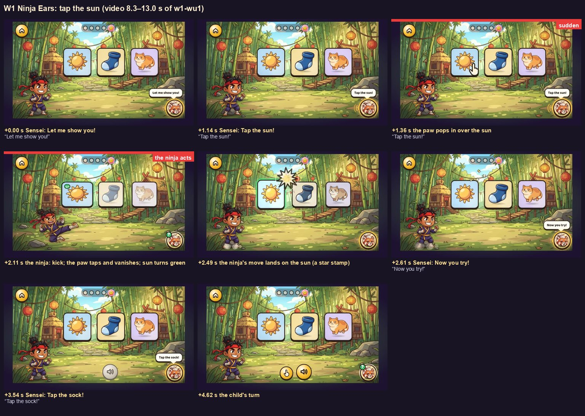

▶ [the clip, at real speed with sound](current/clips/w1-tap.mp4) · video 8.35–12.97 s of `playtest/demo/inventory/runs/w1-wu1/final.mp4`

1. **Sensei never visibly does anything.** She is a round portrait in the bottom-right corner, and the only thing that moves there is her speaking rings. Nothing leaves her portrait. Her "hand" is the paw: a small white glove, about 60 px on the phone. It pops in over the target with no arm and no travel from her corner. It bobs for **0.75 s** (1.1 s in the picture games' I do, 0.7 s in Word Building) and vanishes. The same glove is also the idle hint ("tap here", after 8 or 16 s) and the Show me again button's icon, so the child has learnt it as "tap here", not "Sensei's hand".
2. **The ninja does the action.** In 16 of the 17 demos the child's ninja moves during Sensei's show, 31 moves in all. At the paw's tap it strikes the answer *in the same frame* in 7 demos: a kick, punch, shuriken or spell flies from bottom left and lands on the card with a star stamp. It is the biggest, fastest and most colourful thing on screen, so to a child the ninja did it. The ninja also:
   - dashes on the fast word and does a slow-motion kata on the slow word;
   - runs under the pictures as the "reading finger";
   - casts the spell that merges fish and dog, and sun and flower;
   - casts the spell that writes each new spelling ("this is how we spell it");
   - launches each letter into its line in Word Building.
3. **It is sudden, and it comes on a quick word.** There are 20 paw appearances in the 17 demos. 5 arrive while Sensei is still mid-line. Of the other 15, 13 arrive **within 5 ms of the end of the last thing said** (median 2 ms). That last thing is usually one word (/m/, /s/, "mug", "sun" said slowly) or a three-word line ("Let me show you!", "Watch me first!"). The other two come 0.15 s and 0.42 s after it. In W1 the tap then brings about six things in one frame: the paw vanishes, the tap click, the chime, the card turns green with a tick, the other cards grey out, and the ninja's move leaves. The star stamp lands 0.38 s later, and "Now you try!" often starts before the child has seen the result: 131 ms after the tap in W2's two rows, 0.5 s in W1.
4. **Nothing is announced.** Not one of the 20 paw taps is announced in the first person with its target ("I'm going to tap the sun."). Sensei says one of three things instead:
   - the child's own instruction, *during* the demo: "Tap the sun!", "Tap all the pictures that start with… /s/";
   - a question that the paw then answers: "Which picture is it?", "Which one starts with… /m/", "Which one has this sound in it?";
   - nothing: the paw bobs in silence for 0.75–1.1 s (W5, W6, the I do in First Sounds, Sound Hunt and Word Building).

   The closest today are "I can say a word fast. Sun!" (said *while* the paw taps the rabbit), "Now I find each sound, one at a time." (4 s before the first letter, and generic) and "I'll say the sounds. You listen for the word!" (it announces the sounds, not the tap).
5. **Eleven game types have no demo at all.** Their first meeting frames the game and then asks at once: Ninja Eyes, Kai and Suki, the Monster Battle, Sound Swap, Ninja Run, Story Time, the boss, New Sounds, Sorting, the Gem Trial and Sensei's Challenge (§4). Four of them open with something big before any word: a monster or boss crashes in with a boom and a screen shake, and the ninja shouts "!", in the first second (the Monster Battle, the boss, the Gem Trial, Sensei's Challenge). And New Sounds has the ninja's spell write the letter *before* Sensei says "And this is how we spell it."

**The demos at a glance** (the 14 game types that have a Sensei demo today. The rabbit and the tortoise and the reading rail each come twice, in W1 and W3 and in W2 and W4, and w1-2 has an I do per sound, so there are 17 demos in all):

| demo | what Sensei is saying at the action | the paw | the ninja | flags |
|---|---|---|---|---|
| [W1 Ninja Ears](#w1-tap) | "Tap the sun!" (the child's instruction) | pops in 0.22 s into the line; taps 41 ms after it ends | kicks the sun in the frame the paw vanishes | SUDDEN · NINJA · generic |
| [W1 the rabbit and the tortoise](#w1-fastslow) | "I can say a word fast. Sun!" · "Or I can say it slowly…" | pops in 4 ms, then 3 ms, after the line before | dashes on "Sun!"; slow-motion cast on "sssuuunnn"; dashes again | SUDDEN · NINJA · narrated as it happens |
| [W1 the first sound](#w1-notice) | "Listen to the very first sound." … | none | cups its ear for the whole show | a show, no action (fine) |
| [W1 Pocket Hunt](#w1-tapall) | "Tap all the pictures that start with… /s/" (the child's instruction) | pops in under the lead-in; taps 0.1 s into /s/ | throws a shuriken at the sun 0.68 s later; the sun flies to its pocket | SUDDEN · NINJA · generic |
| [W2 Ninja Reading](#w2-rail) | "Fish… dog. Fish dog!" | none | runs under each picture; casts the fish-dog | SUDDEN · NINJA · generic |
| [W2 two rows](#w2-which) | "Fish… dog. Fish dog!", then "Now you try!" | pops in under the line; taps 0.13 s before "Now you try!" | a gift of stars round the row, under "Now you try!" | SUDDEN · NINJA · generic |
| [W2 Word Squish](#w2-compound) | "Say them slowly: sun… flower. Say them fast: sunflower!" | pops in on the tortoise 30 ms before the line; the buttons light as the paw *arrives* | casts; the pictures merge 0.4 s *before* the paw taps the rabbit | SUDDEN · NINJA · UNANNOUNCED |
| [W3 the rabbit and the tortoise (recap)](#w3-fastslow) | "Let me show you!", then only "mug" | pops in 2 ms after "Let me show you!"; its tap, "mug", the zip, a whoosh and the dash all start within 90 ms | dash; slow-motion cast | SUDDEN · NINJA · generic |
| [W3 Slow Words](#w3-slowpick) | "Which picture is it?" (a question) | pops in the moment the question ends; 0.75 s of silence | punches the mug in bullet time | SUDDEN · NINJA · UNANNOUNCED |
| [W3 Pocket Hunt, /a/ in it](#w3-tapall-in) | "Tap all the pictures with this sound in them… /a/" | under the lead-in; taps 0.1 s into /a/ | throws 0.21 s later | SUDDEN · NINJA · generic |
| [W4 three in a row](#w4-rail) | "Cat… dog… fish. Cat-dog-fish!" | none | runs under each picture | SUDDEN · NINJA · generic |
| [W5 Guess My Word](#w5-sounds) | nothing (after /s/ /u/ /n/) | pops in 0.42 s after /n/; 0.75 s of silence | kicks the sun as the paw vanishes | NINJA · UNANNOUNCED |
| [W6 Sound Dots](#w6-dots) | nothing; each dot's sound comes with its tap | pops in 2–3 ms after each sound; three taps | runs along on the sweep | SUDDEN · NINJA · UNANNOUNCED |
| [w1-2 First Sounds, /m/](#w1-2-first-m) | "Which one starts with… /m/" (a question) | 1 ms after /m/; 1.1 s of silence | casts a gift at the man; then casts the spelling | SUDDEN · NINJA · UNANNOUNCED |
| [w1-2 First Sounds, /s/](#w1-2-first-s) | the same question, with /s/ | 0 ms after /s/; 1.1 s of silence | shuriken at the soap; casts the spelling | SUDDEN · NINJA · UNANNOUNCED |
| [w1-4 Word Building](#w1-4-build) | "aaammm" (the word said slowly) | 5 ms, then 0 ms, after each slow word; 0.7 s | launches each letter into its line; cheers | SUDDEN · NINJA · generic |
| [w1-7 Sound Hunt](#w1-7-hunt) | "Which one has this sound in it? /i/ piiin paaan" | the moment "paaan" ends; 1.1 s of silence | punches the pin; casts the spelling | SUDDEN · NINJA · UNANNOUNCED |

Not seen in these runs: W2's optional "Whoops!" swap (the time governor dropped it; from the code, the ninja backflips over the two pictures and they swap places as Sensei starts, [`swapShow`](../../src/scenes/Warmup.tsx), Warmup.tsx:1447), and the Reception versions of W1 and W2.

---

## 2. Who appears to act

| who | where, how big (844 × 390 phone) | what it does in a demo | what a child reads it as |
|---|---|---|---|
| **Sensei** | the round Help portrait, bottom right, about 67 px | speaks; speaking rings pulse; the caption bubble (grown-ups' setting) sits above her | a voice. Nothing moves from her to the board |
| **the paw** | a white glove, about 60 px, over the lower-right quarter of the target (warm-ups), or hanging off its bottom-right corner (Early) | pops in with no arm and no travel; bobs up-left and back (`taphint`, 1.4 s a cycle); vanishes after 750 ms (warm-ups), 700 ms (Word Building) or 1100 ms (Early's picture I do). The press of its bob comes at 840 ms, so in the warm-ups and Word Building it vanishes **before it presses**. The tap click (warm-ups only) plays as it vanishes | the "tap here" hint. It is the same glove as the idle hint (16 s into a turn it points at the answer, and 8 s into a held Next at ▶) and the Show me again icon |
| **the ninja** | bottom left, about 135 px, the most animated thing on screen | strikes the answer as the paw vanishes; runs along rails; dashes; casts spells that merge pictures and write spellings; launches letters | the one who did it. It is the child's own avatar, so the child may also think *they* did it |
| **the board, by itself** | the cards and buttons | spotlights on naming (in time with each word: fine); the answer turns green with a tick and the others grey out on the tap; lights under the rail; dots light; the rabbit and tortoise buttons flash; pictures glide together | a result, with no visible cause except the ninja's move |

---

## 3. The demos, one by one

Each has a frame strip (each cell: the time from the demo's first line, what happens, and in quotes what Sensei is saying then; a red bar marks a flag), a clip at real speed with sound, and the timeline. **ms** counts from the demo's first line. "Under" means the action starts while that line is still playing.

<a id="w1-tap"></a>
### 3.1 W1 Ninja Ears: "Let me show you! Tap the sun!" (`tap`, Warmup.tsx:504)

The very first demo of the game. "Let me show you!" is followed by "Tap the sun!", the child's own instruction, said during Sensei's demo. The paw pops in 0.22 s into it. As the line ends (41 ms), the paw vanishes and, in the same frame, the card turns green, the other two grey out, the chime plays and the ninja kicks: a crescent slash flies from bottom left to the sun's corner and stamps a star 0.38 s later. "Now you try!" starts 0.5 s after the tap. The whole show, from "Tap the sun!" to "Now you try!", is 1.5 s. This is Jonas's "one quick word, and then it activates something, but it looks like the character does it".


▶ [the clip, at real speed with sound](current/clips/w1-tap.mp4) · video 8.35–12.97 s of `playtest/demo/inventory/runs/w1-wu1/final.mp4`

| ms | Sensei says | what moves | who appears to do it | against the words |
|---:|---|---|---|---|
| 2 | Let me show you! *(1.1 s)* | | Sensei's voice | |
| 1136 | Tap the sun! *(0.9 s)* | | Sensei's voice | |
| 1357 | | the paw pops in over the **sun** (no arm; it bobs where it lands) | the paw | under “Tap the sun!” (221 ms into it) **SUDDEN** |
| 2109 | | the ninja: **kick** (a soft strike: one tink) | **the ninja** | 41 ms after “Tap the sun!” ends **SUDDEN** **NINJA** |
| 2110 | | the paw vanishes with a tap click | the paw | 42 ms after “Tap the sun!” ends |
| 2110 | | sun turns green (a tick) | the board, by itself | 42 ms after “Tap the sun!” ends |
| 2488 | | sun gets the star stamp (the move lands) | the ninja's move | 420 ms after “Tap the sun!” ends |
| 2611 | Now you try! *(0.9 s)* | | Sensei's voice | |
| 3538 | Tap the sock! *(1.1 s)* | | Sensei's voice | |
| 4620 | | *the child's turn opens* | | |

<a id="w1-fastslow"></a>
### 3.2 W1 the rabbit and the tortoise (`fastslow`, Warmup.tsx:576 and `fastSlowShow` 1355)

The best-narrated warm-up demo: the lines are in the first person ("I can say a word fast.", "Or I can say it slowly…"). But the paw lands on the rabbit 4 ms after "Watch me first!" ends, and on the tortoise 3 ms after the fast line ends, before the words that explain them. The ninja does the fast word (a dash, on "Sun!") and the slow word (a slow-motion cast at the card as "sssuuunnn" plays). The rabbit and tortoise flash on the paw's tap, under the line.

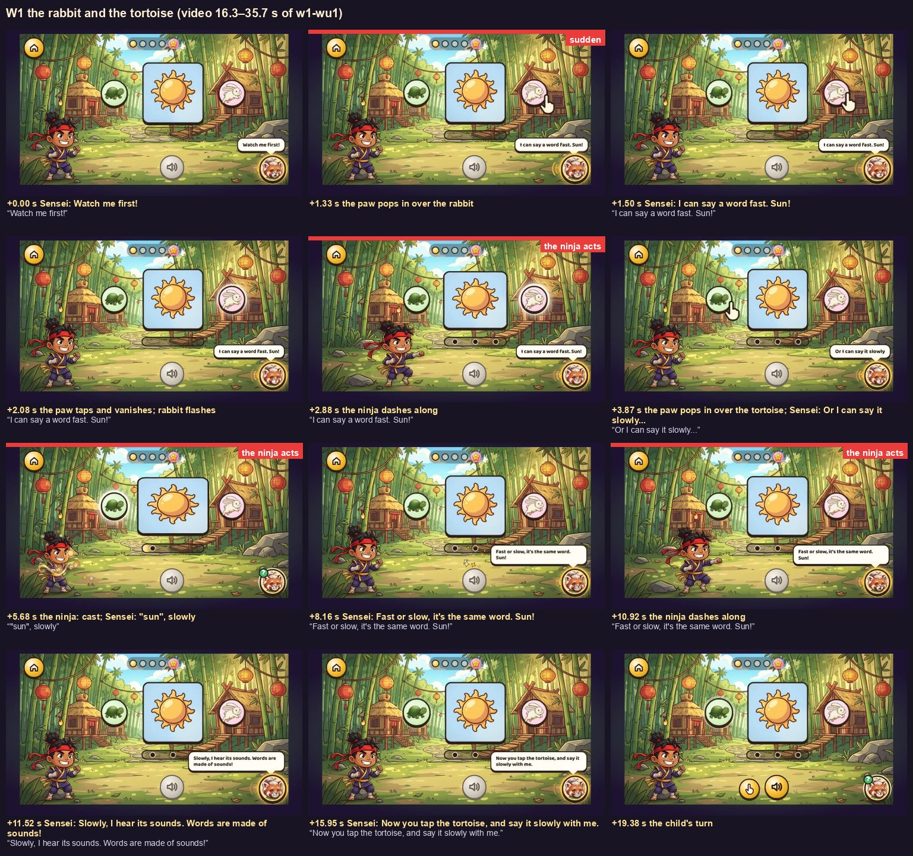

▶ [the clip, at real speed with sound](current/clips/w1-fastslow.mp4) · video 16.29–35.67 s of `playtest/demo/inventory/runs/w1-wu1/final.mp4`

| ms | Sensei says | what moves | who appears to do it | against the words |
|---:|---|---|---|---|
| 4 | Watch me first! *(1.3 s)* | | Sensei's voice | |
| 1332 | | the paw pops in over the **rabbit** (no arm; it bobs where it lands) | the paw | 4 ms after “Watch me first!” ends **SUDDEN** |
| 1503 | I can say a word fast. Sun! *(2.4 s)* | | Sensei's voice | |
| 2082 | | the paw vanishes with a tap click | the paw | under “I can say a word fast. Sun!” (579 ms into it) |
| 2082 | | rabbit flashes | the board, by itself | under “I can say a word fast. Sun!” (579 ms into it) |
| 2784 | | the sound ribbon zips | the board, by itself | under “I can say a word fast. Sun!” (1281 ms into it) |
| 2876 | | the ninja dashes / runs along | **the ninja** | under “I can say a word fast. Sun!” (1373 ms into it) **NINJA** |
| 3870 | | the paw pops in over the **tortoise** (no arm; it bobs where it lands) | the paw | 3 ms after “I can say a word fast. Sun!” ends  |
| 3901 | Or I can say it slowly... *(1.7 s)* | | Sensei's voice | |
| 4621 | | the paw vanishes with a tap click | the paw | under “Or I can say it slowly...” (720 ms into it) |
| 4621 | | tortoise flashes | the board, by itself | under “Or I can say it slowly...” (720 ms into it) |
| 5680 | | the ninja: a slow-motion **cast** at the card (a slow kata) as the slow word plays | **the ninja** | 123 ms after “Or I can say it slowly...” ends **NINJA** |
| 5713 | "sun", slowly *(1.6 s)* | | Sensei's voice | |
| 8163 | Fast or slow, it's the same word. Sun! *(3.3 s)* | | Sensei's voice | |
| 10829 | | the sound ribbon zips | the board, by itself | under “Fast or slow, it's the same word. Sun!” (2666 ms into it) |
| 10919 | | the ninja dashes / runs along | **the ninja** | under “Fast or slow, it's the same word. Sun!” (2756 ms into it) **NINJA** **UNANNOUNCED** |
| 11522 | Slowly, I hear its sounds. Words are made of sounds! *(4.4 s)* | | Sensei's voice | |
| 12993 | | a dot on the ribbon pulses | the board, by itself | under “Slowly, I hear its sounds. Words are made of sounds!” (1471 ms into it) |
| 13334 | | a dot on the ribbon pulses | the board, by itself | under “Slowly, I hear its sounds. Words are made of sounds!” (1812 ms into it) |
| 13677 | | a dot on the ribbon pulses | the board, by itself | under “Slowly, I hear its sounds. Words are made of sounds!” (2155 ms into it) |
| 15917 | | tortoise pulses | the board, by itself | 5 ms after “Slowly, I hear its sounds. Words are made of sounds!” ends |
| 15949 | Now you tap the tortoise, and say it slowly with me. *(3.4 s)* | | Sensei's voice | |
| 19381 | | *the child's turn opens* | | |

<a id="w1-notice"></a>
### 3.3 W1 the first sound (`notice`, `noticeShow` Warmup.tsx:1416)

A show with no paw and no answer to give. The ninja cups its ear for the whole show (pose `listen`). The first dot under each picture goes gold as its held first sound plays. The sound's petal comes in about 3 s into "Sun and sock start with the same sound…". Everything that moves is in time with a word that names it. This is the one demo that doesn't trip a flag. It ends held on Next.

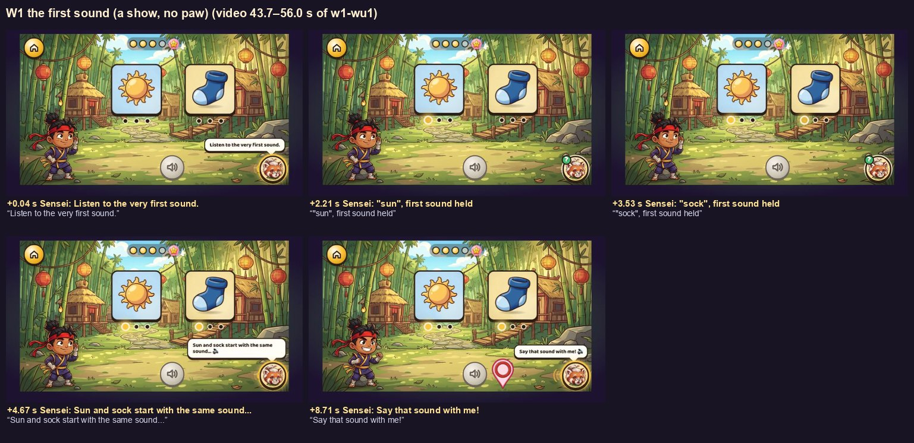

▶ [the clip, at real speed with sound](current/clips/w1-notice.mp4) · video 43.73–55.97 s of `playtest/demo/inventory/runs/w1-wu1/final.mp4`

| ms | Sensei says | what moves | who appears to do it | against the words |
|---:|---|---|---|---|
| 35 | Listen to the very first sound. *(2.1 s)* | | Sensei's voice | |
| 2210 | "sun", first sound held *(1.2 s)* | | Sensei's voice | |
| 3527 | "sock", first sound held *(1.1 s)* | | Sensei's voice | |
| 4668 | Sun and sock start with the same sound... *(2.9 s)* | | Sensei's voice | |
| 7904 | /s/ *(0.8 s)* | | Sensei's voice | |
| 8714 | Say that sound with me! *(1.5 s)* | | Sensei's voice | |
| 10438 | /s/ *(0.8 s)* | | Sensei's voice | |
| 12241 | | *held on Next* | | |

<a id="w1-tapall"></a>
### 3.4 W1 Pocket Hunt: tap all that start with /s/ (`tapall`, Warmup.tsx:749)

Jonas's own example board (sun, sausage, moon, sock, cat). After "Let me show you!", Sensei asks the child's question, "Tap all the pictures that start with… /s/". The paw is timed to land on the sound: it pops in over the sun while the lead-in is still playing, and taps 0.1 s into /s/. 0.68 s later the ninja throws a shuriken, the sun is found and flies to its pocket, and "sssun" plays. "Your turn!" follows 1.2 s after. Nothing says "I'm going to tap the sun".

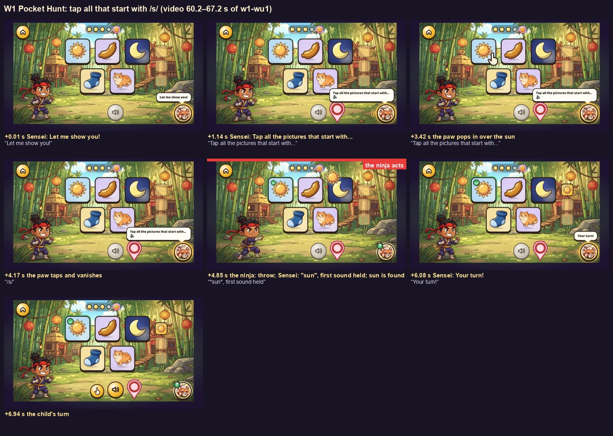

▶ [the clip, at real speed with sound](current/clips/w1-tapall.mp4) · video 60.23–67.17 s of `playtest/demo/inventory/runs/w1-wu1/final.mp4`

| ms | Sensei says | what moves | who appears to do it | against the words |
|---:|---|---|---|---|
| 5 | Let me show you! *(1.1 s)* | | Sensei's voice | |
| 1137 | Tap all the pictures that start with... *(2.5 s)* | | Sensei's voice | |
| 3418 | | the paw pops in over the **sun** (no arm; it bobs where it lands) | the paw | under “Tap all the pictures that start with...” (2281 ms into it)  |
| 4070 | /s/ *(0.8 s)* | | Sensei's voice | |
| 4169 | | the paw vanishes with a tap click | the paw | under “/s/” (99 ms into it) |
| 4852 | "sun", first sound held *(1.2 s)* | | Sensei's voice | |
| 4852 | | the ninja: **throw** (a shuriken at the sun's corner) | **the ninja** | under “"sun", first sound held” (0 ms into it) **SUDDEN** **NINJA** **UNANNOUNCED** |
| 4853 | | sun is found (flies to its pocket) | the board, by itself | under “"sun", first sound held” (1 ms into it) |
| 6084 | Your turn! *(0.8 s)* | | Sensei's voice | |
| 6941 | | *the child's turn opens* | | |

<a id="w2-rail"></a>
### 3.5 W2 Ninja Reading: the reading rail (`rail`, Warmup.tsx:880, `readAlong` 1562)

No paw: **the ninja is the reading finger**. On "Ninjas read this way!" (0.9 s in) it runs along the rail. On "Fish… dog. Fish dog!" it runs under each picture as a light passes under it. Then it casts a spell, 0.5 s after the line, and the two pictures glide together into the fish-dog. The line is Sensei's reading, but the thing that moves along the pictures is the ninja.

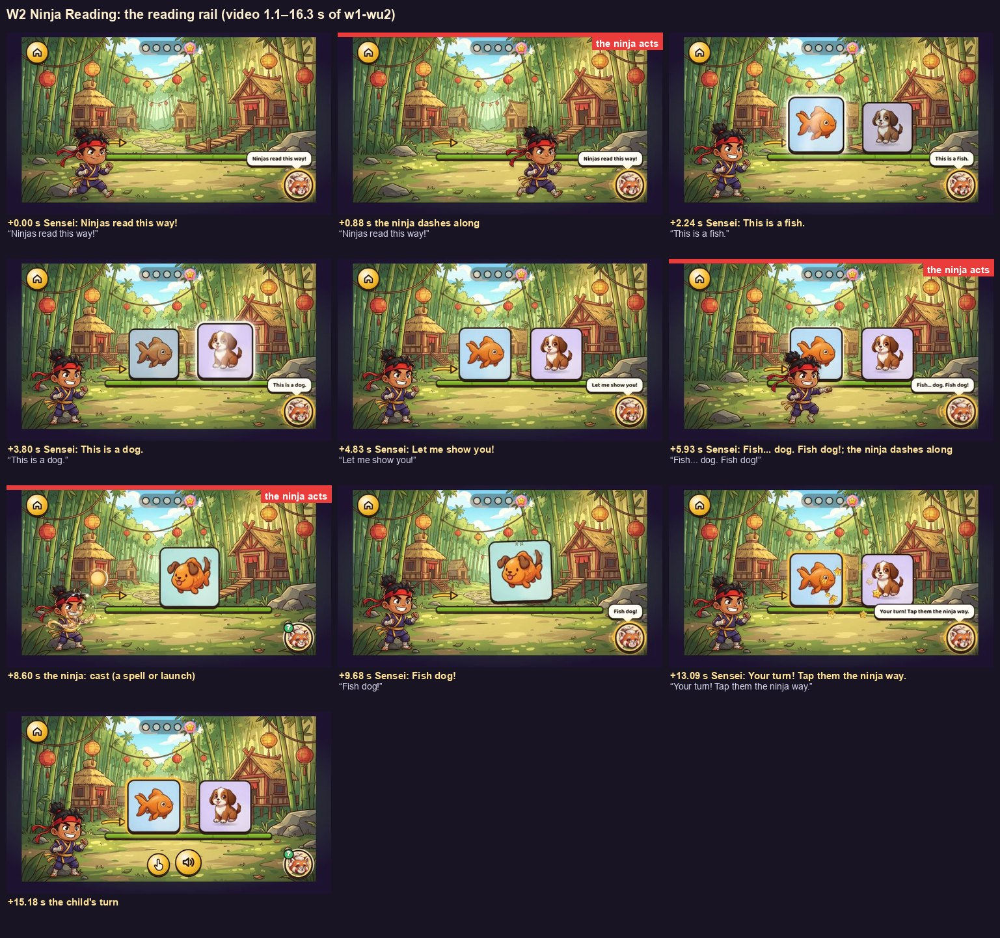

▶ [the clip, at real speed with sound](current/clips/w2-rail.mp4) · video 1.09–16.27 s of `playtest/demo/inventory/runs/w1-wu2/final.mp4`

| ms | Sensei says | what moves | who appears to do it | against the words |
|---:|---|---|---|---|
| 0 | Ninjas read this way! *(1.4 s)* | | Sensei's voice | |
| 876 | | the ninja dashes / runs along | **the ninja** | under “Ninjas read this way!” (877 ms into it) **SUDDEN** **NINJA** **UNANNOUNCED** |
| 2242 | This is a fish. *(1.3 s)* | | Sensei's voice | |
| 3800 | This is a dog. *(0.9 s)* | | Sensei's voice | |
| 4825 | Let me show you! *(1.1 s)* | | Sensei's voice | |
| 5926 | Fish... dog. Fish dog! *(2.2 s)* | | Sensei's voice | |
| 5967 | | the ninja dashes / runs along | **the ninja** | under “Fish... dog. Fish dog!” (41 ms into it) **SUDDEN** **NINJA** |
| 5967 | | the fish lights up | the board, by itself | under “Fish... dog. Fish dog!” (41 ms into it) |
| 6547 | | the dog lights up | the board, by itself | under “Fish... dog. Fish dog!” (621 ms into it) |
| 7608 | | the fish lights up | the board, by itself | under “Fish... dog. Fish dog!” (1682 ms into it) |
| 8596 | | the ninja: **cast**; the fish and the dog glide together into the fish-dog | **the ninja** | 506 ms after “Fish... dog. Fish dog!” ends **NINJA** |
| 9678 | Fish dog! *(1.3 s)* | | Sensei's voice | |
| 13086 | Your turn! Tap them the ninja way. *(2.0 s)* | | Sensei's voice | |
| 13086 | | fish glows | the board, by itself | under “Your turn! Tap them the ninja way.” (0 ms into it) |
| 15179 | | *the child's turn opens* | | |

<a id="w2-which"></a>
### 3.6 W2 two rows: which did I read? (`which`, Warmup.tsx:987)

"Watch me first!", then Sensei reads "Fish… dog. Fish dog!". The paw pops in over the first row while she is still saying "Fish dog!" and taps 0.13 s before the line ends. Then **"Now you try!" starts on top of the result**: the row lights and flashes, the ninja casts a gift of stars round it, and the light sweeps along the row, all under "Now you try!". The demo's result and the hand-over are the same moment.

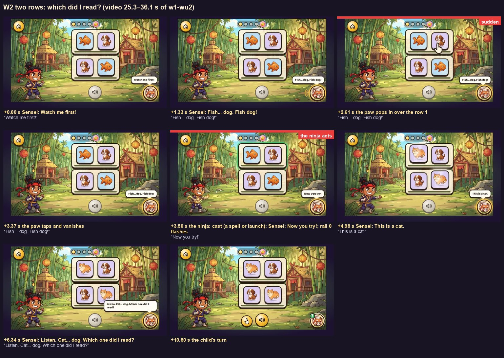

▶ [the clip, at real speed with sound](current/clips/w2-which.mp4) · video 25.27–36.07 s of `playtest/demo/inventory/runs/w1-wu2/final.mp4`

| ms | Sensei says | what moves | who appears to do it | against the words |
|---:|---|---|---|---|
| 3 | Watch me first! *(1.3 s)* | | Sensei's voice | |
| 1330 | Fish... dog. Fish dog! *(2.2 s)* | | Sensei's voice | |
| 2613 | | the paw pops in over the **row 1** (no arm; it bobs where it lands) | the paw | under “Fish... dog. Fish dog!” (1283 ms into it) **SUDDEN** |
| 3365 | | the paw vanishes with a tap click | the paw | under “Fish... dog. Fish dog!” (2035 ms into it) |
| 3496 | Now you try! *(0.9 s)* | | Sensei's voice | |
| 3497 | | row 1 lights up | the board, by itself | under “Now you try!” (1 ms into it) |
| 3497 | | row 1 flashes | the board, by itself | under “Now you try!” (1 ms into it) |
| 3497 | | the ninja: **cast** (a gift of stars round row 1) | **the ninja** | under “Now you try!” (1 ms into it) **SUDDEN** **NINJA** |
| 3759 | | row 1 lights up | the board, by itself | under “Now you try!” (263 ms into it) |
| 4020 | | row 1 glows | the board, by itself | under “Now you try!” (524 ms into it) |
| 4976 | This is a cat. *(1.2 s)* | | Sensei's voice | |
| 6344 | Listen. Cat... dog. Which one did I read? *(4.4 s)* | | Sensei's voice | |
| 10799 | | *the child's turn opens* | | |

<a id="w2-compound"></a>
### 3.7 W2 Word Squish: sun + flower (`compound`, `compoundShow` Warmup.tsx:1470)

The paw is fire-and-forget here (`void pawAt(...)`). Each button lights the moment the paw **arrives**, not when it taps. The paw lands on the tortoise 30 ms *before* "Say them slowly…" starts, with nothing said to announce it. The ninja's spell makes the sunflower 0.4 s **before** the paw has tapped the rabbit. It is the least ordered demo: the result comes before the action that causes it.

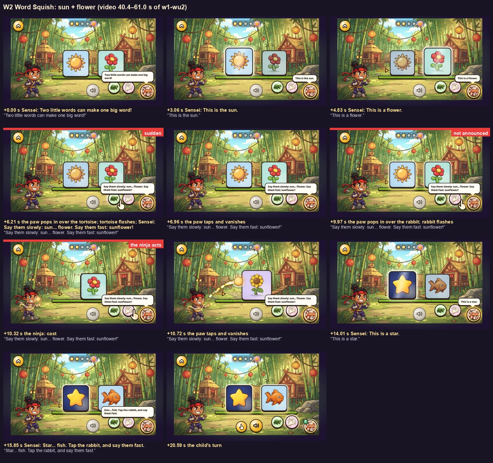

▶ [the clip, at real speed with sound](current/clips/w2-compound.mp4) · video 40.38–60.97 s of `playtest/demo/inventory/runs/w1-wu2/final.mp4`

| ms | Sensei says | what moves | who appears to do it | against the words |
|---:|---|---|---|---|
| 0 | Two little words can make one big word! *(2.9 s)* | | Sensei's voice | |
| 3063 | This is the sun. *(1.5 s)* | | Sensei's voice | |
| 4828 | This is a flower. *(1.2 s)* | | Sensei's voice | |
| 6206 | | tortoise flashes | the board, by itself | 149 ms after “This is a flower.” ends |
| 6207 | | the paw pops in over the **tortoise** (no arm; it bobs where it lands) | the paw | 150 ms after “This is a flower.” ends **SUDDEN** **UNANNOUNCED** |
| 6237 | Say them slowly: sun... flower. Say them fast: sunflower! *(5.7 s)* | | Sensei's voice | |
| 6957 | | the paw vanishes with a tap click | the paw | under “Say them slowly: sun... flower. Say them fast: sunflower!” (720 ms into it) |
| 7727 | | the sun lights up | the board, by itself | under “Say them slowly: sun... flower. Say them fast: sunflower!” (1490 ms into it) |
| 8807 | | the flower lights up | the board, by itself | under “Say them slowly: sun... flower. Say them fast: sunflower!” (2570 ms into it) |
| 9969 | | rabbit flashes | the board, by itself | under “Say them slowly: sun... flower. Say them fast: sunflower!” (3732 ms into it) |
| 9969 | | the paw pops in over the **rabbit** (no arm; it bobs where it lands) | the paw | under “Say them slowly: sun... flower. Say them fast: sunflower!” (3732 ms into it) **UNANNOUNCED** |
| 10318 | | the ninja: **cast**; the sun and the flower glide together into the sunflower | **the ninja** | under “Say them slowly: sun... flower. Say them fast: sunflower!” (4081 ms into it) **NINJA** **UNANNOUNCED** |
| 10720 | | the paw vanishes with a tap click | the paw | under “Say them slowly: sun... flower. Say them fast: sunflower!” (4483 ms into it) |
| 14009 | This is a star. *(1.7 s)* | | Sensei's voice | |
| 15843 | | the star lights up | the board, by itself | 175 ms after “This is a star.” ends |
| 15852 | Star... fish. Tap the rabbit, and say them fast. *(4.7 s)* | | Sensei's voice | |
| 17044 | | the fish lights up | the board, by itself | under “Star... fish. Tap the rabbit, and say them fast.” (1192 ms into it) |
| 20214 | | rabbit pulses | the board, by itself | under “Star... fish. Tap the rabbit, and say them fast.” (4362 ms into it) |
| 20590 | | *the child's turn opens* | | |

<a id="w3-fastslow"></a>
### 3.8 W3 the rabbit and the tortoise again (a recap: `fastSlowShow` with `show: "recap"`)

The recap drops the fast line: "Let me show you!", and 2 ms after it the paw is on the rabbit. 750 ms later, within 90 ms of each other: the paw's tap, a whoosh, "mug", the card's hop, the ribbon's zip and the ninja's dash. The clearest case of "one quick word, and then it activates something".

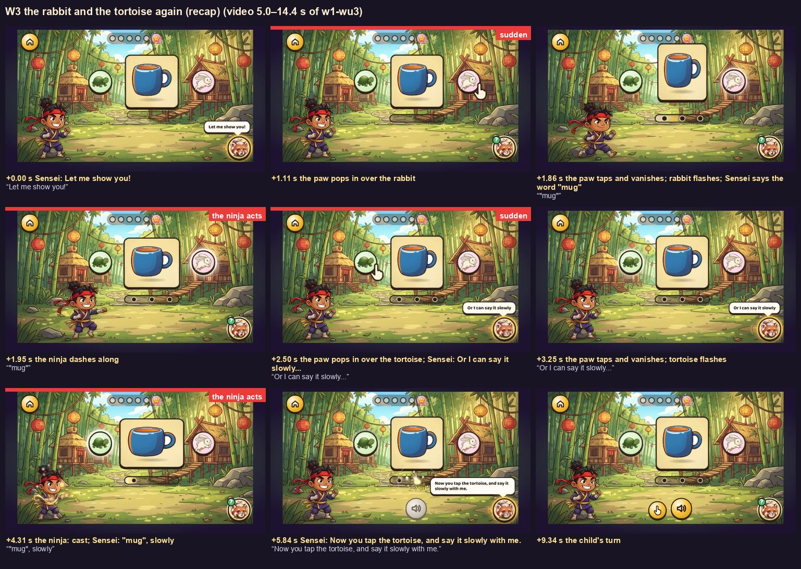

▶ [the clip, at real speed with sound](current/clips/w3-fastslow.mp4) · video 5.04–14.38 s of `playtest/demo/inventory/runs/w1-wu3/final.mp4`

| ms | Sensei says | what moves | who appears to do it | against the words |
|---:|---|---|---|---|
| 5 | Let me show you! *(1.1 s)* | | Sensei's voice | |
| 1109 | | the paw pops in over the **rabbit** (no arm; it bobs where it lands) | the paw | 2 ms after “Let me show you!” ends **SUDDEN** |
| 1863 | "mug" *(0.6 s)* | | Sensei's voice | |
| 1863 | | the paw vanishes with a tap click | the paw | under “"mug"” (0 ms into it) |
| 1863 | | the sound ribbon zips | the board, by itself | under “"mug"” (0 ms into it) |
| 1863 | | rabbit flashes | the board, by itself | under “"mug"” (0 ms into it) |
| 1952 | | the ninja dashes / runs along | **the ninja** | under “"mug"” (89 ms into it) **SUDDEN** **NINJA** |
| 2501 | | the paw pops in over the **tortoise** (no arm; it bobs where it lands) | the paw | 0 ms after “"mug"” ends **SUDDEN** |
| 2529 | Or I can say it slowly... *(1.7 s)* | | Sensei's voice | |
| 3251 | | the paw vanishes with a tap click | the paw | under “Or I can say it slowly...” (722 ms into it) |
| 3251 | | tortoise flashes | the board, by itself | under “Or I can say it slowly...” (722 ms into it) |
| 4306 | | the ninja: a slow-motion **cast** at the card as the slow word plays | **the ninja** | 121 ms after “Or I can say it slowly...” ends **NINJA** |
| 4461 | "mug", slowly *(1.3 s)* | | Sensei's voice | |
| 5813 | | tortoise pulses | the board, by itself | 86 ms after “"mug", slowly” ends |
| 5842 | Now you tap the tortoise, and say it slowly with me. *(3.4 s)* | | Sensei's voice | |
| 9335 | | *the child's turn opens* | | |

<a id="w3-slowpick"></a>
### 3.9 W3 Slow Words: which picture is it? (`slowpick`, Warmup.tsx:631)

Sensei asks a real question, "Which picture is it?", and the paw answers it the moment the question ends. It bobs over the mug in silence for 0.75 s. Then, in one frame, the ninja punches the mug in bullet time (`slowmo`), the card turns green and "mmmuuug" plays. TEACHER_SCRIPT §2.1 names this pattern ("never a question the paw then answers").

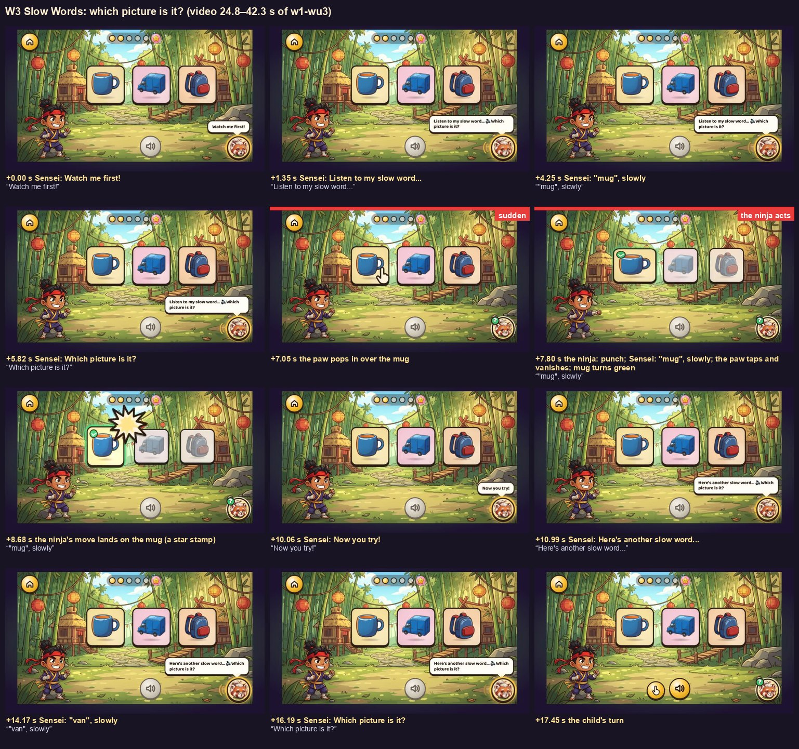

▶ [the clip, at real speed with sound](current/clips/w3-slowpick.mp4) · video 24.83–42.27 s of `playtest/demo/inventory/runs/w1-wu3/final.mp4`

| ms | Sensei says | what moves | who appears to do it | against the words |
|---:|---|---|---|---|
| 0 | Watch me first! *(1.3 s)* | | Sensei's voice | |
| 1350 | Listen to my slow word... *(2.5 s)* | | Sensei's voice | |
| 4246 | "mug", slowly *(1.3 s)* | | Sensei's voice | |
| 5816 | Which picture is it? *(1.2 s)* | | Sensei's voice | |
| 7046 | | the paw pops in over the **mug** (no arm; it bobs where it lands) | the paw | 0 ms after “Which picture is it?” ends **SUDDEN** **UNANNOUNCED** |
| 7797 | "mug", slowly *(1.3 s)* | | Sensei's voice | |
| 7797 | | the ninja: **punch** (a soft strike: one tink) | **the ninja** | under “"mug", slowly” (0 ms into it) **SUDDEN** **NINJA** **UNANNOUNCED** |
| 7797 | | the paw vanishes with a tap click | the paw | under “"mug", slowly” (0 ms into it) |
| 7797 | | mug turns green (a tick) | the board, by itself | under “"mug", slowly” (0 ms into it) |
| 8678 | | mug gets the star stamp (the move lands) | the ninja's move | under “"mug", slowly” (881 ms into it) |
| 9363 | "mug" *(0.6 s)* | | Sensei's voice | |
| 10061 | Now you try! *(0.9 s)* | | Sensei's voice | |
| 10991 | Here's another slow word... *(2.8 s)* | | Sensei's voice | |
| 14168 | "van", slowly *(1.7 s)* | | Sensei's voice | |
| 16189 | Which picture is it? *(1.2 s)* | | Sensei's voice | |
| 17445 | | *the child's turn opens* | | |

<a id="w3-tapall-in"></a>
### 3.10 W3 Pocket Hunt: /a/ in the middle (`tapall`, how "in")

As §3.4: the child's instruction, the paw timed onto the sound, then the ninja's shuriken 0.21 s after the tap, and "caaat". "Your turn!" comes 1 s after the find.

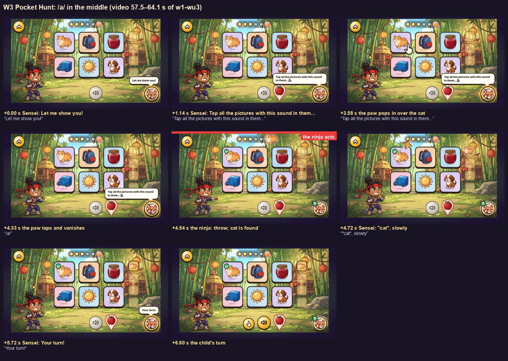

▶ [the clip, at real speed with sound](current/clips/w3-tapall-in.mp4) · video 57.48–64.08 s of `playtest/demo/inventory/runs/w1-wu3/final.mp4`

| ms | Sensei says | what moves | who appears to do it | against the words |
|---:|---|---|---|---|
| 0 | Let me show you! *(1.1 s)* | | Sensei's voice | |
| 1137 | Tap all the pictures with this sound in them... *(2.7 s)* | | Sensei's voice | |
| 3579 | | the paw pops in over the **cat** (no arm; it bobs where it lands) | the paw | under “Tap all the pictures with this sound in them...” (2442 ms into it)  |
| 4227 | /a/ *(0.3 s)* | | Sensei's voice | |
| 4330 | | the paw vanishes with a tap click | the paw | under “/a/” (103 ms into it) |
| 4540 | | the ninja: **throw** (a shuriken at the cat's corner) | **the ninja** | 1 ms after “/a/” ends **SUDDEN** **NINJA** **UNANNOUNCED** |
| 4541 | | cat is found (flies to its pocket) | the board, by itself | 2 ms after “/a/” ends |
| 4720 | "cat", slowly *(1.0 s)* | | Sensei's voice | |
| 5719 | Your turn! *(0.8 s)* | | Sensei's voice | |
| 6595 | | *the child's turn opens* | | |

<a id="w4-rail"></a>
### 3.11 W4 Ninja Reading: three in a row

As §3.5 with three pictures. The ninja runs under each picture on its word, and there is no merge.

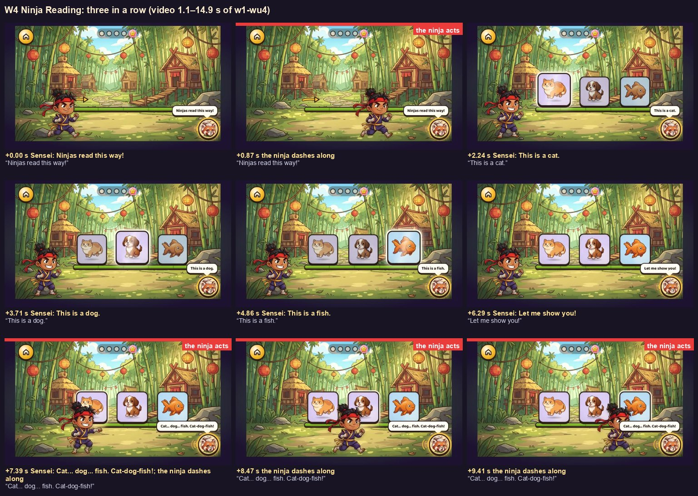

▶ [the clip, at real speed with sound](current/clips/w4-rail.mp4) · video 1.09–14.86 s of `playtest/demo/inventory/runs/w1-wu4/final.mp4`

| ms | Sensei says | what moves | who appears to do it | against the words |
|---:|---|---|---|---|
| 2 | Ninjas read this way! *(1.4 s)* | | Sensei's voice | |
| 870 | | the ninja dashes / runs along | **the ninja** | under “Ninjas read this way!” (868 ms into it) **SUDDEN** **NINJA** **UNANNOUNCED** |
| 2241 | This is a cat. *(1.2 s)* | | Sensei's voice | |
| 3706 | This is a dog. *(0.9 s)* | | Sensei's voice | |
| 4856 | This is a fish. *(1.3 s)* | | Sensei's voice | |
| 6285 | Let me show you! *(1.1 s)* | | Sensei's voice | |
| 7388 | Cat... dog... fish. Cat-dog-fish! *(4.4 s)* | | Sensei's voice | |
| 7409 | | the ninja dashes / runs along | **the ninja** | under “Cat... dog... fish. Cat-dog-fish!” (21 ms into it) **SUDDEN** **NINJA** |
| 7409 | | the cat lights up | the board, by itself | under “Cat... dog... fish. Cat-dog-fish!” (21 ms into it) |
| 8468 | | the ninja dashes / runs along | **the ninja** | under “Cat... dog... fish. Cat-dog-fish!” (1080 ms into it) **SUDDEN** **NINJA** |
| 8468 | | the dog lights up | the board, by itself | under “Cat... dog... fish. Cat-dog-fish!” (1080 ms into it) |
| 9410 | | the ninja dashes / runs along | **the ninja** | under “Cat... dog... fish. Cat-dog-fish!” (2022 ms into it) **SUDDEN** **NINJA** |
| 9410 | | the fish lights up | the board, by itself | under “Cat... dog... fish. Cat-dog-fish!” (2022 ms into it) |
| 10889 | | the cat lights up | the board, by itself | under “Cat... dog... fish. Cat-dog-fish!” (3501 ms into it) |
| 10889 | | the dog lights up | the board, by itself | under “Cat... dog... fish. Cat-dog-fish!” (3501 ms into it) |
| 11755 | Your turn! Tap them the ninja way. *(2.0 s)* | | Sensei's voice | |
| 11756 | | cat glows | the board, by itself | under “Your turn! Tap them the ninja way.” (1 ms into it) |
| 13767 | | *the child's turn opens* | | |

<a id="w5-sounds"></a>
### 3.12 W5 Guess My Word: /s/ /u/ /n/ (`sounds`, Warmup.tsx:1157)

"Let me show you!" then "I'll say the sounds. You listen for the word!", /s/ /u/ /n/. The paw pops in 0.42 s after /n/ and bobs in **silence** for 0.75 s. No line says which picture Sensei thinks it is, or that she is about to tap it. On the tap the ninja kicks the sun and the card turns green. The answer, "sun", comes 0.33 s after that, so the word arrives after the action it should explain.

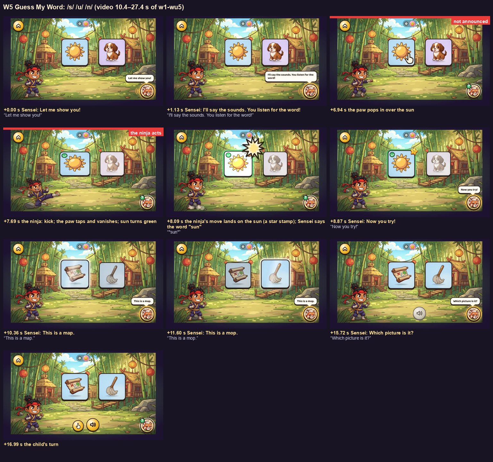

▶ [the clip, at real speed with sound](current/clips/w5-sounds.mp4) · video 10.40–27.39 s of `playtest/demo/inventory/runs/w1-wu5/final.mp4`

| ms | Sensei says | what moves | who appears to do it | against the words |
|---:|---|---|---|---|
| 0 | Let me show you! *(1.1 s)* | | Sensei's voice | |
| 1134 | I'll say the sounds. You listen for the word! *(2.9 s)* | | Sensei's voice | |
| 4113 | /s/ *(0.8 s)* | | Sensei's voice | |
| 5316 | /u/ *(0.2 s)* | | Sensei's voice | |
| 5925 | /n/ *(0.6 s)* | | Sensei's voice | |
| 6939 | | the paw pops in over the **sun** (no arm; it bobs where it lands) | the paw | 423 ms after “/n/” ends **UNANNOUNCED** |
| 7691 | | the ninja: **kick** (a soft strike: one tink) | **the ninja** | 1175 ms after “/n/” ends **NINJA** **UNANNOUNCED** |
| 7691 | | the paw vanishes with a tap click | the paw | 1175 ms after “/n/” ends |
| 7691 | | sun turns green (a tick) | the board, by itself | 1175 ms after “/n/” ends |
| 8024 | "sun" *(0.6 s)* | | Sensei's voice | |
| 8092 | | sun gets the star stamp (the move lands) | the ninja's move | under “"sun"” (68 ms into it) |
| 8875 | Now you try! *(0.9 s)* | | Sensei's voice | |
| 10358 | This is a map. *(0.9 s)* | | Sensei's voice | |
| 11596 | This is a mop. *(1.2 s)* | | Sensei's voice | |
| 13020 | /m/ *(0.7 s)* | | Sensei's voice | |
| 14101 | /a/ *(0.3 s)* | | Sensei's voice | |
| 14837 | /p/ *(0.2 s)* | | Sensei's voice | |
| 15724 | Which picture is it? *(1.2 s)* | | Sensei's voice | |
| 16991 | | *the child's turn opens* | | |

<a id="w6-dots"></a>
### 3.13 W6 Sound Dots (`dots`, Warmup.tsx:1248)

A steady rhythm: the paw lands on a dot 2–3 ms after the previous thing said. 0.75 s of silence follows, then the tap, the dot lights and its sound plays. The sound comes with the tap, so the child can't know what the paw is about to do. On the sweep the ninja runs along under the dots and Sensei says "sun".

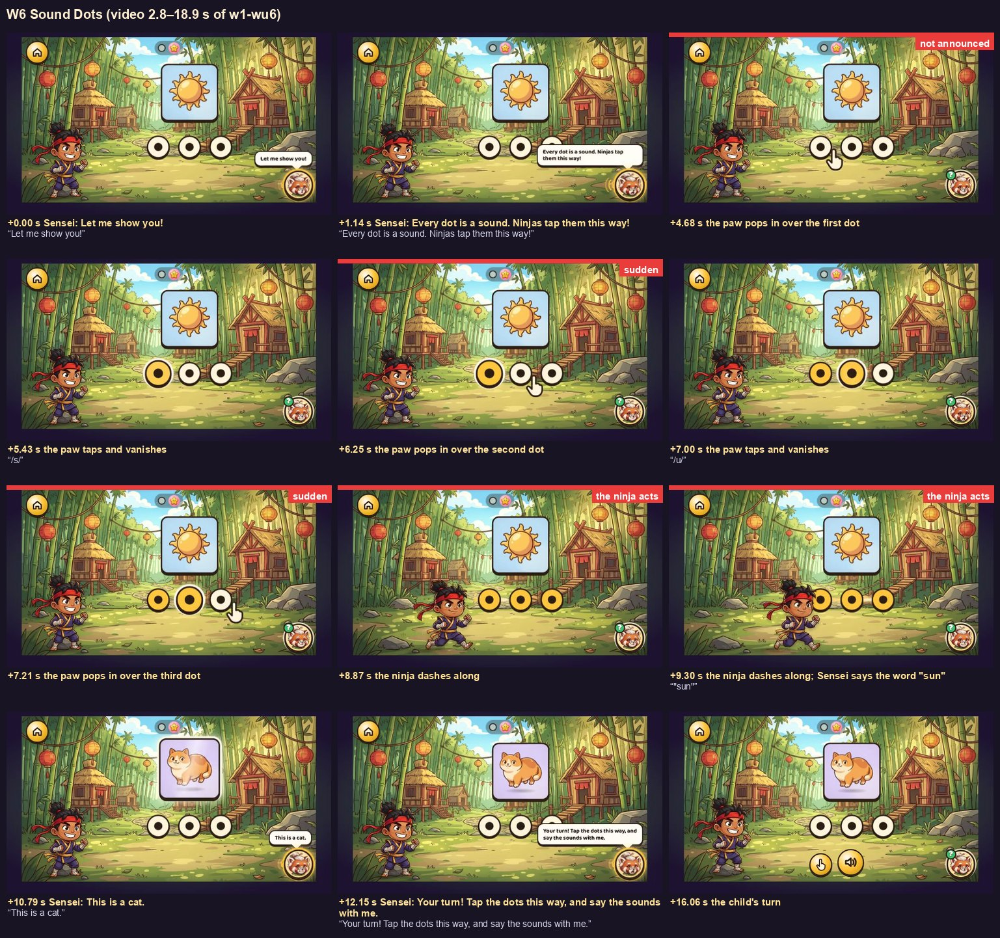

▶ [the clip, at real speed with sound](current/clips/w6-dots.mp4) · video 2.79–18.85 s of `playtest/demo/inventory/runs/w1-wu6/final.mp4`

| ms | Sensei says | what moves | who appears to do it | against the words |
|---:|---|---|---|---|
| 3 | Let me show you! *(1.1 s)* | | Sensei's voice | |
| 1138 | Every dot is a sound. Ninjas tap them this way! *(3.5 s)* | | Sensei's voice | |
| 4685 | | the paw pops in over the **first dot** (no arm; it bobs where it lands) | the paw | 2 ms after “Every dot is a sound. Ninjas tap them this way!” ends **UNANNOUNCED** |
| 5435 | | the paw vanishes with a tap click | the paw | 752 ms after “Every dot is a sound. Ninjas tap them this way!” ends |
| 5435 | | dot 1 lights up | the board, by itself | 752 ms after “Every dot is a sound. Ninjas tap them this way!” ends |
| 5466 | /s/ *(0.8 s)* | | Sensei's voice | |
| 6247 | | the paw pops in over the **second dot** (no arm; it bobs where it lands) | the paw | 0 ms after “/s/” ends **SUDDEN** **UNANNOUNCED** |
| 6999 | | the paw vanishes with a tap click | the paw | 750 ms after “/s/” ends |
| 6999 | | dot 2 lights up | the board, by itself | 750 ms after “/s/” ends |
| 7022 | /u/ *(0.2 s)* | | Sensei's voice | |
| 7207 | | the paw pops in over the **third dot** (no arm; it bobs where it lands) | the paw | 3 ms after “/u/” ends **SUDDEN** **UNANNOUNCED** |
| 7959 | | the paw vanishes with a tap click | the paw | 755 ms after “/u/” ends |
| 7959 | | dot 3 lights up | the board, by itself | 755 ms after “/u/” ends |
| 7984 | /n/ *(0.6 s)* | | Sensei's voice | |
| 8873 | | the ninja dashes / runs along | **the ninja** | 298 ms after “/n/” ends **SUDDEN** **NINJA** **UNANNOUNCED** |
| 9261 | "sun" *(0.6 s)* | | Sensei's voice | |
| 9295 | | the ninja dashes / runs along | **the ninja** | under “"sun"” (34 ms into it) **SUDDEN** **NINJA** **UNANNOUNCED** |
| 10791 | This is a cat. *(1.2 s)* | | Sensei's voice | |
| 12153 | Your turn! Tap the dots this way, and say the sounds with me. *(3.8 s)* | | Sensei's voice | |
| 16063 | | *the child's turn opens* | | |

<a id="w1-2-first-m"></a>
### 3.14 w1-2 First Sounds: Sensei's I do for /m/ (Early.tsx `usePickGame` present(), 980)

"Watch me first!" (the `ido` line), the two pictures named, and the child's question: "Which one starts with… /m/". The paw lands on the man 1 ms after /m/ and stays 1.1 s in silence (`setPaw(answer); await sleep(1100)`). Then, in one frame, the man turns green and the ninja casts a spell orb at him. People and animals get a gift of stars, not a kick, but it is still the ninja who acts. Then "Man starts with… /m/", and 0 ms after it the ninja casts again: its spell writes < m > on the man's first line while Sensei says "We hear the sound. Now look: this is how we spell it." Early's paw has no tap sound.

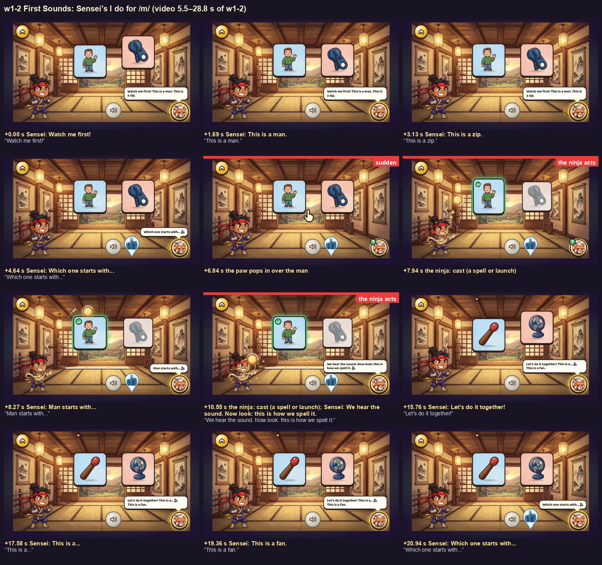

▶ [the clip, at real speed with sound](current/clips/w1-2-first-m.mp4) · video 5.53–28.76 s of `playtest/demo/inventory/runs/w1-2/final.mp4`

| ms | Sensei says | what moves | who appears to do it | against the words |
|---:|---|---|---|---|
| 0 | Watch me first! *(1.4 s)* | | Sensei's voice | |
| 1692 | This is a man. *(1.1 s)* | | Sensei's voice | |
| 3128 | This is a zip. *(1.1 s)* | | Sensei's voice | |
| 4636 | Which one starts with... *(1.2 s)* | | Sensei's voice | |
| 6183 | /m/ *(0.7 s)* | | Sensei's voice | |
| 6843 | | the paw pops in over the **man** (no arm; it bobs where it lands) | the paw | 1 ms after “/m/” ends **SUDDEN** **UNANNOUNCED** |
| 7944 | | the ninja: **cast** (a spell orb flies to the man and settles as a crown of stars: people get a gift, not a kick) | **the ninja** | 1102 ms after “/m/” ends **NINJA** **UNANNOUNCED** |
| 7944 | | the paw vanishes (no sound of its own) | the paw | 1102 ms after “/m/” ends |
| 7944 | | man turns green (a tick) | the board, by itself | 1102 ms after “/m/” ends |
| 8270 | Man starts with... *(1.5 s)* | | Sensei's voice | |
| 9895 | /m/ *(0.7 s)* | | Sensei's voice | |
| 10554 | | the ninja: **cast**; its spell writes < m > on the man's first line | **the ninja** | 0 ms after “/m/” ends **SUDDEN** **NINJA** **UNANNOUNCED** |
| 10585 | We hear the sound. Now look: this is how we spell it. *(4.0 s)* | | Sensei's voice | |
| 14763 | /m/ *(0.7 s)* | | Sensei's voice | |
| 15756 | Let's do it together! *(1.6 s)* | | Sensei's voice | |
| 17583 | This is a... *(0.6 s)* | | Sensei's voice | |
| 18289 | "match" *(0.7 s)* | | Sensei's voice | |
| 19357 | This is a fan. *(1.2 s)* | | Sensei's voice | |
| 20938 | Which one starts with... *(1.2 s)* | | Sensei's voice | |
| 22487 | /m/ *(0.7 s)* | | Sensei's voice | |
| 23145 | | match glows | the board, by itself | 0 ms after “/m/” ends |
| 23226 | | *the child's turn opens* | | |

<a id="w1-2-first-s"></a>
### 3.15 w1-2 First Sounds: the I do for /s/

As §3.14, with a shuriken at the soap. The spelling spell starts with "This is how we spell…" (1 ms), so the letter is written as the words begin, not after them.

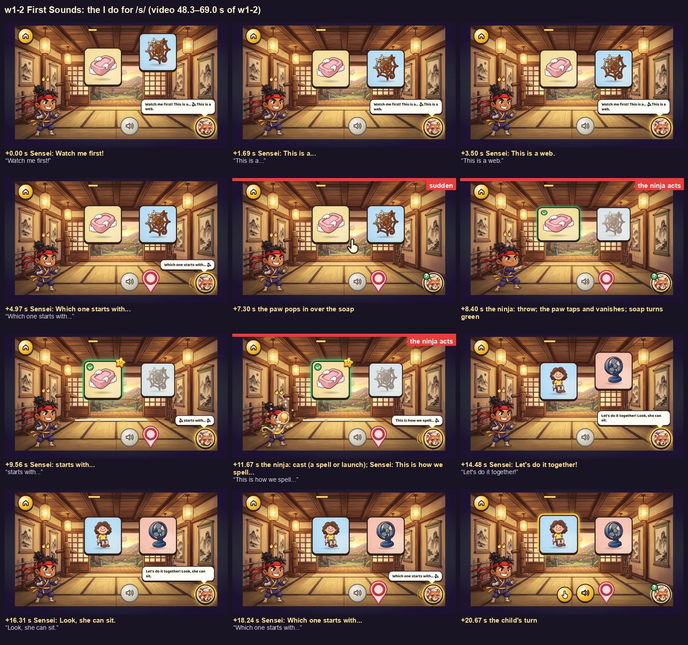

▶ [the clip, at real speed with sound](current/clips/w1-2-first-s.mp4) · video 48.29–68.96 s of `playtest/demo/inventory/runs/w1-2/final.mp4`

| ms | Sensei says | what moves | who appears to do it | against the words |
|---:|---|---|---|---|
| 0 | Watch me first! *(1.4 s)* | | Sensei's voice | |
| 1687 | This is a... *(0.6 s)* | | Sensei's voice | |
| 2392 | "soap" *(0.8 s)* | | Sensei's voice | |
| 3504 | This is a web. *(1.1 s)* | | Sensei's voice | |
| 4970 | Which one starts with... *(1.2 s)* | | Sensei's voice | |
| 6514 | /s/ *(0.8 s)* | | Sensei's voice | |
| 7297 | | the paw pops in over the **soap** (no arm; it bobs where it lands) | the paw | 0 ms after “/s/” ends **SUDDEN** **UNANNOUNCED** |
| 8398 | | the ninja: **throw** (a shuriken at the soap's corner) | **the ninja** | 1101 ms after “/s/” ends **NINJA** **UNANNOUNCED** |
| 8399 | | the paw vanishes (no sound of its own) | the paw | 1102 ms after “/s/” ends |
| 8399 | | soap turns green (a tick) | the board, by itself | 1102 ms after “/s/” ends |
| 8699 | "soap" *(0.8 s)* | | Sensei's voice | |
| 8832 | | soap gets the star stamp (the move lands) | the ninja's move | under “"soap"” (133 ms into it) |
| 9558 | starts with... *(1.2 s)* | | Sensei's voice | |
| 10886 | /s/ *(0.8 s)* | | Sensei's voice | |
| 11670 | This is how we spell... *(1.6 s)* | | Sensei's voice | |
| 11671 | | the ninja: **cast**; its spell writes < s > on the soap's first line | **the ninja** | under “This is how we spell...” (1 ms into it) **SUDDEN** **NINJA** **UNANNOUNCED** |
| 13399 | /s/ *(0.8 s)* | | Sensei's voice | |
| 14484 | Let's do it together! *(1.6 s)* | | Sensei's voice | |
| 16312 | Look, she can sit. *(1.6 s)* | | Sensei's voice | |
| 18245 | Which one starts with... *(1.2 s)* | | Sensei's voice | |
| 19790 | /s/ *(0.8 s)* | | Sensei's voice | |
| 20572 | | sit glows | the board, by itself | 0 ms after “/s/” ends |
| 20667 | | *the child's turn opens* | | |

<a id="w1-4-build"></a>
### 3.16 w1-4 Word Building: Sensei's I do, "am" (Early.tsx `runDemo`, 1716)

The only demo narrated step by step in the first person before it acts: "I say the word… am. I say it slowly… aaammm. Ninjas read this way! We start here, and go this way. Now I find each sound, one at a time." But each letter is then handled the same way: "aaammm", the paw on the tile 0–5 ms later, 0.7 s of silence, and then **the ninja launches the letter** into its line (a spell, then a shuriken throw) as its sound plays. Nothing says "I'm going to find /a/", and the tile is never named before it moves. At the end the ninja cheers.

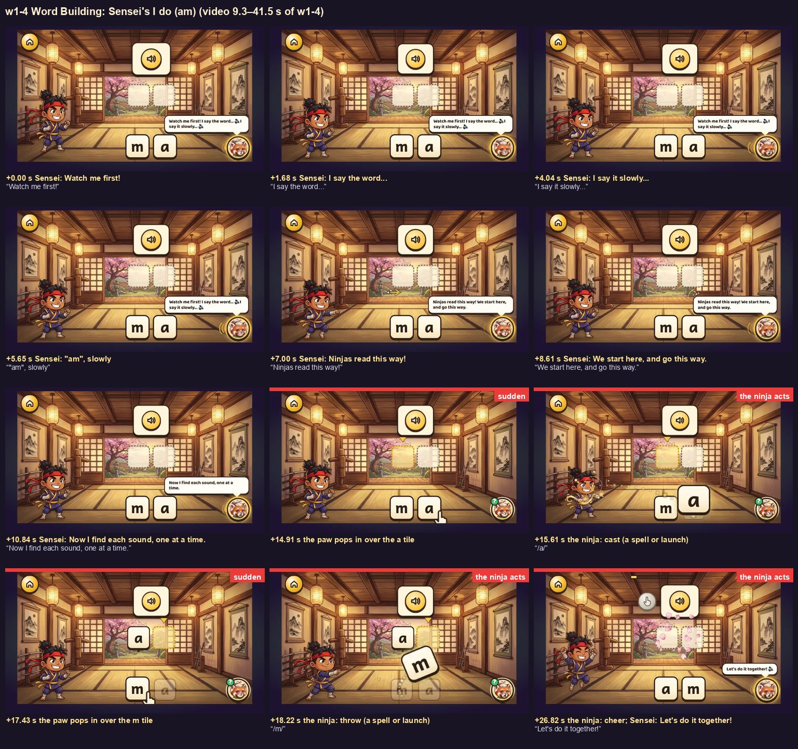

▶ [the clip, at real speed with sound](current/clips/w1-4-build.mp4) · video 9.26–41.47 s of `playtest/demo/inventory/runs/w1-4/final.mp4`

| ms | Sensei says | what moves | who appears to do it | against the words |
|---:|---|---|---|---|
| 0 | Watch me first! *(1.4 s)* | | Sensei's voice | |
| 1684 | I say the word... *(1.2 s)* | | Sensei's voice | |
| 3117 | "am" *(0.6 s)* | | Sensei's voice | |
| 4038 | I say it slowly... *(1.4 s)* | | Sensei's voice | |
| 5653 | "am", slowly *(1.0 s)* | | Sensei's voice | |
| 7002 | Ninjas read this way! *(1.4 s)* | | Sensei's voice | |
| 8608 | We start here, and go this way. *(2.2 s)* | | Sensei's voice | |
| 10837 | Now I find each sound, one at a time. *(3.0 s)* | | Sensei's voice | |
| 13885 | "am", slowly *(1.0 s)* | | Sensei's voice | |
| 14910 | | the paw pops in over the **a tile** (no arm; it bobs where it lands) | the paw | 5 ms after “"am", slowly” ends **SUDDEN** **UNANNOUNCED** |
| 15613 | | the ninja: **cast**; it launches the < a > tile up into the first line | **the ninja** | 708 ms after “"am", slowly” ends **NINJA** **UNANNOUNCED** |
| 15613 | | the paw vanishes (no sound of its own) | the paw | 708 ms after “"am", slowly” ends |
| 15638 | /a/ *(0.3 s)* | | Sensei's voice | |
| 16407 | "am", slowly *(1.0 s)* | | Sensei's voice | |
| 17427 | | the paw pops in over the **m tile** (no arm; it bobs where it lands) | the paw | 0 ms after “"am", slowly” ends **SUDDEN** **UNANNOUNCED** |
| 18130 | | the paw vanishes (no sound of its own) | the paw | 703 ms after “"am", slowly” ends |
| 18156 | /m/ *(0.7 s)* | | Sensei's voice | |
| 18221 | | the ninja: **throw**; it launches the < m > tile into the last line | **the ninja** | under “/m/” (65 ms into it) **SUDDEN** **NINJA** **UNANNOUNCED** |
| 19448 | Say the sounds, and read the word. *(2.5 s)* | | Sensei's voice | |
| 21944 | /a/ *(0.3 s)* | | Sensei's voice | |
| 21944 | | a lights up | the board, by itself | under “/a/” (0 ms into it) |
| 22509 | /m/ *(0.7 s)* | | Sensei's voice | |
| 22510 | | m lights up | the board, by itself | under “/m/” (1 ms into it) |
| 23450 | Now say the whole word... *(1.6 s)* | | Sensei's voice | |
| 26254 | "am" *(0.6 s)* | | Sensei's voice | |
| 26824 | | the ninja: **cheer** | **the ninja** | 0 ms after “"am"” ends **SUDDEN** **NINJA** **UNANNOUNCED** |
| 26853 | Let's do it together! *(1.6 s)* | | Sensei's voice | |
| 28681 | "am" *(0.6 s)* | | Sensei's voice | |
| 29282 | What's the first sound? *(1.6 s)* | | Sensei's voice | |
| 31088 | "am", slowly *(1.0 s)* | | Sensei's voice | |
| 32205 | | *the child's turn opens* | | |

<a id="w1-7-hunt"></a>
### 3.17 w1-7 Sound Hunt: Sensei's I do (pin or pan)

As §3.14. The child's question is long ("Which one has this sound in it? /i/ piiin paaan"), and the paw answers it the moment "paaan" ends, then sits for 1.1 s. The ninja punches the pin, and later casts < i > onto its middle line as "This is how we spell…" starts.

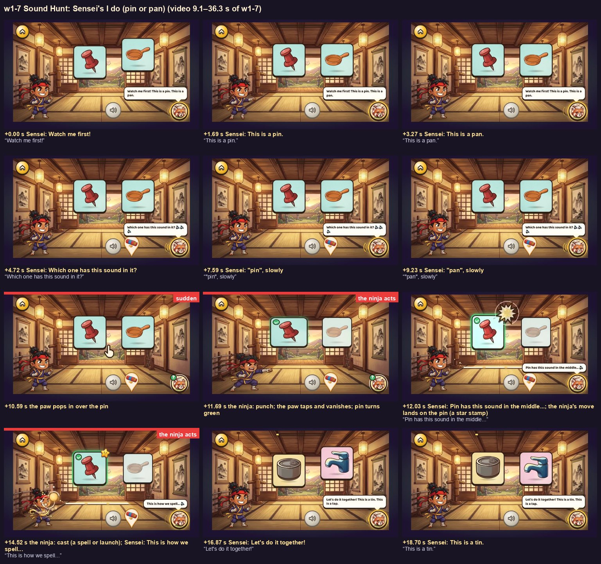

▶ [the clip, at real speed with sound](current/clips/w1-7-hunt.mp4) · video 9.14–36.27 s of `playtest/demo/inventory/runs/w1-7/final.mp4`

| ms | Sensei says | what moves | who appears to do it | against the words |
|---:|---|---|---|---|
| 1 | Watch me first! *(1.4 s)* | | Sensei's voice | |
| 1689 | This is a pin. *(1.2 s)* | | Sensei's voice | |
| 3271 | This is a pan. *(1.1 s)* | | Sensei's voice | |
| 4722 | Which one has this sound in it? *(2.0 s)* | | Sensei's voice | |
| 6990 | /i/ *(0.3 s)* | | Sensei's voice | |
| 7590 | "pin", slowly *(1.3 s)* | | Sensei's voice | |
| 9233 | "pan", slowly *(1.4 s)* | | Sensei's voice | |
| 10590 | | the paw pops in over the **pin** (no arm; it bobs where it lands) | the paw | 0 ms after “"pan", slowly” ends **SUDDEN** **UNANNOUNCED** |
| 11692 | | the ninja: **punch** at the pin's corner (a soft strike: one tink) | **the ninja** | 1100 ms after “"pan", slowly” ends **NINJA** **UNANNOUNCED** |
| 11694 | | the paw vanishes (no sound of its own) | the paw | 1102 ms after “"pan", slowly” ends |
| 11694 | | pin turns green (a tick) | the board, by itself | 1102 ms after “"pan", slowly” ends |
| 12027 | Pin has this sound in the middle... *(2.1 s)* | | Sensei's voice | |
| 12043 | | pin gets the star stamp (the move lands) | the ninja's move | under “Pin has this sound in the middle...” (16 ms into it) |
| 14274 | /i/ *(0.3 s)* | | Sensei's voice | |
| 14521 | | the ninja: **cast**; its spell writes < i > on the pin's middle line | **the ninja** | 0 ms after “/i/” ends **SUDDEN** **NINJA** **UNANNOUNCED** |
| 14552 | This is how we spell... *(1.6 s)* | | Sensei's voice | |
| 16283 | /i/ *(0.3 s)* | | Sensei's voice | |
| 16867 | Let's do it together! *(1.6 s)* | | Sensei's voice | |
| 18696 | This is a tin. *(1.0 s)* | | Sensei's voice | |
| 20054 | This is a tap. *(1.2 s)* | | Sensei's voice | |
| 21574 | Which one has this sound in it? *(2.0 s)* | | Sensei's voice | |
| 23839 | /i/ *(0.3 s)* | | Sensei's voice | |
| 24439 | "tin", slowly *(1.3 s)* | | Sensei's voice | |
| 26075 | "tap", slowly *(1.0 s)* | | Sensei's voice | |
| 27064 | | tin glows | the board, by itself | 1 ms after “"tap", slowly” ends |
| 27126 | | *the child's turn opens* | | |

---

## 4. The first meetings with no demo

These game types have no Sensei demo today: the frame is followed by the child's turn. The ninja's moves here answer the child's own taps, which is what they are for (HERO.md), so they aren't flagged, except where they happen before any word.

<a id="w1-2-find"></a>
### 4.1 w1-2 Ninja Eyes (`find`)

No frame and no demo. After the First Sounds game, "Find this sound… /m/", and the letters are there to tap, 2.2 s in.

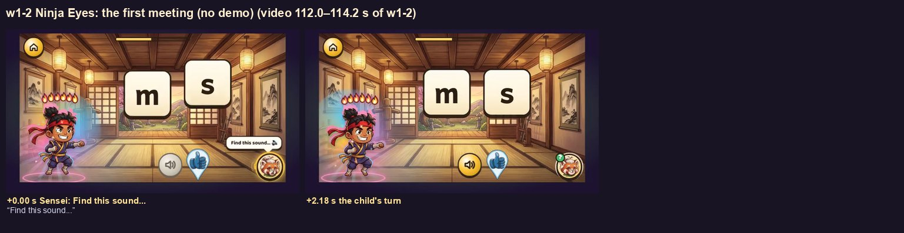

▶ [the clip, at real speed with sound](current/clips/w1-2-find.mp4) · video 111.98–114.16 s of `playtest/demo/inventory/runs/w1-2/final.mp4`

| ms | Sensei says | what moves | who appears to do it | against the words |
|---:|---|---|---|---|
| 1 | Find this sound... *(1.2 s)* | | Sensei's voice | |
| 1492 | /m/ *(0.7 s)* | | Sensei's voice | |
| 2177 | | *the child's turn opens* | | |

<a id="w1-4-readcheck"></a>
### 4.2 w1-4 Kai and Suki (`readcheck`)

Guided, with no demo. "Who read it right? Listen to Kai and Suki!" is followed by "Tap each sound, and say it.", and the child taps the sounds first (the tiles hint). Only then do the two readers speak ("Kai says… am", "Suki says… at").

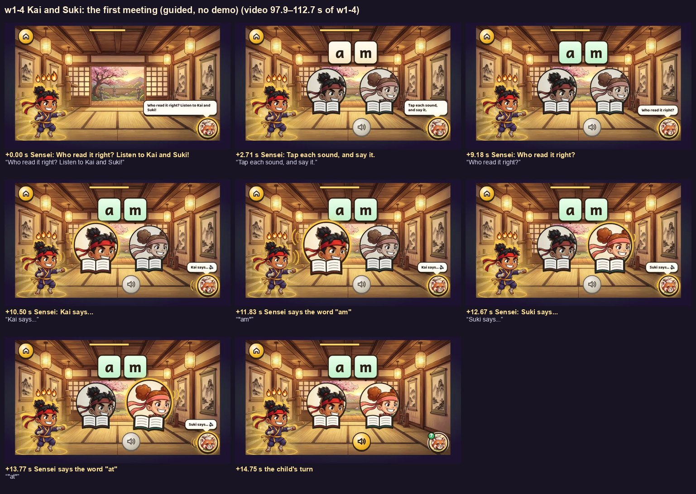

▶ [the clip, at real speed with sound](current/clips/w1-4-readcheck.mp4) · video 97.92–112.67 s of `playtest/demo/inventory/runs/w1-4/final.mp4`

| ms | Sensei says | what moves | who appears to do it | against the words |
|---:|---|---|---|---|
| 2 | Who read it right? Listen to Kai and Suki! *(2.7 s)* | | Sensei's voice | |
| 2708 | Tap each sound, and say it. *(2.1 s)* | | Sensei's voice | |
| 6289 | | | **the child taps sound 0** | |
| 6290 | /a/ *(0.3 s)* | | Sensei's voice | |
| 6290 | | sound 0 lights up | (the child's answer) |  |
| 6602 | | sound 0 turns green (a tick) | (the child's answer) |  |
| 7892 | /m/ *(0.7 s)* | | Sensei's voice | |
| 7892 | | | **the child taps sound 1** | |
| 7892 | | sound 1 lights up | (the child's answer) |  |
| 8549 | | sound 1 turns green (a tick) | (the child's answer) |  |
| 9178 | Who read it right? *(1.3 s)* | | Sensei's voice | |
| 10503 | Kai says... *(1.2 s)* | | Sensei's voice | |
| 11828 | "am" *(0.6 s)* | | Sensei's voice | |
| 12670 | Suki says... *(1.0 s)* | | Sensei's voice | |
| 13769 | "at" *(0.7 s)* | | Sensei's voice | |
| 14747 | | *the child's turn opens* | | |

<a id="w1-6-battle"></a>
### 4.3 w1-6 the first Monster Battle (`battle`)

**Before any word**, the monster crashes in from above at about 0.8 s, with a boom, a screen shake and dust, and the ninja shouts "!" (`ninja.say()`, Battle.tsx:481). Sensei's first line starts 55 ms later. Then comes the frame ("Spell the words to zap it!") and "Spell… mat", and the letters are live at 12.3 s. There is no demo of spelling a word at a monster: the child's first letter is the first time a letter flies at it.

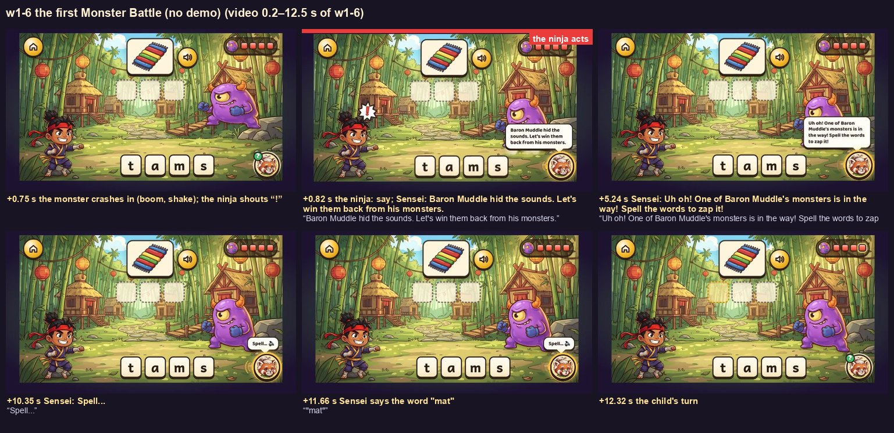

▶ [the clip, at real speed with sound](current/clips/w1-6-battle.mp4) · video 0.20–12.52 s of `playtest/demo/inventory/runs/w1-6/final.mp4`

| ms | Sensei says | what moves | who appears to do it | against the words |
|---:|---|---|---|---|
| 818 | | the monster has just crashed in (boom, screen shake, dust); the ninja shouts “!” | **the ninja** |  **NINJA** **UNANNOUNCED** |
| 873 | Baron Muddle hid the sounds. Let's win them back from his monsters. *(4.1 s)* | | Sensei's voice | |
| 5238 | Uh oh! One of Baron Muddle's monsters is in the way! Spell the words to zap it! *(5.1 s)* | | Sensei's voice | |
| 10349 | Spell... *(0.8 s)* | | Sensei's voice | |
| 11662 | "mat" *(0.6 s)* | | Sensei's voice | |
| 12318 | | *the child's turn opens* | | |

<a id="w1-8-swap"></a>
### 4.4 w1-8 Sound Swap (`swap`)

A 15.7 s frame, then the child's turn, with no demo. "Baron Muddle has mixed up these words! Can you fix them? Change one sound at a time." · "This is… mat" · "Change it to make… sat" · "mmmaaat… sssaaat" · "What changed? Listen here." The first time the child taps the sound that changes, the ninja spin-kicks it out of the word. Nothing has said that this will happen. It is the child's own action, but it is the demo's missing half.

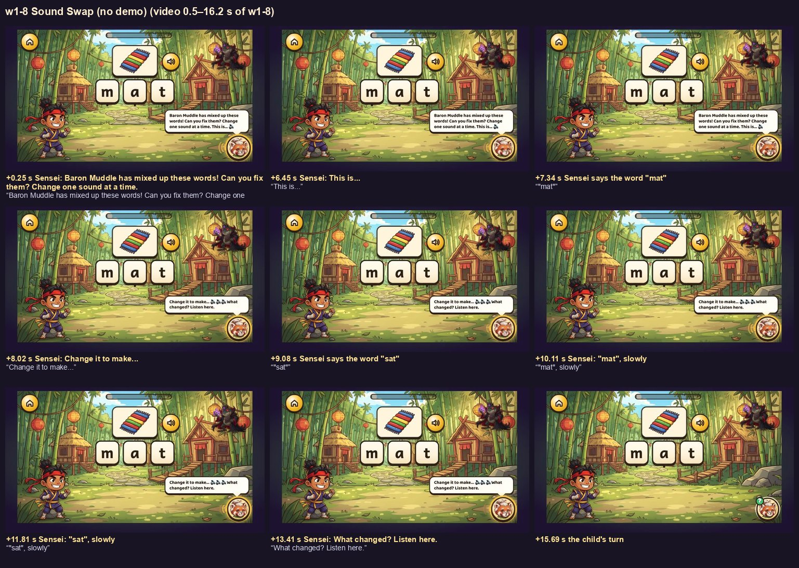

▶ [the clip, at real speed with sound](current/clips/w1-8-swap.mp4) · video 0.50–16.19 s of `playtest/demo/inventory/runs/w1-8/final.mp4`

| ms | Sensei says | what moves | who appears to do it | against the words |
|---:|---|---|---|---|
| 252 | Baron Muddle has mixed up these words! Can you fix them? Change one sound at a time. *(6.0 s)* | | Sensei's voice | |
| 6451 | This is... *(0.9 s)* | | Sensei's voice | |
| 7338 | "mat" *(0.6 s)* | | Sensei's voice | |
| 8022 | Change it to make... *(0.9 s)* | | Sensei's voice | |
| 9076 | "sat" *(0.7 s)* | | Sensei's voice | |
| 10113 | "mat", slowly *(1.3 s)* | | Sensei's voice | |
| 11811 | "sat", slowly *(1.3 s)* | | Sensei's voice | |
| 13408 | What changed? Listen here. *(2.2 s)* | | Sensei's voice | |
| 15689 | | *the child's turn opens* | | |

<a id="w1-9-run"></a>
### 4.5 w1-9 Ninja Run (`run`)

The run starts as the level opens: the ninja runs and the lanterns come. Sensei's frame starts 3 s later: "Ninja Run! Tap to jump, and catch the right word!", then "Listen to the sounds. What word do they make?" /m/ /a/ /t/. There is no demo of a catch. (The simulated child caught with the scene's own shortcut, so its catch isn't a logged tap.)

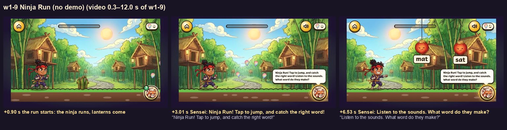

▶ [the clip, at real speed with sound](current/clips/w1-9-run.mp4) · video 0.30–12.00 s of `playtest/demo/inventory/runs/w1-9/final.mp4`

| ms | Sensei says | what moves | who appears to do it | against the words |
|---:|---|---|---|---|
| 3005 | Ninja Run! Tap to jump, and catch the right word! *(3.2 s)* | | Sensei's voice | |
| 6526 | Listen to the sounds. What word do they make? *(3.2 s)* | | Sensei's voice | |
| 9756 | /m/ *(0.7 s)* | | Sensei's voice | |
| 10748 | /a/ *(0.3 s)* | | Sensei's voice | |
| 11394 | /t/ *(0.2 s)* | | Sensei's voice | |

<a id="w1-14-story"></a>
### 4.6 w1-14 Story Time (`story`)

The ninja flips and jumps in as "Story time! I'll read, and you read too." starts. Sensei reads the title and page 1 with each word lit as it is read (in time with the words: fine). Then "Your turn to read." hands over the child's page with no demo of what reading it looks like, beyond the "I read it!" button.

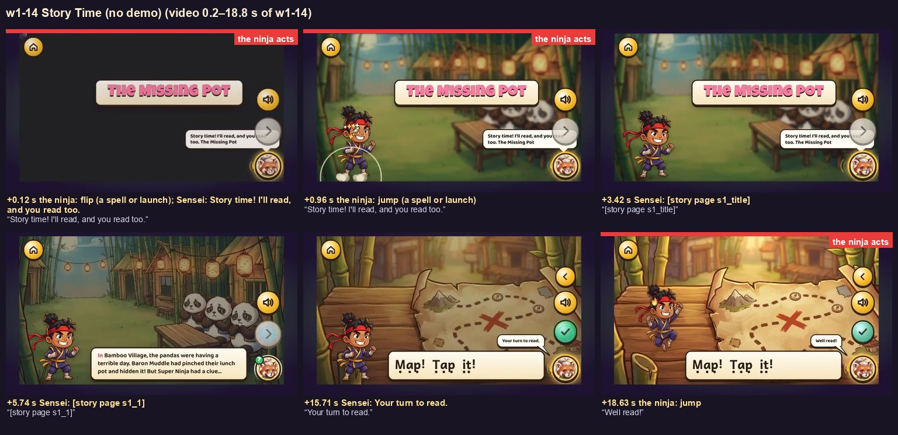

▶ [the clip, at real speed with sound](current/clips/w1-14-story.mp4) · video 0.18–18.81 s of `playtest/demo/inventory/runs/w1-14/final.mp4`

| ms | Sensei says | what moves | who appears to do it | against the words |
|---:|---|---|---|---|
| 123 | | the ninja flips in | **the ninja** |  **NINJA** **UNANNOUNCED** |
| 176 | Story time! I'll read, and you read too. *(3.0 s)* | | Sensei's voice | |
| 961 | | the ninja jumps | **the ninja** | under “Story time! I'll read, and you read too.” (785 ms into it) **NINJA** |
| 3423 | [story page s1_title] *(1.1 s)* | | Sensei's voice | |
| 4587 | | *held on Next* | | |
| 5732 | | | **the child taps Next** | |
| 5735 | [story page s1_1] *(9.9 s)* | | Sensei's voice | |
| 15667 | | | **the child taps Next** | |
| 15709 | Your turn to read. *(1.3 s)* | | Sensei's voice | |
| 18632 | | | **the child taps I read it!** | |
| 18633 | | the ninja: **jump** | the ninja (the child's answer) | 1597 ms after “Your turn to read.” ends  |

<a id="w1-15-boss"></a>
### 4.7 w1-15 the first boss (`boss`)

As the battle, and bigger. The boss crashes in, the ninja shouts "!", and Baron Muddle threatens (`baron_w1`, in his own voice, with his portrait storming in at the top right while the rest of the screen dims). The ninja powers up as his last words fade (`ninja.act("power")` 0.4 s before the end of his line, Battle.tsx:388). Then Sensei: "A big boss monster! Listen carefully, and spell your best!", "on", and the turn.

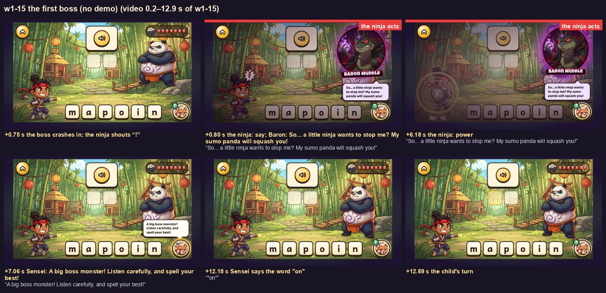

▶ [the clip, at real speed with sound](current/clips/w1-15-boss.mp4) · video 0.20–12.89 s of `playtest/demo/inventory/runs/w1-15/final.mp4`

| ms | Sensei says | what moves | who appears to do it | against the words |
|---:|---|---|---|---|
| 805 | | the boss has just crashed in; the ninja shouts “!” | **the ninja** |  **NINJA** **UNANNOUNCED** |
| 861 | So... a little ninja wants to stop me? My sumo panda will squash you! *(5.7 s)* | | Baron Muddle's voice | |
| 6177 | | the ninja powers up (a flash and rings) as Baron's last words fade | **the ninja** | under “So... a little ninja wants to stop me? My sumo panda will squash you!” (5316 ms into it) **NINJA** **UNANNOUNCED** |
| 7061 | A big boss monster! Listen carefully, and spell your best! *(5.0 s)* | | Sensei's voice | |
| 12177 | "on" *(0.4 s)* | | Sensei's voice | |
| 12688 | | *the child's turn opens* | | |

<a id="w2-1-learn"></a>
### 4.8 w2-1 the first Dojo lesson: New Sounds (`learn`, Dojo.tsx:444)

Jonas's "Listen!" moment. The ear is gone (the petal pulses instead), but the bare "Listen…" still opens the sound. Then /b/ twice, and **0.52 s after the second /b/ the ninja casts a spell** at the empty space beside the petal (Dojo.tsx:463). The petal steps aside, and the letter b pops in 0.7 s later. Only *then* does Sensei say "And this is how we spell it." The ninja writes the letter, and the words that explain it come after it. The turn opens as the letter lands (taps during the explanation are queued), and "Tap it, and say it with me!" comes 2.5 s later.

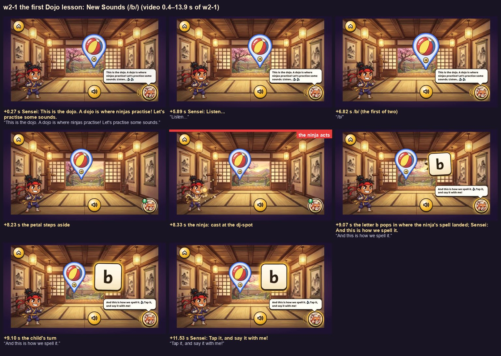

▶ [the clip, at real speed with sound](current/clips/w2-1-learn.mp4) · video 0.40–13.92 s of `playtest/demo/inventory/runs/w2-1/final.mp4`

| ms | Sensei says | what moves | who appears to do it | against the words |
|---:|---|---|---|---|
| 268 | This is the dojo. A dojo is where ninjas practise! Let's practise some sounds. *(5.4 s)* | | Sensei's voice | |
| 5890 | Listen... *(0.8 s)* | | Sensei's voice | |
| 6798 | /b/ *(0.3 s)* | | Sensei's voice | |
| 7555 | /b/ *(0.3 s)* | | Sensei's voice | |
| 8333 | | the petal steps aside; the ninja **casts** a spell at the empty space beside it; the letter b pops in 0.7 s later | **the ninja** | 524 ms after “/b/” ends **NINJA** **UNANNOUNCED** |
| 9080 | And this is how we spell it. *(1.7 s)* | | Sensei's voice | |
| 9096 | | *the child's turn opens* | | |
| 10976 | /b/ *(0.3 s)* | | Sensei's voice | |
| 11529 | Tap it, and say it with me! *(2.0 s)* | | Sensei's voice | |

<a id="w6-br1-sort"></a>
### 4.9 w6-br1 Sorting (`sort`)

A 22 s frame with no demo. "You know this sound! …", "Sorting time! …", "This sound can be spelt in three ways." Each chest's spelling glows as its /k/ is said, in time with the words (fine). Then "It's two letters, but it's one sound." and "Tap the chest with the same spelling as the word.", and the first word ("desk") starts falling. No word is sorted for the child first.

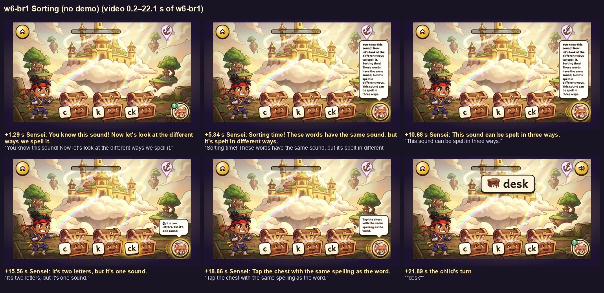

▶ [the clip, at real speed with sound](current/clips/w6-br1-sort.mp4) · video 0.20–22.09 s of `playtest/demo/inventory/runs/w6-br1/final.mp4`

| ms | Sensei says | what moves | who appears to do it | against the words |
|---:|---|---|---|---|
| 1294 | You know this sound! Now let's look at the different ways we spell it. *(3.7 s)* | | Sensei's voice | |
| 5336 | Sorting time! These words have the same sound, but it's spelt in different ways. *(5.0 s)* | | Sensei's voice | |
| 10677 | This sound can be spelt in three ways. *(2.5 s)* | | Sensei's voice | |
| 13595 | /k/ *(0.2 s)* | | Sensei's voice | |
| 14330 | /k/ *(0.2 s)* | | Sensei's voice | |
| 15068 | /k/ *(0.2 s)* | | Sensei's voice | |
| 15555 | It's two letters, but it's one sound. *(2.9 s)* | | Sensei's voice | |
| 18858 | Tap the chest with the same spelling as the word. *(2.9 s)* | | Sensei's voice | |
| 21886 | | *the child's turn opens* | | |

<a id="trial"></a>
### 4.10 a Gem Trial (`trial`)

The monster crashes in and the ninja shouts "!" at 0.75 s. "Your gem is ready. Spell the words to win it." is followed by "nap", and the turn opens at 4.7 s. (This save had seen the timer. A child who hasn't also hears the bar and the hearts explained, with the bar filling as it is described.)

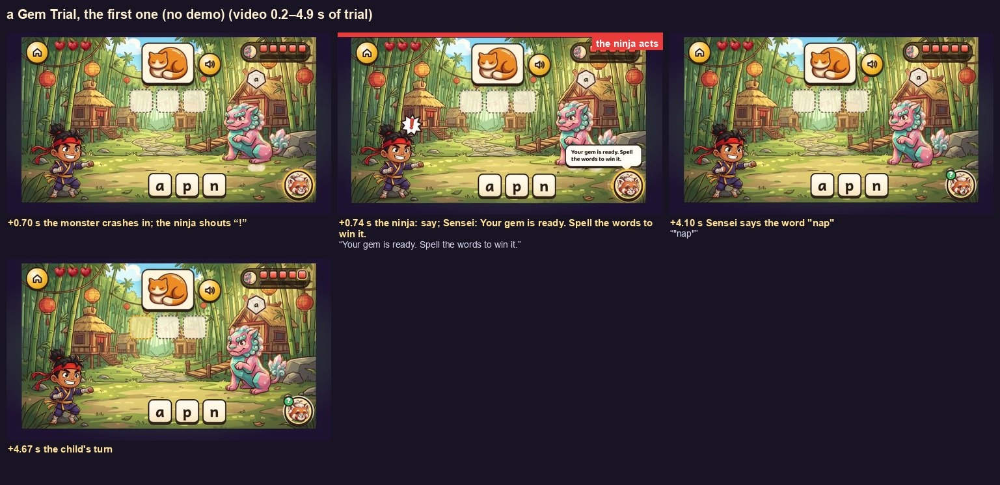

▶ [the clip, at real speed with sound](current/clips/trial.mp4) · video 0.20–4.87 s of `playtest/demo/inventory/runs/trial/final.mp4`

| ms | Sensei says | what moves | who appears to do it | against the words |
|---:|---|---|---|---|
| 745 | | the monster has just crashed in; the ninja shouts “!” | **the ninja** |  **NINJA** **UNANNOUNCED** |
| 796 | Your gem is ready. Spell the words to win it. *(3.2 s)* | | Sensei's voice | |
| 4103 | "nap" *(0.6 s)* | | Sensei's voice | |
| 4674 | | *the child's turn opens* | | |

<a id="review"></a>
### 4.11 Sensei's Challenge (`review`)

The monster crashes in and the ninja shouts "!" at 0.62 s. "Practice time with Sensei! Let's try the sounds you found tricky. You can do it!", then "Spell… at", and the turn opens at 8.0 s.

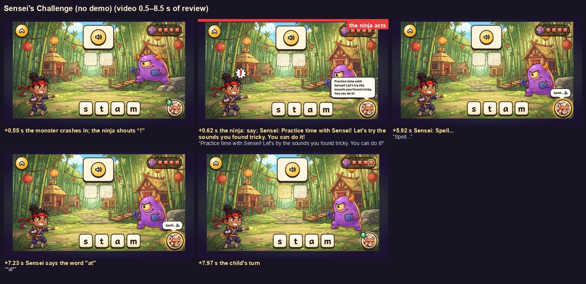

▶ [the clip, at real speed with sound](current/clips/review.mp4) · video 0.50–8.47 s of `playtest/demo/inventory/runs/review/final.mp4`

| ms | Sensei says | what moves | who appears to do it | against the words |
|---:|---|---|---|---|
| 618 | | the monster has just crashed in; the ninja shouts “!” | **the ninja** |  **NINJA** **UNANNOUNCED** |
| 665 | Practice time with Sensei! Let's try the sounds you found tricky. You can do it! *(5.2 s)* | | Sensei's voice | |
| 5915 | Spell... *(0.8 s)* | | Sensei's voice | |
| 7231 | "at" *(0.7 s)* | | Sensei's voice | |
| 7973 | | *the child's turn opens* | | |

---

## 5. Every flag, in one place

Counted by `analyze.ts` over the 17 demo windows (§3), on everything that moves without the child having tapped in the 3 s before (naming spotlights left out):

| | count | where |
|---|---:|---|
| things that move by themselves in a demo | 135 | |
| **SUDDEN** (within 300 ms of a short utterance, or under one) | 77 | every demo but the first sound (§3.3) |
| **NINJA** (the ninja moves during Sensei's show) | 31 moves in 16 of 17 demos | every demo but the first sound |
| **UNANNOUNCED** (no first-person line in the 4 s before) | 81 | everything else has only "Let me show you!" / "Watch me first!" (35), or first-person narration *as* it happens (W1 fast and slow) |
| paw taps announced in the first person with their target | **0 of 20** | |
| paw arrivals within 5 ms of the last word, or under a line | 18 of 20 | the other two: W2 Word Squish (0.15 s after the naming, 30 ms before the line), W5 (0.42 s after /n/) |
| demos where the ninja strikes in the same frame as the paw's tap | 7 | W1 tap, W3 Slow Words, W5, w1-2 ×2, w1-4, w1-7 (and within 0.13–0.68 s: W1 Pocket Hunt, W2 two rows, W3 /a/) |
| demos where the hand-over starts on top of the result | 2 | W2 two rows ("Now you try!" 131 ms after the tap, under the gift and the sweep); W1 Ninja Ears ("Now you try!" 0.5 s after the tap, 0.12 s after the star stamp) |
| demos where the result comes before its cause | 1 | W2 Word Squish (the buttons light when the paw arrives; the merge starts before the paw taps the rabbit) |
| first meetings with no demo at all | 11 of 25 game types | §4 |
| first meetings where something big happens before any word | 5 | the Monster Battle, the boss, the Gem Trial, Sensei's Challenge (the crash-in and the "!"), New Sounds (the ninja's spell writes the letter before "And this is how we spell it.") |

`playtest/demo/inventory/runs/<case>/actions.json` lists every flagged moment with its time, the line before it, and the gap.

---

## 6. Where it lives in the code

The recorded build's code (this checkout, 27 Sep 09:17). **Show me again replays the same function**, so every finding here also holds for the replay.

| what | where |
|---|---|
| the paw in the warm-ups: `pawAt()` puts a `<TapHint>` at the target's middle, waits 750 ms, plays `sfx.tap()`, removes it | src/scenes/Warmup.tsx:421 |
| "Let me show you!" / "Watch me first!" and "Now you try!" / "Your turn!" (`showMe`, `youTry`; `showLine`, `tryLine` alternate them) | Warmup.tsx:446; src/content/warmups.ts:269 |
| W1 Ninja Ears: `show()` says `demo.prompt` ("Tap the sun!"), 250 ms later `pawAt`, then `rightAnswer(…, { soft: true })` | Warmup.tsx:504 |
| the result of a demo tap = the ninja's strike: `rightAnswer()` calls `ninja.strike()` (people and animals: `gift()`, a spell or a cheer) | src/scenes/Early.tsx:105, 292 |
| fast and slow: `fastSlowShow` (paws, `fastHop` → `dash()`, `slowWord` → `ninja.act("cast")` in slow motion) | Warmup.tsx:1355, 1507, 1519 |
| Pocket Hunt: the paw timed to land on the sound (`nextClip`), then `ninja.act("throw")` | Warmup.tsx:749 |
| the reading rail: `readAlong` → `runAlong` (the ninja runs under each picture); the merge by the ninja's cast | Warmup.tsx:1562, 880 |
| two rows: `play()` taps the row, then `gift()` and the sweep run *with* `youTry` ("Now you try!") | Warmup.tsx:1009 |
| Word Squish: `void pawAt(...)` (fire-and-forget), the buttons flash on arrival, `ninja.act("cast")` before the rabbit's tap | Warmup.tsx:1470 |
| Slow Words, Guess My Word, Sound Dots | Warmup.tsx:636, 1176, 1264 |
| W2's "Whoops!" swap (`ninja.act("flip")` as the line starts) | Warmup.tsx:1447 |
| Early's I do: `present()` asks the child's question, then `setPaw(answer); await sleep(1100); choose(answer, true)` | Early.tsx:980, 1016 |
| the spell that writes a spelling: `castSpelling()` (the ninja casts, the spelling appears as it lands) | Early.tsx:157 |
| Word Building's I do: `runDemo()`: `setPaw(j); sleep(700)`, then `carry()` → `launch()` (the ninja launches the tile) | Early.tsx:1716, 628 |
| the paw's picture and bob: `TapHint` (a 110 stage-px glove), `@keyframes taphint` (1.4 s; press at 60%) | src/ui/ui.tsx:938; src/styles.css:401 |
| New Sounds: `ninja.act("cast", where)` before "And this is how we spell it." | src/scenes/Dojo.tsx:463 |
| a battle's entrance: `enter()`: the drop, the boom, the shake, `ninja.say()` | src/scenes/Battle.tsx:453 |

The teacher-voice registry (`src/content/games.ts`: frame, demo lines, Ready) is in this build, but no scene reads it yet (only NavDemo uses `holdReady`). Every demo above still runs on the warm-ups' `fm_` lines and Early's `ido`/`wedo`/`youdo` lines.

---

## 7. Files

- **Frame strips**: `docs/demo-choreography/current/<demo>.jpg`, one per demo and first meeting (28). Cells show the 16:9 stage cropped out of the 844 × 390 screen.
- **Clips** at real speed, with the rebuilt soundtrack (speech and sound effects; music was off in the save): `docs/demo-choreography/current/clips/<demo>.mp4`, each the demo's window plus 0.8 s before and 1.5 s after.
- **Whole recordings** (git-ignored, like all playtest video): `playtest/demo/inventory/runs/<case>/final.mp4`, with `timeline.md` (every event, readable), `timeline.json`, `actions.json` (the flags), and the raw `events.json` / `audio.json` / `meta.json`.

## 8. Re-running it

Everything is in `playtest/demo/inventory/`. Nothing deletes: an old run or clip is moved to `.trash/demo-inventory/`.

```
bun playtest/demo/inventory/record.ts w1-wu1 [--base https://superninja.templestein.com]   # one case (cases.ts), one browser per process
bun playtest/demo/inventory/build.ts [case ...]      # timeline + final.mp4 with sound
bun playtest/demo/inventory/analyze.ts [case ...]    # the flags → actions.json
bun playtest/demo/inventory/strips.ts [demo ...]     # strips + clips for the windows in demos.json
bun playtest/demo/inventory/table.ts <demo>          # a demo's timeline table (as in §3, §4)
bun playtest/demo/inventory/stats.ts                 # the numbers in §1 and §5
```

`--base` can point at a frozen build (`bun scripts/treadmill/frozen.ts --port 49xx --out … --detach`), so the same inventory can be taken of the new choreography when it lands, as its "after".

**Caveats.**
- The simulated child answers after 1.5 s of quiet. Once or twice in Pocket Hunt it answered sooner, because a word clip shows no caption. That only touches the child's turns, never a demo.
- W2's optional swap beat was dropped by the time governor in this run.
- `fm_`/`ido` line texts are this checkout's `lines.ts`, which matches the build.
- The paw's size, the ninja's size and the stage scale (0.54) are for 844 × 390. On a bigger phone everything scales together.
