# What a new 3-year-old hears today: the listener's record

**26 September 2026, the teacher-voice workflow, listener pass.** Jonas, after playtesting the preschool levels with his 3- and 4-year-old: *"I find that this extremely abbreviated way of talking, it doesn't help at all. … Teachers explain what they're doing."* This is a record of exactly what a brand-new preschool child hears and sees today, from the opt-in to the first Dojo level, plus the first meeting with every other game. Each moment has its verbatim transcript beside what was on screen, then a diagnosis against his feedback. It records what the game does; it proposes no new script (that is docs/TEACHER_SCRIPT.md's job).

- **Full transcript of the whole journey** (every game, every turn, 53 minutes): [current-transcript.md](current-transcript.md).
- **Stills** used below: [current-shots/](current-shots/). Every Sensei line has a still at its start and one a game-second later under `playtest/runs/teacher-voice/run-a/shots/` (git-ignored; 1,720 frames).

---

## 0. The short version

1. **Six lines in ten are four words or fewer.** 847 Sensei lines in 53 minutes; 512 (60%) have four words or fewer, and 410 of those aren't praise; the median line is four words. The warm-ups and the first-sound level are the shortest: in w1-2, 43 of its 53 lines are four words or fewer.
2. **No game is ever introduced as a game.** Not one line in 53 minutes says what the game is, how it goes or why we play it: nothing like "In this game…", "Here's how it works", "…because…". The openers are slogans: "Ninja ears on!", "Ninjas read this way!", "Watch me first!", "Spell…", "Change it to make…".
3. **"I'll show you, then you" is compressed to two 3-word labels.** "Let me show you!" / "Watch me first!" and "Now you try!" / "Your turn!" (warm-ups), and "Watch me first!" / "Let's do it together!" / "Now it's your turn!" (first-sound and early Dojo levels). They are never joined into a sentence that says who does what ("First I'll…, then you'll…").
4. **Sensei gives the child's instruction during her own demo.** "Let me show you! Tap the sun!" (the paw arrives about a second later), "Let me show you! Tap all the pictures that start with… /s/", and in w1-2's demo "Which one starts with… /m/". So the child hears a command that isn't for them. Three seconds later they hear the same shape ("Tap the sock!"), and this time it is for them.
5. **There is exactly one readiness check in 53 minutes:** "Ready for the next game? Tap the big arrow!" after the first game (Reward 1). Nowhere does Sensei ask "Are you ready?" or "Do you want to have a go?" before a turn.
6. **"Listen…" is a bare one-word order,** 41 times (lines that begin with "Listen"). The worst is the Dojo's `listen` clip ("Listen…", about 0.7 s) followed 150 ms later by a pure sound. It opens every new sound in the first Dojo level: four times in 30 s in w2-1.
7. **Jonas's "first Dojo level with the ear"** is the Dojo's Learn (Dojo.tsx `Learn`), first met at **w2-1** (Blossom Hills: b, c, g, h). In the build he played (production bundle `play-DuHshu4L.js`, which matches the 19:23 backup 0b50f5f here), the screen opens on a 230 px pulsing golden **ear** button (`Icon.ear`, `.dj-ear`). Sensei says "This is the dojo… Let's practise some sounds." and then only "Listen…" /b/ /b/. Every later sound opens with "Listen…" and the ear alone. Today's source has swapped the ear for the sound's petal, but the words are the same, and the /g/ petal (a white, faceless ghost) still looks like an ear (§3).
8. **Icons arrive unexplained.** They include the tortoise and rabbit, the sound petal (first seen 54 s into W1, 2:48 into the journey, and first named 2:45 later in Reward 2), the green Next arrow, the lesson beads, the pockets, the reading rail, the stacked "which did I read" rails, the Show-me-again paw, Kai and Suki, the monster's health bar and the letters themselves ("This is how we spell…" is the first a 3-year-old hears of letters).
9. **Long silent-for-the-child stretches still happen,** but they are *talk*, not explanation. The first turns open after 10–31 s of talk (§1): W1 after 33 words, w1-2 after 63 words, the first early Dojo (w1-4) after 75 words, and the Sky Temple's first sort after 57 words. They are long without framing anything: most of those words are picture names and labels.
10. **The hand-over is often unclear.** Letters are tappable while Sensei is still introducing the battle, Sound Swap and the boss (the learner tapped at +3.0 s, +2.9 s and +2.9 s), and "Yes, the first sound changes! Now pick the new sound." is cut off by the child's next tap 3 times out of 3.

---

## 1. The numbers, game by game (first meeting)

A brand-new child who answers "not yet" to "Do you go to big school yet?", played continuously on one page from the title tap to the World Flower after w2-1 (53 minutes of game time), plus the first sort (w6-br1) in a separate run with every earlier level marked done. "Talk before the first turn" runs from the game's first line to the end of the line (and its spliced sound or word) that opens the child's first turn. A "turn" is everything Sensei says between two child actions.

| Game or moment (first meeting) | Journey time | Length | Sensei lines | Words per turn, mean (max) | Talk before the child's first turn | Lines of 4 words or fewer (not praise) | Bare commands | "Listen…" lines |
|---|---|---|---|---|---|---|---|---|
| Opt-in ("big school?") | 1:12 | 22.5 s | 7 | 11.8 (22) | 6.2 s, 16 words | 2 | 0 | 0 |
| Dojo welcome (Training) | 1:34 | 16.1 s | 4 | 12.7 (17) | 2.9 s, 7 words ("Ninja training! First, tap the big gong!") | 0 | 0 | 0 |
| W1 Ninja Ears | 1:53 | 97.8 s | 30 | 22.5 (47) | 10.7 s, 33 words | 15 | 8 | 3 |
| Reward 1 (Sticker Book) | 3:31 | 23.2 s | 5 | 16.5 (23) | 10.0 s, 22 words | 1 | 1 | 0 |
| W2 Ninjas Read This Way | 3:54 | 69.8 s | 17 | 17.4 (36) | 10.2 s, 29 words | 11 | 0 | 1 |
| Reward 2 + first map | 5:04 | 38.3 s | 7 | 20.3 (23) | (no turn; three Nexts) | 0 | 0 | 0 |
| W3 (fast/slow recap, /a/ in it, /m/ first) | 5:46 | 102.3 s | 28 | 19.1 (36) | 12.1 s, 35 words | 17 | 3 | 2 |
| W4 (three in a row), then its repeat | 7:37 | 79.6 s + 70.0 s | 20 + 14 | 12.2 (25) | 8.9 s, 21 words | 11 + 6 | 2 + 1 | 3 + 1 |
| W5 (sounds to words) | 10:22 | 103.3 s | 23 | 19.5 (45) | 17.0 s, 45 words | 17 | 1 | 1 |
| W6 (sound dots) | 12:14 | 61.0 s | 7 | 5.9 (32) | 10.9 s, 31 words | 1 | 2 | 0 |
| w1-2 first sound (the first level in the dojo room) | 13:23 | 126.8 s | 53 | 15.6 (43) | 23.3 s, 63 words | 43 | 8 | 2 |
| World Flower, first visit | 15:36 | 77.2 s | 13 | 14.1 (17) | (no turn; seven Nexts) | 3 | 0 | 1 |
| w1-4 first early Dojo (build "am", "at") | 19:29 | 120.3 s | 31 | 14.4 (34) | 31.4 s, 75 words | 15 | 2 | 0 |
| w1-6 first battle | 24:08 | 73.0 s | 10 | 5.9 (17) | 5.9 s, 18 words (letters tappable from the first frame) | 2 | 1 | 2 |
| w1-7 first sound hunt ("in the middle") | 25:37 | 130.6 s | 41 | 17.1 (68) | 29.0 s, 82 words | 21 | 3 | 0 |
| w1-8 first Sound Swap | 28:20 | 89.4 s | 28 | 11.3 (25) | 14.4 s, 31 words | 15 | 6 | 0 |
| w1-9 first Ninja Run | 30:02 | 87.1 s | 14 | – | 8.4 s, 23 words | 0 | 0 | 4 |
| w1-14 first story | 45:18 | 63.5 s | 11 + 7 story pages | 15.7 (26) | 16.8 s, 48 words | 3 | 0 | 0 |
| w1-15 first boss | 46:30 | 147.2 s | 16 | 5.8 (18) | 10.7 s, 24 words (letters tappable during Baron's line) | 1 | 0 | 4 |
| **w2-1 first Dojo Learn (Jonas's "ear" level)** | 49:52 | 144.9 s | 45 | 9.1 (32) | 10.6 s, 32 words | 12 | 5 | 9 |
| w6-br1 first sort (separate run) | – | 86.9 s | 9 | 14.6 (57) | 18.2 s, 57 words | 0 | 0 | 0 |

"Bare command" means a line that starts with an order (Tap, Listen, Find, Say, Watch, Look, Start, Change, Spell…) and has six words or fewer. Praise is counted separately and is not in these columns. W1's first-turn figure counts the demo's "Tap the sun!" as talk. Ninja Run's taps go through the bot's JavaScript hook, so they are not in its transcript. Its one "turn" is the whole run.

**Across the whole journey (53 minutes, 19 stones):**
- **Line length:** 847 Sensei lines, 512 of them four words or fewer; the median line is 4 words.
- **The most-said lines:**

| Line | Times |
|---|---|
| "Which one starts with…" | 27 |
| "Say the sounds… and read the word!" | 21 |
| "Tap the glowing stone to start your next adventure." | 20 |
| "Change it to make…" | 19 |
| "What changed? Listen here." | 19 |
| "Welcome to Bamboo Village!" | 17 |
| "What's the first sound?" | 16 |
| "What's the last sound?" | 16 |
| "You did it!" | 15 |
| "This is how we spell…" | 15 |
| "Watch me first!" / "Let's do it together!" / "Now it's your turn!" | 13 each |
| "Listen again." | 11 |

- **Readiness checks** with a tap answer: 1 ("Ready for the next game? Tap the big arrow!"). The only other questions to the child that aren't about a phonics answer are:
  - "Do you go to big school yet?" (the opt-in, answered with a tap);
  - "Shall we have a little break?" (25:22) and "Do you remember this one?" (the World Flower). Neither can be answered.
- **Lines giving a reason** ("because", "so that", "that's why") or framing a game ("this game", "here's how"): **0**.

---

## 2. How this was recorded

- **Build:**
  - A frozen copy of `src/`, `play/`, `index.html` and the configs, taken at 22:56 on 26 Sep while another workflow was editing `src/`. It is in `playtest/runs/teacher-voice/snap/`, with `public/` and `node_modules/` symlinked.
  - It was built with `bunx vite build --outDir playtest/runs/teacher-voice/.build-listener` and served by `vite preview` on port 4301.
  - **Code references below are file:line in that snapshot**, so search for the quoted code if the live file has moved.
  - The production build Jonas played (superninja.templestein.com, bundle `play-DuHshu4L.js`) was also recorded for the Dojo's Learn, because it differs there (§3).
- **Tool:** `playtest/runs/teacher-voice/listen.ts`.
  - It is `scripts/treadmill/continuous.ts` (one page, no reloads, bot.ts `step()`) with two additions: a screenshot at 844×390 at the start of every spoken line and one game-second later, and a DOM summary at that instant (scene, beat, what is tappable, the nav row, the petal).
  - Screenshots landed 0.1 game-seconds after the line started.
  - Its companions: `analyse.py` (contact sheets), `gen_md.py` (per-clip tables and metrics), `gen_turns.py` (the turn tables below), `handover.py` (talk before the first turn) and `coderefs.py` (line id → call site).
- **Child:**
  - A new profile with the real defaults (captions **off**, music on). The child answers "not yet" (the teddy) and plays at `?fast=2`; every time is game time.
  - The **learner** persona waits 2.6 s after a question and gets about one in three first tries wrong.
  - Like a real 3-year-old, it also taps things while Sensei is still talking whenever they are tappable. Those taps are in the transcripts and are findings in themselves.
- **Runs:**

| Run | Folder under `playtest/runs/teacher-voice/` | What it covers |
|---|---|---|
| A | `run-a/` | Title → film → choose → opt-in → welcome → W1 → Reward 1 → W2 → Reward 2 → map → W3, W4 (and its automatic repeat), W5, W6 → w1-2 … w1-15 → w2-1, with every reward, map arrival and World Flower trip |
| Sort | `run-sort/` | w6-br1, the first sort, for a child with every earlier level done |
| Production | `run-prod-w2-1/` | w2-1 on production |

- **I looked at the stills** for every moment below: contact sheets in `run-a/sheets/`, and the curated ones in [current-shots/](current-shots/).

---

## 3. The level Jonas means: the first Dojo, "Listen!" and the ear

**Which level.** The Dojo's Learn step (Dojo.tsx `Learn`, the sound → spelling → "tap it and say it" loop), which a preschool child first meets at **w2-1**, the first stone of Blossom Hills (b, c, g, h). Why this one:
- In the build Jonas played, the only screens with an ear icon are this one (`.dj-ear`, `<Icon.ear />`) and Ninja Run's small "Hear the sounds again" button. It is also the only level that opens each new sound with a bare "Listen…".
- w1-2 and w1-4 are also set in the dojo room, but neither says "Listen!" first or shows an ear. w1-2 opens with "Every word starts with a sound…", w1-4 with "This is our dojo…".
- A child moved on by the day-one "Jump ahead" offer, or by a grown-up's "Start from here", can land on a Dojo Learn level sooner.

**What production shows and says (what Jonas saw).** The screen opens on a big golden ear, pulsing, from the first frame:

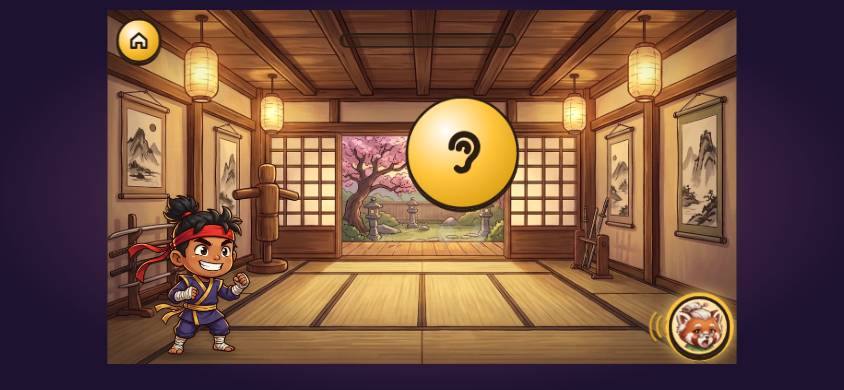 

*Transcript: w2-1 on production (in the last column, "map" is production's Home button, which was labelled "map"), starting 0:04.8 into the journey.*

| t (s) | Sensei says (verbatim; [sounds] and ["words"] are spliced clips) | line ids | words | talk (s) | child | on screen as the turn starts |
|---|---|---|---|---|---|---|
| 0.0 | | | | | taps level w2-1 | |
| 0.4 | This is the dojo. A dojo is where ninjas practise! Let's practise some sounds. Listen... [/b/] [/b/] And this is how we spell it. [/b/] Tap it, and say it with me! | dojo_hello, listen, audit_spell_it, dojo_tap_say | 32 | 10.6 | | learn; cards/buttons: map, Hear the sound |
| 11.9 | | | | | taps b | |
| 13.8 | [/b/] [/b/] Fantastic! Listen... [/k/] [/k/] And this is how we spell it. [/k/] Tap it, and say it with me! | yay_3, listen, audit_spell_it, dojo_tap_say | 21 | 6.7 | | learn; cards/buttons: map, b |
| 22.0 | | | | | taps c | |
| 23.4 | [/k/] [/k/] Super! Listen... [/g/] [/g/] And this is how we spell it. [/g/] Tap it, and say it with me! | yay_2, listen, audit_spell_it, dojo_tap_say | 21 | 6.1 | | learn; cards/buttons: map, c |
| 30.6 | | | | | taps g | |
| 32.0 | [/g/] [/g/] Smashing! Listen... [/h/] [/h/] And this is how we spell it. [/h/] Tap it, and say it with me! | yay_9, listen, audit_spell_it, dojo_tap_say | 21 | 6.7 | | learn; cards/buttons: map, g |
| 39.5 | | | | | taps h | |
| 41.2 | [/h/] [/h/] Amazing! Can you find... [/b/] Tap the speaker to hear the sound again. ✂ | yay_5, dojo_find, tut_speaker | 15 | 5.5 | | learn; cards/buttons: map, h |
| 45.9 | | | | | taps b | |
| 45.9 | [/b/] Super! Can you find... [/k/] Tap the speaker to hear the sound again. ✂ | yay_2, dojo_find, tut_speaker | 14 | 4.4 | | find; cards/buttons: map, b, g, c, a, Hear it again |
| 49.8 | | | | | taps a | |
| 49.9 | That's... [/a/] Listen... [/k/] | thats, listen | 4 | 1.7 | | find; cards/buttons: map, a, p, c, o, Hear it again |
| 53.3 | | | | | taps c | |
| 53.3 | [/k/] Ace! Can you find... [/g/] Tap the speaker to hear the sound again. ✂ | yay_10, dojo_find, tut_speaker | 14 | 4.4 | | find; cards/buttons: map, a, p, c, o, Hear it again |
| 57.4 | | | | | taps g | |
| 57.4 | [/g/] Smashing! Can you find... [/h/] Tap the speaker to hear the sound again. ✂ | yay_9, dojo_find, tut_speaker | 14 | 4.6 | | find; cards/buttons: map, t, g, b, s, Hear it again |
| 61.4 | | | | | taps h | |
| 61.4 | [/h/] Amazing! Now let's make words! First, listen to the word. Then tap its sounds, one at a time. ✂ | yay_5, dojo_build | 19 | 7.8 | | find; cards/buttons: map, h, s, m, o, Hear it again |
| 65.9 | | | | | taps a | |
| 66.2 | Listen again... What do you hear here? ["cab"] | listen_here | 8 | 2.8 | | build; cards/buttons: map, Hear the word, a, o, c, p, b |
| 69.4 | | | | | taps c | |
| 69.4 | [/k/] |  | 1 | 0.2 | |  |
| 72.5 | | | | | taps a | |
| 72.5 | [/a/] |  | 1 | 0.3 | |  |
| 75.5 | | | | | taps b | |
| 75.5 | [/b/] Ninjas read this way! [/k/] [/a/] [/b/] ["cab"] Well done! Look, a gem! Each gem holds a way to spell a sound. When you get words right, it fills up. ["hob"] | fm_l2_way, yay_4, audit_gem_first | 32 | 12.1 | | build; cards/buttons: map, Hear the word, a, o, c, p, b |
| 92.1 | | | | | taps p | |
| 92.6 | Hmm, listen again. What sound comes next? ✂ | audit_listen_next | 7 | 3.7 | | build; cards/buttons: map, Hear the word, p, o, b, h, a |
| 95.7 | | | | | taps h | |
| 95.7 | [/h/] |  | 1 | 0.3 | |  |
| 98.7 | | | | | taps o | |
| 99.1 | [/o/] |  | 1 | 0.5 | |  |
| 101.7 | | | | | taps b | |
| 101.7 | [/b/] [/h/] [/o/] [/b/] ["hob"] Smashing! ["cap"] | yay_9 | 7 | 3.3 | | build; cards/buttons: map, Hear the word |
| 108.6 | | | | | taps a | |
| 108.6 | Listen again... What do you hear here? ["cap"] | listen_here | 8 | 2.8 | | build; cards/buttons: map, Hear the word, a, o, c, b, p |
| 112.1 | | | | | taps c | |
| 112.1 | [/k/] |  | 1 | 0.2 | |  |

*(20 more rows: the full table is in [current-transcript.md](current-transcript.md).)*

- **0.4 s, "This is the dojo. A dojo is where ninjas practise! Let's practise some sounds."** It is said once, over the ear. It frames the room, not the game: nothing says what will happen or what the child will do.
- **6.1 s, "Listen…"**, a one-word clip, then the pure sound twice ([/b/] [/b/]).
  - The ear was the only thing on screen. Nothing explains it, and nothing says it is the sound Sensei is saying or that tapping it says the sound again.
- **Then the ninja casts, and the ear turns into the letter b.** "And this is how we spell it." [/b/] "Tap it, and say it with me!"
- **The next three sounds each start cold:** "Listen…" [/k/] [/k/], "Listen…" [/g/] [/g/], "Listen…" [/h/] [/h/], each with the ear back in the middle.
  - For the second to fourth sounds, "it just starts with 'Listen!' and this ear appears", Jonas's words.
  - How a Dojo level opens depends on the ledger (`narrative.ts` `SPACING`). The welcome is told twice (w1-4's "This is our dojo…" counts as the first, w2-1's `dojo_hello` as the second). Then "Back to the dojo! Let's learn some new sounds." comes three times (`short`: [0, 1, 1]).
  - After that, by the code, from w3-6 on this path (the fifth Dojo Learn level: w2-1, w2-4, w3-1, w3-4, w3-6), **every Dojo level opens straight on "Listen…"**. This is read from the code, not played.
- **Production had no nav row** (no Next, and no speaker during Learn; Find had its own "Hear it again" button), so during the new sound nothing on screen offers to say it again, except the ear itself, which nobody says can be tapped.

**What today's source shows (the snapshot).** The same words; the ear has become the sound's petal (`SoundBadge`, 200 px):

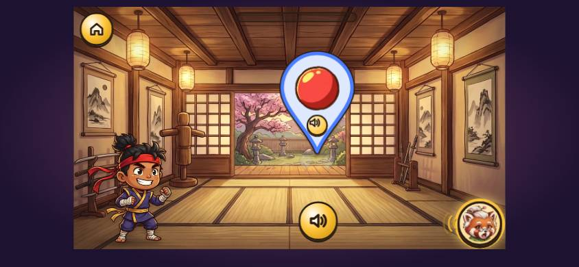 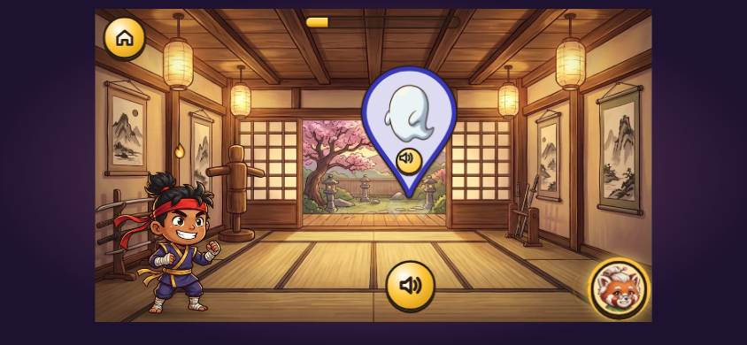

*Transcript: w2-1 in the snapshot, starting 49:52.0 into the journey.*

| t (s) | Sensei says (verbatim; [sounds] and ["words"] are spliced clips) | line ids | words | talk (s) | child | on screen as the turn starts |
|---|---|---|---|---|---|---|
| 0.0 | | | | | taps level w2-1 | |
| 0.0 | This is the dojo. A dojo is where ninjas practise! Let's practise some sounds. Listen... [/b/] [/b/] And this is how we spell it. [/b/] Tap it, and say it with me! | dojo_hello, listen, audit_spell_it, dojo_tap_say | 32 | 10.6 | | learn; nav: speaker |
| 11.5 | | | | | taps b | |
| 13.3 | [/b/] [/b/] Well done! Listen... [/k/] [/k/] And this is how we spell it. [/k/] Tap it, and say it with me! | yay_4, listen, audit_spell_it, dojo_tap_say | 22 | 6.7 | | learn; cards/buttons: b; nav: speaker |
| 20.8 | | | | | taps c | |
| 22.2 | [/k/] [/k/] Amazing! Listen... [/g/] [/g/] And this is how we spell it. [/g/] Tap it, and say it with me! | yay_5, listen, audit_spell_it, dojo_tap_say | 21 | 6.6 | | learn; cards/buttons: c; nav: speaker |
| 30.0 | | | | | taps g | |
| 31.5 | [/g/] [/g/] Smashing! Listen... [/h/] [/h/] And this is how we spell it. [/h/] Tap it, and say it with me! | yay_9, listen, audit_spell_it, dojo_tap_say | 21 | 6.7 | | learn; cards/buttons: g; nav: speaker |
| 39.2 | | | | | taps h | |
| 40.8 | [/h/] [/h/] Ace! Can you find... [/b/] Tap the speaker to hear the sound again. ✂ | yay_10, dojo_find, tut_speaker | 15 | 5.0 | | learn; cards/buttons: h; nav: speaker |
| 45.0 | | | | | taps b | |
| 45.0 | [/b/] Well done! Can you find... [/k/] Tap the speaker to hear the sound again. ✂ | yay_4, dojo_find, tut_speaker | 15 | 4.9 | | find; cards/buttons: h, i, b, o; nav: speaker, petal /b/ |
| 49.2 | | | | | taps m | |
| 49.2 | That's... [/m/] Listen... [/k/] | thats, listen | 4 | 2.1 | | find; cards/buttons: m, c, g, s; nav: speaker, petal /k/ |
| 52.7 | | | | | taps c | |
| 52.7 | [/k/] Fantastic! Can you find... [/g/] Tap the speaker to hear the sound again. ✂ | yay_3, dojo_find, tut_speaker | 14 | 4.8 | | find; cards/buttons: m, c, g, s; nav: speaker, petal /k/ |
| 57.0 | | | | | taps g | |
| 57.0 | [/g/] Smashing! Can you find... [/h/] Tap the speaker to hear the sound again. ✂ | yay_9, dojo_find, tut_speaker | 14 | 4.6 | | find; cards/buttons: a, m, c, g; nav: speaker, petal /g/ |
| 60.9 | | | | | taps h | |
| 60.9 | [/h/] Fantastic! Now let's make words! First, listen to the word. Then tap its sounds, one at a time. ✂ | yay_3, dojo_build | 19 | 7.7 | | find; cards/buttons: h, p, n, c; nav: speaker, petal /h/ |
| 65.4 | | | | | taps p | |
| 65.4 | Listen again... What do you hear here? ["hip"] | listen_here | 8 | 2.7 | | build; cards/buttons: Hear the word, h, p, i, s, b; nav: speaker |
| 68.9 | | | | | taps h | |
| 68.9 | [/h/] |  | 1 | 0.3 | |  |
| 71.9 | | | | | taps i | |
| 71.9 | [/i/] |  | 1 | 0.2 | |  |
| 74.9 | | | | | taps p | |
| 74.9 | [/p/] Ninjas read this way! [/h/] [/i/] [/p/] ["hip"] Ace! ["bin"] | fm_l2_way, yay_10 | 11 | 4.0 | | build; cards/buttons: Hear the word, h, p, i, s, b; nav: speaker |
| 82.5 | | | | | taps m | |
| 82.5 | Let's listen to the word again, slowly. ["bin", slowly] | audit_listen_slowly | 8 | 4.0 | | build; cards/buttons: m, b, h, n, i; nav: speaker |
| 86.0 | | | | | taps b | |
| 86.0 | [/b/] |  | 1 | 0.3 | |  |
| 89.0 | | | | | taps i | |
| 89.0 | [/i/] |  | 1 | 0.2 | |  |
| 92.1 | | | | | taps n | |
| 92.1 | [/n/] [/b/] [/i/] [/n/] ["bin"] Fantastic! ["tip"] | yay_3 | 7 | 3.9 | | build; nav: speaker |
| 99.3 | | | | | taps i | |
| 99.3 | Hmm, listen again. What sound comes next? ✂ | audit_listen_next | 7 | 3.7 | | build; cards/buttons: Hear the word, i, t, g, p, b; nav: speaker |
| 102.8 | | | | | taps t | |
| 102.8 | [/t/] |  | 1 | 0.2 | |  |
| 105.8 | | | | | taps i | |
| 105.8 | [/i/] |  | 1 | 0.2 | |  |
| 108.8 | | | | | taps p | |
| 108.8 | [/p/] [/t/] [/i/] [/p/] ["tip"] Super! ["cab"] | yay_2 | 7 | 2.6 | | build; cards/buttons: Hear the word; nav: speaker |
| 114.9 | | | | | taps p | |
| 114.9 | Listen again... What do you hear here? ["cab"] | listen_here | 8 | 2.8 | | build; cards/buttons: p, o, c, a, b; nav: speaker |
| 118.4 | | | | | taps c | |
| 118.4 | [/k/] |  | 1 | 0.2 | |  |
| 121.4 | | | | | taps a | |
| 121.4 | [/a/] |  | 1 | 0.3 | |  |
| 124.3 | | | | | taps b | |
| 124.3 | [/b/] [/k/] [/a/] [/b/] ["cab"] Fantastic! ["big"] | yay_3 | 7 | 3.2 | | build; nav: speaker |
| 128.7 | | | | | taps b | |
| 128.7 | [/b/] |  | 1 | 0.3 | |  |
| 131.6 | | | | | taps b | |
| 131.6 | Keep going, ninja! Hmm, listen again. What sound comes next? ✂ | streak_lost, audit_listen_next | 10 | 5.0 | | build; cards/buttons: Hear the word, b, g, p, c, i; nav: speaker |
| 135.1 | | | | | taps i | |
| 135.1 | [/i/] |  | 1 | 0.2 | |  |
| 138.1 | | | | | taps g | |
| 138.1 | [/g/] [/b/] [/i/] [/g/] ["big"] Super! Well done! You practised so hard! | yay_2, dojo_done | 12 | 5.3 | | build; cards/buttons: Hear the word; nav: speaker |

**Diagnosis against Jonas's feedback:**

| | |
|---|---|
| Terse or telegraphic | "Listen…" (1 word) opens 4 of the 4 new sounds; "Can you find…" + sound ×4; praise one word ("Ace!", "Smashing!") after each. 45 lines at a mean of 9.1 words per turn, and 13 of them praise. |
| Bare commands | "Listen…" ×5 (plus two "Listen again… What do you hear here?"), "Tap it, and say it with me!" ×4. |
| An icon with no explanation | Production: a big ear, never named ("This ear means *listen*: when I say a sound, you can tap it to hear it again"). Snapshot: a petal with a picture (a ball, an anchor, a ghost, a speech bubble), never named as the sound's picture here. The ghost for /g/ reads as an ear. |
| No framing of the game | "Let's practise some sounds" is all. Nothing says "I'll say a new sound, then I'll show you how we write it, then you tap it and say it with me." |
| No "I'll show you, then you" | Sensei says the sound and shows the letter, then "Tap it, and say it with me!", but there is no "first I'll…, then you'll…". From the second sound on, the child can only guess that the pattern repeats. |
| No readiness check | None. |
| Demo without narration | The ninja's cast (the ear/petal steps aside and the letter appears) happens in silence between "Listen… /b/ /b/" and "And this is how we spell it." No "Watch: I'm going to write that sound." |
| No reason given | Nothing says why we listen first, what "how we spell it" means, or that these are the letters grown-ups use for the sound. |
| The hand-over | Clear in Learn ("Tap it, and say it with me!"). In Find, the tip "Tap the speaker to hear the sound again." is cut off by the child's answer 4 times out of 4 (✂). In Build, "Now let's make words! First, listen to the word. Then tap its sounds, one at a time." is cut off after 2.8 s by the child's tap. |

**Code:**
- `src/scenes/Dojo.tsx` `Learn`: the welcome, l.440–445 (`dojo_hello` while `isDue("dojo:welcome", "twice")`, else `audit_dojo_back` while `isDue("dojo:back", "short")`, else nothing).
- The intro, l.445: `intro.push({ line: "listen" }, { gap: 150 }, { sound: p }, { gap: 500 }, { sound: p }, { gap: 400 })`.
- The reveal, l.465: `audit_spell_it` or `audit_hear_see`, then `about`, then `dojo_tap_say`. Help and idle say `listen` + sound again (l.498, l.492).
- The ear in production: backup 0b50f5f `Dojo.tsx` l.490–502, `<button className="btn-round dj-ear …" style={{ width: 230, height: 230 }}><Icon.ear /></button>`. In the snapshot it is `<SoundBadge p={p} size={BADGE} …>`, l.536.
- Find: `Find` `prompt()` l.575–596 (`dojo_find`, then `tut_speaker` after the question).
- Build: `Build` `prompt()` l.737 (`dojo_build`).
- The line texts: `src/content/lines.ts` l.55 `listen` "Listen...", l.71 `dojo_hello`, l.72 `dojo_tap_say`, l.459 `audit_spell_it`.

---

## 4. Every moment, in order

Each section gives:
- **What the child sees:** from the stills. The table's last column is the DOM state at the turn's first line: the scene/beat, what can be tapped, and the nav row (Next dim or ready, the speaker, Show me again, the petal, Back).
- **The transcript:** one row per Sensei turn. Spliced clips are in brackets: [/s/] is a pure sound, ["sun", slowly] a stretched word, ["sun", first sound held] the held onset. ✂ marks a clip cut off by the next one. Times are seconds from the start of the moment.
- **The diagnosis** against the nine points in the brief.
- **The code** that composes the lines.

### 4.1 Intro film and "Choose your ninja" (0:00–1:12)

The film is storytelling, not teaching, and reads well. Its 9 lines run at 11 words per turn, each shot held on Next. Sensei introduces herself once, at the end: "I am Sensei Maple. I will train you. Now, choose your ninja!" Then "Great choice! Let's rescue those sounds!" follows. Nothing says what "training" or "rescuing sounds" will involve. (In this run the child waited for Sensei to finish before choosing. An eager tap cuts "I am Sensei Maple…", as SCRIPT_STYLE §1.1 row 6 already records.)

*Transcript: choose, starting 1:06.5 into the journey.*

| t (s) | Sensei says (verbatim; [sounds] and ["words"] are spliced clips) | line ids | words | talk (s) | child | on screen as the turn starts |
|---|---|---|---|---|---|---|
| 0.0 | | | | | taps kai | |
| 0.0 | Great choice! Let's rescue those sounds! | chose | 6 | 2.4 | | choose; cards/buttons: kai, suki; nav: Next (dim), speaker |
| 5.3 | | | | | taps Next (next) | |

Code: `src/App.tsx` `Choose` l.427–429 (`intro_8`, `chose`); `src/scenes/IntroFilm.tsx`.

### 4.2 The opt-in: "Do you go to big school yet?" (1:12)

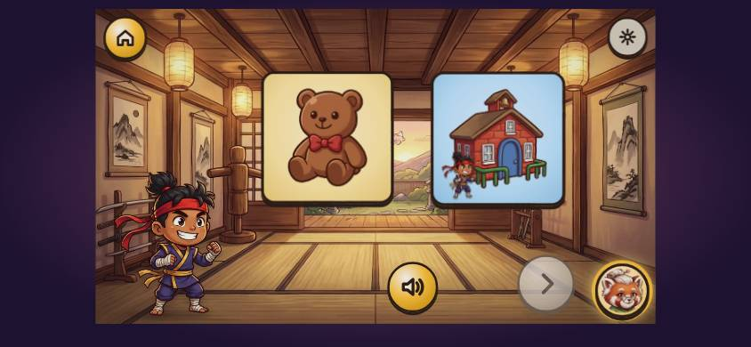

**What the child sees:**
- A teddy card and a school card (with the child's ninja at the gate), each spotlit in turn as it is named.
- A grey (dim) Next arrow and a speaker.
- The gear, top right.

*Transcript: opt-in, starting 1:12.1 into the journey.*

| t (s) | Sensei says (verbatim; [sounds] and ["words"] are spliced clips) | line ids | words | talk (s) | child | on screen as the turn starts |
|---|---|---|---|---|---|---|
| 0.1 | Do you go to big school yet? Not yet? Tap the teddy! Yes? Tap the school! | fm_opt_q1, fm_opt_notyet, fm_opt_yes | 16 | 6.2 | | optin; cards/buttons: teddy, school; nav: Next (dim), speaker |
| 9.9 | | | | | taps teddy | |
| 9.9 | Not yet! | fm_opt_echo_notyet | 2 | 1.2 | | optin; cards/buttons: teddy, school; nav: Next, speaker |
| 12.8 | | | | | taps Next (next) | |
| 13.2 | Then I've set up some listening games, just for you! Your grown-ups can change this later, in the grown-ups' settings. | fm_opt_ok_notyet, fm_opt_grownups | 22 | 6.1 | | optin; cards/buttons: teddy; nav: Next (dim), speaker |
| 22.2 | | | | | taps Next (next) | |
| 22.2 | Ninja training! First, tap the big gong! | tut_1 | 7 | 2.9 | | tut-gong; nav: speaker |

**Diagnosis:**
- **No hello and no reason.** After "Great choice! Let's rescue those sounds!", the next thing Sensei says is a question about school, with no "Before we start, I want to find the right games for you."
- **Telegraphic.** "Not yet? Tap the teddy!" "Yes? Tap the school!" "Not yet!" are 5, 4 and 2 words: the answers are given before the child has worked out the question.
- **Said to the grown-up, heard by the child.** "Your grown-ups can change this later, in the grown-ups' settings." is 12 words for the grown-up, said to the child.
- **The Next arrow** first appears, dim, here. Nothing says what it does or that the child must tap it. The learner tapped it; a 3-year-old may not.

**Code:** `src/scenes/OptIn.tsx`:
- The A choices, l.29–30 (`fm_opt_notyet`, `fm_opt_yes`, echoes).
- `question()`, l.76 (`fm_opt_q1`).
- `CONFIRM` l.38 and `confirm()` l.222–223 (`fm_opt_ok_notyet` + `fm_opt_grownups`).

### 4.3 The Dojo welcome: gong, Help, speaker (1:34)

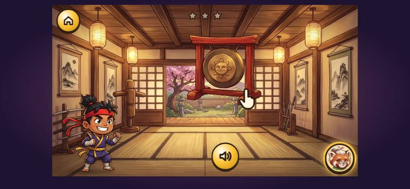 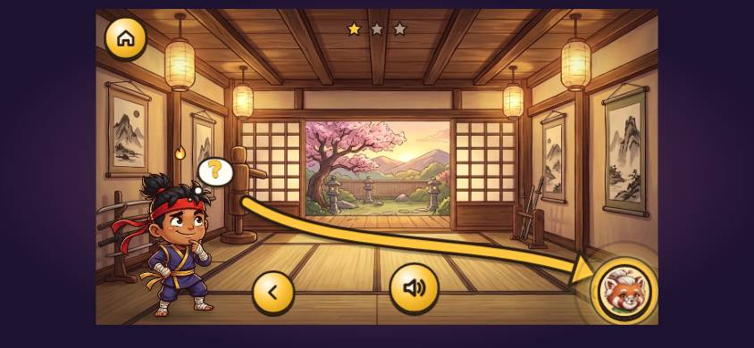 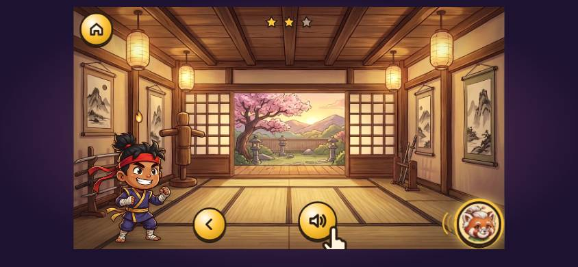

**What the child sees:**
- A gong hanging in the dojo, with a pointing hand on it.
- Three grey stars at the top, never explained.
- Then a big yellow arrow sweeping from the ninja to Sensei in the corner.
- Then the pointing hand on the speaker.

*Transcript: dojo welcome, starting 1:34.6 into the journey.*

| t (s) | Sensei says (verbatim; [sounds] and ["words"] are spliced clips) | line ids | words | talk (s) | child | on screen as the turn starts |
|---|---|---|---|---|---|---|
| 5.3 | | | | | taps gong | |
| 5.7 | Stuck? Tap me, down here in the corner. Try it now! ✂ | fm_help_short | 11 | 3.9 | | tut-help; nav: speaker, Back |
| 8.2 | | | | | taps Help | |
| 8.2 | That's it! I'm always here to help. And when you tap the speaker, I'll say it again! | fm_help_ok, fm_speaker | 17 | 5.2 | | tut-help; nav: speaker, Back |
| 16.1 | | | | | taps Hear it again (again) | |
| 16.1 | And when you tap the speaker, I'll say it again! | fm_speaker | 10 | 2.6 | | tut-speaker; nav: speaker, Back |

**Diagnosis:**
- **"Ninja training! First, tap the big gong!"** is a bare command with a label. It doesn't say what training is, or that the gong starts it.
- **"Stuck? Tap me, down here in the corner. Try it now!"** is the best line of the first minutes. It says what Help is for, where it is and when to use it, and it hands the turn over ("Try it now!").
- **"And when you tap the speaker, I'll say it again!"**
  - It starts with "And", with no first half.
  - The speaker has nothing to say again yet, so tapping it plays this same instruction (said twice in 5 s).
  - SCRIPT_FIXES C19 has the fix, not yet applied.
- **No bridge into the first game.** There is no "Now let's play our first game" and no "Now I'll teach you a listening game". The next thing the child hears is W1's "Ninja ears on!".

**Code:** `src/scenes/Training.tsx`:
- `useEffect` l.76 and `play()` l.106 (`tut_1`).
- `play()` l.111 (`fm_help_short`); `advance()` l.144 (`fm_help_ok`).
- `play()` l.113 and `tapSpeaker()` l.175 (`fm_speaker`).

### 4.4 W1 Ninja Ears: the first game (1:53, 97.8 s)

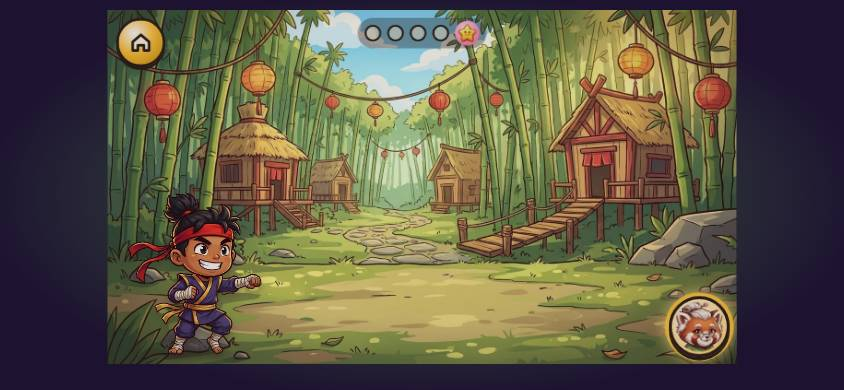 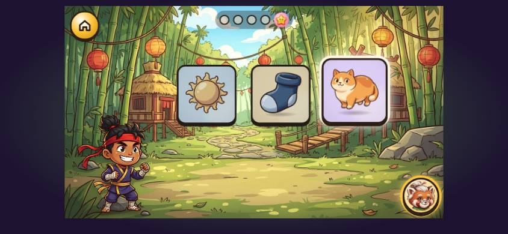 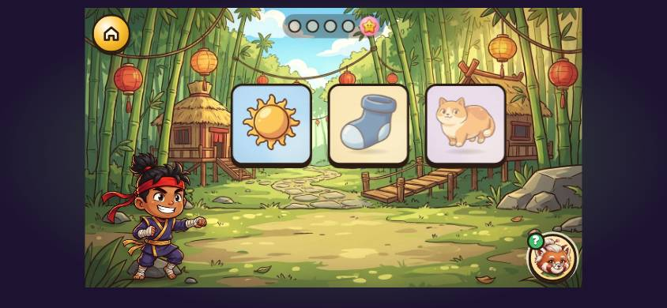 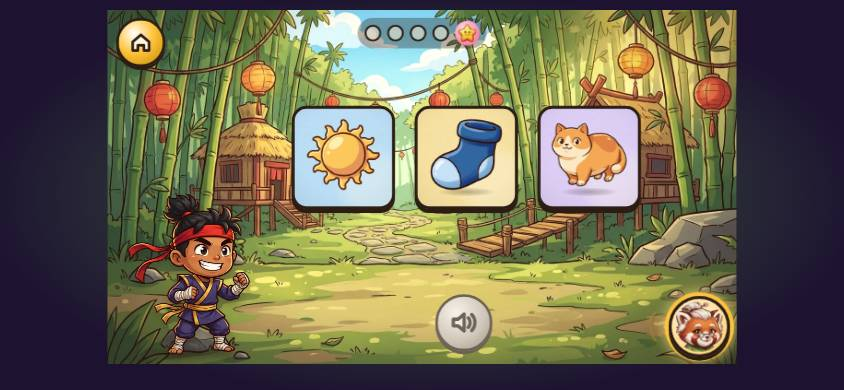
 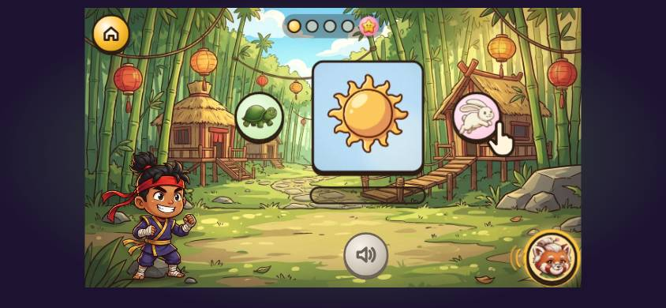 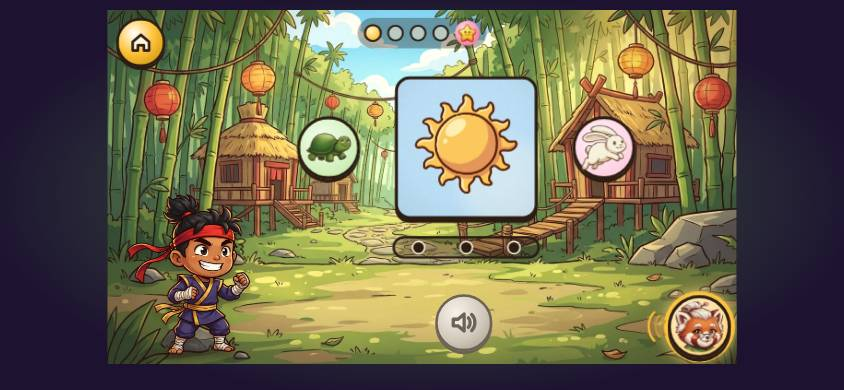 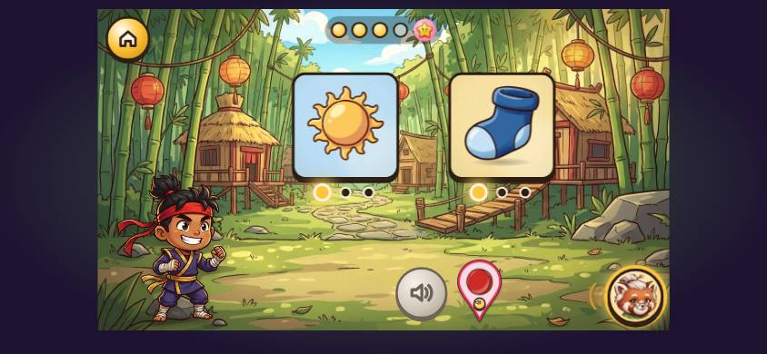

**What the child sees:**
- **0.5 s,** "Ninja ears on!": the empty Bamboo Village, four beads and a sticker at the top. There are no cards yet and no ears anywhere.
- **Naming:** the three cards drop in and are spotlit as each is named.
- **The tap demo:**
  - On "Let me show you!" nothing changes.
  - On "Tap the sun!" the paw is not yet visible a full game-second in (the still), so for a moment the screen looks exactly like the child's own turn.
  - The sun is struck (a star burst) during "Now you try!".
  - The speaker pops in with "Tap the sock!".
- **Fast and slow:**
  - "Watch me first!" is said over an **empty stage**: the cards have slid away and the sun, tortoise and rabbit haven't arrived yet.
  - Then the sun appears big, with a green tortoise on the left and a pink rabbit on the right, and the paw taps the rabbit. Neither animal is ever introduced ("This is my rabbit button: it says a word fast").
  - Three grey dots sit on a bar under the card.
- **The notice beat:**
  - The ninja cups its hand behind its ear.
  - The first dot under sun and sock turns gold.
  - On "…the same sound… /s/" a red teardrop with a tiny picture pops into the nav row: the **sound petal**, its first appearance. It is not named until Reward 2, 2:45 later.
  - The beat ends on a **held Next** (the green arrow), with no line saying so. The learner tapped it at +60.6 s.
- **Tap-all:**
  - Five cards in two rows, with dashed **pockets** on the right that are never explained.
  - The paw finds the sun.
  - On each find, a mini-card flies to a pocket.

*Transcript: W1 Ninja Ears, starting 1:53.5 into the journey.*

| t (s) | Sensei says (verbatim; [sounds] and ["words"] are spliced clips) | line ids | words | talk (s) | child | on screen as the turn starts |
|---|---|---|---|---|---|---|
| 0.5 | Ninja ears on! Let's listen to some words. This is the sun. This is a sock. This is a cat. Let me show you! Tap the sun! Now you try! Tap the sock! | fm_l1_hello, fm_name_sun, fm_name_sock, fm_name_cat, fm_show_me, fm_tap_sun, fm_you_try, fm_tap_sock | 33 | 10.7 | | warmup/hello |
| 15.3 | | | | | taps cat | |
| 15.3 | ["cat"] Listen again. Tap the sock! | listen_again, fm_tap_sock | 6 | 2.5 | | warmup/tap; cards/buttons: sun, sock, cat; nav: speaker |
| 18.8 | | | | | taps sock | |
| 19.1 | ["sock"] Watch me first! I can say a word fast. Sun! Or I can say it slowly... ["sun", slowly] Fast or slow, it's the same word. Sun! Slowly, I hear its sounds. Words are made of sounds! Your turn! Tap the tortoise, and say it slowly with me. | fm_show_me_2, fm_fast_sun, fm_slow, fm_same_word, fm_hear_sounds_short, fm_tap_tortoise | 47 | 19.5 | | warmup/tap; cards/buttons: sun, sock, cat; nav: speaker |
| 41.7 | | | | | taps tortoise | |
| 41.7 | ["sun", slowly] Listen to the very first sound. ["sun", first sound held] ["sock", first sound held] Did you notice? Sun and sock start with the same sound... [/s/] Say that sound with me! [/s/] | fm_first_listen, fm_notice_sun_sock, t_everyone_say | 27 | 11.7 | | warmup/notice; cards/buttons: sun, sock; nav: speaker |
| 60.6 | | | | | taps Next (next) | |
| 61.0 | This is a sausage. This is the moon. Let me show you! Tap all the pictures that start with... [/s/] ["sun", first sound held] Your turn! | fm_name_sausage, fm_name_moon, fm_show_me, fm_tap_all_start, fm_you_try_2 | 23 | 8.5 | | warmup/tapall; cards/buttons: sun, sausage, moon, sock, cat; nav: speaker |
| 74.4 | | | | | taps sock | |
| 74.7 | ["sock", first sound held] |  | 1 | 0.0 | |  |
| 78.6 | | | | | taps cat | |
| 78.6 | ["cat", slowly] Cat starts with a different sound. Listen again. Tap all the pictures that start with... [/s/] | fm_diff_cat, listen_again, fm_tap_all_start | 17 | 8.2 | | warmup/tapall; cards/buttons: sun, sausage, moon, sock, cat; nav: speaker, petal /s/ |
| 87.9 | | | | | taps sausage | |
| 88.2 | ["sausage", first sound held] You found them both! They both start with... [/s/] You can hear the sounds in words. Brilliant listening! Look! Your pictures are turning into stickers! | fm_found_both, fm_l1_done, fm_rw_look | 26 | 10.6 | | warmup/tapall; cards/buttons: sun, sausage, moon, sock, cat; nav: speaker, petal /s/ |

**Diagnosis:**

| | Evidence |
|---|---|
| Terse or telegraphic | 15 of 30 lines have four words or fewer, and none of them is praise: "Let me show you!", "Tap the sun!", "Now you try!", "Tap the sock!", "Your turn!", "Listen again." ×2… The naming is four words a picture. The longest turn (47 words, 19.5 s) is the fast/slow show: long, but a chain of short statements. |
| Bare commands | 8: "Tap the sun!", "Tap the sock!" ×2, "Watch me first!", "Listen again." ×2, "Listen to the very first sound.", "Say that sound with me!". |
| Icons with no explanation | The tortoise and rabbit; the ribbon and dots; the lesson beads; the petal (unexplained for 2:45); the pockets; the green Next arrow at the notice hold. "Ninja ears on!" promises ears that never appear (the ninja's ear-cup comes 44 s later). |
| No framing | "Ninja ears on! Let's listen to some words." is all. Nothing says "In this game I'll say a word and you find its picture" or "We're going to play with words: fast, slow, and the sounds inside them." |
| No "I'll show you, then you" | Only the labels: "Let me show you!" → "Now you try!", "Watch me first!" → "Your turn!". The demo's own line is the child's instruction ("Tap the sun!"). |
| No readiness check | None. The child is handed the tortoise without being asked whether they're ready to say it slowly. |
| Demos silent or unnarrated | The tap demo is narrated only as a command ("Tap the sun!"), not as what Sensei is doing ("I'm tapping the sun. The sun!"). In the tap-all demo the paw finds the sun in silence apart from "sssun". The fast/slow show is well narrated ("I can say a word fast… Or I can say it slowly…"). |
| No reason given | "Words are made of sounds!" and "Did you notice? Sun and sock start with the same sound…" are facts with no "so what". Nothing says why we listen for the first sound. |
| The hand-over is unclear | "Tap the sun!" (the demo) and "Tap the sock!" (the child) are the same sentence shape 3 s apart, and the only difference is "Let me show you!" / "Now you try!". Tap-all is the same: the instruction "Tap all the pictures that start with… /s/" comes inside the demo, and the child's cue is "Your turn!" (2 words). |

**Code:**
- **The script:** `src/content/warmups.ts` W1 beats, l.86–99.
- **`src/scenes/Warmup.tsx`:**

| Beat or line | Where |
|---|---|
| `run.hello` (`fm_l1_hello`) | l.489 |
| `nameCards` (`fm_name_<w>` via `nameLine()`) | l.430 |
| `run.tap`, with the demo `show()` saying `demo.prompt` `fm_tap_sun` as the paw moves | l.500–569 (the demo at l.504–521) |
| `showMe()` / `youTry()` (`showLine()` / `tryLine()` in warmups.ts l.269–270, alternating `fm_show_me`/`fm_show_me_2` and `fm_you_try`/`fm_you_try_2`) | l.441–442 |
| `run.fastslow` + `fastSlowShow` (`fm_fast_sun`, `fm_slow`, `fm_same_word`, `fm_hear_sounds_short`, `fm_tap_tortoise`) | l.571–622, l.1343–1402 |
| `run.notice` + `noticeShow` (`fm_first_listen`, `fm_notice_sun_sock`, `t_everyone_say`; the ear-cup `ninja.pose("listen")` at l.1408) | l.691–706, l.1404–1433 |
| `run.tapall` (`fm_tap_all_start`, `fm_diff_<w>`, `listen_again`, `fm_found_both`) | l.708–870 |

### 4.5 Reward 1: the Sticker Book (3:31)

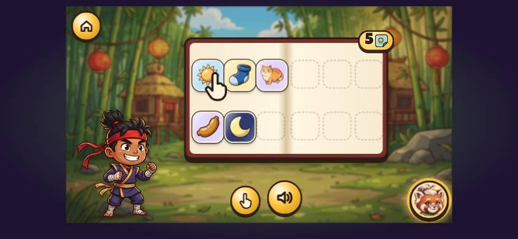

*Transcript: Reward 1, the Sticker Book arrives, starting 3:31.3 into the journey.*

| t (s) | Sensei says (verbatim; [sounds] and ["words"] are spliced clips) | line ids | words | talk (s) | child | on screen as the turn starts |
|---|---|---|---|---|---|---|
| 3.6 | This is your Sticker Book! Sun, sock, cat, sausage and moon! Every picture you play with becomes a sticker! Tap a sticker! | fm_rw_book, fm_rw1_list, fm_rw_every, fm_rw_tap | 22 | 10.0 | | stickers |
| 15.6 | | | | | taps sticker sun | |
| 15.6 | ["sun"] ["sun", slowly] Ready for the next game? Tap the big arrow! | fm_rw_next | 11 | 5.9 | | stickers; nav: Next, speaker, Back |
| 22.9 | | | | | taps Next (next) | |

**Diagnosis:**
- **The warmest stretch of the first minutes,** because it narrates what is happening: "Look! Your pictures are turning into stickers!" "This is your Sticker Book!" "Every picture you play with becomes a sticker!".
- **"Tap a sticker!"** is a bare command. A paw button (Show me again) appears beside the speaker, unexplained.
- **"Ready for the next game? Tap the big arrow!"** is the journey's **only readiness check with a tap answer**.

**Code:** `src/scenes/Stickers.tsx`:
- `on()`: l.210 (`fm_rw_look`), l.223 (`fm_rw_book`), l.238 (`fm_rw_every`), l.251 (`fm_rw_tap`).
- `times()`: l.191 (`fm_rw_next`).

### 4.6 W2 Ninjas Read This Way (3:54, 69.8 s)

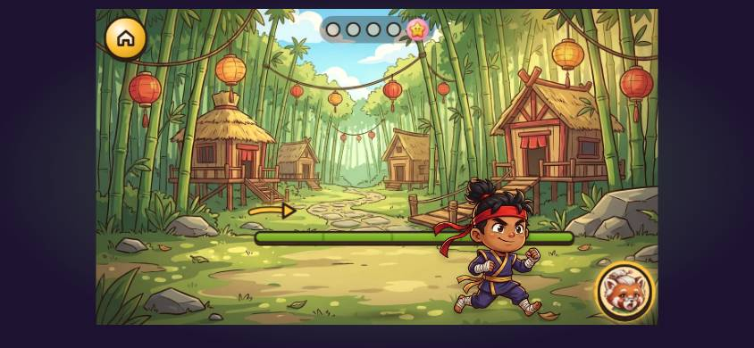 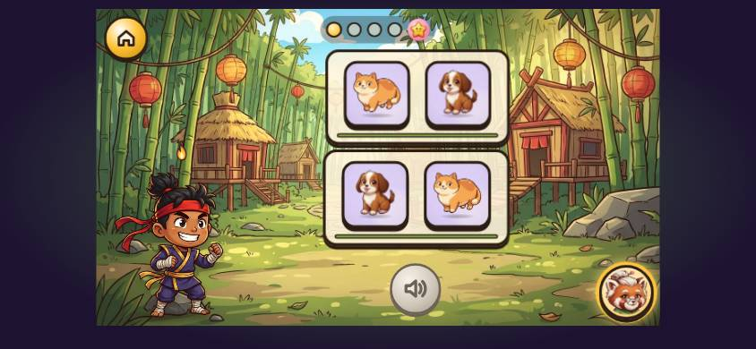 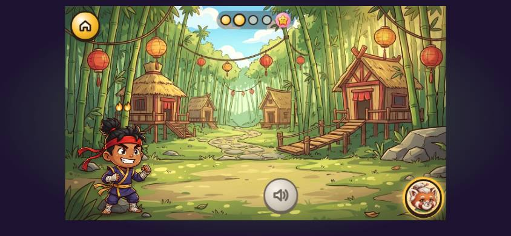

**What the child sees:**
- **The first line:** "Ninjas read this way!" is said over an empty bamboo rail with a small yellow arrow at its left end. The ninja runs along it.
- **Fish and dog:** they land on the rail and merge into a fish-dog.
- **"Which one did I read?"**
  - Two stacked rails of small cards (cat/dog, dog/cat) appear together with the question.
  - The time governor dropped **both** the swap beat (◇) and the which-did-I-read demo (`skipDemo`, the lesson being behind its clock). So this child meets a brand-new board with a question and no demonstration.
- **"Two little words can make one big word!"** is said over an empty stage.
- **The tortoise and rabbit** come back beside the sun and flower. The paw taps them.

*Transcript: W2 Ninjas Read This Way, starting 3:54.5 into the journey.*

| t (s) | Sensei says (verbatim; [sounds] and ["words"] are spliced clips) | line ids | words | talk (s) | child | on screen as the turn starts |
|---|---|---|---|---|---|---|
| 0.5 | Ninjas read this way! This is a fish. This is a dog. Let me show you! Fish... dog. Fish dog! Fish dog! Your turn! Tap them the ninja way. | fm_l2_way, fm_name_fish, fm_name_dog, fm_show_me, fm_read_fish_dog, fm_pair_fish_dog, fm_l2_turn | 29 | 10.2 | | warmup/rail |
| 18.3 | | | | | taps fish | |
| 18.3 | ["fish"] |  | 1 | 0.7 | |  |
| 21.9 | | | | | taps fish | |
| 25.4 | | | | | taps dog | |
| 25.4 | ["dog"] Fish dog! Listen. Cat... dog. Which one did I read? | fm_pair_fish_dog, fm_which_cat_dog | 11 | 6.2 | | warmup/rail; cards/buttons: fishdog; nav: speaker |
| 38.7 | | | | | taps rail 0 | |
| 39.2 | Cat dog! Two little words can make one big word! This is a flower. Say them slowly: sun... flower. Say them fast: sunflower! This is a star. Star... fish. Tap the rabbit to say them fast! | fm_pair_cat_dog, fm_l2_big_word, fm_name_flower, fm_sunflower, fm_name_star, fm_starfish_q | 36 | 16.5 | | warmup/which; cards/buttons: rail 0, rail 1; nav: speaker |
| 61.2 | | | | | taps rabbit | |
| 63.4 | Starfish! You read the pictures, just like a real reader! | fm_starfish, fm_l2_done | 10 | 4.6 | | warmup/compound; cards/buttons: starfish, tortoise, rabbit; nav: speaker |

**Diagnosis:**
- **No framing of what reading is.** "Ninjas read this way!" is a slogan, not an explanation of what we're about to do ("When we read, we always start here and go this way, like the ninja. Watch me read these pictures.").
- **Telegraphic:** 11 of 17 lines have four words or fewer. "Fish dog!" is said twice in a row (SCRIPT_FIXES C17.4, not yet applied).
- **"Your turn! Tap them the ninja way."** "The ninja way" is only as clear as the arrow.
- **"Listen. Cat… dog. Which one did I read?"**
  - A bare "Listen." opens it.
  - It is a new game with no demo (it was dropped) and no framing ("Now I'll read one of these rails, and you tap the one I read").
- **The hand-over at the starfish is clear:** "Star… fish. Tap the rabbit to say them fast!".

**Code:**
- The script: `src/content/warmups.ts` W2, l.129–143.
- `src/scenes/Warmup.tsx`: `run.rail` l.871–972, `run.which` l.976–1066, `run.compound` l.1067–1143.
- The governor's `skipDemo()` and `skipOptional()`: warmups.ts l.245–259.

### 4.7 Reward 2 and the first map (5:04)

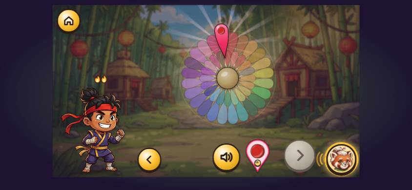

*Transcript: Reward 2 and the first map, starting 5:04.3 into the journey.*

| t (s) | Sensei says (verbatim; [sounds] and ["words"] are spliced clips) | line ids | words | talk (s) | child | on screen as the turn starts |
|---|---|---|---|---|---|---|
| 0.3 | Fish, dog, flower, sunflower, star and starfish! Ooh, a shiny sticker! Fish dog! Sun, sock, sausage and sunflower. They all start with... [/s/] | fm_rw2_list, fm_rw_shiny, fm_rw2_s | 23 | 16.9 | | stickers; cards/buttons: sticker sun(dim), sticker sock(dim), sticker cat(dim), sticker sausage(dim), sticker moon(dim); nav: Next (dim), speaker, petal /s/ |
| 21.1 | | | | | taps Next (next) | |
| 22.0 | You found your very first sound! Look, its petal is shining through the mist. This petal is for the sound... [/s/] | fm_rw2_petal, audit_petal_means | 21 | 8.3 | | stickers; nav: Next (dim), speaker, petal /s/, Back |
| 33.5 | | | | | taps Next (next) | |
| 34.3 | Your Sticker Book lives here, on the map! Tap the glowing stone to start your next adventure. | fm_rw2_map, map_hint | 17 | 5.8 | | map; cards/buttons: level w1-wu3, next world, Sticker Book, World Flower; nav: speaker |

**Diagnosis:**
- **38 s of show,** with three Next taps and no child turn.
- **The petal is first named here:** "You found your very first sound! Look, its petal is shining through the mist. This petal is for the sound… /s/". That comes 2:45 after it first appeared in W1's nav row.
- **The map.** The map arrives with "Your Sticker Book lives here, on the map! Tap the glowing stone…". The map itself (a grid of about 20 grey stones, a World Flower button, a Sticker Book button, a gear) is never introduced.

**Code:**
- `src/scenes/Stickers.tsx` `run()`: l.389 (`fm_rw_shiny`), l.443 (`fm_rw2_petal`), l.465 (`audit_petal_means`).
- `src/App.tsx` `WorldMap`: l.566 (`fm_rw2_map` + `map_hint`).

### 4.8 W3 to W6: the other warm-ups (5:46–13:16)

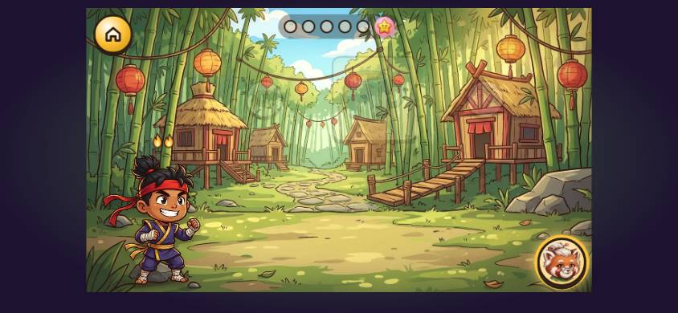 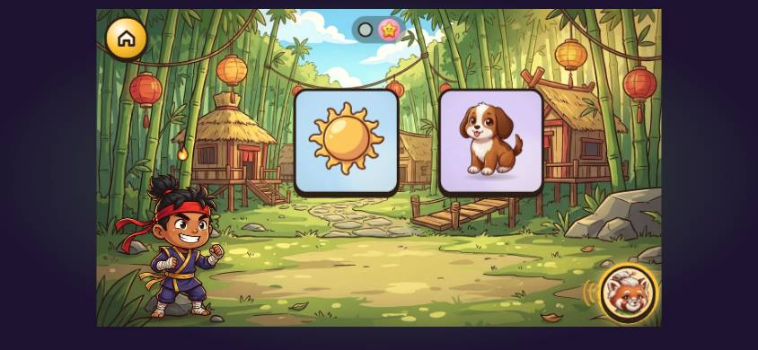 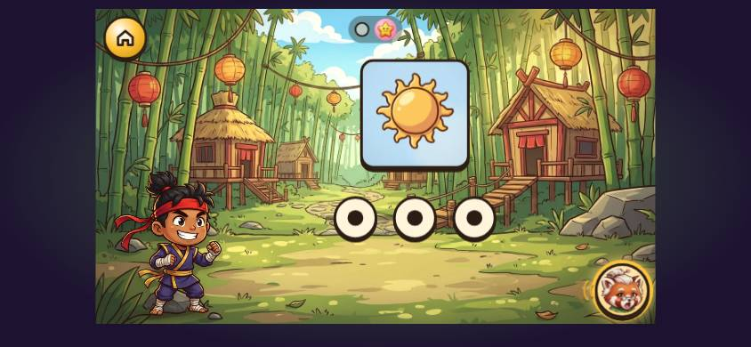

#### W3 (fast and slow on mug, "/a/ in it", /m/ first)

*Transcript: level w1-wu3, starting 5:46.2 into the journey.*

| t (s) | Sensei says (verbatim; [sounds] and ["words"] are spliced clips) | line ids | words | talk (s) | child | on screen as the turn starts |
|---|---|---|---|---|---|---|
| 0.3 | Ninja ears on! Let's listen to some words. This is a mug. Let me show you! ["mug"] Or I can say it slowly... ["mug", slowly] Your turn! Tap the tortoise, and say it slowly with me. | fm_l1_hello, fm_name_mug, fm_show_me, fm_slow, fm_tap_tortoise | 35 | 12.1 | | warmup/hello |
| 16.7 | | | | | taps rabbit | |
| 16.7 | ["mug"] Your turn! Tap the tortoise, and say it slowly with me. | fm_tap_tortoise | 12 | 4.4 | | warmup/fastslow; cards/buttons: mug, tortoise, rabbit; nav: speaker |
| 21.1 | | | | | taps tortoise | |
| 21.1 | ["mug", slowly] This is a van. This is a bag. Watch me first! Listen to my slow word... ["mug", slowly] Which picture is it? ["mug", slowly] ["mug"] Now you try! Here's another slow word... ["van", slowly] Which picture is it? | fm_name_van, fm_name_bag, fm_show_me_2, fm_slow_listen, fm_which_pic, fm_you_try, fm_slow_another, fm_which_pic | 36 | 17.5 | | warmup/slowpick; cards/buttons: mug, van, bag; nav: speaker |
| 45.7 | | | | | taps van | |
| 45.7 | ["van", slowly] ["van"] This is some jam. Let me show you! Tap all the pictures with this sound in them... [/a/] ["cat", slowly] Your turn! | fm_name_jam, fm_show_me, fm_tap_all_in, fm_you_try_2 | 23 | 9.8 | | warmup/tapall; cards/buttons: cat, bag, jam, van, sun, dog; nav: speaker |
| 60.1 | | | | | taps bag | |
| 60.4 | ["bag", slowly] |  | 1 | 0.7 | |  |
| 63.9 | | | | | taps dog | |
| 64.0 | ["dog", slowly] Dog doesn't have that sound in it. Listen again. Tap all the pictures with this sound in them... [/a/] | fm_not_in_dog, listen_again, fm_tap_all_in | 20 | 6.6 | | warmup/tapall; cards/buttons: cat, bag, jam, van, sun, dog; nav: speaker, petal /a/ |
| 71.8 | | | | | taps jam | |
| 72.1 | ["jam", slowly] |  | 1 | 0.9 | |  |
| 75.7 | | | | | taps van | |
| 76.0 | ["van", slowly] You found them all! They all have the sound... [/a/] This is a map. Tap all the pictures that start with... [/m/] | fm_found_all, t_they_all_have, fm_name_map, fm_tap_all_start | 23 | 8.2 | | warmup/tapall; cards/buttons: cat, bag, jam, van, sun, dog; nav: speaker, petal /a/ |
| 88.6 | | | | | taps mug | |
| 88.9 | ["mug", first sound held] ["moon", first sound held] Here's the last one! ["map", first sound held] They all start with... [/m/] You can hear the sounds in words. Brilliant listening! | fm_last_one, fm_all_start, fm_l1_done | 21 | 6.8 | | warmup/tapall; cards/buttons: mug, moon, map, sun, cat; nav: speaker, petal /m/ |

- **Every Ninja Ears lesson opens with the same line,** "Ninja ears on! Let's listen to some words." (W1, W3, W5), and W1's closing "You can hear the sounds in words. Brilliant listening!" closes W3 too.
- **"Let me show you!" is said over an empty stage** (the mug has slid out; the buttons haven't come in).
- **The fast half is missing:** "Or I can say it slowly…" is the first sentence of the demo.
  - The paw taps the rabbit with just ["mug"], because `fm_fast_mug` isn't recorded.
  - So the demo has no first half (SCRIPT_FIXES C17.1, not yet applied).
- **The slow-word demo asks the child a question inside Sensei's own turn:** "Watch me first! Listen to my slow word… ["mug", slowly] Which picture is it?". Then the paw answers.
- **"/a/ in it" is a new idea with no explanation:** "Let me show you! Tap all the pictures with this sound in them… /a/". A 3-year-old has never been told what a sound "in" a word is (W1 did only the first sound).
- **The hard cap was reached** in the /m/ tap-all. "Here's the last one!" came and the paw finished the beat: to the child, the game just ended.
- **A wrong button is not explained:** the child tapped the rabbit for the tortoise. The rabbit says "mug" fast, then the same instruction comes again. Nothing says "That's the rabbit: it says it fast. The tortoise says it slowly."

#### W4 (three in a row) and its automatic repeat

*Transcript: W4 (first play), starting 7:37.8 into the journey.*

| t (s) | Sensei says (verbatim; [sounds] and ["words"] are spliced clips) | line ids | words | talk (s) | child | on screen as the turn starts |
|---|---|---|---|---|---|---|
| 0.0 | | | | | taps level w1-wu4 | |
| 0.8 | Ninjas read this way! Let me show you! Cat... dog... fish. Cat-dog-fish! Your turn! Tap them the ninja way. | fm_l2_way, fm_show_me, fm_read_cat_dog_fish, fm_l2_turn | 21 | 8.9 | | warmup/rail |
| 13.1 | | | | | taps fish | |
| 13.1 | Start here, on this side! | fm_l2_start | 5 | 2.2 | | warmup/rail; cards/buttons: cat, dog, fish; nav: speaker |
| 16.6 | | | | | taps cat | |
| 16.6 | ["cat"] |  | 1 | 0.5 | |  |
| 19.9 | | | | | taps dog | |
| 19.9 | ["dog"] |  | 1 | 0.5 | |  |
| 23.2 | | | | | taps fish | |
| 23.2 | ["fish"] Cat dog fish! Now they're the other way round. Fish... dog... cat. Fish dog cat! Listen. Fish... dog... cat. Which one did I read? | fm_triple_cat_dog_fish, fm_l4_swap, fm_which_three | 25 | 12.7 | | warmup/rail; cards/buttons: cat, dog, fish; nav: speaker |
| 39.7 | | | | | taps rail 1 | |
| 40.1 | Listen again. Listen. Fish... dog... cat. Which one did I read? | listen_again, fm_which_three | 11 | 5.4 | | warmup/which; cards/buttons: rail 0, rail 1; nav: speaker |
| 46.0 | | | | | taps rail 0 | |
| 46.8 | Fish dog cat! This is rain. This is a bow. Rain... bow. Tap the rabbit to say them fast! | fm_triple_fish_dog_cat, fm_name_rain, fm_name_bow, fm_rainbow_q | 19 | 9.3 | | warmup/which; cards/buttons: rail 0, rail 1; nav: speaker |
| 60.3 | | | | | taps rabbit | |
| 61.1 | Rainbow! This is snow. This is a man. Snow... man. Tap the rabbit to say them fast! | fm_rainbow, fm_name_snow, fm_name_man, fm_snowman_q | 17 | 8.1 | | warmup/compound; cards/buttons: rainbow, tortoise, rabbit; nav: speaker |
| 71.9 | | | | | taps rabbit | |
| 73.3 | Snowman! You read the pictures, just like a real reader! | fm_snowman, fm_l2_done | 10 | 4.6 | | warmup/compound; cards/buttons: snowman, tortoise, rabbit; nav: speaker |

- **The learner scored under 50% first try in W3 and W4,** so W4 was repeated at once (`needsRepeat`).
- **The only explanation is "Let's practise that again!",** said on the map and cut off (✂) by the stone tap. The child plays the same 70 s again with no word about why.
- **The corrections are bare:** "Start here, on this side!" (5 words), and "Listen again." then the same question.

**Code:** `src/App.tsx` l.570 (`fm_practise_again`) and l.1266 (`needsRepeat`).

#### W5 (I'll say the sounds, you listen for the word)

*Transcript: level w1-wu5, starting 10:22.6 into the journey.*

| t (s) | Sensei says (verbatim; [sounds] and ["words"] are spliced clips) | line ids | words | talk (s) | child | on screen as the turn starts |
|---|---|---|---|---|---|---|
| 0.0 | | | | | taps level w1-wu5 | |
| 0.3 | Ninja ears on! Let's listen to some words. Remember? Words are made of sounds! Let me show you! I'll say the sounds. You listen for the word! [/s/] [/u/] [/n/] ["sun"] Now you try! This is a mop. [/m/] [/a/] [/p/] Which picture is it? | fm_l1_hello, audit_made_of_sounds, fm_show_me, fm_sounds_intro, fm_you_try, fm_name_mop, fm_which_pic | 45 | 17.0 | | warmup/hello |
| 25.4 | | | | | taps map | |
| 25.7 | [/m/] [/a/] [/p/] ["map"] This is a cap. [/k/] [/a/] [/t/] Which picture is it? | fm_name_cap, fm_which_pic | 15 | 4.8 | | warmup/sounds; cards/buttons: cat, cap; nav: speaker |
| 37.4 | | | | | taps cat | |
| 37.7 | [/k/] [/a/] [/t/] ["cat"] This is a bug. This is a bun. [/b/] [/u/] [/g/] Which picture is it? | fm_name_bug, fm_name_bun, fm_which_pic | 19 | 5.6 | | warmup/sounds; cards/buttons: bug, bag, bun; nav: speaker |
| 50.5 | | | | | taps bun | |
| 50.5 | ["bun"] Listen again. [/b/] [/u/] [/g/] | listen_again | 6 | 2.3 | | warmup/sounds; cards/buttons: bug, bag, bun; nav: speaker |
| 54.3 | | | | | taps bug | |
| 54.6 | [/b/] [/u/] [/g/] ["bug"] This is a fan. [/f/] [/a/] [/n/] Which picture is it? | fm_name_fan, fm_which_pic | 15 | 5.4 | | warmup/sounds; cards/buttons: van, fan; nav: speaker |
| 66.7 | | | | | taps fan | |
| 67.0 | [/f/] [/a/] [/n/] ["fan"] Well done! This is a jug. [/j/] [/u/] [/g/] Which picture is it? | yay_4, fm_name_jug, fm_which_pic | 17 | 6.7 | | warmup/sounds; cards/buttons: van, fan; nav: speaker |
| 80.7 | | | | | taps jug | |
| 81.0 | [/j/] [/u/] [/g/] ["jug"] This is a bus. [/b/] [/u/] [/s/] Which picture is it? | fm_name_bus, fm_which_pic | 15 | 5.3 | | warmup/sounds; cards/buttons: sun, bus, bun; nav: speaker |
| 93.2 | | | | | taps bun | |
| 93.2 | ["bun"] Here's the last one! [/b/] [/u/] [/s/] ["bus"] You heard the words in the sounds. Super listening! More stickers for your Sticker Book! | fm_last_one, fm_l5_done, fm_rw_more | 24 | 8.7 | | warmup/sounds; cards/buttons: sun, bus, bun; nav: speaker |

- **"I'll say the sounds. You listen for the word!"** is the one warm-up line that says who does what. It comes *after* "Let me show you!" rather than framing the game before it, and nothing says the child then taps the picture.
- **45 words and 17 s before the first turn.**
- **The naming runs into another word's sounds:** "This is a mop. [/m/] [/a/] [/p/] Which picture is it?". The answer is map (SCRIPT_FIXES C17.2, not yet applied).
- **The hard cap came again:** "Here's the last one!".

#### W6 (sound dots)

*Transcript: level w1-wu6, starting 12:14.9 into the journey.*

| t (s) | Sensei says (verbatim; [sounds] and ["words"] are spliced clips) | line ids | words | talk (s) | child | on screen as the turn starts |
|---|---|---|---|---|---|---|
| 0.0 | | | | | taps level w1-wu6 | |
| 0.8 | Let me show you! Every dot is a sound. Ninjas tap them this way! [/s/] [/u/] [/n/] ["sun"] Your turn! Tap the dots this way, and say the sounds with me. | fm_show_me, fm_dots_intro, fm_dots_turn | 31 | 10.9 | | warmup/dots; cards/buttons: sun, dot 0, dot 1, dot 2 |
| 18.3 | | | | | taps dot 0 | |
| 18.3 | [/k/] |  | 1 | 0.2 | |  |
| 21.3 | | | | | taps dot 1 | |
| 21.3 | [/a/] |  | 1 | 0.3 | |  |
| 21.7 | | | | | taps dot 2 | |
| 21.7 | [/t/] Say the sounds... and say the word! ["cat"] | fm_dots_say | 9 | 3.5 | | warmup/dots; cards/buttons: cat, dot 0, dot 1, dot 2; nav: speaker |
| 30.5 | | | | | taps dot 2 | |
| 30.5 | Start here, on this side! | fm_l2_start | 5 | 2.2 | | warmup/dots; cards/buttons: dog, dot 0, dot 1, dot 2; nav: speaker |
| 34.0 | | | | | taps dot 0 | |
| 34.0 | [/d/] |  | 1 | 0.2 | |  |
| 37.1 | | | | | taps dot 1 | |
| 37.1 | [/o/] |  | 1 | 0.5 | |  |
| 40.4 | | | | | taps dot 2 | |
| 40.4 | [/g/] ["dog"] |  | 2 | 0.6 | |  |
| 45.5 | | | | | taps dot 2 | |
| 45.5 | Start here, on this side! | fm_l2_start | 5 | 2.2 | | warmup/dots; cards/buttons: mug, dot 0, dot 1, dot 2; nav: speaker |
| 49.0 | | | | | taps dot 0 | |
| 49.0 | [/m/] |  | 1 | 0.7 | |  |
| 52.6 | | | | | taps dot 1 | |
| 52.6 | [/u/] |  | 1 | 0.5 | |  |
| 56.0 | | | | | taps dot 2 | |
| 56.0 | [/g/] ["mug"] Now you're ready to find out how we write the sounds! | fm_l6_done | 13 | 3.7 | | warmup/dots; cards/buttons: mug, dot 0, dot 1, dot 2; nav: speaker |

- **It opens on "Let me show you!",** with no hello.
- **Then two short statements:** "Every dot is a sound. Ninjas tap them this way!".
- **"Your turn! Tap the dots this way, and say the sounds with me."** is a clear hand-over with a reason for the child's voice.
- **The correction** "Start here, on this side!" came twice. The dots are the first grey sound buttons a child sees, and they are introduced in 10 words.

**Code for W3–W6:**
- The scripts: `src/content/warmups.ts` W3 l.166–181, W4 l.184–197, W5 l.200–219, W6 l.222–229.
- `src/scenes/Warmup.tsx`:

| Beat | Lines | Where |
|---|---|---|
| `run.slowpick` | `fm_slow_listen`, `fm_which_pic`, `fm_slow_another` | l.624–689 |
| W5 `sounds` | `audit_made_of_sounds`, `fm_sounds_intro`, `fm_which_pic` | l.1144–1233; its question l.1201 |
| W6 `dots` | `fm_dots_intro`, `fm_dots_turn`, `fm_dots_say`, `fm_l2_start` | l.1235–1323 |
| `pawClose` (`fm_last_one`) | | l.281–290 |

### 4.9 w1-2: the first "first sound" level, and the first letters (13:23, 126.8 s)

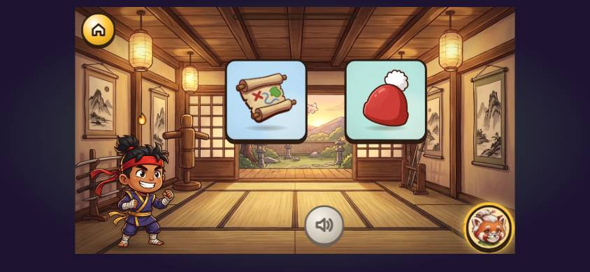 

**What the child sees:**
- **The setting:** the dojo room for the first time since the welcome. Two picture cards (a map, a hat) and a speaker.
- **The demo's answer:** the thumbs-up petal (/m/) pops into the nav row as the paw picks the map. A letter is written under the map by the ninja's spell: **the first letter the child has ever seen.**
- **Later:** the picture pairs give way to two letter tiles (m, s) for "Find this sound…", with no word that the game has changed.

*Transcript: level w1-2, starting 13:23.9 into the journey.*

| t (s) | Sensei says (verbatim; [sounds] and ["words"] are spliced clips) | line ids | words | talk (s) | child | on screen as the turn starts |
|---|---|---|---|---|---|---|
| 0.0 | | | | | taps level w1-2 | |
| 0.0 | Every word starts with a sound. Let's listen for the very first sound! Watch me first! This is a map. | first_intro, ido, fm_name_map | 20 | 7.1 | |  |
| 7.7 | | | | | taps hat | |
| 7.7 | This is a hat. Which one starts with... [/m/] Map starts with... [/m/] We hear the sound. Now look: this is how we spell it. [/m/] Let's do it together! This is a cup. This is a mop. Which one starts with... [/m/] | fm_name_hat, first_q, fs_map, audit_hear_see, wedo, fm_name_cup, fm_name_mop, first_q | 43 | 16.2 | | pick; cards/buttons: map, hat; nav: speaker |
| 28.0 | | | | | taps mop | |
| 28.4 | Mop starts with... [/m/] This is how we spell... [/m/] Now it's your turn! This is a mug. This is a zip. Which one starts with... [/m/] | fs_mop, how_we_spell, youdo, fm_name_mug, fm_name_zip, first_q | 27 | 9.6 | | pick; cards/buttons: cup, mop; nav: speaker, petal /m/ |
| 40.1 | | | | | taps mug | |
| 40.4 | Mug starts with... [/m/] Three right answers in a row! Your ninja is getting stronger. Watch me first! This is a bed. | fs_mug, audit_streak_first, ido, fm_name_bed | 22 | 9.1 | | pick; cards/buttons: mug, zip; nav: speaker, petal /m/ |
| 50.0 | | | | | taps bed | |
| 50.5 | This is a sock. Which one starts with... [/s/] Sock starts with... [/s/] This is how we spell... [/s/] Let's do it together! This is some sand. This is a van. Which one starts with... [/s/] | fm_name_sock, first_q, fs_sock, how_we_spell, wedo, fm_name_sand, fm_name_van, first_q | 36 | 13.9 | | pick; cards/buttons: bed, sock; nav: speaker |
| 68.6 | | | | | taps sand | |
| 68.9 | Sand starts with... [/s/] This is how we spell... [/s/] Now it's your turn! This is a cat. This is the sun. Which one starts with... [/s/] | fs_sand, how_we_spell, youdo, fm_name_cat, fm_name_sun, first_q | 27 | 10.7 | | pick; cards/buttons: sand, van; nav: speaker, petal /s/ |
| 81.7 | | | | | taps sun | |
| 82.0 | Sun starts with... [/s/] This is a mat. Which one starts with... | fs_sun, fm_name_mat, first_q | 12 | 4.9 | | pick; cards/buttons: cat, sun; nav: speaker, petal /s/ |
| 88.0 | | | | | taps sand | |
| 88.0 | Keep going, ninja! Listen again. ["mat", slowly] Which one starts with... [/m/] | streak_lost, listen_again, first_q | 11 | 5.7 | | pick; cards/buttons: mat, sand; nav: speaker, petal /m/ |
| 94.6 | | | | | taps mat | |
| 94.9 | Mat starts with... [/m/] Which one starts with... [/s/] | fs_mat, first_q | 9 | 4.7 | | pick; cards/buttons: mat, sand; nav: speaker, petal /m/ |
| 101.3 | | | | | taps sun | |
| 101.6 | Sun starts with... [/s/] Find this sound... [/m/] | fs_sun, find_q | 8 | 4.3 | | pick; cards/buttons: sun, map; nav: speaker, petal /s/ |
| 107.6 | | | | | taps m | |
| 107.6 | Smashing! Find this sound... [/s/] | yay_9, find_q | 5 | 2.8 | | pick; cards/buttons: m, s; nav: speaker, petal /m/ |
| 111.5 | | | | | taps m | |
| 111.5 | Listen again. [/s/] | listen_again | 3 | 1.7 | | pick; cards/buttons: s, m; nav: speaker, petal /s/ |
| 115.0 | | | | | taps s | |
| 115.0 | Brilliant! Find this sound... [/m/] | yay_1, find_q | 5 | 3.0 | | pick; cards/buttons: s, m; nav: speaker, petal /s/ |
| 119.2 | | | | | taps m | |
| 119.2 | Ace! Find this sound... [/s/] | yay_10, find_q | 5 | 2.8 | | pick; cards/buttons: s, m; nav: speaker, petal /m/ |
| 123.1 | | | | | taps s | |
| 123.1 | Fantastic! | yay_3 | 1 | 1.2 | | pick; cards/buttons: s, m; nav: speaker, petal /s/ |

**Diagnosis:**
- **The introduction is lost.** "Every word starts with a sound. Let's listen for the very first sound!" is said as the stone is tapped, over the map's fade, before the level is on screen (SCRIPT_FIXES C18, not yet applied).
- **The I do / we do / you do labels are there, as labels.** "Watch me first!", "Let's do it together!", "Now it's your turn!": 3–4 words each, 13 times each on the journey. Nothing says what "together" means (the answer glows after 2 s) or that each round has three parts.
- **The demo is a question to the child that the paw answers:** "Which one starts with… /m/" (Sensei's own demo), then the paw taps the map in silence, then "Map starts with… /m/". Nothing like "I think it's the map: mmmap. Map starts with /m/!".
- **Letters arrive in one line:** "We hear the sound. Now look: this is how we spell it. /m/". It is the first letter a preschool child meets, and no one says what writing a sound is or why.
- **Stems repeat:** "Which one starts with…" ×9 in this level alone. "Find this sound…" ×4 switches the game from pictures to letter tiles with no word of explanation. The praise after each is one word ("Smashing!", "Brilliant!", "Ace!", "Fantastic!").
- **The size of it:**
  - 43 of 53 lines have four words or fewer.
  - 63 words and 23.3 s of talk come before the child's first real turn (the we-do question at +26.9 s).
  - The learner tapped the hat while it was being named in the demo, a stray tap a 3-year-old makes too.

**Code:** `src/scenes/Early.tsx`:
- `FirstSoundLevel`: l.1267. `first_intro` at l.1377.
- `mk()`, l.1301–1335: `first_q` in `prompt` l.1308; `fs_<w>` + sound in `onRight`; `audit_hear_see` or `how_we_spell` at l.1327. The "Find this sound…" items: `find_q`, l.1366.
- `usePickGame` `present()`, l.968–1004: `ido`/`wedo`/`youdo` l.975–977; the naming l.979–987. After the question the paw answers the I do item: `setPaw(it.answer)`, l.1002.

### 4.10 The World Flower, first visit (15:36)

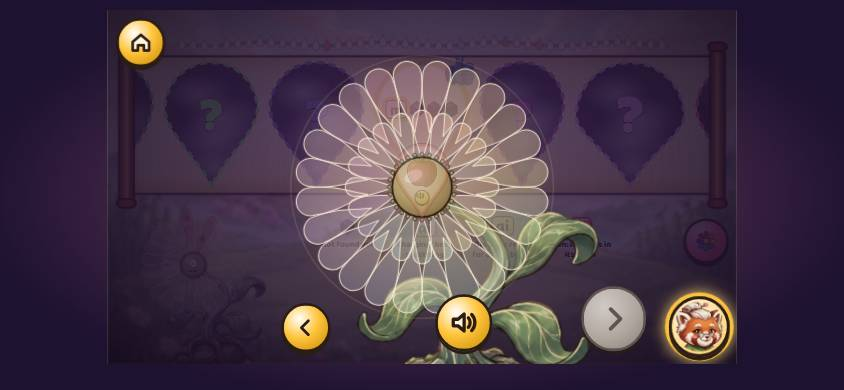

*Transcript: world flower, starting 15:36.7 into the journey.*

| t (s) | Sensei says (verbatim; [sounds] and ["words"] are spliced clips) | line ids | words | talk (s) | child | on screen as the turn starts |
|---|---|---|---|---|---|---|
| 6.9 | | | | | taps Next (next) | |
| 7.0 | Every petal is one sound. Listen! This is the petal for the sound... [/a/] | flower_i2 | 14 | 5.3 | | tree; cards/buttons: petal n, petal v, petal j, petal g, petal m, petal h, petal k, petal r …; nav: Next (dim), speaker, Back |
| 15.1 | | | | | taps Next (next) | |
| 15.1 | Inside each petal are shiny gems. Each gem is a way to spell the sound. | wf_i3 | 15 | 6.0 | | tree; cards/buttons: petal n, petal v, petal j, petal g, petal m, petal h, petal k, petal r …; nav: Next (dim), speaker, Back |
| 23.9 | | | | | taps Next (next) | |
| 23.9 | When you play and get it right, a gem fills up with ninja power. | flower_i4 | 14 | 3.8 | | tree; cards/buttons: petal n, petal v, petal j, petal g, petal m, petal h, petal k, petal r …; nav: Next (dim), speaker, Back |
| 30.5 | | | | | taps Next (next) | |
| 30.5 | When a gem is full, it glows. Then you can win it in a gem battle! | flower_i5 | 16 | 4.6 | | tree; cards/buttons: petal n, petal v, petal j, petal g, petal m, petal h, petal k, petal r …; nav: Next (dim), speaker, Back |
| 38.0 | | | | | taps Next (next) | |
| 38.0 | Win all the gems in a petal, and the petal flies back onto the World Flower! | flower_i6 | 16 | 5.1 | | tree; cards/buttons: petal n, petal v, petal j, petal g, petal m, petal h, petal k, petal r …; nav: Next (dim), speaker, Back |
| 45.9 | | | | | taps Next (next) | |
| 46.0 | You found a new sound! Look, here is its petal, shining through the mist. | wf_found_sound | 14 | 5.5 | | tree/found; cards/buttons: petal n, petal v, petal j, petal g, petal m, petal h, petal k, petal r …; nav: Next (dim), speaker |
| 54.4 | | | | | taps Next (next) | |
| 54.4 | This is the way we spell... [/m/] ...in mat. We see this spelling in man and map. | t_way_we_spell, tg_m_m_in, tg_m_m_see | 17 | 6.0 | | tree/explain; cards/buttons: petal n, petal v, petal j, petal g, petal m, petal h, petal k, petal r …; nav: Next (dim), speaker, petal /m/, Back |
| 63.7 | | | | | taps Next (next) | |
| 63.7 | This is the way we spell... [/s/] ...in sit. We see this spelling in sun and bus. | t_way_we_spell, tg_s_s_in, tg_s_s_see | 17 | 6.9 | | tree/explain; cards/buttons: petal n, petal v, petal j, petal g, petal m, petal h, petal k, petal r …; nav: Next (dim), speaker, petal /s/, Back |
| 74.0 | | | | | taps Next (next) | |
| 76.9 | | | | | taps Next (next) | |
| 76.9 | Welcome to Bamboo Village! | world_1 | 4 | 1.9 | | map; cards/buttons: level w1-3, next world, Sticker Book, World Flower; nav: speaker |

- **Six facts, one per Next,** in 45 s: flower_i1 to i6.
- **The wrong petal:** it shows and says **/a/**, a petal this child doesn't have (SCRIPT_FIXES C8, not yet applied).
- **A bare "Listen!"** sits in the middle of `flower_i2`.
- **The facts are explained (who, what), but not why we are here:** there is no "Let's go and see where your sounds live". Gem battles and petals flying home are explained long before the child can use them.

**Code:** `src/scenes/Intros.tsx` `FlowerIntro` l.58 (the `lines` array, with `{ sound: "a" }` hard-coded).

### 4.11 w1-4: the first early Dojo, building "am" (19:29)

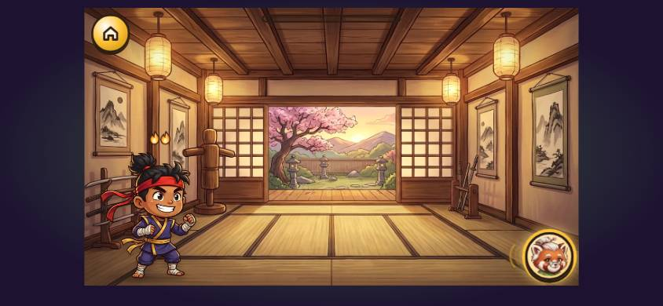 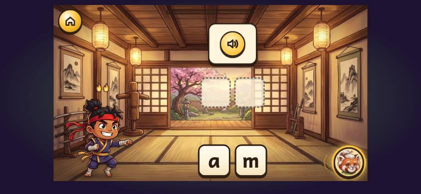

**What the child sees:**
- **The empty dojo** during "This word has two sounds!" (the still): no word is on screen yet.
- **Then two dashed slots** and the letter tiles a and m.
- **A word card** that is a yellow speaker: "am" has no picture.
- **The paw** points to each letter in turn as the ninja launches it into its slot.

*Transcript: level w1-4, starting 19:29.0 into the journey.*

| t (s) | Sensei says (verbatim; [sounds] and ["words"] are spliced clips) | line ids | words | talk (s) | child | on screen as the turn starts |
|---|---|---|---|---|---|---|
| 0.0 | | | | | taps level w1-4 | |
| 0.1 | This is our dojo. Here we listen to sounds, make words, and read them. This word has two sounds! Watch me first! I say the word... | audit_dojo_first, two_sounds, ido, build_ido_1 | 26 | 10.6 | |  |
| 11.3 | | | | | taps m | |
| 11.6 | ["am"] I say it slowly... ["am", slowly] | build_ido_2 | 6 | 2.9 | | build; cards/buttons: Hear the word, a, m; nav: speaker |
| 14.9 | | | | | taps a | |
| 15.4 | Ninjas read this way! We start here, and go this way. Now I find each sound, one at a time. ["am", slowly] [/a/] ["am", slowly] [/m/] Say the sounds... and read the word! [/a/] [/m/] ["am"] | fm_l2_way, audit_left_right, build_ido_3, say_sounds_read | 34 | 14.1 | | build; cards/buttons: Hear the word, a, m; nav: speaker |
| 33.7 | | | | | taps a | |
| 33.7 | Let's do it together! ["am"] What's the first sound? | wedo, first_sound_q | 9 | 3.8 | | build; cards/buttons: m, a; nav: speaker |
| 36.7 | | | | | taps a | |
| 37.9 | ["am", slowly] [/a/] The last sound is at the end of the word. Listen to the end. | audit_last_place | 16 | 4.7 | | build; cards/buttons: Hear the word, m, a; nav: speaker |
| 42.5 | | | | | taps a | |
| 43.5 | What's the last sound? ["am", slowly] | last_sound_q | 5 | 2.5 | | build; cards/buttons: Hear the word, m, a; nav: speaker |
| 46.0 | | | | | taps m | |
| 46.6 | [/m/] Say the sounds... and read the word! [/a/] [/m/] ["am"] Ninja power! Look, a gem! Each gem holds a way to spell a sound. When you get words right, it fills up. | say_sounds_read, streak_3, audit_gem_first | 33 | 13.7 | | build; cards/buttons: Hear the word, m, a; nav: speaker |
| 64.7 | | | | | taps Next (next) | |
| 64.7 | Now it's your turn! ["am"] What's the first sound? | youdo, first_sound_q | 9 | 3.4 | | build; cards/buttons: m, a; nav: speaker |
| 67.7 | | | | | taps a | |
| 68.6 | ["am", slowly] [/a/] What's the last sound? ["am", slowly] | last_sound_q | 7 | 3.8 | | build; cards/buttons: Hear the word, m, a; nav: speaker |
| 73.0 | | | | | taps m | |
| 73.0 | [/m/] Say the sounds... and read the word! [/a/] [/m/] ["am"] Wow! Super ninja streak! ["at"] What's the first sound? ["at", slowly] | say_sounds_read, streak_6, first_sound_q | 21 | 10.8 | | build; cards/buttons: Hear the word, m, a; nav: speaker |
| 85.5 | | | | | taps t | |
| 89.0 | | | | | taps a | |
| 89.0 | [/a/] What's the last sound? ["at", slowly] | last_sound_q | 6 | 2.5 | | build; cards/buttons: Hear the word, t, a; nav: speaker |
| 92.4 | | | | | taps t | |
| 92.4 | [/t/] Say the sounds... and read the word! [/a/] [/t/] ["at"] Fantastic! Who read it right? Listen to Kai and Suki! Tap each sound, and say it. | say_sounds_read, yay_3, read_intro, read_tap_sounds | 27 | 10.3 | | build; cards/buttons: Hear the word, t, a; nav: speaker |
| 105.0 | | | | | taps sound 0 | |
| 105.0 | [/a/] |  | 1 | 0.3 | |  |
| 105.6 | | | | | taps sound 1 | |
| 105.6 | [/m/] [/m/] Who read it right? Suki says... ["am"] Kai says... ["at"] | read_who, suki_says, kai_says | 12 | 6.1 | | read; cards/buttons: sound 0, sound 1, reader suki, reader kai; nav: speaker |
| 115.1 | | | | | taps reader suki | |
| 115.4 | [/a/] [/m/] ["am"] Ace! | yay_10 | 4 | 2.3 | | read; cards/buttons: sound 0, sound 1, reader suki, reader kai; nav: speaker |

**Diagnosis:**
- **The introduction is said over the map fade.** "This is our dojo. Here we listen to sounds, make words, and read them." frames the room's purpose, the nearest thing to framing on the preschool path, but the child hears it while the level isn't yet on screen.
- **"This word has two sounds!"** comes before there is a word (SCRIPT_FIXES C13).
- **The best-narrated demo on the path:** "I say the word… am. I say it slowly… aaam. Ninjas read this way! We start here, and go this way. Now I find each sound, one at a time.". But it is **75 words and 31.4 s** before the child's first turn, and the finding itself is silent apart from the stretched word and the sound.
- **Two more ideas before the child's turn:**
  - "The last sound is at the end of the word. Listen to the end." (14 words, abstract).
  - "Look, a gem! Each gem holds a way to spell a sound. When you get words right, it fills up." (20 words, a held step), in the middle of the we-do.
- **"Who read it right? Listen to Kai and Suki!"**
  - Kai and Suki appear for the first time, unintroduced.
  - "Who read it right?" is asked *before* they read (SCRIPT_FIXES C14).
  - The child is first told "Tap each sound, and say it." (a bare command) on the reading card.

**Code:** `src/scenes/Early.tsx`:
- `BuildSequence`: l.1508; `audit_dojo_first` l.1535; `two_sounds`/`three_sounds` l.1542.
- `BuildOne` `runDemo`: l.1687–1706 (`build_ido_1`, `build_ido_2`, `fm_l2_way` + `audit_left_right`, `build_ido_3`).
- `slotQ`: l.1603 (`first_sound_q`, `next_sound_q`, `last_sound_q`).
- `readBack`: l.1650 (`say_sounds_read`).
- `ReadCheck`/`ReadOne`: l.1891–1962 (`read_intro`, `read_tap_sounds`, `read_who`, `kai_says`, `suki_says`).

### 4.12 w1-6: the first battle (24:08)

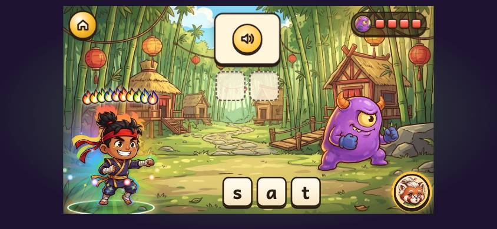

*Transcript: level w1-6, starting 24:08.0 into the journey.*

| t (s) | Sensei says (verbatim; [sounds] and ["words"] are spliced clips) | line ids | words | talk (s) | child | on screen as the turn starts |
|---|---|---|---|---|---|---|
| 0.0 | | | | | taps level w1-6 | |
| 0.6 | Uh oh! One of Baron Muddle's monsters is in the way! Spell the words to zap it! | battle_start | 17 | 5.1 | | battle; cards/buttons: Hear the word, s, a, t; nav: speaker |
| 3.0 | | | | | taps a | |
| 5.7 | Spell... ["at"] [/a/] | battle_spell | 3 | 1.8 | | battle; cards/buttons: Hear the word, s, a, t; nav: speaker |
| 11.0 | | | | | taps t | |
| 11.0 | [/t/] [/a/] [/t/] ["at"] Well done! ["am"] | yay_4 | 7 | 3.1 | | battle; cards/buttons: Hear the word, s, a, t; nav: speaker |
| 18.3 | | | | | taps t | |
| 18.7 | Keep going, ninja! Listen again... What do you hear here? | streak_lost, listen_here | 10 | 3.6 | | battle; cards/buttons: Hear the word, t, m, a; nav: speaker |
| 21.8 | | | | | taps a | |
| 22.7 | ["am", slowly] [/a/] |  | 2 | 1.3 | |  |
| 27.2 | | | | | taps m | |
| 27.2 | [/m/] [/a/] [/m/] ["am"] Fantastic! ["sat"] | yay_3 | 6 | 4.1 | | battle; cards/buttons: Hear the word, t, m, a; nav: speaker |
| 34.9 | | | | | taps s | |
| 34.9 | [/s/] |  | 1 | 0.8 | |  |
| 37.8 | | | | | taps m | |
| 38.3 | Let's listen to the word again, slowly. | audit_listen_slowly | 7 | 3.2 | | battle; cards/buttons: Hear the word, a, m, t, s; nav: speaker |
| 41.3 | | | | | taps a | |
| 41.6 | ["sat", slowly] [/a/] |  | 2 | 1.8 | |  |
| 46.2 | | | | | taps t | |
| 46.2 | [/t/] [/s/] [/a/] [/t/] ["sat"] Super! ["mat"] | yay_2 | 7 | 3.5 | | battle; cards/buttons: Hear the word, a, m, t, s; nav: speaker |
| 54.2 | | | | | taps m | |
| 54.2 | [/m/] |  | 1 | 0.7 | |  |
| 57.1 | | | | | taps t | |
| 57.6 | Hmm, listen again. What sound comes next? | audit_listen_next | 7 | 3.7 | | battle; cards/buttons: a, t, s, m; nav: speaker |
| 60.6 | | | | | taps a | |
| 61.4 | ["mat", slowly] [/a/] |  | 2 | 1.8 | |  |
| 66.1 | | | | | taps t | |
| 66.1 | [/t/] [/m/] [/a/] [/t/] ["mat"] Hooray! The monster ran away! | battle_win | 10 | 4.5 | | battle; nav: speaker |

**What the child sees:**
- A purple monster with a four-block health bar (top right).
- A speaker card and two slots.
- The letters s, a, t, which are **tappable from the first frame**. The learner tapped a at +3.0 s, during Sensei's first sentence.

**Diagnosis:**
- **"Uh oh! One of Baron Muddle's monsters is in the way! Spell the words to zap it!"**
  - It frames the stakes, not the game.
  - It is the first time a 3-year-old hears "spell" as something *they* do.
  - Nothing shows how: there is no demo in the first battle.
- **"Spell…" ["at"]** is the child's first word-spelling instruction: one word and a spliced word.
- **The health bar and slots are never explained.** The corrections are whole questions ("Listen again… What do you hear here?", "Let's listen to the word again, slowly.").

**Code:** `src/scenes/Battle.tsx`:
- The intro `part()`: l.357–372 (`audit_baron_first` once if due, `battle_start`).
- `question()`: l.451 (`battle_spell` + word for the first word).

### 4.13 w1-7: the first sound hunt ("in the middle") (25:37)

*Transcript: level w1-7, starting 25:37.8 into the journey.*

| t (s) | Sensei says (verbatim; [sounds] and ["words"] are spliced clips) | line ids | words | talk (s) | child | on screen as the turn starts |
|---|---|---|---|---|---|---|
| 0.0 | | | | | taps level w1-7 | |
| 0.0 | Now let's listen for a sound in the middle of a word! The middle sound comes after the first sound, and before the last sound. Watch me first! This is a pan. This is a pin. Which one has this sound in it? [/i/] ["pin", slowly] ["pan", slowly] Pin has this sound in the middle... [/i/] This is how we spell... [/i/] Let's do it together! This is a tap. | hunt_intro, audit_middle_place, ido, fm_name_pan, fm_name_pin, hunt_q, mid_pin, how_we_spell, wedo, fm_name_tap | 68 | 23.7 | |  |
| 27.9 | | | | | taps tap | |
| 28.6 | This is a tin. Which one has this sound in it? [/i/] ["tin", slowly] ["tap", slowly] | fm_name_tin, hunt_q | 14 | 5.3 | | pick; cards/buttons: tap, tin; nav: speaker |
| 35.4 | | | | | taps tin | |
| 35.7 | Tin has this sound in the middle... [/i/] This is how we spell... [/i/] Now it's your turn! This is a lid. This is a mat. Which one has this sound in it? [/i/] ["lid", slowly] ["mat", slowly] | mid_tin, how_we_spell, youdo, fm_name_lid, fm_name_mat, hunt_q | 36 | 12.4 | | pick; cards/buttons: tap, tin; nav: speaker, petal /i/ |
| 51.0 | | | | | taps lid | |
| 51.3 | Lid has this sound in the middle... [/i/] Ninja power! Watch me first! I say the word... | mid_lid, streak_3, ido, build_ido_1 | 17 | 6.2 | | pick; cards/buttons: lid, mat; nav: speaker, petal /i/ |
| 58.0 | | | | | taps i | |
| 58.4 | ["it"] I say it slowly... ["it", slowly] Now I find each sound, one at a time. ["it", slowly] [/i/] ["it", slowly] [/t/] | build_ido_2, build_ido_3 | 19 | 7.8 | | build; cards/buttons: Hear the word, i, t; nav: speaker |
| 69.7 | | | | | taps i | |
| 69.9 | Say the sounds... and read the word! [/i/] [/t/] ["it"] Let's do it together! ["it"] What's the first sound? | say_sounds_read, wedo, first_sound_q | 19 | 7.6 | | build; cards/buttons: Hear the word, i, t; nav: speaker |
| 78.1 | | | | | taps i | |
| 79.4 | ["it", slowly] [/i/] What's the last sound? ["it", slowly] | last_sound_q | 7 | 3.5 | | build; cards/buttons: Hear the word, i, t; nav: speaker |
| 84.0 | | | | | taps t | |
| 84.0 | [/t/] Say the sounds... and read the word! [/i/] [/t/] ["it"] Ace! Now it's your turn! ["it"] What's the first sound? | say_sounds_read, yay_10, youdo, first_sound_q | 21 | 8.2 | | build; cards/buttons: Hear the word, i, t; nav: speaker |
| 93.8 | | | | | taps t | |
| 94.8 | ["it", slowly] |  | 1 | 0.8 | |  |
| 97.3 | | | | | taps i | |
| 97.3 | [/i/] What's the last sound? ["it", slowly] | last_sound_q | 6 | 2.6 | | build; cards/buttons: Hear the word, t, i; nav: speaker |
| 100.6 | | | | | taps t | |
| 100.6 | [/t/] Say the sounds... and read the word! [/i/] [/t/] ["it"] Wow! Super ninja streak! Who read it right? Listen to Kai and Suki! Tap each sound, and say it. | say_sounds_read, streak_6, read_intro, read_tap_sounds | 30 | 11.5 | | build; cards/buttons: Hear the word, t, i; nav: speaker |
| 114.4 | | | | | taps sound 0 | |
| 114.4 | [/s/] [/s/] |  | 2 | 1.6 | |  |
| 115.3 | | | | | taps sound 1 | |
| 115.3 | [/i/] |  | 1 | 0.2 | |  |
| 115.6 | | | | | taps sound 2 | |
| 115.6 | [/t/] Who read it right? Suki says... ["sat"] Kai says... ["sit"] | read_who, suki_says, kai_says | 11 | 5.1 | | read; cards/buttons: sound 0, sound 1, sound 2, reader suki, reader kai; nav: speaker |
| 124.7 | | | | | taps reader kai | |
| 125.0 | [/s/] [/i/] [/t/] ["sit"] Super! | yay_2 | 5 | 2.6 | | read; cards/buttons: sound 0, sound 1, sound 2, reader suki, reader kai; nav: speaker |

- **The introduction is said on the map:** "Now let's listen for a sound in the middle of a word!".
- **A definition comes before any example:** "The middle sound comes after the first sound, and before the last sound." (13 words). It is said over an **empty dojo** (the still: no cards, no word, no slots), so there is nothing to point at.
- **The demo asks the child a question inside Sensei's own turn:** "Watch me first! This is a pan. This is a pin. Which one has this sound in it? [/i/] [pin, slowly] [pan, slowly]". Then the paw answers: "Pin has this sound in the middle… [/i/]". "In the middle" was defined a moment earlier in the abstract, before any word was on screen.
- **82 words and 29 s** before the first turn.

**Code:** `src/scenes/Early.tsx` `SoundHuntLevel`: l.1407; `hunt_intro` + `audit_middle_place` at l.1456–1462; `hunt_q` at l.1432; `mid_<w>` in `onRight`.

### 4.14 w1-8: the first Sound Swap (28:20)

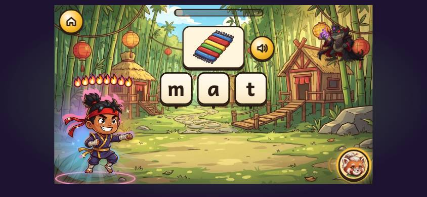

*Transcript: level w1-8, starting 28:20.3 into the journey.*

| t (s) | Sensei says (verbatim; [sounds] and ["words"] are spliced clips) | line ids | words | talk (s) | child | on screen as the turn starts |
|---|---|---|---|---|---|---|
| 0.0 | | | | | taps level w1-8 | |
| 0.1 | Baron Muddle has mixed up these words! Can you fix them? Change one sound at a time. | swap_start | 17 | 6.0 | | swap; cards/buttons: m, a, t; nav: speaker |
| 2.9 | | | | | taps m | |
| 6.3 | This is... | this_is | 2 | 0.9 | | swap; cards/buttons: m, a, t; nav: speaker |
| 6.5 | | | | | taps t | |
| 7.1 | ["mat"] Change it to make... ["sat"] ["mat", slowly] ["sat", slowly] What changed? Listen here. | swap_make, what_changed | 12 | 7.5 | | swap; cards/buttons: m, a, t; nav: speaker |
| 15.9 | | | | | taps m | |
| 16.9 | | | | | taps s | |
| 16.9 | Yes, the first sound changes! Now pick the new sound. ✂ [/s/] [/a/] [/t/] ["sat"] Amazing! You're a ninja master! Change it to make... ["sit"] ["sat", slowly] | audit_swap_first, streak_10, swap_make | 25 | 12.7 | | swap; cards/buttons: a, t, s; nav: speaker |
| 27.1 | | | | | taps t | |
| 28.2 | ["sit", slowly] What changed? Listen here. | what_changed | 5 | 2.8 | | swap; cards/buttons: Hear the word, s, a, t; nav: speaker |
| 31.4 | | | | | taps a | |
| 32.0 | | | | | taps i | |
| 32.2 | Yes, the middle sound changes! Now pick the new sound. ✂ [/s/] [/i/] [/t/] ["sit"] Amazing! Change it to make... ["sat"] ["sit", slowly] | audit_swap_middle, yay_5, swap_make | 21 | 9.8 | | swap; cards/buttons: Hear the word, s, t, a, i; nav: speaker |
| 39.7 | | | | | taps t | |
| 40.0 | ["sat", slowly] What changed? Listen here. | what_changed | 5 | 3.7 | | swap; cards/buttons: s, i, t; nav: speaker |
| 44.2 | | | | | taps i | |
| 45.2 | | | | | taps a | |
| 45.4 | Now pick the new sound. ✂ [/s/] [/a/] [/t/] ["sat"] Super! Change it to make... ["mat"] ["sat", slowly] | swap_pick, yay_2, swap_make | 16 | 7.4 | | swap; cards/buttons: s, t, i, a; nav: speaker |
| 52.5 | | | | | taps s | |
| 53.5 | ["mat", slowly] What changed? Listen here. | what_changed | 5 | 3.8 | | swap; cards/buttons: Hear the word, s, a, t; nav: speaker |
| 56.0 | | | | | taps t | |
| 57.6 | | | | | taps s | |
| 58.5 | | | | | taps m | |
| 58.6 | Now pick the new sound. ✂ [/m/] [/a/] [/t/] ["mat"] Amazing! This is... ["am"] Change it to make... ["at"] | swap_pick, yay_5, this_is, swap_make | 18 | 7.7 | | swap; cards/buttons: Hear the word, a, t, m; nav: speaker |
| 66.2 | | | | | taps m | |
| 67.0 | ["am", slowly] ["at", slowly] What changed? Listen here. | what_changed | 6 | 3.8 | | swap; cards/buttons: Hear the word, a, m; nav: speaker |
| 72.5 | | | | | taps t | |
| 72.7 | Yes, the last sound changes! Now pick the new sound. ✂ | audit_swap_last | 10 | 3.9 | | swap; cards/buttons: Hear the word, a, s, t; nav: speaker |
| 72.8 | | | | | taps a | |
| 73.4 | [/a/] [/t/] ["at"] Fantastic! Change it to make... ["it"] ["at", slowly] ["it", slowly] | yay_3, swap_make | 11 | 5.2 | | swap; cards/buttons: Hear the word, a, t; nav: speaker |
| 79.3 | | | | | taps t | |
| 80.3 | What changed? Listen here. | what_changed | 4 | 2.2 | | swap; cards/buttons: Hear the word, a, t; nav: speaker |
| 82.7 | | | | | taps a | |
| 83.7 | | | | | taps i | |
| 83.7 | Now pick the new sound. ✂ [/i/] [/t/] ["it"] Super! You fixed them all! | swap_pick, yay_2, swap_done | 13 | 4.6 | | swap; cards/buttons: Hear the word, t, a, i; nav: speaker |

- **"Baron Muddle has mixed up these words! Can you fix them? Change one sound at a time."**
  - The tiles m, a, t are tappable during it, and the learner tapped m at +2.9 s.
  - The screen is still fading in when it starts.
- **"This is… [mat] Change it to make… [sat] [mat, slowly] [sat, slowly] What changed? Listen here."** There is no demo, and the question comes after the words (SCRIPT_FIXES C11).
- **"Yes, the first sound changes! Now pick the new sound."** is cut off by the child's next tap 3 times out of 3 (✂).
- **Stems repeat:** "Change it to make…" and "What changed? Listen here." come 6 times each.
- **"Amazing! You're a ninja master!"** comes after the first swap.

**Code:** `src/scenes/Swap.tsx`: `tell()` l.268 (`swap_start` + `this_is`); `ask()` l.283–297 (`swap_make`, `what_changed`); `sayPick()` l.335–347.

### 4.15 w1-9: the first Ninja Run (30:02)

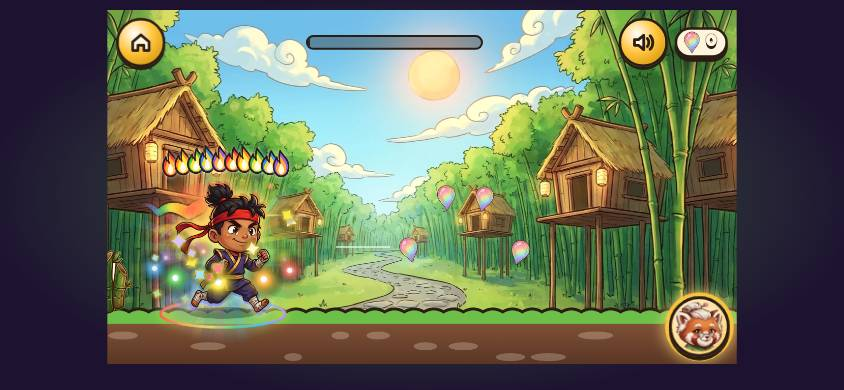

*Transcript: level w1-9, starting 30:02.3 into the journey.*

| t (s) | Sensei says (verbatim; [sounds] and ["words"] are spliced clips) | line ids | words | talk (s) | child | on screen as the turn starts |
|---|---|---|---|---|---|---|
| 0.0 | | | | | taps level w1-9 | |
| 5.0 | Ninja Run! Tap to jump, and catch the right word! Listen to the sounds. What word do they make? [/s/] [/i/] [/t/] [/s/] [/i/] [/t/] ["sit"] Ace! Listen to the sounds, and catch the word they make! [/a/] [/t/] [/a/] [/t/] ["at"] Well done! Say the sounds, and listen for the word. [/m/] [/a/] [/t/] [/m/] [/a/] [/t/] ["mat"] Brilliant! Listen to the sounds. What word do they make? [/s/] [/a/] [/t/] [/s/] [/a/] [/t/] ["sat"] Smashing! Listen to the sounds, and catch the word they make! [/i/] [/t/] [/i/] [/t/] ["it"] Super! Say the sounds, and listen for the word. [/a/] [/m/] [/a/] [/m/] ["am"] Ace! Bong! You made it to the gong! | run_start, run_blend, yay_10, audit_sounds_again, yay_4, t_listen_for_word, yay_1, run_blend, yay_9, audit_sounds_again, yay_2, t_listen_for_word, yay_10, run_end | 114 | 43.2 | | run; nav: speaker |

- **"Ninja Run! Tap to jump, and catch the right word!"** Then "Listen to the sounds. What word do they make?", and the lanterns come.
- **No demo** shows what jumping to catch a lantern looks like.
- **The cue lines rotate** (`run_blend`, `audit_sounds_again`, `t_listen_for_word`). `t_listen_for_word` tells the child to "Say the sounds" while Sensei says them (SCRIPT_FIXES C16).
- **The child's taps are missing from the transcript,** because the bot plays Run through a JavaScript hook.

**Code:** `src/scenes/Run.tsx` `startEvent()` l.648–662; `src/content/narrative.ts` `RUN_BLEND_CUES` l.111.

### 4.16 w1-14: the first story (45:18)

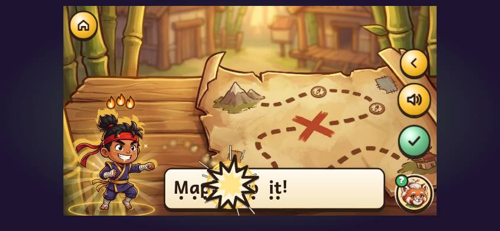

*Transcript: level w1-14, starting 45:18.7 into the journey.*

| t (s) | Sensei says (verbatim; [sounds] and ["words"] are spliced clips) | line ids | words | talk (s) | child | on screen as the turn starts |
|---|---|---|---|---|---|---|
| 0.0 | Story time! I'll read, and you read too. (story page) [story s1_title] | story_start, story:s1_title | 11 | 4.1 | | story; nav: Next (dim), speaker |
| 7.2 | | | | | taps Next (next) | |
| 7.2 | (story page) In Bamboo Village, the pandas were having a terrible day. Baron Muddle had pinched their lunch pot and hidden it! But Super Ninja had a clue... | story:s1_1 | 26 | 9.9 | | story; nav: Next (dim), speaker |
| 19.9 | | | | | taps Next (next) | |
| 19.9 | Your turn to read! Tap a word if you need help. ✂ | story_your_turn | 11 | 2.7 | | story; cards/buttons: Map, Tap, it, I read it!; nav: speaker, Back |
| 20.2 | | | | | taps I read it! | |
| 20.2 | Well read! (story page) Map! Tap it! (story page) The map showed a twisty path, deep into the bamboo. Super Ninja crept along, quiet as a mouse. | well_read, story:s1_2, story:s1_3 | 23 | 9.4 | | story; cards/buttons: Map, Tap, it, I read it!; nav: speaker, Back |
| 32.6 | | | | | taps Next (next) | |
| 32.6 | Your turn to read! Tap a word if you need help. ✂ | story_your_turn | 11 | 2.7 | | story; cards/buttons: Tip, tap, tip, I read it!; nav: speaker, Back |
| 33.0 | | | | | taps I read it! | |
| 33.0 | Well read! (story page) Tip, tap, tip, tap. (story page) Two places to look! Where is the pot hidden? | well_read, story:s1_4, story:s1_5 | 15 | 6.5 | | story; cards/buttons: Tip, tap, tip, I read it!; nav: speaker, Back |
| 37.0 | | | | | taps mat | |
| 40.0 | Read the two words. Tap the one you choose. [/m/] [/a/] [/t/] ["mat"] Your turn to read! Tap a word if you need help. ✂ | audit_story_choice, story_your_turn | 24 | 7.4 | | story; cards/buttons: pit, mat; nav: speaker, Back |
| 46.1 | | | | | taps I read it! | |
| 46.1 | Well read! (story page) Pot! Pot on mat! (story page) The pandas cheered and gobbled up every last dumpling. And look! Inside the pot was a glowing sound petal. | well_read, story:s1_6, story:s1_7 | 25 | 10.7 | | story; cards/buttons: Pot, on, mat, I read it!; nav: speaker, Back |
| 59.8 | | | | | taps Next (next) | |
| 59.8 | Let's think about the story... ✂ | story_question | 5 | 2.8 | | story; cards/buttons: pot, map, pan; nav: speaker, Back |
| 60.1 | | | | | taps pot | |
| 60.1 | Brilliant! The end! What a story! | yay_1, story_end | 6 | 3.3 | | story; cards/buttons: pot, map, pan; nav: speaker, Back |

- **"Story time! I'll read, and you read too."** is one of the two framing lines on the path that say who does what (the other is W5's). It is said on the map as the stone is tapped.
- **Each page's picture fades in after its text starts,** so the start-of-line stills are black.
- **"Your turn to read! Tap a word if you need help."**
  - It asks a 3-year-old non-reader to read "Map! Tap it!".
  - The ✓ "I read it!" button is not explained.
- **"Let's think about the story…"** is cut off (✂) by a tap before the question is heard.

**Code:** `src/scenes/Story.tsx`: `TitleStep` l.412 (`story_start`); l.658 and l.709 (`story_your_turn`); l.794 (`audit_story_choice`); l.898 (`story_question`).

### 4.17 w1-15: the first boss (46:30)

*Transcript: level w1-15, starting 46:30.2 into the journey.*

| t (s) | Sensei says (verbatim; [sounds] and ["words"] are spliced clips) | line ids | words | talk (s) | child | on screen as the turn starts |
|---|---|---|---|---|---|---|
| 0.0 | | | | | taps level w1-15 | |
| 0.6 | **BARON:** So... a little ninja wants to stop me? My sumo panda will squash you! | baron_w1 | 14 | 5.7 | | battle; cards/buttons: i, n, m, o, p, t, a; nav: speaker |
| 2.9 | | | | | taps i | |
| 6.4 | | | | | taps t | |
| 6.8 | A big boss monster! Listen carefully, and spell your best! ["top"] [/t/] | battle_boss | 12 | 5.9 | | battle; cards/buttons: i, n, m, o, p, t, a; nav: speaker |
| 16.3 | | | | | taps o | |
| 16.3 | [/o/] |  | 1 | 0.5 | |  |
| 19.2 | | | | | taps p | |
| 19.2 | [/p/] [/t/] [/o/] [/p/] ["top"] Wow! Super ninja streak! ["not"] | streak_6 | 10 | 5.0 | | battle; cards/buttons: i, n, m, o, p, t, a; nav: speaker |
| 28.4 | | | | | taps t | |
| 28.8 | Keep going, ninja! Listen again... What do you hear here? | streak_lost, listen_here | 10 | 3.6 | | battle; cards/buttons: Hear the word, t, p, s, o, a, m, n; nav: speaker |
| 31.9 | | | | | taps n | |
| 32.8 | ["not", slowly] [/n/] |  | 2 | 2.2 | |  |
| 38.0 | | | | | taps o | |
| 38.0 | [/o/] |  | 1 | 0.5 | |  |
| 40.9 | | | | | taps t | |
| 40.9 | [/t/] [/n/] [/o/] [/t/] ["not"] Well done! ["nip"] | yay_4 | 8 | 4.0 | | battle; cards/buttons: Hear the word, t, p, s, o, a, m, n; nav: speaker |
| 48.8 | | | | | taps p | |
| 49.3 | Let's listen to the word again, slowly. | audit_listen_slowly | 7 | 3.2 | | battle; cards/buttons: Hear the word, p, a, o, n, i, m, t; nav: speaker |
| 52.3 | | | | | taps n | |

*(35 more rows: the full table is in [current-transcript.md](current-transcript.md).)*

- **Baron opens:** "So… a little ninja wants to stop me? My sumo panda will squash you!".
- **The letters are tappable during his line,** and the learner tapped at +2.9 s and +6.4 s.
- **Then "A big boss monster! Listen carefully, and spell your best!"** It frames the challenge, but by then the child has already been tapping.

**Code:** `src/scenes/Battle.tsx` l.352–358 (`battle_boss`); Baron's lines in the boss intro.

### 4.18 w6-br1: the first sort (separate run)

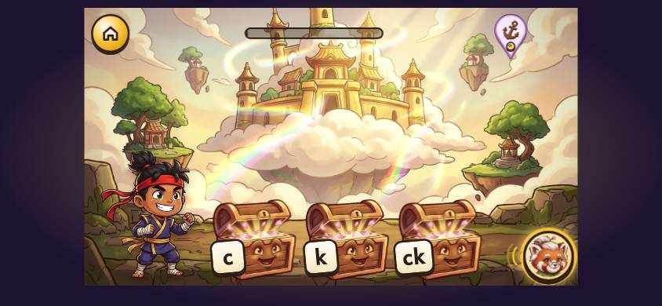

*Transcript: level w6-br1, starting 0:04.8 into the journey.*

| t (s) | Sensei says (verbatim; [sounds] and ["words"] are spliced clips) | line ids | words | talk (s) | child | on screen as the turn starts |
|---|---|---|---|---|---|---|
| 0.0 | | | | | taps level w6-br1 | |
| 0.7 | You know this sound! Now let's look at the different ways we spell it. Sorting time! These words have the same sound, but it's spelt in different ways. This sound can be spelt in three ways. [/k/] [/k/] [/k/] It's two letters, but it's one sound. Tap the chest with the same spelling as the word. ["king"] | audit_bridging_first, audit_sort_first, audit_sort_three, t_two_letters, help_sort | 57 | 18.2 | | sort; cards/buttons: basket c, basket k, basket ck; nav: speaker, petal /k/ |
| 24.2 | | | | | taps basket k | |
| 24.3 | [/k/] [/i/] [/ng/] ["king"] Look, a gem! Each gem holds a way to spell a sound. When you get words right, it fills up. | audit_gem_first | 24 | 8.8 | | sort; cards/buttons: basket c, basket k, basket ck; nav: speaker, petal /k/ |
| 37.7 | | | | | taps Next (next) | |
| 38.0 | ["cap"] |  | 1 | 0.6 | |  |
| 40.7 | | | | | taps basket c | |
| 40.8 | [/k/] [/a/] [/p/] ["cap"] ["sketch"] |  | 5 | 1.9 | |  |
| 46.8 | | | | | taps basket k | |
| 46.9 | [/s/] [/k/] [/e/] [/ch/] ["sketch"] Ninja power! ["cat"] | streak_3 | 8 | 4.2 | | sort; cards/buttons: basket c, basket k, basket ck; nav: speaker, petal /k/ |
| 54.1 | | | | | taps basket c | |
| 54.2 | [/k/] [/a/] [/t/] ["cat"] ["skid"] |  | 5 | 1.9 | |  |
| 60.2 | | | | | taps basket k | |
| 60.3 | [/s/] [/k/] [/i/] [/d/] ["skid"] ["crisp"] |  | 6 | 2.8 | |  |
| 67.2 | | | | | taps basket c | |
| 67.3 | [/k/] [/r/] [/i/] [/s/] [/p/] ["crisp"] Wow! Super ninja streak! | streak_6 | 10 | 5.3 | | sort; cards/buttons: basket c, basket k, basket ck; nav: speaker, petal /k/ |
| 75.4 | | | | | taps basket ck | |
| 75.7 | [/s/] [/t/] [/u/] [/k/] ["stuck"] ["sock"] [/s/] [/o/] [/k/] ["sock"] Sorted! What a clever ninja. | sort_done | 15 | 7.0 | | sort; cards/buttons: basket c, basket k, basket ck; nav: speaker, petal /k/ |

- **Five lines and 57 words (18.2 s) before the first word.** The /k/ petal sits top right, and three identical chests are labelled c, k and ck.
- **"This sound can be spelt in three ways. [/k/] [/k/] [/k/]":** each chest hops in turn with its sound, but Sensei never says which chest is which spelling (SCRIPT_FIXES C1 has the target).
- **"Tap the chest with the same spelling as the word."** There is no demo.
- **The first word's answer is followed by the gem explanation as a held step** (Next), so the second word waits on a tap on the arrow.

**Code:** `src/scenes/Sort.tsx` `playIntro` l.383–404 and `on()` l.423–433.

---

## 5. Patterns across the journey

### 5.1 Bare commands and "Listen…"

| Line (id) | Text | Times in 53 min | Where |
|---|---|---|---|
| `listen_again` | Listen again. | 11 | every picture game's first-miss correction |
| `listen_here` | Listen again... What do you hear here? | 7 | battles, Dojo build |
| `audit_listen_next` | Hmm, listen again. What sound comes next? | 7 | battles, Dojo build |
| `listen` | Listen... | 6 | **Dojo Learn, every new sound**; Find corrections |
| `find_q` | Find this sound... | 12 | w1-2, w1-3, w1-10 |
| `swap_make` | Change it to make... | 19 | Sound Swap, every step |
| `ido` / `fm_show_me_2` | Watch me first! | 13 + 2 | first-sound, sound hunt, early Dojo; W1, W3 |
| `read_tap_sounds` | Tap each sound, and say it. | 6 | Kai and Suki |
| `fm_l2_start` | Start here, on this side! | 4 | W4, W6 corrections |
| `battle_spell` | Spell... | 2 | the first word of each battle |
| `fm_tap_sun`, `fm_tap_sock`, `fm_rw_tap`, `tut_1` | Tap the sun! / Tap the sock! / Tap a sticker! / Ninja training! First, tap the big gong! | 1–2 each | the first minutes |

In the official scripts, "Listen" comes with what to listen for and why. The Lesson 1 set-up, for example: "I'm going to say the word 'sat' very slowly. Listen carefully to hear the sounds that make up the word 'sat'." ([teacher-language.md](../../assets-src/sw-sources/research/sections/teacher-language.md) §10.1).

### 5.2 "I'll show you, then you": what exists

| Game | The show line | The try line | Is the demo narrated? | Is the child's instruction voiced inside the demo? |
|---|---|---|---|---|
| W1 tap | Let me show you! | Now you try! | no: Sensei says "Tap the sun!" | **yes** |
| W1 fast/slow | Watch me first! (over an empty stage) | Your turn! Tap the tortoise, and say it slowly with me. | **yes** ("I can say a word fast… Or I can say it slowly…") | no |
| W1 tap-all | Let me show you! | Your turn! | no: silent paw, "sssun" | **yes** ("Tap all the pictures that start with…") |
| W2 rail | Let me show you! | Your turn! Tap them the ninja way. | partly ("Fish… dog. Fish dog!") | no |
| W2 which | (demo dropped by the governor) | – | – | – |
| W3 slow word | Watch me first! | Now you try! | no: "Which picture is it?" then the paw | **yes** |
| W5 sounds | Let me show you! | Now you try! | the frame, but *after* the label ("I'll say the sounds. You listen for the word!") | no |
| W6 dots | Let me show you! | Your turn! Tap the dots this way… | partly ("Every dot is a sound. Ninjas tap them this way!") | no |
| First sound (w1-2 …) | Watch me first! | Let's do it together! → Now it's your turn! | no: "Which one starts with…" then the paw | **yes** |
| Early Dojo (w1-4) | Watch me first! | Let's do it together! → Now it's your turn! | **yes** ("I say the word… I say it slowly… Now I find each sound…") | no |
| Dojo Learn | (none: the sound, then the letter, is the show) | Tap it, and say it with me! | no: the cast that brings the letter is silent | no |
| Battle, Sound Swap, Run, Sort | – (no demo at the first meeting) | – | – | – |

Nowhere are the two halves joined into one sentence a child can follow: "First I'll do one, and you watch. Then it's your go." The official oral-blending model does exactly this: the teacher says what she is going to do, does it, checks, and then hands over. Its one-line summary is "I'm going to say the sounds in a word… Now you have a go." ([nursery-precode.md](../../assets-src/sw-sources/research/sections/nursery-precode.md) l.245, secondary: the founder's blog). The Early Years samples also open by explaining the activity ("Explain they are going to take a walk to listen for sounds.", Activity 1.1).

### 5.3 Readiness checks

| Line | Where | Answered by a tap? |
|---|---|---|
| "Ready for the next game? Tap the big arrow!" (`fm_rw_next`) | Reward 1 | **yes**, the only one |
| "Welcome back, Super Ninja! Ready for more training?" (`welcome_back`) | the map, for a returning child (the sort and production runs) | no (rhetorical) |
| "Wow, you've practised so much! Ninjas need rest too. Shall we have a little break?" (`dojo_nap`) | reward after w1-6 | no |
| "Do you remember this one?" (`t_remember_this`) | World Flower after the boss | no |
| "Tap the arrow when you're ready!" (`nav_ready`) | only after 16 s idle on a held Next | (never heard in this run) |

### 5.4 Icons and screen furniture that arrive unexplained

| Thing | First seen | Explained? |
|---|---|---|
| The green Next arrow | film shot 1 (0:01) | only by the idle nudge `nav_ready` after 16 s (never reached here); Reward 1 says "Tap the big arrow!" at 3:51 |
| Home, Back ◀ | film / Training | never |
| The speaker (Hear it again) | opt-in (1:12) | yes, in the welcome (1:45) |
| Help (Sensei, bottom right) | title | yes, in the welcome ("Stuck? Tap me…") |
| Three stars (welcome), lesson beads (warm-ups) | 1:34, 1:54 | never |
| The tortoise and rabbit | W1 +21 s | never by name before "Tap the tortoise" |
| The sound ribbon and dots | W1 +21 s | "Slowly, I hear its sounds." (implicit) |
| **The sound petal** (a teardrop with a picture) | W1 +54 s (2:48 into the journey) | "This petal is for the sound…" in Reward 2 (5:32), 2:45 later |
| The pockets (tap-all) | W1 +61 s | never |
| The reading rail and arrow | W2 +0.5 s | "Ninjas read this way!" |
| The stacked rails ("which did I read") | W2 +31 s | never (the demo was dropped) |
| Show me again (the paw button) | Reward 1 | never |
| The map: stones, World Flower, Sticker Book, gear | 5:38 | only "Tap the glowing stone" and "Your Sticker Book lives here" |
| Letters | w1-2 +15 s (13:39) | "We hear the sound. Now look: this is how we spell it." |
| The ninja's flames (the streak) | W2, by 4:47 | "Three right answers in a row! Your ninja is getting stronger." (w1-2 +43 s, 14:07) |
| Gems | w1-4 +55 s | yes ("Look, a gem! Each gem holds…") |
| Kai and Suki | w1-4 +100 s | never introduced ("Listen to Kai and Suki!") |
| The monster's health bar | w1-6 | never |
| The ear (production) / the petal (snapshot) in the Dojo Learn | w2-1 | never |

### 5.5 Lines said before their screen is there

The level's first line starts as the stone is tapped, so it plays over the map's fade (SCRIPT_FIXES C18). In this run that happened to:

| Level | The line said over the fade |
|---|---|
| w1-2 and w1-10 | "Every word starts with a sound…" |
| w1-4 | "This is our dojo…" |
| w1-5 | "This word has three sounds!" |
| w1-7 | "Now let's listen for a sound in the middle of a word!" |
| w1-14 | "Story time! I'll read, and you read too." |
| w2-1 | "This is the dojo…" |

The map's own "Tap the glowing stone…" is cut off (✂) on 17 of 20 arrivals. So several games' only framing sentence is the one said while the child is still looking at the map.

---

## 6. Where the lines are composed (quick map)

| Moment | File and function (snapshot line) | Line ids |
|---|---|---|
| Opt-in | `OptIn.tsx` A/B tables l.29–36, `question()` l.76, `confirm()` l.222 | `fm_opt_*` |
| Welcome | `Training.tsx` `play()` l.106–114, `advance()` l.144, `tapSpeaker()` l.175 | `tut_1`, `fm_help_short`, `fm_help_ok`, `fm_speaker` |
| Warm-up scripts | `content/warmups.ts` `WARMUPS` l.77–230, `showLine`/`tryLine` l.269–270, `skipDemo`/`skipOptional` l.245–259 | `fm_l1_hello`, `fm_l2_way`, `fm_tap_*`, `fm_read_*`, `fm_*_q`… |
| Warm-up beats | `Warmup.tsx` `run.{hello,name,tap,fastslow,slowpick,notice,tapall,rail,which,compound,sounds,dots,done}` l.487–1336; `nameCards` l.430; `showMe`/`youTry` l.441–442; `fastSlowShow` l.1343; `noticeShow` l.1404; `pawClose` l.281 | `fm_name_<w>`, `fm_show_me*`, `fm_you_try*`, `listen_again`, `fm_diff_<w>`, `fm_last_one` |
| Rewards 1 and 2 | `Stickers.tsx` `on()` l.210–251, `times()` l.191, `run()` l.322–465 | `fm_rw_*`, `audit_petal_means` |
| Level reward | `App.tsx` `Reward` `talk()` l.856–890 | `yay_7`, `petal(s)_got`, `fm_rw_more`, `audit_gem_*`, `gem_ready`, `jump_offer`, `dojo_nap` |
| Map arrival | `App.tsx` `WorldMap` l.555–575 | `world_<n>`, `map_hint`, `welcome_back`, `fm_practise_again`, `fm_rw2_map` |
| First sound, sound hunt | `Early.tsx` `FirstSoundLevel` l.1267 (`mk()` l.1301), `SoundHuntLevel` l.1407, `usePickGame` `present()` l.968 | `first_intro`, `first_q`, `fs_<w>`, `how_we_spell`, `audit_hear_see`, `find_q`, `hunt_intro`, `audit_middle_place`, `hunt_q`, `ido`, `wedo`, `youdo` |
| Early Dojo | `Early.tsx` `BuildSequence` l.1508, `BuildOne` `runDemo` l.1687, `slotQ` l.1603, `readBack` l.1650, `ReadCheck`/`ReadOne` l.1891–1962 | `audit_dojo_first`, `two_sounds`, `build_ido_*`, `audit_left_right`, `*_sound_q`, `say_sounds_read`, `read_*` |
| Dojo | `Dojo.tsx` `Learn` l.390–560, `Find` l.569–640, `Build` l.700–900 | `dojo_hello`, `listen`, `audit_spell_it`, `dojo_tap_say`, `dojo_find`, `tut_speaker`, `dojo_build` |
| Battle | `Battle.tsx` intro `part()` l.352–372, `question()` l.451 | `battle_start`, `battle_boss`, `battle_spell`, `listen_here` |
| Sound Swap | `Swap.tsx` `tell()` l.268, `ask()` l.283, `sayPick()` l.335 | `swap_start`, `this_is`, `swap_make`, `what_changed`, `audit_swap_*`, `swap_pick` |
| Ninja Run | `Run.tsx` `startEvent()` l.648–662; `narrative.ts` `RUN_BLEND_CUES` l.111 | `run_start`, `run_blend`, `audit_sounds_again`, `t_listen_for_word` |
| Story | `Story.tsx` `TitleStep` l.412, l.658/709, l.794, l.898 | `story_start`, `story_your_turn`, `audit_story_choice`, `story_question` |
| Sort | `Sort.tsx` `playIntro` l.383, `on()` l.423 | `audit_bridging_first`, `audit_sort_first`, `audit_sort_three`, `t_two_letters`, `help_sort` |
| World Flower | `Intros.tsx` `FlowerIntro` l.58; `teach.ts` `foundScript()` l.252, `worldScript()` l.295 | `flower_i*`, `wf_*`, `t_way_we_spell`, `tg_*` |
| Corrections (the stems) | `content/narrative.ts` `positionName()` l.101–111; `engine/feedback.ts` `correction()` l.22 | `listen_here`, `audit_listen_*`, `audit_swap_*` |
| Line texts | `content/lines.ts` (the whole file; the first-minutes blocks from l.300, l.535 and l.547) | all |

---

## 7. What the listener could not see

- **Real children's pacing.** The learner answers 2.6 s after each question and never wanders off. A real 3-year-old is slower and more varied, so every "talk before the first turn" figure here is a floor.
- **Whether the child understood.** The transcript shows what was said, not what was followed. The strongest signal of confusion here is the learner's early taps during intros, where tiles were live. W3 and W4 scoring under 50% first try (which triggered the W4 repeat) is also partly a signal, since it comes from the bot's fixed one-in-three misses.
- **Ninja Run's taps,** which go through the bot's JavaScript hook.
- **Captions.** Off by default, and they were left off. A grown-up who turns them on sees the same lines as text.
- **The build Jonas played** differs from the snapshot in places:
  - The ear in the Dojo Learn.
  - No nav row: Next, Back, the speaker, Show me again and the petal slot.
  - In production the film, rewards and the opt-in also move on by themselves, as NAVIGATION.md §2 records for the pre-navigation build.
  - Only w2-1 was re-recorded on production. Production has the warm-up lines (for example `fm_hear_sounds_short`), but this pass didn't replay the warm-ups there, so what they show and when they wait may differ.
