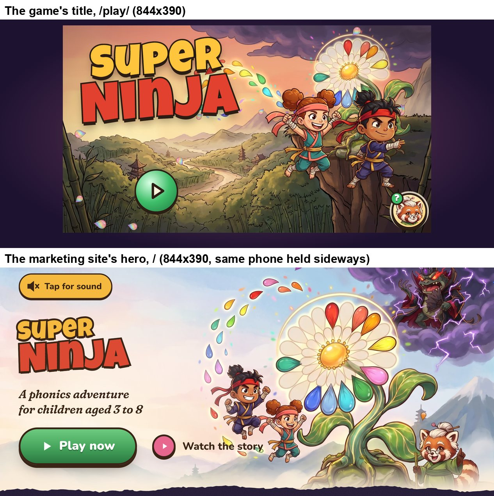

# The title screen: audit

**Status:** an audit of the game's title screen as it is today, 27 September 2026, about 06:45–07:15 BST. It is the starting point for a redesign. It makes no design proposals. It records what is wrong (measured where possible), every state the title has to handle, and what a new design must keep.

**Jonas (27 Sep, verbatim):** "Also the layout of the game start screen looks lame and boring and worse than the marketing site and the play button looks weird and little and out of place floating randomly."

**What was audited:**
- Production, `https://superninja.templestein.com/play/` (bundle `play-BkhzgbZT.js`), from a fresh profile and from seeded saves.
- The marketing site, `https://superninja.templestein.com/`.
- Headless Chromium through Playwright, `isMobile`, `hasTouch`, an iPhone Safari user agent, DPR 3. Taps are real touch events (CDP `Input.dispatchTouchEvent`).
- Three landscape phones:

| phone | CSS px | real DPR | 1 CSS px |
|---|---|---|---|
| iPhone 12–15 | **844×390** | 3 | 0.166 mm |
| iPhone SE | **667×375** | 2 (shot at 3, as briefed; the layout is the same) | 0.156 mm |
| iPhone Pro Max | **932×430** | 3 | 0.166 mm |

- The site was also shot upright, at 390×844 and 375×667.

The title in the current `src/` (App.tsx `Title`, src/styles/shell.css) matches production. Screenshots are in [`current/`](current/). The probes and raw JSON are in `playtest/runs/title-design/` (git-ignored, §8).

---

## 1. The short version

1. **The Play button is small, and it is not the loudest thing on the screen.**
   - It is a 150-stage-px circle: **74 CSS px (12 mm) on an iPhone 15**, 71 px on an SE and 82 px on a Pro Max, pulsing to 110 %.
   - It covers **1.3 % of the screen**. The site's "Play now" pill is 202×64 px, three times the area, with a label.
   - Sensei's Help coin in the opposite corner is 61 px, with a face and a **green "?" badge in the same green**. It competes with Play for the eye.
2. **Play floats because nothing holds it.** It sits in the lower left, over the busiest part of the painting (forest canopy, a pagoda, the river). It has no plate, no ground, no shadow on the scene and no label. It is centred under the logo but 120 stage px below it, so it doesn't read as part of the lockup. The heroes face and point elsewhere: Kai's throw points at the Help coin.
3. **A third of the phone is a dark frame.** The stage is a fixed 16:9 box, so a 19.5:9 phone gets plum-black bars: **107 px each side at 844×390** (116 px at 932). The title uses **68 %** of an iPhone 15's screen (69 % on a Pro Max, 82 % on an SE). The site's hero is full bleed.
4. **It is darker and muddier than the site.** Mean luminance on screen is **88/255 for the title** (117 inside the stage) and **178 for the site's hero**. The title's painting is a dusky sunset over an olive valley, darkened again by a vignette. The site is a bright pastel dawn on cream paper.
5. **The story is missing.** The site's hero shows the whole cast round a big, central World Flower: Kai and Suki leaping for petals, Sensei Maple cheering and Baron Muddle in his storm cloud.
   - The title has two cut-out heroes pasted over a small flower in the top-right corner, covering its stem and lower petals.
   - Sensei appears only as the Help coin. Baron isn't there at all.
6. **It barely moves.** The only motion:
   - two heroes bobbing 18 stage px;
   - a 1.3 s scale pulse on Play;
   - 14 small, pale drifting petals that look like soap bubbles.

   The logo and the painting are still. There is no glint, no entrance for anything but Play, and no voice. On launch it is silent: the title theme first plays on "Who's playing?", after the tap.
7. **One tap on Play starts the game twice.** The button and the scene behind it both run `start()`: two gongs, two 40-petal bursts, and `sessions` goes up by 2 (measured 6 → 8; a tap on the sky gives 6 → 7). The petal burst isn't at the button either (stage 640, 560). The fix workflow should know (§3.3).
8. **A cold first launch shows a grey box for about 2 seconds.** On 4G at CPU ×4, the title's painting (224 KB) finishes loading last, at **3.45 s** (LCP 3.54 s). It waits behind the 283 KB bundle and **32 hero-pose sprites (about 2.6 MB)** that `poses.ts` requests at boot. Until then the child sees the logo, Play and petals on flat `#222`. The site preloads its hero art. The game preloads nothing.
9. **What works:**
   - 59 DOM nodes;
   - 19 animations, all transform or opacity;
   - no requestAnimationFrame while idle (0 calls in 4 s);
   - 2 ms of main-thread work in 4 s;
   - the title music warm-up fetches without decoding (PERF.md fix 5).

   A redesign has a big budget left and must not spend it on the main thread.

---

## 2. The title today, measured

[`title-844x390-annotated.jpg`](current/title-844x390-annotated.jpg) marks the boxes below. The stage is 1280×720, scaled to fit the height. `Stage` (src/ui/ui.tsx) keeps 10 px free at the top and 26 px at the bottom on touch screens.

| | 844×390 | 667×375 | 932×430 |
|---|---|---|---|
| stage scale / size (CSS px) | 0.4917 / 629×354 | 0.4708 / 603×339 | 0.5472 / 700×394 |
| side bars (each) | **107 px** | 32 px | **116 px** |
| share of the screen the stage uses | **68 %** | 82 % | 69 % |
| Play (150 stage px), at rest / pulse peak | **74 / 81 px (12.2 / 13.4 mm)** | 71 / 78 px (11.0 mm) | 82 / 90 px (13.6 mm) |
| Play's centre on screen | (267, 293): 32 % across, 75 % down | (185, 281) | (294, 325) |
| Help coin (124 stage px) | 61 px (10.1 mm) | 58 px | 68 px |
| logo box / "Super" / "Ninja" cap size | 278×162 / 74 / 93 px | 266×155 / 71 / 90 px | 309×180 / 82 / 104 px |
| Suki, Kai (each, about) | 136×165 px | 130×160 px | 150×185 px |
| the site's "Play now" on the same phone | **202×64 px** (33×11 mm), label + ▶ | 202×64 | 202×64 |
| the site's logo "Super" / "Ninja" | 43 / 66 px | 41 / 64 px | 47 / 73 px |

In stage coordinates the logo sits at left 60, top 70, tilted −4°. Play's wrapper is at left 250, top 500 (centre 325, 575). The Help coin sits at right 14, bottom 14. Suki (`jump`, 270 px) is at 700, 230 and Kai (`throw`, 262 px) at 930, 236.

The game's logo is **1.4× the size of the site's** in landscape. The type isn't too small. The logo is the only element with any scale, and Play has almost none.

---

## 3. Weaknesses

### 3.1 Layout and use of the screen

- **The frame.** The side bars are a radial gradient from muted plum (`--world` #ff7aa2 mixed into #1d1230) to near-black. They frame the game like a video player on a web page ([`title-844x390.jpg`](current/title-844x390.jpg), [`title-932x430.jpg`](current/title-932x430.jpg)). On the two big phones a quarter of the width is dead. The site's hero runs edge to edge ([`site-hero-844x390.jpg`](current/site-hero-844x390.jpg)).
- **No layout grid.** The site's hero has one clear column on the calm left: logo, tagline, then Play, left-aligned at x 32, over a cream glow (`.hero-copy::before`), with the art on the right. The title has three things floating on one painting:
  - the logo, top-left;
  - Play, lower-left, over the forest;
  - the heroes, right, over the cliff.

  They are not aligned to each other, and nothing ties Play to the logo.
- **Busy where it should be calm, and calm where nothing is.**
  - Play sits on the most detailed part of the painting: canopy, pagoda, river bends.
  - The painted petal ribbon runs out of the logo's "R" and "A" towards the flower, so the logo's right edge collides with it.
  - The quiet sky (centre-top) holds nothing.
- **The heroes hide the painting's focal point.** The World Flower is painted top-right (its head at stage x ≈ 870–1130, y ≈ 40–290). Kai's head covers its lower petals, and both heroes cover its stem, leaves and roots. The flower, the heart of the story, is the smallest thing in the scene.
- **Stickers, not characters.** The heroes are `.sprite` cut-outs with a drop shadow and no contact with the ground. Both bob on `floaty` (±18 stage px, ±2°), so Kai, who "stands on the cliff" in the code, hovers over it and Suki hangs frozen mid-jump. Kai's pointing arm leads the eye to the Help coin.

### 3.2 Hierarchy

What an eye (or a three-year-old) lands on at 844×390, most to least:

1. the logo (13.7 % of the screen, saturated red and gold);
2. Suki and Kai with the glowing flower (about 14 %);
3. Sensei's coin, bottom-right: a face, a gold rim and a green "?" badge;
4. Play, a green ball on a green-olive forest.

Play's fill is #3fbf6a on an olive surround (average #74653f). It is separated from the forest mainly by its ink ring. It is only **1.21× the Help coin's diameter** (1.46× the area). Both are round ink-outlined coins, and the "?" badge on the coin is Play's exact green (`--good`). For a child who can't read, the screen has two green round things in opposite corners. Sensei's line for Help is "Tap the big green button to start!" (`help_start`), and the button is not big.

### 3.3 The Play button

- **Size:** see §2. It is 150 stage px, only 1.6× the in-game round buttons (92 px) and 1.5× Home (100 px). It has the same `btn-round` style as every control in the game (Next, Back, Hear it again, the map's side buttons), so it doesn't look special.
- **Style against the site's `.btn-go`:**

| | the title's Play (`.btn-round.go`) | the site's `.btn-go` |
|---|---|---|
| shape | circle, icon only (▶, 41 px) | pill, ▶ icon + "Play now" |
| size at 844×390 | 74 px circle | 202×64 px |
| fill | radial "glossy ball", #d9ffe4 → #3fbf6a → #1f7a41 | linear, #6ccb7f → #45a35c → #2b7a41 |
| outline, drop | 5 stage px (2.5 CSS) ink #2b1d14, hard 6 px (3 CSS) drop | 3 px ink #3a2416, hard 5 px drop + soft 14/24 px shadow |
| surround | busy forest | calm cream sky, aligned under the tagline |
| motion | pops in (scale 0.6 → 1, 0.45 s, after 300 ms), then `pulse` 1 ↔ 1.1 every 1.3 s | none (lifts 2 px on hover) |

  The game already has a pill close to the site's: `.btn-go-wide` on the Get-ready page.
- **Aliveness:** a uniform throb, and nothing else:
  - no glint, sheen or ring;
  - no idle escalation (the Choose screen has one: a bob at 8 s, a pointing hand at 16 s);
  - no voice. `tap_start` ("Tap to start!") is preloaded by the title and never said.
- **Press feedback:** on the tap the button doesn't squash, flash or leave. The petals burst from stage (640, 560), not from the button. The button keeps pulsing until the cut to "Who's playing?".
- **The whole screen is the button.** The title scene has `tapProps(start)`, so a tap anywhere starts the game (verified: a tap on the sky goes to Who's playing?). That is kind to children, but it means the button isn't needed to play, and any grown-ups' control added to the title must stop the tap reaching the scene.
- **Double start (bug, not a design issue):**
  - `RoundButton` runs `start()` on pointerdown, and the event bubbles to the scene's own `tapProps(start)`.
  - `tapProps` calls `preventDefault` but not `stopPropagation`, and `going` is still false in both closures.
  - So one tap on Play:
    - runs `sfx.gong()` and `sfx.whoosh()` twice;
    - bursts 80 petals;
    - calls `playMusic("title")` twice;
    - adds **2** to `sessions` (measured 6 → 8; `playtest/runs/title-design/double-start.ts`).

  (App.tsx `Title`: the scene's `tapProps(start)` at line 385, the button at lines 396–399.)

### 3.4 The art

- **Two different paintings of the same moment.**
  - The site uses `hero-wide.webp` (2400×1340): pastel dawn, the flower big and central, the cast of four painted in.
  - The title uses `title_bg.webp` (1920×1072): an orange-pink sunset over a deep valley, a storm cloud, and the flower small on a cliff top-right, with no characters. The heroes are sprites laid over it.
  - Setup ("Get ready") and "Who's playing?" reuse `title_bg` blurred and darkened (brightness 0.45 and 0.55). So the first three screens after the bright site are all this dusky painting.
- **Brightness and colour** (mean over the frame, 0–255 luminance, HSV saturation):

| | luminance | saturation |
|---|---|---|
| the title on screen (with bars) | 88 | 0.47 |
| the title's stage only | 117 | 0.42 |
| `title_bg` itself | 132 | 0.37 |
| the site's hero on screen | 178 | 0.25 |
| `hero-wide` itself | 191 | 0.20 |

  The vignette (`.vignette`, 35 % ink at the edges) takes the painting from 132 to 117.
- **The drifting petals don't match the painted ones.** `item_petal.webp` is a pale rainbow-opal teardrop. At 22–44 stage px (11–22 CSS px), over a sunset, it reads as a soap bubble. The painting's (and the site's) petals are single, saturated sound colours.
- **The site's cast is absent.** No Sensei Maple in the scene (only the Help coin) and no Baron Muddle. The story promise, "win the petals back from Baron Muddle", isn't on the title.

### 3.5 Typography

- The logo is the only text:
  - Luckiest Guy, "Super" in gold #ffc53d, "Ninja" in red #e2412f;
  - a 10-stage-px ink stroke (4.9 CSS px);
  - hard 12 px and soft 22/30 px shadows;
  - tilted −4°.

  It is big and well made, and it is the best thing on the screen. It is the same lockup as the site's `.logo` (tilted −3°, 6–9 px stroke, gold #f4b93e and red #dd4a33), in slightly different colours (§3.8).
- No tagline, no child's name and no word for the grown-ups. Children can't read, so that is fine for them. A parent gets nothing, not even "who's playing" (§4).
- The fonts load with `display=block` (play/index.html). On a cold launch the logo is invisible until Luckiest Guy arrives (about 1.5 s on 4G ×4).

### 3.6 Motion

| element | animation | notes |
|---|---|---|
| 14 petals (`PetalDrift`) | `drift`: translate (0, −60) → (−180, 800) and rotate 540°, linear, 9–17 s, random delays | small and pale (§3.4), and scattered at random over the logo and Play |
| Suki, Kai | `floaty`: translateY 0 ↔ −18 and rotate −2° ↔ 2°, 3.2 s and 2.7 s | the whole sprite bobs; nothing moves inside the character |
| Play | pops in at 300 ms (0.45 s), then `pulse` 1 ↔ 1.1 every 1.3 s | the only thing asking to be tapped |
| logo, painting, flower glow, storm, petal ribbon | none | the scene is a still picture ([`title-motion-844x390.mp4`](current/title-motion-844x390.mp4): the first 8 s are almost identical frames) |
| on Start | gong, 40-petal burst at stage (640, 560), whoosh, puffs at the heroes' feet, both heroes crouch and fly up 560 px (0.55 s), the title music starts; 500 ms after the tap the route changes, the screen cuts to near-black #1d1230 and fades in "Who's playing?" (0.6 s); the burst's petals keep falling over the next screen | [`start-tap-sequence-10fps.jpg`](current/start-tap-sequence-10fps.jpg): the ninja exit is mostly hidden by the cut to dark, which reads as a page reload, not a game transition |

Everything that loops runs on the compositor (transform, opacity). Measured over 4 s untouched at 844×390:
- 0 requestAnimationFrame calls (the effects canvas sleeps);
- main thread busy 2 ms;
- 1 style recalc and 0 layouts.

### 3.7 Sound

- **On launch the title is silent.** Browsers block audio before a gesture, so the Start tap is also the audio unlock (`unlockAudio()`: it resumes the AudioContext and sets the iOS audio session to "playback" so the silent switch doesn't mute the game). The title theme first plays after the tap, over the heroes' exit and on "Who's playing?".
- In a browser tab, the Get-ready page's "play here" tap has already unlocked audio before the title appears, but the title still says nothing.
- **Back on the title via Home, the land's music keeps playing** (measured: from the map, Bamboo Village's `world_bamboo` plays on the title; `playMusic` only runs in `start()`).
- There is no sound indicator or toggle on the title. Music volume (per player) and captions are on the grown-ups page, which is reached from the map. The site has a "Tap for sound" chip.
- Help says `help_start`: "Tap the big green button to start!"

### 3.8 The brand: site and game side by side

| | site (landing/landing.css) | game title |
|---|---|---|
| mood | "an illustrated picture book on warm cream paper": bright, airy, watercolour, torn-paper edges | a dusky sunset painting in a dark frame |
| ink | #3a2416 | #2b1d14 |
| gold / red | #f4b93e / #dd4a33 | #ffc53d / #e2412f |
| go green | #6ccb7f → #45a35c → #2b7a41 (linear) | #d9ffe4 → #3fbf6a → #1f7a41 (radial) |
| UI font | Nunito 800–900; Fraunces italic for the tagline | Baloo 2 (not used on the title) |
| Play | labelled pill, the clear end of a reading line | small icon coin in the scenery |
| cast | Kai, Suki, Sensei Maple, Baron Muddle, World Flower centre stage | Kai and Suki sprites; the flower small and covered; Sensei as a coin |
| framing | full bleed, the art's right side for the characters, the left for the words | letterboxed 16:9, everything scattered |
| motion | a petal canvas drifting over the art's right half, reveal-on-scroll | bobbing sprites, pulse, pale petals |

The two palettes are close but not the same. The logo lockup, Luckiest Guy and the ink-outlined chunky style are shared.

### 3.9 Performance today

**The live title** (844×390, after load):
- **59 DOM nodes** (35 in the stage). The budget is ≤ 400.
- 19 animations: `drift` ×14, `floaty` ×2 and `pulse` loop; `title-start-in` and the route fade are finite. All are transform or opacity.
- 0 rAF calls while idle.
- About 0.05 % of the main thread busy.

**A cold first launch** (the home-screen app path, no Get-ready; 4G at 150 ms RTT and 9 Mbps; CPU ×4; cache disabled): [`cold-load-4g-cpu4-filmstrip.jpg`](current/cold-load-4g-cpu4-filmstrip.jpg).

| ms | what happens |
|---|---|
| 452 / 904 | first paint / first contentful paint |
| 676 | the 283 KB bundle arrives; nothing on the page has been preloaded (the only preload is the modulepreload polyfill) |
| ~700, as the bundle runs | `poses.ts` requests **all 32 hero-pose sprites** first (`setTimeout(probePoses, 0)` at import, about 2.6 MB); then the title requests its painting, 8 Sensei mouth frames, the petal and the star, `tap_start.mp3`, and `title.mp3` (2.3 MB, low priority, its body thrown away: PERF fix 5). In the unthrottled run the poses were requested at 622 ms and the painting at 639 ms |
| 1567 | Luckiest Guy arrives; the logo appears |
| ~0.9 s–3.0 s | the child sees the logo, Play and petals on the stage's flat `#222`, in the plum frame |
| 2.1–3.0 s | the painting paints in bands from the top; the heroes appear before the scenery behind them |
| 2911–3357 | the 32 pose sprites finish |
| **3453** | `title_bg.webp` (224 KB) finishes, **last** |
| 3544 | largest contentful paint (the painting) |

- **Art sizing.** `title_bg` is 1920×1072 for every phone. An iPhone 15 needs 1888×1062 device px (a good fit). An SE (DPR 2) needs 1206×678, so it decodes 2.5× the pixels it shows. The painting has no `srcset` and no preload.
- **Caching.**
  - Images are served with `cache-control: public, max-age=0, must-revalidate`.
  - The service worker (`src/pwa/sw.template.js`) is cache-first for `/a/` once installed, so this cost falls on the first launch: the one right after the marketing site.
  - The site's own `hero-wide.webp` (184 KB, same origin) is in the browser's cache by then. The game doesn't use it.

---

## 4. Every state

The title component knows nothing about who is playing: it looks the same in every state ([`states` screenshots](current/)).

| # | state | how the child gets here | before / on the title | after Play | taps from the title to playing |
|---|---|---|---|---|---|
| 1 | **First launch, browser tab** (from the site's "Play now") | `/` → `/play/` | "Grown-ups: get ready!" (Setup) comes first: Share → Add to Home Screen steps on iPhone, full screen or install on Android, "No thanks, play here in the browser →". It has Home top-left and Help ([`first-launch-get-ready-844x390.jpg`](current/first-launch-get-ready-844x390.jpg)) | no players yet, so straight to **"What's your name?"**, a text field in the dojo with "A grown-up can help type it." ([`first-launch-after-start-name.jpg`](current/first-launch-after-start-name.jpg)); then the film, Choose, the opt-in, the Dojo welcome, Lesson 1 | Play, type, Go (an empty Go asks for a grown-up; a second plays as "Ninja 1") |
| 2 | **First launch, home-screen app** | the icon | the title is the very first screen; audio is locked until the first tap | as 1 | as 1 |
| 3 | **Held upright** (e.g. straight from the site's portrait "Play now") | | the turn-your-phone picture covers everything ([`play-opened-upright-390x844.jpg`](current/play-opened-upright-390x844.jpg)) | | |
| 4 | **Returning child, one player** | | the same title: no name, no "welcome back", no sign of their ninja or progress | **"Who's playing?"** with their card and a same-sized dashed "+" card ([`returning-1-player-whos-playing.jpg`](current/returning-1-player-whos-playing.jpg)); their card hops (0.56 s), then `afterLaunch()` resumes: the map with its welcome, or the next lesson ([`returning-after-pick-map-gear.jpg`](current/returning-after-pick-map-gear.jpg)) | **2 every time** (Play, then their own face). The "+" card is as big as theirs and leads to the name screen |
| 5 | **2–4 players** | | the same | one row of cards, 210×290 stage px (103×143 CSS px), most recently played first; a player without a ninja yet gets a big coloured initial ([`players-3-whos-playing.jpg`](current/players-3-whos-playing.jpg)) | 2 |
| 6 | **5 players** | | the same | two rows of smaller cards, 178×244 (88×120 CSS px), with "+" alone on the second row ([`players-5-whos-playing.jpg`](current/players-5-whos-playing.jpg)) | 2 |
| 7 | **6 or more players** | | the same | only the 5 most recent are shown (`shown = ….slice(0, 5)`, Profiles.tsx; from the code, not tested): **a sixth child can't be picked** | |
| 8 | **Back on the title with Home** | Home from the map, the film, Choose, the opt-in, the Dojo welcome, and the first session's lessons and rewards (NAVIGATION.md §3.3) | the same title, with the land's music still playing (§3.7) | "Who's playing?" again, even though the same child was just playing | 2 |
| 9 | **Mid first session** | | the same | after the pick, `afterLaunch()` resumes the film, the opt-in, the welcome or the lesson (`firstSession` is kept) | 2 |
| 10 | **New school year** (first launch on or after 1 September) | | the same | after the pick, the opt-in in "new year" mode | 2 |

**Grown-ups on the title:** none.
- The settings gear (hold 2 s, `HoldButton`, conic progress, "This part is for grown-ups. Hold the button to open.") exists only on the map (top-right) and on the opt-in.
- A parent who wants the settings before a child plays has to go Play → pick a child → map → hold the gear.
- The grown-ups page belongs to the current player (music volume, captions, school year, delete this player).
- Nothing on the title says whose game it is. Profiles are reached only by tapping Play.

---

## 5. What must stay

**The name**
- The Super Ninja lockup: Luckiest Guy, gold "Super" over red "Ninja", thick ink stroke, the tilt. It is shared with the site and the app icon.
- The child's own name, on their player card.

**Profiles**
- "Who's playing?" with one card per child: their ninja, or a coloured initial, and their name. Each child's save is separate (`superninja.profiles.v1`, `superninja.save.<id>`).
- Cards keep their order while the screen is open, and the picked card hops before the game moves on.
- Making a new player, with a typed name, "A grown-up can help type it", the empty-Go fallback to "Ninja n", and ◀ Back to the list.
- `profilesApi.select()` happens as the game leaves the screen, not before.
- `afterLaunch()` decides where a picked child resumes.

**Grown-ups**
- The press-and-hold gear (2 s, with its spoken line and the "Grown-ups: press and hold" hint on a short tap), so children don't open the settings by accident.
- The grown-ups page's return to the screen it was opened from (`{ name: "grownups", from }`).
- The Get-ready page before the title in a browser tab (once per tab session, `sn.setup`), with "play here".

**Sound**
- The first tap on the title is the audio unlock: `unlockAudio()` before any sound, including the iOS "playback" audio session.
- The title music streams through an `<audio>` element and is **never decoded** (PERF.md fix 5). The title may warm the HTTP cache with a low-priority fetch whose body is thrown away. PERF's gate: the title, 5 s untouched, holds **≤ 2 MB** of decoded audio.
- Help on the title says `help_start` (its words may change with the design).

**Navigation and layout contract**
- **The title is home:** it has no Home button (NAVIGATION.md rule 1), and every Home in §3.3 lands here.
- **Sensei's Help coin** is bottom-right on every screen, including the title (right 14, bottom 14, 124 stage px, z 85).
- Nothing moves on by itself: the title waits for a tap.
- HERO.md's ninja zone (bottom-left) and Home zone (top-left) are enforced on levels and on screens with a `.ninja-spot`. The sweep exempts `.scene.title`, so the title may use those areas. Keep the zones in mind for the screens around it: on "Who's playing?", Home is top-left.

**Test hooks the bots and treadmill rely on**
- the `.scene.title` class;
- `button[aria-label="Start"]` (scripts/treadmill/continuous.ts and first-minutes.ts press it with `pointerdown`);
- `window.__snState = { scene: "title" }`;
- `?scene=title`;
- the soak's "the title, 5 s untouched" sample.

**Performance**
- ≤ 400 DOM nodes.
- Endless animations only on transform and opacity, on HTML elements, not SVG internals (PERF.md fix 4).
- No rAF while idle.
- No `animationiteration` listeners (src/ui/ui.tsx drops them).
- A fast first paint.

---

## 6. Facts a new design has to work with

These are constraints, not proposals.

- **The stage is fixed at 1280×720 and scaled to the phone's height.** The side bars are outside it, in `.viewport`. Anything that uses them has to be drawn outside the stage, and must keep working as the width changes: 32 px bars on an SE, 116 px on a Pro Max.
- **Safe areas.** On notched phones held sideways, the notch or Dynamic Island takes about 47–59 px on one side, inside those bars. The home indicator sits along the bottom. Art can bleed there; controls can't.
- **Aspect ratios.**
  - `title_bg` and `hero-wide` are both about 1.79:1.
  - An iPhone 15 is 2.16:1. Full bleed needs art about 20 % wider, or a crop of about 17 % of the height.
  - `hero-portrait.webp` (1000×1792) is the upright version.
- **Available art** (repo paths the mockups may use):
  - `public/media/landing/hero-wide.webp`, `hero-portrait.webp`, `world-flower.webp`, `finale.webp`, `baron-night.webp`;
  - `public/a/i/title_bg.webp`, `world_flower_bg.webp`, `world_flower_stem.webp`;
  - hero poses `hero_{kai,suki}_{idle,jump,throw,cheer,run,cast,…}.webp` (640 px);
  - `sensei_{idle,talk,cheer}.webp`, `baron_{idle,angry}.webp`, `item_petal.webp`;
  - music `public/a/m/title.mp3` (2.3 MB, 167 s).
- **A tap anywhere starts the game today.** A design that keeps that must make other controls on the title (a gear, player faces) stop the tap. A design that drops it must still let a child start with one obvious tap.
- **Returning children tap twice** (Play, then their face). That count is a product decision the design touches. FIRST_MINUTES.md starts the five-minute clock "when the child taps the title screen" and wants the grown-up handover (Get ready, profile, name) under 20 s.
- **The first tap is also the audio unlock.** Any sound the title makes on launch can only start after a tap.

---

## 7. Decisions made during the audit (no one was asked)

- Chromium, not WebKit, so that CDP could measure the main thread and throttle the CPU and network. An iPhone user agent, so Setup shows its iPhone steps. Layout, sizes and timings are the same in both engines; Safari's rendering of the fonts may differ slightly.
- The SE was shot at DPR 3, as briefed. It is really DPR 2. The CSS layout is identical; §3.9 notes what DPR 2 means for the art.
- "Name" in "what must stay" was read as both the game's name (the logo) and the child's name (profiles).
- The states were made by seeding `localStorage` (players Maya, Leo, Ava, Theo and Isabella) rather than by playing through.

---

## 8. Method and files

Probes (all in `playtest/runs/title-design/`, git-ignored):

| command | what it does |
|---|---|
| `bun playtest/runs/title-design/probe.ts title <w> <h>` | first launch in a tab: Get ready → the title (frames, measurements, idle cost) → Play → the next screen |
| `bun playtest/runs/title-design/probe.ts states` | returning child, 3 players, 5 players, a fresh app launch, and a tap on the sky |
| `bun playtest/runs/title-design/probe.ts perf 4g` | cold load at CPU ×4 on 4G: filmstrip, paint entries, request order |
| `bun playtest/runs/title-design/probe.ts site <w> <h>` | the site's hero, measured |
| `bun playtest/runs/title-design/probe.ts video` | 8 s of the title, then Play (mp4) |
| `bun playtest/runs/title-design/double-start.ts` | `sessions` before and after one tap on Play, and one on the sky |
| `bun playtest/runs/title-design/music.ts` | which music plays on the title at launch, and after Home from the map |
| `bun playtest/runs/title-design/portrait.ts` | `/play/` opened upright |
| `python3 playtest/runs/title-design/make-figures.py` | copies the chosen shots to `current/` and draws the annotated and comparison figures |

Raw output is in `playtest/runs/title-design/out/`: `*-title.json`, `states.json`, `perf-4g.json`, `site-*.json` and every PNG.

Screenshots in [`current/`](current/):
- **the title:**
  - [`title-844x390.jpg`](current/title-844x390.jpg), [`title-667x375.jpg`](current/title-667x375.jpg), [`title-932x430.jpg`](current/title-932x430.jpg)
  - [`title-844x390-annotated.jpg`](current/title-844x390-annotated.jpg)
  - [`title-844x390-entering.jpg`](current/title-844x390-entering.jpg): Play mid pop-in
  - [`title-motion-844x390.mp4`](current/title-motion-844x390.mp4)
  - [`start-tap-sequence-10fps.jpg`](current/start-tap-sequence-10fps.jpg)
  - [`cold-load-4g-cpu4-filmstrip.jpg`](current/cold-load-4g-cpu4-filmstrip.jpg)
- **the states:**
  - [`first-launch-get-ready-844x390.jpg`](current/first-launch-get-ready-844x390.jpg)
  - [`first-launch-after-start-name.jpg`](current/first-launch-after-start-name.jpg)
  - [`returning-1-player-whos-playing.jpg`](current/returning-1-player-whos-playing.jpg)
  - [`players-3-whos-playing.jpg`](current/players-3-whos-playing.jpg)
  - [`players-5-whos-playing.jpg`](current/players-5-whos-playing.jpg)
  - [`returning-after-pick-map-gear.jpg`](current/returning-after-pick-map-gear.jpg): the gear is top-right on the map
  - [`play-opened-upright-390x844.jpg`](current/play-opened-upright-390x844.jpg)
- **the site:**
  - [`site-hero-844x390.jpg`](current/site-hero-844x390.jpg), [`site-hero-667x375.jpg`](current/site-hero-667x375.jpg), [`site-hero-932x430.jpg`](current/site-hero-932x430.jpg)
  - [`site-hero-390x844.jpg`](current/site-hero-390x844.jpg), [`site-hero-375x667.jpg`](current/site-hero-375x667.jpg): at 375×667 upright, "Play now" is below the fold
  - [`title-vs-site-844x390.jpg`](current/title-vs-site-844x390.jpg)
