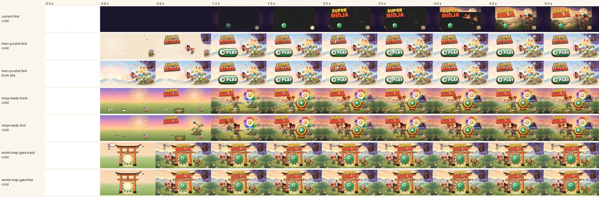
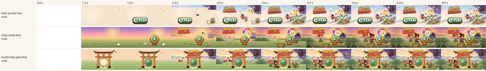

# The title mockups: cost judge

**Status:** a judgement of the three title mockups through one lens, 27 September 2026. **Is it cheap to run and fast to show?** Nothing here judges looks or layout. Every number was measured for this report (method in §6), next to today's title on production.

**Jonas (27 Sep, verbatim):** "Also the layout of the game start screen looks lame and boring and worse than the marketing site and the play button looks weird and little and out of place floating randomly."

## 1. Verdict

| | today's title | [hero-poster](hero-poster/) | [ninja-ready](ninja-ready/) | [world-map-gate](world-map-gate/) |
|---|---|---|---|---|
| **score (cost lens)** | — | **6 / 10** | **8 / 10** | **7 / 10** |
| title ready on a cold 4G load, CPU ×4 (art + logo + Play all shown) | **3.68 s** | **1.05 s** (1.03 s from the site) | 1.31 s | 1.1–1.2 s |
| slow 4G: when it first reads as the title | not measured (3.7 s on 4G) | 3.0 s (Play alone on cream until then) | 2.0 s | 2.1 s (the gate and Play from 1.0–1.5 s) |
| bytes before it's ready | ~3 MB (32 pose sprites first) | 490 KB | 565–630 KB (+150 KB of poses after) | 460–475 KB (+2.3 MB music at 2 s) |
| decoded size of the images on screen | 12.4 MB | 25–29 MB | 21–23 MB | **15–16 MB** |
| main painting sized for the phone | no | no (2400 px for every phone) | yes (1600 / 2400) | yes (1400 / 1920) |
| DOM (elements / all nodes) | 59 / 87 | **86–99 / 185–204** | 132–159 / 226–278 | 165–211 / 317–365 |
| endless animations | 17 | 37–38 | 32–34 | 35 |
| non-compositable, or on an SVG element (soak rule, budget ≤ 2) | 0 | 2 (on `<svg>`) | 2 (on `<svg>`) | **0** |
| rAF while idle | 0 | 0 | 0 | 0 |
| idle main thread, CPU ×4, 10 s | 0.1 % | 0.2–0.4 % | **0.1 %** | 0.3–0.4 % |
| composited layers drawing / area in screens | 24 / 4.4 | 46–48 / 6.6–7.6 | 44 / 4.5 | 50–52 / 6.5 |
| compositing cost while idle (software GPU, % of a core) | 11 % | **28–31 %** (2.7×) | **17–20 %** (1.7×) | 21–30 % (2.3×) |

In short:

- **All three fix the thing that is actually slow today.** Today's painting lands last, at 3.7 s, behind 2.6 MB of pose sprites. Every mockup has its title up in 1.0–1.3 s on the same 4G phone, with no long tasks, no rAF while idle and nothing ticking on the main thread.
- **They differ in what they cost while they sit there.** All three run twice as many endless animations as today, on twice as many layers. The main thread doesn't notice (0.1–0.4 %). The compositor does: 1.7× today's drawing cost for ninja-ready, 2.3× for world-map-gate and 2.7× for hero-poster. A title can sit idle for minutes while a grown-up sets up, so this is where the heat budget goes.
- **ninja-ready is the cheapest to run.** It's the slowest to show (1.3 s), because Play is the last thing to arrive and its "PLAY" plaque and the logo wait for the web font.
- **world-map-gate is the lightest to load and hold in memory, and paints best on a slow connection.** It has the most DOM, a big rotating ray layer, and it downloads the whole 2.3 MB title track 1.5 s after load.
- **hero-poster is the fastest on a good connection and the only one that needs no web font.** It is also the most expensive to keep on screen and the heaviest in memory. It ships one 2400 px painting to every phone. Its "already cached from the site" advantage is real only when the site was viewed sideways (§3.1).

Filmstrips (trace screenshots, cold cache, CPU ×4):

---

## 2. What to graft

These are the cheap, fast parts worth carrying into the build whichever design wins.

1. **Size the painting for the phone and preload it** (ninja-ready, world-map-gate). Use `<link rel="preload" as="image" imagesrcset=… imagesizes=… fetchpriority="high">` with a matching `srcset`. The SE (DPR 2) then gets the 1400–1600 px file (4.2–4.7 MB decoded) instead of 7.9–12.3 MB. In the game, the preload goes in `play/index.html`, so the art downloads alongside the bundle, not after it.
2. **A first paint in the painting's colours** (ninja-ready, world-map-gate). The body gets a gradient of the art's sky and meadow, so the first frame at 0.45–0.95 s is never grey or plum.
3. **Structure that paints before any image arrives** (world-map-gate). The inline-SVG gate, the portal glow and Play are on screen at 0.95–1.45 s even on slow 4G. hero-poster shows only Play on cream for the first 3 s there.
4. **A pre-rendered logo lockup and "PLAY" word** (hero-poster). They need no Luckiest Guy. The game loads its fonts with `display=block`, and on a cold 4G ×4 launch Luckiest Guy lands at 1.6–1.7 s (today's LCP trace), so a live-text logo is invisible until then. Graft the idea, not the files: 1222×761 px plus a same-size mask is 7.1 MB decoded for a lockup drawn 808–899 device px wide (§3.1).
5. **The cheapest ambience per effect** (ninja-ready). It keeps layers small (4.5 screens against 6.5–7.6) and uses a CSS transition for the gear's 2 s hold ring (no rAF even while held; hero-poster runs rAF during the hold). It uses 192 px face badges, not 640 px sprites shrunk to a 66 px face.
6. **One start per tap** (all three). A `going` guard plus `stopPropagation` on every control. Today's double start (audit §3.3) is gone in all of them.
7. **Stream the title music; never decode it** (all three). `<audio preload="none">`, and nothing calls `decodeAudioData` on it (PERF.md fix 5 holds).

**For every design, in the game itself:**

- **Stop `poses.ts` requesting all 32 pose sprites (2.6 MB) at boot.** Today they go out before the painting, and the painting lands last at 3.7 s. Probe them after the title's first paint, or after the first tap.
- **Serve the title art from `/a/`.** `src/pwa/sw.template.js` is cache-first only for `/a/` and `/assets/`; everything else, `/media/landing/` included, is network-first. Art left anywhere else costs a round trip on every launch and isn't there offline.
- **Add an idle "sleep".** After about 30 s untouched, pause the ambient loops (camera drift, rays, mist, orbits, drifting petals, twinkles) with a class and `animation-play-state: paused`, set by a timer, never rAF. Keep only Play's pulse and glint. Any tap wakes them. All three designs run 32–38 endless animations forever (today 17).
- **Keep the entrances short.** "Ready" in the table is gated by choreography more than by bytes: Play pops in 0.35–0.7 s after the page starts, then takes 0.5–0.6 s. The art is usually there before Play is.

---

## 3. Each design

### 3.1 hero-poster: 6 / 10

**Fast to show:**
- Cold 4G ×4, the fastest of the three:
  - logo 0.83 s;
  - painting 0.95 s;
  - Play 1.05 s (its entrance: 0.4 s delay + 0.55 s);
  - 490 KB in 10 requests;
  - no long tasks.
- From the site, held sideways, the painting is a 304 and paints at 0.58 s. "Ready" barely moves (1.03 s), because Play's entrance is the gate.
- It's the only design whose logo and Play label need no web font.
- On slow 4G it's the weakest: Play alone on a cream field from 1.5 s, the logo at 3.0 s and the painting at 3.6 s. Everything that makes it a title is an image, and the patches, mist and mask queue alongside the painting.

**Cheap to run:**
- Main thread: 0.17–0.41 % idle at ×4, 0 rAF, 0.1–1.1 style recalcs a second.
- The smallest DOM: 86–99 elements.
- The most expensive to keep on screen:
  - 46–48 drawing layers covering 6.6–7.6 screens;
  - 37–38 endless animations;
  - 13 elements with `will-change`, 3 masks, 5 filtered images;
  - 28–31 % of a core in the (software) GPU against 11 % today.
- Where that cost comes from:
  - the whole-painting camera drift (`tp-cam`, a full-screen layer that changes every frame);
  - the 1500-art-px rotating rays behind a mask;
  - the 3200-stage-px mist strip;
  - the saturate/contrast filter on the painting and on the three promoted patches.
- The heaviest in memory: 25–29 MB of decoded images.
  - `hero-wide.webp` (2400×1340, 12.3 MB) goes to every phone. On an SE at DPR 2 that is **3.2× the pixels it shows**.
  - `logo.webp` + `logo-fill.webp` (the glint mask) are 1222×761 each: 7.1 MB.
  - In the "several players" state, 640 px hero sprites are shrunk into 66 px faces (2 MB each).

**The "already in the cache" claim is conditional:**
- The site preloads `hero-portrait.webp` on every phone (`media="(max-width: 899px)"`). It loads `hero-wide.webp` only when held sideways (`<picture>` source `(orientation: landscape) and (min-width: 600px) and (max-height: 540px)`). A parent reading the site upright, the usual way, arrives with `hero-wide` uncached.
- An iPhone home-screen app has its own storage, so its first launch is cold whatever the site did.
- Production serves the file with `max-age=0, must-revalidate`, and the service worker treats `/media/landing/` as network-first. So even when cached, every launch pays a round trip (a 304), and offline there is no painting.

**Must fix:**
- **Size the painting per phone:** add a ~1400 px variant for DPR 2 through `imagesrcset`, and move the file under `/a/i/` so the service worker serves it cache-first. That trades the site-cache hit, which is rare (above), for instant repeat launches.
- **Cut the compositing to ninja-ready's level:**
  - drop the camera drift or the rays (each alone saved about 3–4 points of the 28–31 in the ablation);
  - bake the saturate/contrast into the image files;
  - shorten the mist strip;
  - take `will-change` off the 10 drifting petals.
- **Logo:**
  - export it at the biggest phone's need (~900 px wide, ~2 MB);
  - make the glint mask half size, or use the logo's own alpha;
  - put the logo before the patches and mist in the request order.
- **Move two endless animations off `<svg>`:** `tp-nudge` (the ▶ inside Play) and `taphint` (the idle paw), onto a wrapping ``. The house soak (`scripts/treadmill/soak.ts`) counts any SVGElement target as a main-thread animation, and these two fill the whole ≤ 2 budget on their own. Chromium does composite them today, but the gate will fail.
- **Faces:** use 192 px crops, as the other two do.
- **Start:** the 1.9× camera push into the flower rasterises the full painting layer at up to 1.9× (about 3.6× the pixels) for a second. Check it on a real iPhone SE before keeping it.

### 3.2 ninja-ready: 8 / 10

**Fast to show:**
- Cold 4G ×4:
  - dusk gradient at 0.46–0.48 s;
  - logo 1.14–1.22 s (live Luckiest Guy);
  - painting 0.98–1.02 s;
  - ninjas 1.06–1.07 s;
  - **Play last, at 1.31 s** (the gong starts 0.7 s after the page, then 0.5 s).
- Bytes: 565–630 KB before ready, the most of the three. After that, 150 KB of jump poses as a warm-up.
- Slow 4G: the gradient at 0.94 s, the gong at 1.8 s (its "PLAY" word waits for the font at 2.4 s), the logo at 2.0 s, the art at 3.7 s and the ninjas at 4.0–4.3 s.
- In the game, the font lands at about 1.7 s on 4G ×4, so the logo and the "PLAY" plaque would appear about half a second after the art.

**Cheap to run: the best of the three.**
- Idle main thread 0.08–0.11 % at ×4, 0 rAF, 0 style recalcs.
- 44 layers over 4.5 screens, the same area as today's title.
- 17–20 % of a core in the software GPU, 1.7× today's and about 60 % of hero-poster's.
- DOM 132–159 elements.
- 21–23 MB decoded, with the dusk painting sized per phone: 2400 px, or 1600 px for DPR 2 (4.7 MB).

**Must fix:**
- **Pre-render the logo and the "PLAY" plaque** (the graft from hero-poster). Under `display=block` they are blank until Luckiest Guy arrives.
- **Start the gong's entrance at 0.2–0.3 s, not 0.7 s.** Play is the thing to tap, and it's the last to appear.
- **Resize the flower art:**
  - `world_flower_stem.webp` is 900×967 (107 KB, 3.3 MB decoded), drawn about 606 device px wide;
  - `flower-bloom.webp` is 760 px (109 KB).

  Right-sized, they cut roughly 100 KB from the load.
- **The leap swaps `img.src` to the jump pose without `decode()`.** The warm-up starts 600 ms after load and finishes at 1.9 s on 4G (6.0 s on slow 4G). A child who taps sooner gets the swap mid-leap from the network, with a blank or stale frame. Decode before swapping, or keep the ready pose if the jump isn't decoded.
- **Move the two storm bolts' endless opacity animation off `<svg class="bolt">`** onto a wrapper (the soak's rule, as in hero-poster).
- **Drop `mix-blend-mode: screen` from the gong's glint.** A plain white gradient looks the same and avoids a blend pass every frame. The saving didn't show up above the noise here.

### 3.3 world-map-gate: 7 / 10

**Fast to show:**
- Cold 4G ×4:
  - the torii and the portal glow at 0.45–0.56 s, before any image;
  - Play 0.94–0.98 s (fully settled 1.16–1.18 s);
  - painting 0.86–0.88 s;
  - logo 1.07–1.09 s (live Luckiest Guy).
- Bytes: 460–475 KB, the fewest.
- On slow 4G it reads best: gate at 0.95 s, Play 1.45 s, logo 2.1 s, art 3.6 s.
- **The music warm-up:** 1.5 s after load it fetches all of `title.mp3` (2.3 MB) with its body thrown away. The game does the same today (PERF.md fix 5 allows it). On 4G that takes 1.95 → 4.2 s of the connection. On slow 4G it starts while the painting is still arriving and was still downloading 12 s after load.

**Cheap to run:**
- Idle main thread 0.32–0.36 % at ×4, 0 rAF.
- 0.8–0.9 recalcs and 0.2 layouts a second, from the 9 s idle nudge's forced reflow; trivial.
- **No endless animation on an SVG element or on a non-compositable property.** The only one of the three that is clean by the soak's rule.
- **The lightest in memory:** 15.3–15.6 MB decoded, 1.2× today. The SE gets the 1400 px vista (4.2 MB).
- 50–52 layers over 6.5 screens: 21–30 % of a core in the software GPU, 1.9–2.7× today. **The 1200-stage-px rotating rays behind a radial mask is the biggest single cost:** removing them saved about 6 points, the largest single saving in the ablation.
- **The most DOM:** 165–178 elements, 211 with the player shelf open. By the soak's own count (every node, TreeWalker), that is 317–365 against the ≤ 400 budget. A React port loses the whitespace text nodes, but the 50-node SVG gate and the 12 bordered ring petals stay.

**Must fix:**
- **Shrink the rays** to the portal's size (~700 px), or make them a static image that only breathes in opacity.
- **Warm the music later:** after the painting has painted and, better, after the first tap or in `requestIdleCallback`. Never while the art is still loading. The same change is worth making to the game's warm-up.
- **Bake the torii into the art** (or into one image) to take about 50 SVG nodes and their first-paint cost off the page. Keep an inline-CSS silhouette if the early gate matters.
- **Lazy-load `sensei_talk.webp`** (74 KB). It loads at startup but is invisible until Sensei speaks.
- **Check the vista on the big phones.** 1920 px is drawn at 2532–2796 device px (0.69–0.76× linear). It's cheap, but may look soft. If a 2400 px variant is added, keep the 1400 for DPR 2.
- **Drop `mix-blend-mode: screen` on the storm flash** (an unnecessary blend pass). Also the double `drop-shadow` filter on the live-text logo: it costs paint time once, at a moment when the CPU is busiest.

---

## 4. Things that are fine in all three

- **No rAF while idle:** 0 calls in 10 s at CPU ×4, in every state measured.
- **Compositor only.** Chromium's own trace logs a failure for every animation it can't run on the compositor. The only failures logged were "no visible change" at start-up, on elements not painted yet (an empty player row, patches before their image). No property or target failures. The idle style-recalc rate confirms nothing ticks on the main thread.
- **No long tasks during a cold load at CPU ×4** (today: 1.1 s in total, one of 557 ms). The mockups have no game bundle, so the React mount will still add its own.
- **The Start tap at CPU ×4:** 190–330 ms of main-thread work over 1.6 s, 0 rAF, no long tasks. Today it's 991 ms and 92 rAF calls (the effects canvas), which includes the route change the mockups stub out.
- **DOM:** all well under 400 elements.
- **The music is never decoded.**

---

## 5. Caveats

- **Chromium, not WebKit.** Layout, bytes and timings carry over. Compositing rules differ in detail:
  - WebKit may not accelerate individual `scale`/`translate` animations the way Chromium does (hero-poster's Play breathes on `scale`, and ninja-ready's entrances use `translate`/`scale`).
  - Masks and blend modes cost differently on Core Animation.
  - Before the build ships, one idle-heat check on a real iPhone SE settles it.
- **Software GPU.** Headless Chromium composites in software (SwiftShader), so the "% of a core" figures overstate a phone's GPU. They rank the designs by how much they draw every frame. Runs varied by ±3–6 points: hero-poster 27.8–31.2, ninja-ready 17.4–19.8, world-map-gate 20.9–30.1, today 11.0. The ranking held on every run.
- **"Layers" and "screens"** are the composited layers that draw content, times their size, divided by the phone's screen. That's a proxy for GPU memory and overdraw: Chromium rasterises only near the viewport.
- **The mockups are standalone pages.** In the game the 283 KB bundle and its React mount come first. Unless the painting is preloaded in `play/index.html` and `poses.ts` waits, the game will not match these load times. With both, expect roughly 1.2–1.7 s on 4G ×4 (the bundle and the art share the connection, and the title paints when React mounts) against 3.7 s today.
- **"Ready"** is when the painting has painted (element timing) and the logo and Play regions of the trace filmstrip are ≥ 90 % / ≥ 85 % of the way to their settled look. Loops were allowed for: a frame counts as settled if it matches any frame from the settled window (5.5–8 s).
- The mockup-only chrome (state switchers, the stand-in next screen, the turn-your-phone overlay) is excluded from "design" DOM counts. It is 7–12 elements.

---

## 6. Method and files

Every run: Playwright Chromium, `isMobile`, `hasTouch`, an iPhone Safari user agent, 844×390 at DPR 3 unless stated. The SE ran at 667×375, DPR 2 (its real DPR), and the Pro Max at 932×430, DPR 3.

The mockups were served from the repo root by a local server that sends production's headers (`cache-control: public, max-age=0, must-revalidate`, an ETag, 304 on a match). Today's title was measured on production (fresh profile, Get ready skipped, i.e. the home-screen path).

Scripts, all in `playtest/runs/title-design/judge-cost/` (git-ignored):

| command | what it measures |
|---|---|
| `bun …/cost.ts steady` | per design and state, at three phones:<ul><li>DOM;</li><li>animations and their properties;</li><li>Chromium's composite-failure trace;</li><li>layers;</li><li>image bytes and decoded sizes;</li><li>how the painting fits each phone.</li></ul>At 844×390 it also runs:<ul><li>10 s idle at CPU ×4 (main thread, style recalcs, layouts, rAF);</li><li>the Start tap at CPU ×4.</li></ul>→ `out/steady.json` |
| `bun …/cost.ts cold` | cold load, 4G (150 ms, 9 Mbps) + CPU ×4, cache off (and "from the site": `hero-wide` and `hero-portrait` fetched first, then revalidated). Collects paints, LCP, element timing, fonts, long tasks and requests, plus trace screenshots every frame → `out/cold-*.json`, `out/frames/` |
| `NET=slow4g bun …/cost.ts cold` | the same on slow 4G (400 ms, 1.6 Mbps), mockups only → `out/slow-*.json` |
| `python3 …/frames.py cold` / `slow` | visual progress of the whole screen, the logo and Play against the settled frames; the filmstrips in `judge-cost/` → `out/progress-*.json` |
| `bun …/extra.ts` | the house soak's own rules (`scripts/treadmill/soak.ts`: every node, SVG-targeted and hidden endless animations) at 3.5 s and 9.5 s, and the decoded size of the images actually drawn → `out/extra.json` |
| `bun …/pipeline.ts` (and `--ablate`) | CPU time of every Chromium process (renderer, GPU, browser) over 10 s idle; the ablation switches off one effect at a time → `out/pipeline*.json` |

Decisions made without asking:
- The "several players" state was taken as the worst case for DOM and decoded size.
- "Ready" needs Play fully in view, so the designs' entrance animations count against them. That is deliberate: the child is waiting for Play.
- ≤ 400 DOM nodes was checked two ways, by elements (the audit's count) and by all nodes (the soak's).
- The idle "sleep" (§2) is a proposal for the build, not something any mockup does.
