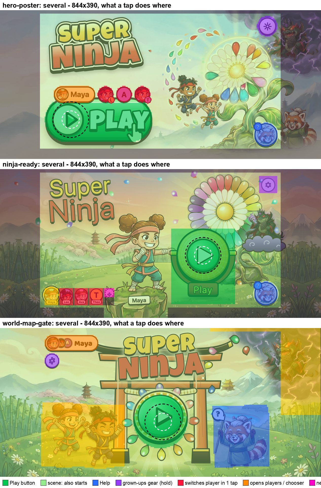

# Title mockups: the small-hands judge

**Status:** a judgement of the three title mockups, 27 September 2026, about 08:15–08:35 BST. The lens is one question: **would a 3-year-old know exactly where to tap, first time, without help?** Four things count:
- Play is big, sits where the layout puts it, is alive, and can't be mistaken for anything else.
- A near miss still does the right thing.
- A grown-up can find profiles and settings.
- A child can't reach profiles or settings by accident.

Art, brand and performance belong to other judges. They come in here only where they change what a child taps.

**Judged:** [`hero-poster/`](hero-poster/) (file of 08:13), [`ninja-ready/`](ninja-ready/) (07:42), [`world-map-gate/`](world-map-gate/) (07:44), with production's title (https://superninja.templestein.com/play/, fresh profile) as the baseline.
- Three landscape phones: 844×390, 667×375 and 932×430.
- Three states: first launch, one child (Maya), and several children (4 in hero-poster and ninja-ready, 6 in world-map-gate).
- Touch only (Playwright, `isMobile`, `hasTouch`). Method in §6.

---

## 1. Scores

| | score /10 | in one line |
|---|---|---|
| today's title (baseline) | 4 | Play is a 78 px coin (1.5–2 % of the screen) in the forest. A child succeeds anyway, because the whole scene starts the game. |
| **world-map-gate** | **8** | The clearest "tap here" of the three: Play is dead centre in a glowing gate and everything flows into it. Profiles sit behind a shelf that takes two deliberate taps. Weak spots: the heroes are toys that don't start the game, and a thumb gripping the edge starts it. |
| **ninja-ready** | **7** | The most forgiving: 100 % of sloppy taps aimed at Play start the game, and the child's own ninja "strikes" the gong. But one tap on a sibling's badge swaps who plays, and so does a one-tap green "+". Play sits off-centre under a busier flower. |
| **hero-poster** | **6** | The biggest and liveliest Play. But when a child exists, the profile row sits **on** its top edge (0.5 mm gap). A real tap 6 px inside Play's drawn edge switched the player to Ava instead of starting. |

All three beat today on the first question. None is safe for profiles yet.

---

## 2. The numbers

Unless noted, figures are at 844×390. Ranges run SE → Pro Max. "Starts" counts a tap on Play and a tap on any other part of the scene that also starts the game. "Scatter" is 3,000 seeded taps aimed at Play's ▶, with a 2-D Gaussian error of 4 mm (a careful tap) or 8 mm (a hurried 3-year-old). 1 CSS px = 0.166 mm (0.156 mm on the SE).

| | today | hero-poster | ninja-ready | world-map-gate |
|---|---|---|---|---|
| Play as drawn, at rest (CSS px) | 71 / 78 / 87 coin | pill ≈259×108 / 269×112 / 301×125 | gong + plaque 132×168 / 138×175 / 158×197; its tap box 167×197 at 844 | 127 / 133 / 148 circle |
| the ▶ a child aims at | the whole coin | 49–59 px | green centre 83–100 px | 56–68 px |
| share of the screen | 1.5–2 % | 9–12 % | 7–9 % | 5–7 % |
| Play's centre (across, down) | 32 %, 75 % | 16–22 %, 74 % | 63 %, 58 % | **51 %, 63 %** |
| 4 mm scatter: starts | 99.5–99.9 % | 99.6–100 %, first launch; **95.7–98.4 % with a child** (the rest open Who's playing?) | **100 %** | **100 %** |
| 8 mm scatter: starts | 90–95 % | 74–93 %: 7–15 % do nothing (off the stage), **10 % open Who's playing?** once a child exists, up to 1 % switch the player | **99.6–100 %** | 97–99 %: 0.6–2 % poke a hero, ≤ 0.7 % Help |
| nearest thing that isn't a start, from Play's edge | Help, 54–67 mm | **the name tag, 0.5 mm** (with a child); Help, 40–50 mm (first launch) | Help, 7.5–9.5 mm | Kai's toy box, 4.5–5.5 mm |
| screen where a tap does nothing | 18–32 % | 18–32 % (the bleeds, the bottom strip, the painted Sensei and Baron) | 16–33 % (bleeds, bottom strip) | **0.4–1 %** |
| screen that reacts but doesn't start | 1 % (Help) | 2–5 % (Help, gear, name tag, faces) | 2–5 % (Help, gear, badges, "+") | **26–28 %** (Kai and Suki 17–19 %, Sensei-as-Help 7–9 %, chip, gear) |
| one tap changes who plays | — | **yes** (a sibling's face, on Play's edge) | **yes** (a sibling's badge, bottom-left) | no: chip → shelf → face; a stray tap only closes the shelf |
| one tap makes a new player | — | no | **yes**: a green dashed "+", 24–32 px (3.7–5.3 mm) | no (inside the shelf) |
| a tap on the child's **own** face | — | opens Who's playing? | a shout, no start | opens the shelf |
| grown-ups' gear (hold 2 s) | none on the title | top-right, 43–50 px | top-right, 43–50 px | top-left under the chip, **36–42 px** |
| a thumb gripping a side edge | nothing | nothing | nothing | **starts the game** |
| nudge after sitting still, with sound still locked | none | a paw taps Play at 8 s; a golden petal flies from the flower into Play every 9 s | **none** (the 12 s nudge is spoken only) | Play hops at 9 s, then every 14 s |
| DOM nodes / rAF calls while idle | 62 / 0 | 100–111 / 0 | 142–157 / 0 | 180–193 / 0 |

Hit maps (what a tap does, everywhere on the screen, with the 4 mm and 8 mm rings round the ▶):
- [`judge-small-hands/hitmap-844x390-first.jpg`](judge-small-hands/hitmap-844x390-first.jpg), [`…-one.jpg`](judge-small-hands/hitmap-844x390-one.jpg), [`…-several.jpg`](judge-small-hands/hitmap-844x390-several.jpg)
- [`judge-small-hands/hitmap-667x375-several.jpg`](judge-small-hands/hitmap-667x375-several.jpg), [`judge-small-hands/hitmap-932x430-several.jpg`](judge-small-hands/hitmap-932x430-several.jpg)
- [`judge-small-hands/profile-taps-844x390.jpg`](judge-small-hands/profile-taps-844x390.jpg): one tap on a sibling in each mockup

---

## 3. Real touch taps (140: 126 in the batch run, 14 in follow-ups, each on a freshly loaded title)

| tap | hero-poster | ninja-ready | world-map-gate |
|---|---|---|---|
| the ▶, every state and phone | starts once | starts once | starts once |
| two taps on Play 150 ms apart | 1 start (`__starts` = 1) | 1 start | 1 start |
| **6 px inside Play's drawn top edge**, ¾ across (several children) | **no start; switched to Ava** ("Ava!") | starts | starts |
| 12 px above Play's top edge (several children; all three phones) | **no start; switched to Ava** | starts | starts |
| 12 px below Play's tap area | starts | nothing (the dead strip under the stage) | starts |
| the most striking hero | starts | starts (the child's own ninja) | **a shout and a hop, no start** |
| a sibling's face, then Play | **plays as Leo** | **plays as Leo** ("Welcome back, Leo!") | chip → shelf; the tap meant for Play only closes the shelf; still Maya |
| the child's own face | Who's playing? (a detour) | a shout, no start | the shelf opens; own card → shelf closes, still Maya |
| "+" (new player) | not on the title | **the name screen, in one tap** | in the shelf: a second tap goes to the name screen |
| a thumb resting on the left or right edge, 400 ms (all three phones) | nothing | nothing | **starts** |
| a palm on the lower-left corner, then a tap on Play (SE, 844) | starts as Maya | starts as Maya | starts as Maya |
| Help (first launch) | "Tap the big green button to start!" | **the help line is cut off after ~0.5 s** by the unlock greeting ("Tap to start!"); the `help_start` clip is paused | "Tap the big green button to start!" (painted Sensei) |
| gear, short tap | the "Grown-ups: press and hold" hint | the hint | the hint (checked separately: `gear-debug.ts`) |
| gear, held 2.3 s | the grown-ups page | the grown-ups page | the grown-ups page |

---

## 4. Each mockup through small hands

### world-map-gate: 8/10

**What a 3-year-old sees:** a gate in the middle of a sunny meadow. A glowing green button sits in its opening, ringed by a slowly turning rainbow of petals. Light rays, rising motes and petals fleeing Baron's storm all pour into it. It is the only thing on the screen that a composition this symmetrical could be about.

What works:
- Play is where the layout's logic puts it: dead centre (51 % across), framed twice (the gate, then the petal ring). The motion all converges on it.
- The idle hop at 9 s is visual, so it works before the first tap has unlocked sound.
- Profiles are the safest of the three:
  - one chip, top-left, with the child's face and name;
  - it opens a modal shelf of 55–57 px faces;
  - a tap outside a face only closes the shelf.

  A sibling switch takes two deliberate taps, then Play (verified: a mistaken tap aimed at Play while the shelf is open doesn't start as anyone). The chip isn't shown on first launch, when there's no one to switch between.
- Almost nothing is dead: 99 % of the screen does something.

What a small hand trips on:
- **The heroes are toys, not starts.** Kai's and Suki's hit boxes are the image rectangles, empty meadow included. Together they are 17–19 % of the screen, and Kai's box comes within 4.5–5.5 mm of Play's edge. They are the first thing a child of that age taps: a child their own size, cheering. The poke is delightful (a shout, a hop), but it is not a start. 0.6–2 % of 8 mm taps aimed at Play land on a toy.
- **Help is the painted Sensei, not the coin.** Sensei is 137–160 px across (7–9 % of the screen) and she is great for a pre-reader: poke her and she says "Tap the big green button to start!". But she replaces the Help coin that NAVIGATION.md and HERO.md put bottom-right on every screen.
- **The grip starts the game.** The whole viewport starts on `pointerdown`, so a thumb resting 22 px from either side edge started the game on all three phones. That's harmless for play, but a parent passing the phone, or a child picking it up, skips the title and its one chance to switch player.
- The gear is 36–42 px, under the 44 px minimum for a grown-up's thumb. The chip and gear sit top-left, where Home lives on every other screen.
- Play is the smallest of the three (5–7 % of the screen, 127 px on the SE). It reads as big because nothing competes with it.

### ninja-ready: 7/10

**What a 3-year-old sees:** their own ninja, huge, on a rock in the middle, fist against a gold gong with a green ▶ in it and a red PLAY plaque below. It is a story they understand: hit the gong and off you go.

What works:
- **It is the most forgiving layout.** Play's tap area (167×197 at 844) is bigger than the drawn gong. The nearest thing that isn't a start is Help, 7.5–9.5 mm away. So 100 % of careful taps and 99.6–100 % of sloppy ones start the game.
- **The child's own ninja starts the game when tapped.** The biggest, most personal thing on the screen does the right thing.
- The ninja's action points at Play, so Play doesn't float: it is the thing the hero is about to strike.

What a small hand trips on:
- **One tap on a sibling's badge swaps who plays** (verified: Leo's Kai drops onto the rock, Sensei says "Welcome back, Leo!", and Play then starts Leo's save). Because that swap is such a good reward, children will do it for fun.
- **The "+" is a one-tap route to "What's your name?"** (verified). It is green, the colour the child has been told means "go", and 3.7–5.3 mm across: too small for the grown-up it is meant for, and a magnet for a child.
- The badges sit 5 mm from the bottom edge, in the SE's grip zone (the child's own badge is in it; tapping it gives a shout and no start).
- **Play is off-centre** (63 % across, under the World Flower):
  - The flower is the busiest thing on the screen: a rainbow halo, turning rays, an orbit of petals.
  - Its gold heart sits right above the gold gong, so there are two gold discs stacked on the right.
  - The green part, which Sensei's line calls "the big green button", is only 83–100 px.
- **No nudge that works without sound.** At 12 s Sensei says "Tap to start!", but on a home-screen launch sound is still locked, so nothing visible happens.
- **The first tap on Help cuts Help off:** `unlock()` schedules the greeting 0.5 s later, and `say()` pauses the help clip for it.
- 30–33 % of the big phones' screens is dead (the bleeds, and the strip under the stage).

### hero-poster: 6/10

**What a 3-year-old sees:** the marketing painting, bright and full-bleed, with the heroes leaping for the flower on the right. On the left is a giant glossy green pill with a cream ▶ disc and the word PLAY. It is the most "button" button of the three, and a child who has seen YouTube knows ▶.

What works:
- Play is **the biggest** of the three (9–12 % of the screen) and the most alive. It:
  - breathes;
  - has a glint sweeping across it;
  - sends out a gold ripple;
  - nudges its ▶;
  - at 8 s, gets a paw that taps it;
  - every 9 s, catches a golden petal that arcs from the World Flower into its disc. This is the best eye-leading device in any of the mockups: it carries the child's eye from the art they look at first to the thing they should tap.
- The word is pre-rendered, so Play is whole at first paint without waiting for the font.
- The press sinks the pill onto its shadow and flashes it. `__starts` proves one tap is one start.
- On first launch, with no profile controls on screen, it is nearly perfect: 99.6–100 % of careful taps start the game.

What a small hand trips on:
- **The profile row sits on Play.** With a child, the name tag and the siblings' faces sit on Play's top edge, overlapping the pill by about 11 CSS px.
  - A real tap **inside** Play's drawn top edge switched the player to Ava and didn't start. So did a tap 12 px above it, on all three phones.
  - 10 % of sloppy taps aimed at the ▶ open Who's playing? instead of starting (0.5 mm gap).
  - The row puts the child's own face, and their siblings', on the button itself. That breaks "never confused with anything else" at the exact spot the child is aiming.
- **A tap on a sibling's face switches who plays**, and Play then starts that child's save (verified: Leo).
- **The ▶ disc sits at the pill's left end, near the dead bleed:**
  - 7–15 % of sloppy taps aimed at it do nothing.
  - 31–32 % of the big phones' screens is dead, including the painted Sensei and Baron.
  - A child who taps the friendly red panda gets nothing.
- **The layout is the site's web hero:** a copy column on the left (logo, then Play) and art on the right, with the heroes leaping away from Play. Play is anchored, not floating, but it lives in a column of words, not in the world.
- On the SE, Play is 108 px tall, under the 110 target.

---

## 5. What to graft, what must be fixed

### Graft

1. **world-map-gate's composition.** Play dead centre, framed, with the scene's motion (rays, portal glow, petals fleeing Baron) converging into it. Nowhere else does the layout itself say where to tap.
2. **world-map-gate's profiles: one chip that opens a modal shelf.**
   - A switch takes two deliberate taps.
   - A stray tap only closes the shelf.
   - The chip is hidden on first launch.
   - The shelf's faces are big enough (55–57 px).
3. **world-map-gate's whole-screen tap.** Nothing on the screen is dead. A 3-year-old whose tap does nothing decides the game is broken.
4. **ninja-ready's own ninja, next to Play, that starts the game when tapped,** with its action aimed at Play. The biggest, most personal thing on the screen should do the right thing.
5. **ninja-ready's clear ring round Play.** A tap area bigger than the drawn button (167×197 around a 138 px disc), and about 8 mm or more round it where every tap starts.
6. **hero-poster's golden petal from the flower into Play every 9 s,** and its **8 s paw.** Both are visual, so they work before sound is unlocked (and world-map-gate's hop can stay).
7. **hero-poster's press** (sinks onto its shadow, flashes) and its **pre-rendered label.** Play must be whole at first paint.
8. **From all three:** Help's "?" badge in blue, so Play is the only green thing on the screen. One tap is one start (a `going` guard; the controls stop their taps). Keep hero-poster's `__starts` hook for the bots.

### Must fix

1. **Nothing that changes who plays may sit within 8 mm of Play, and no single tap on the title may change who plays.**
   - Evidence, hero-poster: 0.5 mm gap; a real tap inside Play's edge switched to Ava.
   - Evidence, ninja-ready: a one-tap badge swap, then Play starts Leo's save.
   - Use world-map-gate's chip-and-shelf.
2. **No one-tap "new player" on the title.** ninja-ready's green 24–32 px "+" goes straight to the name screen. It belongs in the shelf (or the grown-ups page), and not in go-green.
3. **The child's own face must never be a dead end.** All three put it on a control that doesn't start the game:
   - hero-poster: Who's playing?;
   - ninja-ready: a shout;
   - world-map-gate: the shelf, then back to the title.

   It is the first thing a small child taps. In the shelf, a tap on your own face should close it and make Play hop (or start as you). The big ninja in the scene should start the game.
4. **No dead screen.** hero-poster and ninja-ready leave 30–33 % of the big phones dead: the painted bleeds and the strip under the stage, and in hero-poster the painted Sensei and Baron. Let the whole viewport start the game, as world-map-gate does.
5. **Toys must not crowd Play** (world-map-gate).
   - Kai's and Suki's hit boxes are rectangles of mostly meadow, 4.5–5.5 mm from Play. Hit-test their silhouettes, or shrink the boxes.
   - Make the child's own hero start the game.
   - The others may react, but should hand the child on to Play: Play hops or glows when a toy is poked.
6. **Keep Help as the coin, bottom-right, 124 stage px.**
   - world-map-gate's painted-Sensei Help is 7–9 % of the screen and breaks the NAVIGATION.md/HERO.md contract.
   - The painted Sensei can still say the same line when poked.
   - If the contract changes, log it in DECISIONS.md.
7. **The grip must not start the game** (world-map-gate). Ignore scene touches that begin within about 6–8 mm of a side edge, or start the scene on a short tap (up within 400 ms, moved less than 10 px) rather than on `pointerdown`. Play itself keeps `pointerdown`, which the treadmill presses.
8. **The idle nudge must be visible** (ninja-ready). On a home-screen launch sound is locked, and the 12 s spoken nudge shows nothing.
9. **Help must finish its line** (ninja-ready). The unlock greeting cuts `help_start` after about 0.5 s.
10. **Sensei's words must match the button** (ninja-ready). "Tap the big green button" points at a gold gong with an 83–100 px green centre and a red PLAY plaque. Make the green bigger, or change the line.
11. **The gear for grown-ups:**
    - It needs to be at least 44 CSS px (world-map-gate's is 36–42).
    - A 2 s hold with a filling ring resists children but doesn't stop them: a toddler who holds gets in, the same as on the map today. The grown-ups page's destructive actions (delete this player) need their own confirmation.
12. **Play is at least 110 CSS px on the smallest phone.** hero-poster's pill is 108 px tall on the SE.

**Recommendation:**
- Build on **world-map-gate's** layout and its profile shelf.
- Give Play **ninja-ready's** clean ring, and let the child's own ninja start the game.
- Add **hero-poster's** flower-to-Play petal, paw, press and pre-rendered label.
- Close every one-tap path to "someone else plays".

---

## 6. Method and files

- **Browser:** Chromium through Playwright, `isMobile`, `hasTouch`, an iPhone Safari user agent. DPR 3 on 844×390 and 932×430; DPR 2 on the SE, its real density.
- **Taps:** real touch events through CDP `Input.dispatchTouchEvent`, with a 12 px touch radius.
- **Mockups:** served from the repo root.
- **Production:** a fresh profile with `sn.setup` set, which reaches the title. Its title is the same in every state, so it was probed once per phone.
- **Hit maps:**
  - The page settles for 2.6 s (every entrance has landed), then sits 3 s untouched.
  - All animations are then paused, and `elementFromPoint` runs every 3 CSS px.
  - Each point is classified by the mockup's own handlers (which controls stop the tap, and what the scene does). Categories: Play; scene start; Help; gear; switch player; open players; new player; toy; nothing.
- **Scatter:** 3,000 seeded points per case, aimed at the ▶ icon, because children read the symbol, not the word. The error is a 2-D Gaussian of 4 mm and 8 mm, clamped to the screen.
- **Grip zone:** 12 mm in from each side edge, over the lower 65 % of the height.
- **Real taps:** 140 (126 in the batch run, 14 in `shelf.ts` and `gear-debug.ts`), each on a freshly loaded title, with the outcome read from the page (a start, the player's name, Sensei's words, the shelf, the grown-ups page).
- **Caveats:**
  - Chromium, not WebKit, and headless, where the safe-area insets are 0. On a notched iPhone the controls stay inside the stage, well clear of the notch.
  - The mockups' next screens are stand-ins.
  - Play's measured size varies by up to 5 % with its breathing; the table gives it at rest.
- **Decided without asking** (per the house rules):
  - DPR 2 for the SE.
  - The ▶ as the aim point.
  - "Several" means each mockup's own several-players state (4 or 6 children).
  - world-map-gate's short-tap gear hint didn't show in the batch run, but a separate run showed it (`gear-debug.ts`). It counts as working.

Probes (git-ignored), in `playtest/runs/title-design/judge-small-hands/`:

| command | what it does |
|---|---|
| `bun playtest/runs/title-design/judge-small-hands/probe.ts maps` | hit maps, scatter, sizes, idle rAF; writes `out/maps.json` and the `*-hitmap.png` files |
| `bun playtest/runs/title-design/judge-small-hands/probe.ts taps` | the 126 batch touch taps; writes `out/taps.json` and `out/taps.log` |
| `bun playtest/runs/title-design/judge-small-hands/shelf.ts` | world-map-gate's shelf (sibling, own face, "+"), and ninja-ready's first tap on Help |
| `bun playtest/runs/title-design/judge-small-hands/gear-debug.ts` | world-map-gate's gear on a short tap |
| `python3 playtest/runs/title-design/judge-small-hands/sheet.py` | the hit-map contact sheets in `docs/title-design/judge-small-hands/` |
