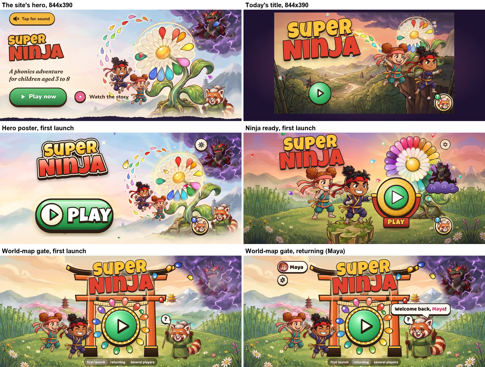

# Title redesign: the "wow and brand" judge

**Status:** one judge's verdict on the three title mockups, 27 September 2026. It uses one lens: *is the title clearly more exciting than the marketing site, is it consistent with the site (the same world, characters and type), and does it feel like a premium children's game rather than a web page?* Other judges cover usability, performance and the navigation contract. Notes on those appear below only where they change how the screen looks and feels.

**Jonas (27 Sep, verbatim):** "Also the layout of the game start screen looks lame and boring and worse than the marketing site and the play button looks weird and little and out of place floating randomly."

## 1. Verdict

| | Hero poster | Ninja ready | World-map gate |
|---|---|---|---|
| **More exciting than the site?** | **5**: bolder, but the same picture | **8** | **8** |
| **Consistent with the site?** | **9** | **5**: a different time of day, flower and Baron | **8**: the World Flower is missing |
| **Feels like a premium children's game?** | **5**: reads as the site's hero with the copy taken out | **8** | **8** |
| **Overall, on this lens** | **6 / 10** | **7 / 10** | **8 / 10** |
| Answers "Play is little and floating"? | yes: the biggest Play (281×117), anchored under the logo | yes: a gong standing on the meadow | yes: centred in the gate, where the eye goes |

**Recommendation:** build on **world-map-gate**. It is the only one that is both clearly more exciting than the site and clearly the site's world. Add **ninja-ready's** physical Play object, its "PLAY" plaque and the child's own ninja. Add **hero-poster's** painted World Flower and its petal "comet" flying into Play. §4 lists the grafts and §5 what must be fixed first.

All three beat today's title easily: no dark frame, 1.8–3.5× the Play button, and brighter. The question here is only whether they beat the site.

## 2. The numbers

These are my own shots: Playwright, `isMobile`, `hasTouch`, iPhone UA, DPR 2. The live site and the live title come from production; the mockups are served locally. Play is the button's box (`button[aria-label="Start"]`, or the site's `.btn-go`). Brightness is mean luminance (0–255). Colourfulness is Hasler–Süsstrunk: higher means more vivid.

| 844×390 | brightness | saturation | colourfulness | Play (CSS px) | Play's share of the screen |
|---|---|---|---|---|---|
| **the site's hero** | **178** | 0.27 | **61** | 202×64 pill | 3.9 % |
| today's title | 90 | 0.49 | 70 | 79×79 | 1.9 % |
| hero poster | 184 | 0.26 | 61 | **281×117** pill | **10.0 %** |
| ninja ready | 136 | 0.45 | **79** | 167×197 gong (disc 144) | **10.0 %** |
| world-map gate | 151 | 0.40 | 78 | 139×139 disc (about 195 across with its petal ring) | 5.9 % |

On the iPhone SE (667×375) Play measures 270×112 (hero poster), 160×188 (ninja ready) and 133×133 (world-map gate). On the Pro Max (932×430) it is 312×130, 186×219 and 152×152. The rest of the table is in `playtest/runs/title-design/judge-wow/out/` (see §7).

What the numbers say:
- **Hero poster is statistically the site.** It has the same brightness, saturation and colourfulness (61 against 61), because it is the same painting.
- **Ninja ready and the gate are about 30 % more colourful than the site** (79 and 78 against 61). They are darker than the site's pastel paper (136 and 151 against 178), but brighter than today's title (90). "More vivid than the site but still bright" is the right target for a game, and the gate lands closest to it.

## 3. Each design, through this lens

### 3.1 Hero poster: 6 / 10

**What it gets right**
- **It is the site's world, exactly.** It reuses `hero-wide.webp`, the file the browser has just cached, with the same cast, poses, palette and storm. A child who tapped "Play now" lands on the picture they just saw, only bigger and louder. It has the best continuity of the three (9/10 on consistency).
- **Play is unmissable.** It is a 281×117 glossy pill that takes 10 % of the screen, with a ▶ disc and a Luckiest Guy "PLAY". It sits in the logo's column, so it no longer floats. Of the three, it is the most literal answer to "weird and little".
- **Grown-ups get a good "who's playing" pattern.** A "Maya" tab sits on top of Play, with the other faces beside it ([`hero-poster/shots/states-844x390.jpg`](hero-poster/shots/states-844x390.jpg)). It says whose game it is without a second screen.
- **Its motion is well chosen:**
  - a slow camera drift about the flower's heart;
  - twinkles;
  - one petal that flies from the flower into Play's disc (`comet-844x390.jpg`), which is the best single idea in the three mockups for tying Play to the story;
  - a pointing hand at about 8 s ([`judge-wow/motion-hero-poster.jpg`](judge-wow/motion-hero-poster.jpg)).

**Why it is not "clearly more exciting than the site"**
- **It is the site's layout with the copy removed.** It keeps the same left column (logo, then a call-to-action pill) and the same art on the right. The pill is the site's `.btn-go` scaled up by 1.4×. Put next to the site ([`hero-poster/shots/compare-844x390.jpg`](hero-poster/shots/compare-844x390.jpg)), it reads as the same page zoomed in, not as the next, bigger moment.
- **The cast stays small and to the side.** Kai and Suki are about 120 CSS px tall, the same as on the site, and live in the right third. Nothing on the title is bigger or closer than it was on the site, apart from the button and the logo.
- **Two Senseis stand side by side.** The Help coin with Sensei's face sits right next to the painted Sensei (bottom-right at every size). At first glance it looks like a mistake.
- **On the iPhone SE the story falls off the edge.** Baron is cut to a sliver behind the gear and Sensei is cut in half at the right ([`judge-wow/site-vs-designs-667x375.jpg`](judge-wow/site-vs-designs-667x375.jpg), [`hero-poster/shots/many-667x375.jpg`](hero-poster/shots/many-667x375.jpg)). Without its villain, the SE title loses the site's story.
- **A third logo.** The glossy sticker lockup (cream outline, gradient) looks good and more like a game logo, but it differs from the site, the app icon and the other two mockups. It is only worth doing if the site and the icon change too.
- **Small misses:**
  - the pressed state washes Play out to a pale mint ([`play-states-844x390.jpg`](hero-poster/shots/play-states-844x390.jpg));
  - Leo's and Theo's faces are the same Kai crop with no colour ring, so they look like the same child;
  - the gear sits on Baron's storm.

### 3.2 Ninja ready: 7 / 10

**What it gets right**
- **It is the most "game" of the three.** Play is an object in the world: a gold gong in a red-lacquer cradle, standing on the meadow, with a red "PLAY" plaque as its base ([`ninja-ready/shots/v6-press-844x390.png`](ninja-ready/shots/v6-press-844x390.png)). A child knows what to do with a gong. It is the best Play button of the three as an object. It has a reason to be struck, it stands on the ground, and it reads as a game control, not a web control.
- **The child's own ninja is the hero.** Maya's ninja is 174×211 CSS px, about 1.8× the site's Kai. She stands in the ready pose on a stone plinth with her name on a plaque, and her fist rests on the gong. This is personal in a way the site can't be.
- **It arrives like a game:**
  - the ninja drops in and lands with a puff;
  - the gong swings in;
  - Baron rises in;
  - the flower glows ([`judge-wow/motion-ninja-ready.jpg`](judge-wow/motion-ninja-ready.jpg)).

  On the tap, the ninja lunges, a shock ring runs out from the gong and she leaps before the wipe ([`judge-wow/tap-ninja-ready.jpg`](judge-wow/tap-ninja-ready.jpg)).
- **The colour is vivid** (colourfulness 79, the highest).

**Where it leaves the site's world**
- **A different time of day.** The painting is `world_flower_bg`, graded to a violet-rose dusk (`make-art.py`). The site is a pale pastel dawn on cream paper. A parent coming from the site sees sunset colours and a new place.
- **A different World Flower.** The flower is the game's own vector bloom, with a saturated rainbow outer ring and pale inner petals (`tools/make-flower.ts`). It is faithful to the in-game Tree, but it is not the site's painted white daisy with its 12 teardrop petals, the image that was centre stage one tap ago. Its stem is hidden behind the gong, so it reads as a floating fan.
- **A weaker villain.** Baron is the small in-game sprite, sitting on a flat cartoon cloud with swirl marks. On the site he is big, in a painted thunderstorm with lightning. The flat cloud and the flat flower sit next to a painted meadow, so the rendering styles clash.
- **Sensei is only a coin.**

**Composition**
- **The centre is crowded** ([`judge-wow/site-vs-designs-844x390.jpg`](judge-wow/site-vs-designs-844x390.jpg)): the gong overlaps the flower, Baron's cloud sits on the flower, and on first launch Kai's fist touches the gong's rail. The left third holds only meadow.
- **A stray sparkle** (a thin cross) sits over the "A" of the logo at every size and looks like a mouse cursor.
- **Seven children** become two rows of 34 px badges with truncated names ("Isabe…").

### 3.3 World-map gate: 8 / 10

**What it gets right**
- **It is a scene, not a page.** The composition is symmetric and framed like a console title:
  - the logo on the gate;
  - Play in the gate's opening, with rays of light coming through, at the point where the scene's lines meet;
  - the heroes celebrating on the left;
  - Sensei cheering on the right;
  - Baron raging in his storm, top right.

  Play sits where the layout puts it, which answers "floating randomly" more fully than the other two.
- **The whole cast is there, and it is the site's cast.** Baron is keyed out of the site's own hero painting (`make-art.py` §1), so the villain is exactly the one the parent just saw. Kai, Suki and Sensei are the game's own cheer poses, drawn in the same designs. Sensei is full-bodied and her "?" bubble is the Help, so there are no duplicate Senseis.
- **Play is a flower.** Twelve teardrop petals in the sound colours ring the green disc and turn slowly. The button reads as the World Flower's heart, which echoes the site's petal arc. Here, "tap the flower to start the adventure" is built into the button's shape.
- **It has the best exit.** On the tap, both heroes leap through the gate into the light and the screen fills with a glow ([`judge-wow/tap-world-map-gate.jpg`](judge-wow/tap-world-map-gate.jpg), [`world-map-gate/shots/start-sequence-844x390-final.jpg`](world-map-gate/shots/start-sequence-844x390-final.jpg)). The story beat is "into the world", and it works as a transition into the map.
- **It is bright and vivid:** brightness 151 and colourfulness 78. It holds up on all three phones with nothing cut off ([`judge-wow/site-vs-designs-667x375.jpg`](judge-wow/site-vs-designs-667x375.jpg), [`judge-wow/site-vs-designs-932x430.jpg`](judge-wow/site-vs-designs-932x430.jpg)).

**What holds it back**
- **The World Flower is missing.** It is the site's centrepiece and the heart of the story. Here only its petals remain, round Play.
- **The torii looks like UI laid on a painting.** It is flat orange with a flat brown roof, with no painted texture, light or shadow. The bamboo, peaks and characters around it are painted. Of all the mockups, this is the clearest place where the craft level drops.
- **The logo is jammed onto the torii.** "SUPER" overlaps the top beam, and the pillars and the tie-beam poke up between the letters of "NINJA" ([`judge-wow/site-vs-designs-667x375.jpg`](judge-wow/site-vs-designs-667x375.jpg) shows it worst). The idea of the logo as the gate's name board is right, but it needs a real board (a plaque) or the logo has to sit clear above the top beam.
- **The petals on the beam's end look like balloons snagged on the gate.** They stream off towards Baron, but at phone size the story ("Baron is stealing the petals") doesn't read.
- **Sensei is a very tappable rival for Play.** Her hit box is 144×141 CSS px, bigger than Play's 139. A three-year-old will tap the cute red panda. That is harmless if she speaks the "tap the flower" line, but it has to be designed for.
- **Play has no label.** Children don't need one. A small "PLAY" plaque would help grown-ups, match the site's "Play now", and anchor the ring to the ground (see §4).

## 4. What to graft

The base is world-map-gate. Take these from the others, most valuable first:

1. **From hero-poster: the site's painted World Flower, through the gate.**
   - Key the flower out of `hero-wide.webp` (world-map-gate already keys Baron out of that file) and stand it inside the gate's opening, or just behind it.
   - Play's disc then sits over the flower's golden heart, and the 12 CSS petals become (or join) the painted ones.
   - The site's central image comes back, and Play becomes "the heart of the World Flower". This one change moves consistency from 8 to 9 or 10.
2. **From hero-poster: the petal comet.** Every few seconds, one petal leaves the flower (or Baron's storm) and lands in Play's disc. It is a small, story-true glint that makes Play feel alive without a mechanical throb.
3. **From ninja-ready: Play as a physical object that stands on the ground.**
   - Give the gate's Play a base: the red-lacquer "PLAY" plaque in gold Luckiest Guy, or a low stone lantern plinth.
   - Also give it a struck-gong response on the tap: the squash, then the shock ring.
   - This takes ninja-ready's best idea and puts it inside the gate.
4. **From ninja-ready: the returning child's own ninja, front and centre.**
   - When there is a current player, their ninja stands (or lands with a puff) in front of the gate, larger than the generic pair, with their name on a small plaque.
   - On first launch Kai and Suki keep the spot.
   - This is the one thing that makes the title more personal than the site ever can be.
5. **From ninja-ready: a staged arrival.** Ninja ready lands the ninja, swings the gong in and lets Baron rise, and each beat is a compositor-only one-shot. Give the gate the same staging: the logo drops onto the gate, the petals bloom round Play one by one, the heroes land, and the storm rolls in.
6. **From hero-poster: "who's playing" attached to Play, when there is room.** On the gate, the faces chip in the top-left is clean and fine for grown-ups. The takeaway from hero-poster is to use a colour ring per child (the gate's sheet already does), never two identical faces.

**Don't graft:**
- ninja-ready's dusk grade;
- ninja-ready's vector flower and flat cloud;
- hero-poster's left-column web layout;
- hero-poster's sticker logo, unless the site and the icon move to it too.

## 5. What must be fixed

**Before the gate design ships (brand and craft)**
1. **Paint the torii,** or give it the painting's texture, light and a contact shadow on the grass. It must not read as a flat shape on top of the art. This is the difference between "nice web mock-up" and "premium game".
2. **Give the logo a proper name board,** or lift it clear of the top beam. No pillar or beam may cross a letter at any of the three sizes.
3. **Bring back the World Flower** (§4.1). The site's hero is built round it, and the title can't leave it out.
4. **Make the petal theft read, or drop it.** Either show a clear stream from the flower to Baron's storm, or keep the petals in the ring round Play. Remove the petals stuck on the beam's end.
5. **Design for the Sensei tap.** Either:
   - keep her as the Help and have her point at Play and say "tap the flower!", with her hit box no bigger than Play's; or
   - go back to the standard Help coin (bottom-right, as on every other screen) and let the painted Sensei cheer without being a button.

   Either way, Play must stay the biggest target on the screen.
6. **Add the "PLAY" plaque under the ring** (§4.3).

**For any of the three**
7. **One logo lockup** across the site, the icon and the game.
8. **Nothing in the story may be cut off on the SE.** Baron, Sensei and the flower must be whole at 667×375.
9. **No stray sparkle crosses** over the logo (ninja ready).
10. **No washed-out pressed state** (hero poster).
11. **Player faces:** two children with the same ninja must still look different (a colour ring and an initial).

## 6. Why not the others, in one line each

- **Hero poster** is the safest and most on-brand design, and it has the biggest Play. But it doesn't raise the excitement above the site: it is the site's picture with a bigger button. Jonas said the title was "worse than the marketing site", and a title that merely *equals* the site doesn't fix that.
- **Ninja ready** feels the most like a game, and its gong and the child's own ninja are the two best single ideas. But its dusk sky, vector flower and flat-cloud Baron make it a different world from the one the parent just saw.

## 7. Method and files

**Figures in [`judge-wow/`](judge-wow/)**
- **The site, today's title and all three designs, per phone:**
  - [`site-vs-designs-844x390.jpg`](judge-wow/site-vs-designs-844x390.jpg)
  - [`site-vs-designs-667x375.jpg`](judge-wow/site-vs-designs-667x375.jpg)
  - [`site-vs-designs-932x430.jpg`](judge-wow/site-vs-designs-932x430.jpg)
- **Arrival and idle, frames from 0.3 s to 13 s:**
  - [`motion-hero-poster.jpg`](judge-wow/motion-hero-poster.jpg)
  - [`motion-ninja-ready.jpg`](judge-wow/motion-ninja-ready.jpg)
  - [`motion-world-map-gate.jpg`](judge-wow/motion-world-map-gate.jpg)
- **The tap, 80–1500 ms:**
  - [`tap-hero-poster.jpg`](judge-wow/tap-hero-poster.jpg)
  - [`tap-ninja-ready.jpg`](judge-wow/tap-ninja-ready.jpg)
  - [`tap-world-map-gate.jpg`](judge-wow/tap-world-map-gate.jpg)

**Commands** (the scripts are in `playtest/runs/title-design/judge-wow/`, git-ignored):

| command | what it does |
|---|---|
| `bun playtest/runs/title-design/judge-wow/shoot.ts` | shoots the live site and the live title (production), then each mockup, first launch and returning, on three phones; records a motion strip and the tap; writes `out/report.json` with Play's box and the DOM count |
| `uv run --with numpy --with pillow python playtest/runs/title-design/judge-wow/figures.py` | builds the figures above and prints the brightness, saturation, colourfulness and Play-share table |

I also read each mockup's own shots, videos and art scripts. Those are in `hero-poster/shots/`, `ninja-ready/shots/`, `world-map-gate/shots/`, `ninja-ready/make-art.py`, `ninja-ready/tools/make-flower.ts` and `playtest/runs/title-design/world-map-gate/make-art.py`.

**Decisions made while judging (no one was asked)**
- I scored three things: excitement against the site, consistency with the site, and premium game feel. The overall score is my judgement, not an average: a design that only equals the site can't win, because Jonas's complaint was that the title is *worse* than the site.
- I shot at DPR 2 rather than 3 to keep the files small. Layout and sizes in CSS px are the same.
- The world-map-gate shots were taken without its `shot=1` flag, so its small state switcher shows at the bottom of my frames. It is a mock-up control and is ignored in the judging.
- "Consistent with the site" was judged against the site's hero only: the painting, the cast, the logo lockup and the palette. The site's UI fonts (Nunito, Fraunces) were not required on the title. The game's Baloo 2 and Luckiest Guy are the right type for the game.
